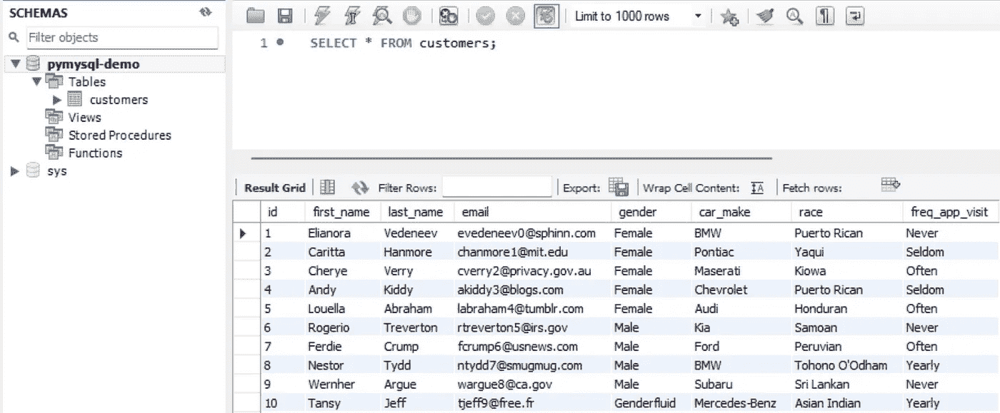
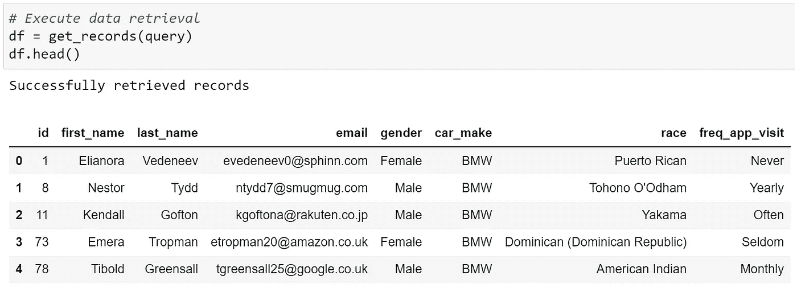
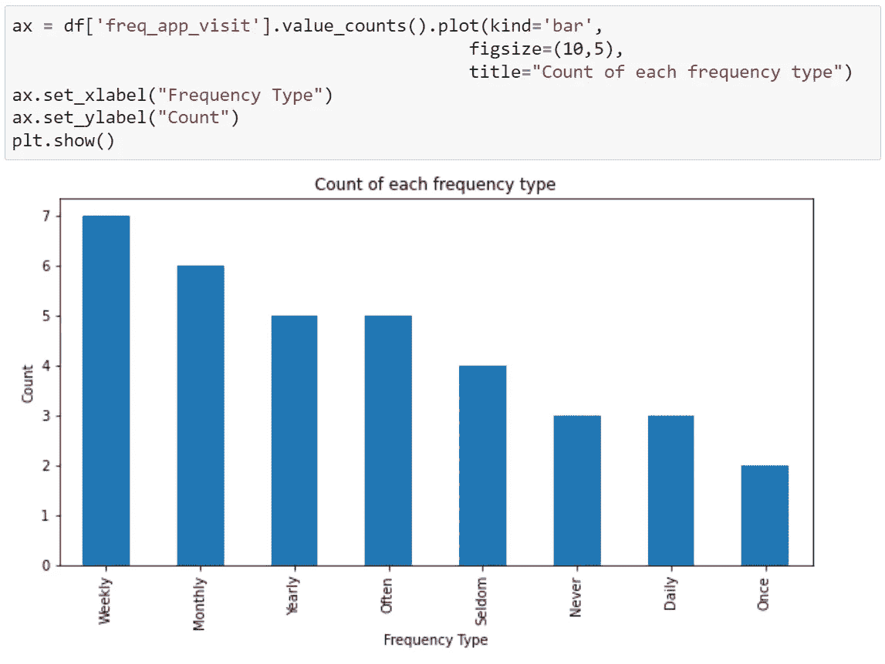
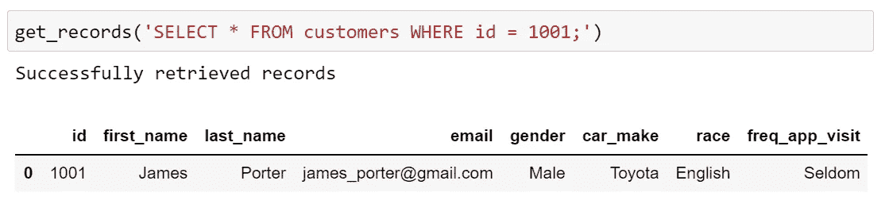

# PyMySQL —为数据科学连接 Python 和 SQL

> 原文：<https://towardsdatascience.com/pymysql-connecting-python-and-sql-for-data-science-91e7582d21d7>

## 轻松访问 MySQL 数据库并使用 Python 执行 SQL 查询


迈克尔·奥斯特林克在 [Unsplash](https://unsplash.com?utm_source=medium&utm_medium=referral) 上的照片

SQL 和 Python 是数据从业者有效处理数据不可或缺的工具。

一个常见的用例是最初使用 SQL 查询从关系数据库中检索数据，然后使用 pandas 等库在 Python 中操作和分析数据。

但是您知道吗，这两个看似独立的任务可以合并到一个 Python 脚本中，轻松实现相同的结果。

在本文中，我们发现了从 Python 连接到 MySQL 数据库并与之交互的 [PyMySQL](https://pypi.org/project/PyMySQL/) 的概念和实现。

# 目录

> ***(1)***[*PyMySQL 是什么，为什么要用它？*](#bf00)***(2)***[*初始设置*](#3127)***(3)***[*连接与光标对象*](#2a38)***(4)***[*建立与 MySQL 服务器的连接*](#9337)


[Rubaitul Azad](https://unsplash.com/@rubaitulazad?utm_source=medium&utm_medium=referral) 在 [Unsplash](https://unsplash.com?utm_source=medium&utm_medium=referral) 上拍摄的照片

# (PyMySQL 是什么，为什么使用它？

PyMySQL 是一个纯 Python 的 MySQL 客户端库，这意味着它是一个 Python 包，为我们创建了访问 MySQL 关系数据库的 API 接口。

文档页面声明 PyMySQL 是基于 [PEP 249](https://peps.python.org/pep-0249/) 构建的。这意味着 PyMySQL 是基于 Python 数据库 API 规范开发的，该规范旨在促进用于数据库访问的 Python 模块的标准化。

使用 PyMySQL 的主要原因是，通过在 Python 脚本的范围内合并 SQL 语句，它可以作为直接与 MySQL 数据库交互的便捷接口。

这也意味着我们不需要访问单独的 RDBMS 接口来运行下游 Python 操作所需的 SQL 查询。

# (2)初始设置

## (一)安装

我们可以使用 pip 安装 PyMySQL:

```
pip install PyMySQL
```

还需要满足以下版本要求:

*   [MySQL](http://www.mysql.com/) ≥ 5.6 或 [MariaDB](https://mariadb.org/) ≥ 10.0
*   [Python](https://www.python.org/downloads/) ≥ 3.6

## ㈡数据设置

对于这个演示，我们从 [Mockaroo](https://www.mockaroo.com/) 生成一个 1000 行的模拟数据集来表示一个*客户*数据集。然后通过表数据导入向导功能将数据导入到**本地** MySQL 数据库中，形成*客户*表。



MySQL Workbench 中的 *customers* 表截图|作者图片

我生成的数据可以在 GitHub repo 项目中的**这里**找到。

如果您想了解更多关于为这样的实验生成模拟数据的免费资源，请查看以下参考资料:

[](/free-resources-for-generating-realistic-fake-data-da63836be1a8) [## 用于生成真实假数据的免费资源

### 零成本地为您的数据科学项目生成模拟和虚拟数据

towardsdatascience.com](/free-resources-for-generating-realistic-fake-data-da63836be1a8) 

## ㈢进口包装

然后，我们导入项目所需的所有包:

```
import **pymysql**
import pandas as pd
import matplotlib.pyplot as plt
```

# (3)连接和光标对象

PyMySQL 库建立在两个关键的 Python 对象之上:**连接**对象和**光标**对象。

*   [**连接**](https://pymysql.readthedocs.io/en/latest/modules/connections.html) 对象:创建对 MySQL 数据库的访问
*   [**光标**](https://pymysql.readthedocs.io/en/latest/modules/cursors.html) 对象:执行 SQL 查询，与 MySQL 数据库通信，如取数据库记录，调用过程。

# (4)建立与 MySQL 服务器的连接

在与 MySQL 数据库交互之前，我们必须连接到服务器。第一步是定义配置参数。

下面是我们连接到本地数据库实例的默认配置设置。请注意，根据您为模式和数据库创建的特定设置，这些值可能会有所不同。

这些参数最好存储在单独的。py 文件，并使用像 [configparser](https://docs.python.org/3/library/configparser.html#quick-start) 这样的工具解析到主 Python 脚本中。

定义好配置参数后，我们可以将它们解析成 PyMySQL *connect* 方法调用，该方法调用可以包装在 Python 函数中。

然后，我们通过调用 Python 函数并以变量形式返回连接对象来执行连接:

# (5)从 MySQL 数据库中检索数据

假设我们想从*客户*表中提取数据的一个子集(例如，开宝马的客户)。我们首先定义一个执行以下操作的函数:

*   从前面设置的连接对象创建一个游标对象。
*   将 SQL 查询解析为游标对象并执行查询。对于这个例子，查询是`SELECT * FROM customers WHERE car_make = 'BMW';`，我们将它作为一个字符串存储在一个名为`query`的 Python 变量中。
*   将执行提交给连接对象，以便查询到达数据库。这是因为默认情况下，连接对象不会自动提交。
*   获取执行的 SQL 查询产生的所有数据记录。
*   将数据记录(作为字典列表返回)转换成 pandas 数据帧。

上述步骤被包装在如下所示的 Python 函数(`get_records`)中:

运行该函数将返回以下输出:



作者图片

现在，来自 SQL 查询的记录被存储为 Python pandas 数据帧，我们可以自由地对数据执行各种分析和操作技术。

例如，我们可以使用 **pandas** 和 **matplotlib** 来可视化这些客户访问特定移动应用程序的频率分布(基于列`freq_app_visit`):



dataframe | Image 的“频率应用程序访问”列的直方图(按作者)

[](https://kennethleungty.medium.com/membership) [## 通过我的推荐链接加入 Medium—Kenneth

### 以一杯咖啡的价格访问我所有的内容(和所有的媒体文章)!

kennethleungty.medium.com](https://kennethleungty.medium.com/membership) 

# (6)其他 CRUD 功能

除了从 MySQL 数据库读取数据，我们还可以使用 PyMySQL 执行其他 CRUD(创建、读取、更新、删除)功能来管理数据库。

例如，我们可以执行一个查询，让**将数据记录**插入到*客户*表中。像以前一样，我们为数据插入的这个特定操作创建一个 Python 函数。

完成后，我们可以使用之前创建的`get_records` Python 函数查看新添加的记录:



按作者检索新插入的记录|图像的数据

# (7)包装

在本文中，我们学习了如何利用 PyMySQL 的功能，通过 Python 与 MySQL 数据库进行交互。

特别是，我们看到了在一个 Python 脚本或笔记本的范围内，从 MySQL 数据库中检索、操作和分析数据是多么容易。

你可以查看这个项目的 GitHub repo[**这里**](https://github.com/kennethleungty/PyMySQL-Demo) 和 PyMySQL 官方文档 [**这里**](https://pymysql.readthedocs.io/en/latest/) 。

如果您想了解 PyMySQL 是如何用于云数据库(而不是本演示中所示的本地数据库)的，请查看以下内容:

[](/definitive-guide-to-create-an-sql-database-on-cloud-with-aws-and-python-c818c7270af2) [## 使用 AWS 和 Python 在云上创建 SQL 数据库的权威指南

### 关于使用 Amazon RDS、MySQL Workbench 和 PyMySQL 构建和部署云的简单易懂的综合指南…

towardsdatascience.com](/definitive-guide-to-create-an-sql-database-on-cloud-with-aws-and-python-c818c7270af2) 

# 在你走之前

欢迎您**加入我的数据科学学习之旅！**点击此[媒体](https://kennethleungty.medium.com/)页面，查看我的 [GitHub](https://github.com/kennethleungty) ，了解更多令人兴奋的实用数据科学内容。同时，祝您在使用 PyMySQL 的过程中愉快！

[](/how-to-dockerize-machine-learning-applications-built-with-h2o-mlflow-fastapi-and-streamlit-a56221035eb5) [## 如何对接用 H2O、MLflow、FastAPI 和 Streamlit 构建的机器学习应用

### 用 Docker 容器化多服务 ML 应用的简单指南

towardsdatascience.com](/how-to-dockerize-machine-learning-applications-built-with-h2o-mlflow-fastapi-and-streamlit-a56221035eb5) [](/top-tips-to-google-search-like-a-data-science-pro-897599f4d9ae) [## 像经验丰富的数据科学家一样使用谷歌搜索的顶级技巧

### 了解高级 Google 搜索功能，提高您查找数据科学解决方案的效率

towardsdatascience.com](/top-tips-to-google-search-like-a-data-science-pro-897599f4d9ae) [](/imputation-of-missing-data-in-tables-with-datawig-2d7ab327ece2) [## 用 DataWig 对表中缺失数据的插补

### 用 Python 实现 Amazon 的 DataWig 来估算表格数据中的缺失值

towardsdatascience.com](/imputation-of-missing-data-in-tables-with-datawig-2d7ab327ece2)