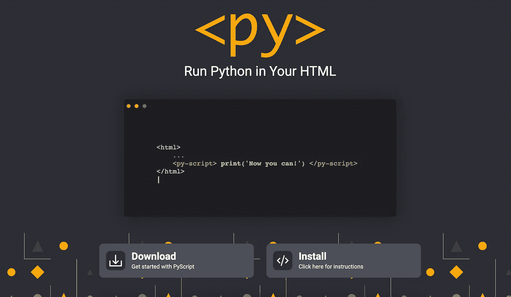
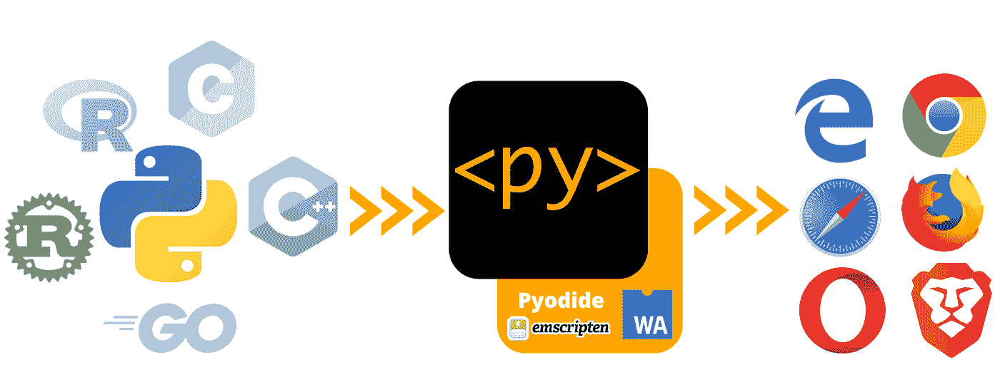
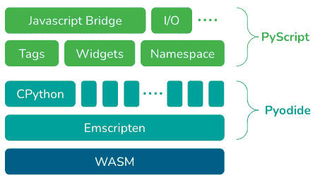
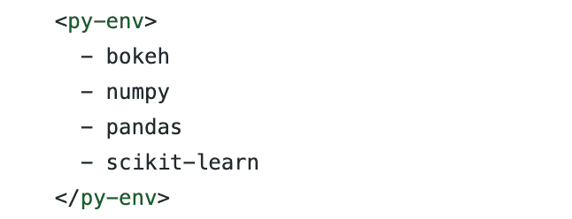
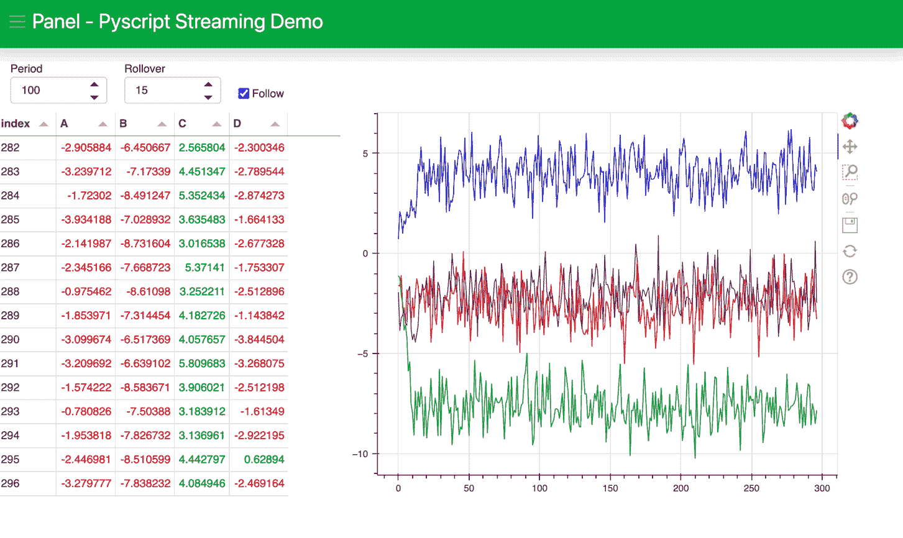
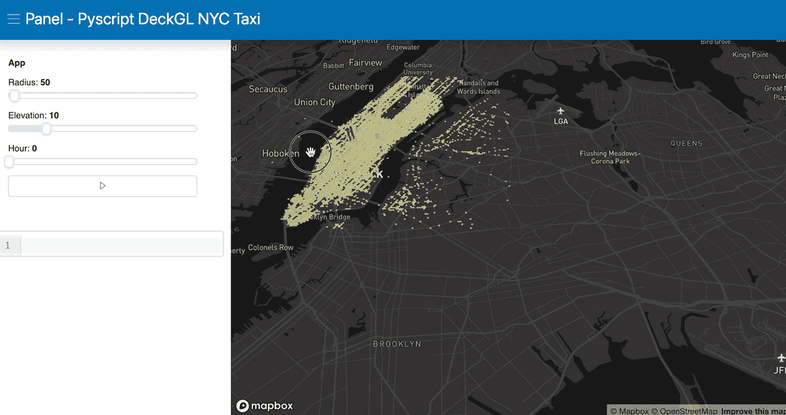

# PyScript:浏览器中的 Python

> 原文：<https://towardsdatascience.com/pyscript-python-in-the-browser-aadaf8960a80>

资料来源:pyscript.net

你是数据科学家还是主要使用 Python 的开发人员？你会嫉妒那些编写 Javascript 代码，在浏览器中构建花哨网站的开发者吗？如果我们能用 Python 写网站该有多好？令人惊讶的是，在 PyCon US 2022 上，Anaconda 的首席执行官王蒙杰宣布了一项名为 PyScript 的闪亮新技术，允许用户在浏览器中编写 Python 和实际上许多语言。

# PyScript <py>是什么？</py>

由 Anaconda 的团队开发，包括王蒙杰、法比奥·普利格和菲利普·鲁迪格， [PyScript](http://pyscript.net) 是，正如彼得在他的演讲中提到的，“一个在 HTML 中交错 Python 的系统(像 PHP)。”这意味着你可以用 HTML 编写和运行 Python 代码，用 PyScript 调用 Javascript 库，用 Python 做所有的 web 开发。听起来很神奇！

## **使用 PyScript 对世界和数据科学家来说意味着什么？**

*   最明显的是，有了 PyScript，我们现在可以用 HTML 编写 Python(可能还有其他语言)并构建 web 应用程序。PyScript 使更多的前端开发人员和创作者能够使用 Python 的强大功能。
*   正如彼得在演讲中提到的，“网络浏览器是世界上最普遍的便携式计算机环境。”事实上，每个人都可以使用网络浏览器，不管是在你的电脑上还是手机上。这意味着任何人都可以无障碍地访问和开始编程。
*   有了 PyScript，我们不再需要担心部署问题。PyScript 提供了“超越云的架构转变”一切都将发生在你的网络浏览器中。作为数据科学家，我们可以在一个 html 文件中共享我们的仪表板和模型，当其他人在 web 浏览器中打开该文件时，它将运行代码。

图一。PyScript 概述。

# PyScript 背后的魔力是什么？

PyScript 目前构建在 [Pyodide](https://pyodide.org/) 之上，这是一个“CPython 到 WebAssembly/ [Emscripten](https://emscripten.org/) 的端口”。PyScript 支持在浏览器中编写和运行 Python 代码，将来还会提供对其他语言的支持。

图二。PyScript 技术栈。

## **什么是 WebAssembly？**

使用 Python 编写网站成为可能的基础技术是 WebAssembly。最初开发 WebAssembly 时，web 浏览器只支持 Javascript。

WebAssembly 于 2017 年首次发布，到 2019 年迅速成为官方的万维网联盟(W3C)标准。它包括人类可读的。wat 文本格式语言，然后转换成二进制。浏览器可以运行的 wasm 格式。这使得我们可以用任何语言编写代码，编译成 WebAssembly，然后在 web 浏览器中运行。

# 如何使用 PyScript？

PyScript 的 alpha 版本可以在 pyscript.net 上找到。该代码可在[https://github.com/pyscript](https://github.com/pyscript)获得。按照这些[指示](https://github.com/pyscript/pyscript/blob/main/pyscriptjs/README.md)试一试。PyScript 允许您使用以下三个主要组件用 html 编写 Python:

*   <py-env>定义运行 Python 代码所需的 Python 包。</py-env>
*   <py-script>是您编写 Python 代码并在网页中执行的地方。</py-script>
*   <py-repl>创建一个 REPL(读取-评估-打印循环)组件，评估用户输入的代码并显示结果。</py-repl>

## ***< py-env >例***

下面是一个例子，说明我们如何使用<py-env>在 HTML 中定义 Python 环境。在这个[示例](https://github.com/pyscript/pyscript/blob/main/pyscriptjs/examples/panel_stream.html#L38-L43)中，我们将包 bokeh、numpy、pandas 和 scikit-learn 加载到我们的环境中。</py-env>

## ***< py-script >示例***

这个例子演示了一个带有流数据的面板仪表板。正如你在代码中看到的，我们能够像在 Python 文件中一样，在< py-script >中编写我们熟悉的 [Python 代码](https://github.com/pyscript/pyscript/blob/main/pyscriptjs/examples/panel_stream.html#L71-L126)。如果你不喜欢直接在< py-script >下编写你的 Python 代码，你也可以像<py-script src = "/Python _ file . py "></py-script>一样使用 Python 文件作为源代码。

来源:[https://github . com/py script/py script/blob/main/pyscript js/examples/panel _ stream . html](https://github.com/pyscript/pyscript/blob/main/pyscriptjs/examples/panel_stream.html)

## ***< py-repl >例子***

这个例子使用 DeckGL 和 REPL 组件演示了一个带有纽约出租车数据的面板仪表板。如您所见，我们能够定义半径并选择数据帧的子集(hour<3) in the REPL. How magical!

Source: [https://github . com/py script/py script/blob/main/pyscript js/examples/panel _ deck GL . html](https://github.com/pyscript/pyscript/blob/main/pyscriptjs/examples/panel_deckgl.html)

你还可以在 PyScript Github 页面上找到许多其他的例子，包括一个 D3 可视化和一个带有计算机视觉的马里奥游戏。

PyScript 将 Python 引入浏览器。我对这项新的创新感到非常兴奋，迫不及待地想看看它如何在社区中展开。敬请关注即将推出的许多出色的新功能！

**参考文献:**

  

主题演讲，王蒙杰在 2022 年美国 PyCon 上

. . .

2022 年 4 月索菲亚·杨

*原载于*[*https://www . anaconda . cloud*](https://anaconda.cloud/pyscript-python-in-the-browser)*。*