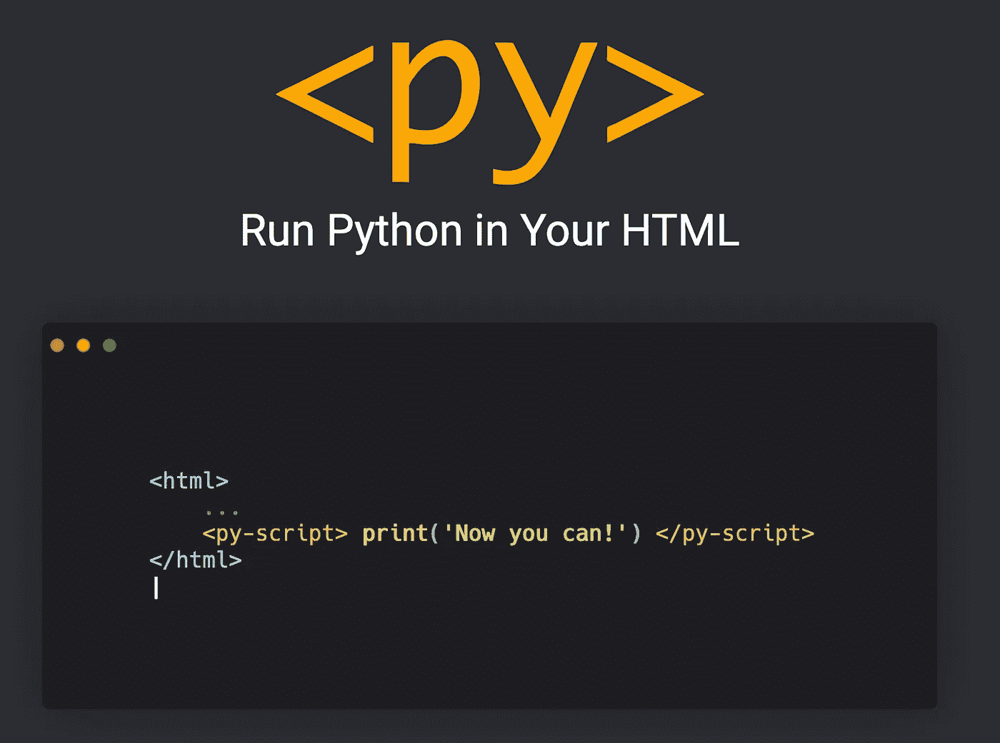
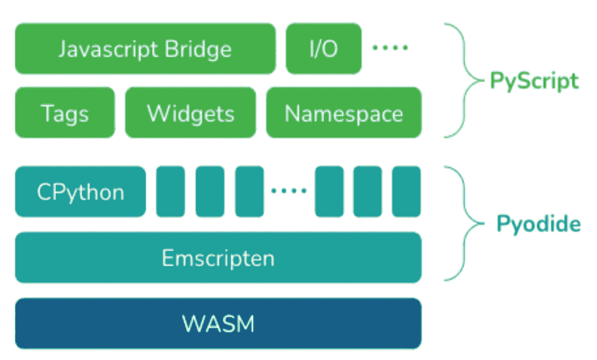
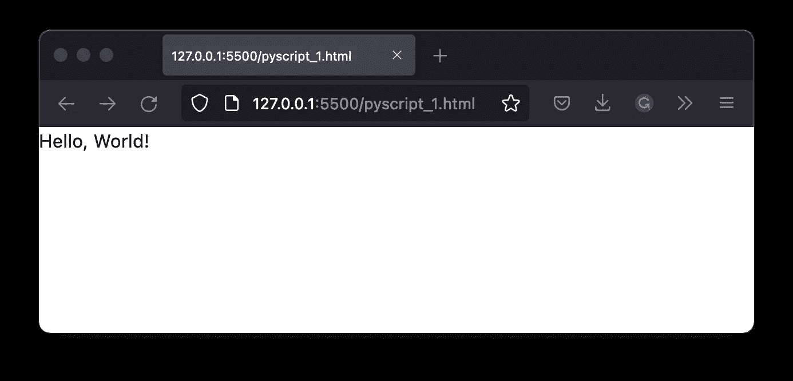
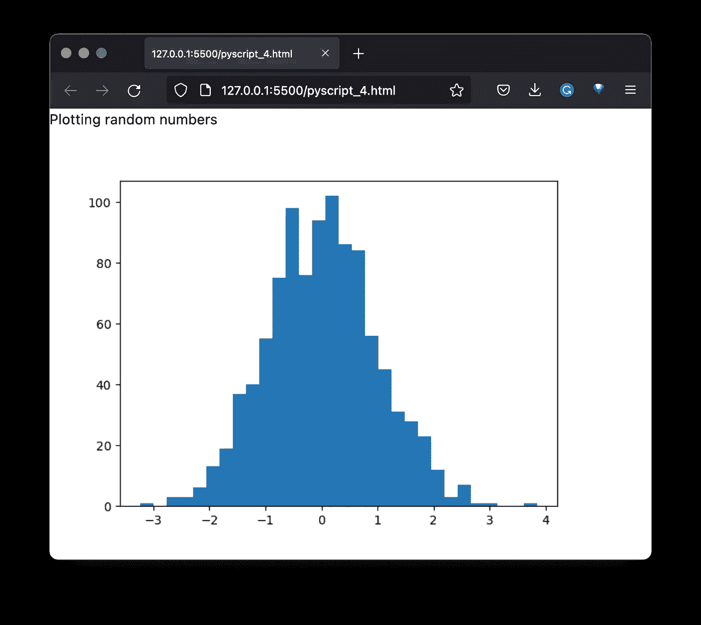

# PyScript——在浏览器中释放 Python 的威力

> 原文：<https://towardsdatascience.com/pyscript-unleash-the-power-of-python-in-your-browser-6e0123c6dc3f>



来源:[来源:pyscript.net](https://pyscript.net/)

## 如何从 HTML 代码中运行 Python

在 PyCon US 2022 的主题演讲中，Anaconda 的首席执行官王蒙杰公布了一个相当令人惊讶的项目——[py script](https://pyscript.net/)。它是一个 JavaScript 框架，允许用户在浏览器中混合使用 Python 和标准 HTML 来创建 Python 应用程序。该项目的最终目标是让更广泛的受众(例如前端开发人员)受益于 Python 及其各种库(statistical、ML/DL 等)的强大功能。).

## 关于 PyScript 要知道的关键事情

*   允许我们在浏览器中使用 Python 及其庞大的库生态系统(包括`numpy`、`pandas`、`scikit-learn`)。
*   通过使用环境管理用户可以决定在运行页面代码时哪些包和文件是可用的。
*   我们可以使用一些现成的精选 UI 组件，例如:按钮、容器、文本框等。
*   我们不必担心部署，因为有了 PyScript，一切都会在我们的 web 浏览器中发生。作为数据科学家，我们可以与我们的利益相关者共享包含仪表板和/或模型的 HTML 文件，他们将能够在他们的浏览器中运行这些文件，而无需任何复杂的设置。

## 它是如何工作的？

PyScript 建立在 [Pyodide](https://pyodide.org/en/stable/) 之上。我希望我不是那种不太了解 Pyodide 到底是什么的数据科学家。所以是基于 WebAssembly 的浏览器和 Node.js 的 Python 发行版(CPython 的端口)。这就带来了下一个问题:什么是 WebAssembly？

**WebAssembly** 是让用 Python 写网站成为可能的技术。它使用人类可读的文本格式语言，然后被转换成浏览器可以运行的二进制 T4 格式。得益于此，我们可以用任何语言编写代码，编译成 WebAssembly，然后在 web 浏览器中运行。

在下面展示技术堆栈的图片中，我们还可以看到 [**Emscripten**](https://emscripten.org/) ，这是一个开源的编译器工具链。它允许将任何可移植的 C/C++代码库编译成 WebAssembly。

值得庆幸的是，作为最终用户，我们不需要完全理解到底发生了什么。然而，它肯定是重要的，例如，出于安全原因。



来源:[https://anaconda.cloud/pyscript-python-in-the-browser](https://anaconda.cloud/pyscript-python-in-the-browser)

目前，PyScript 支持在浏览器中编写和运行 Python 代码。未来的目标是它也将提供对其他语言的支持。

这也是潜在限制发挥作用的地方。目前，当使用 PyScript 时，我们只能使用 Pyodide 支持的库。你可以在这里找到整个列表[。](https://github.com/pyodide/pyodide/tree/main/packages)

## 带它去兜风

PyScript 目前处于 alpha 阶段，但我们已经可以尝试一下，并可能对其 [GitHub repo](https://github.com/pyscript/pyscript) 提出任何改进建议。我们可以直接从 [PyScript 的网站](https://pyscript.net/)下载包含所有代码和资产的压缩文件夹。

PyScript 网站上提供的最基本的示例如下:

正如我们所见，Python 代码嵌入在`<py-script>`块中。在浏览器中打开文件(或使用 VS 代码的 Life Saver 扩展)会产生以下输出:



作者图片

在第二个例子中，我们将做得更多一点。我们将使用`numpy`生成来自标准正态分布的数字，然后使用`matplotlib`绘制它们。我们使用以下代码来实现这一点:

这一次，我们还做了以下工作:

*   我们通过在`<py-env>`块中列出想要在 Python 环境中使用的库来定义它们，
*   我们通过在`<py-script>`块:`<py-script output=”plot”>`中指定来表示我们将输出一个图。



作者图片

自然，随着我们的代码库变得越来越大，我们不需要将它完全嵌入到 HTML 文件中。我们可以使用下面的块结构来加载任何`.py`脚本:

```
<py-script src="/our_script.py"> </py-script>
```

在这里(已经在浏览器中运行)和这里(GitHub 上的代码)可以找到相当多使用 PyScript [的例子。](https://pyscript.net/examples/)

## 包扎

*   有了 PyScript，我们将能够直接从浏览器上运行 Python 代码，
*   该项目由 Anaconda 开发，
*   该项目仍处于 alpha 阶段，但我们已经可以使用 Pyodide 支持的一些库了。

就我个人而言，我不确定此时该如何看待 PyScript。这看起来很有希望，但是它可能会带来很多新的安全问题。此时，我们还可以看到，即使运行一些简单的脚本，在执行时间方面也已经产生了很大的开销。所以我不确定在浏览器中运行大块代码有多实际。

我很想知道你对这项新技术有什么想法！请在评论中或在 [Twitter](https://twitter.com/erykml1?source=post_page---------------------------) 上让我知道。

*喜欢这篇文章吗？成为一个媒介成员，通过无限制的阅读继续学习。如果您使用* [*这个链接*](https://eryk-lewinson.medium.com/membership) *成为会员，您将支持我，无需您额外付费。提前感谢，再见！*

您可能还会对以下内容感兴趣:

[](/pandas-is-not-enough-a-comprehensive-guide-to-alternative-data-wrangling-solutions-a4730ba8d0e4)  [](/preview-your-jupyter-notebooks-in-the-terminal-with-nbpreview-87601a92d0d1)  [](/pur-the-easiest-way-to-keep-your-requirements-file-up-to-date-22d835279348) 