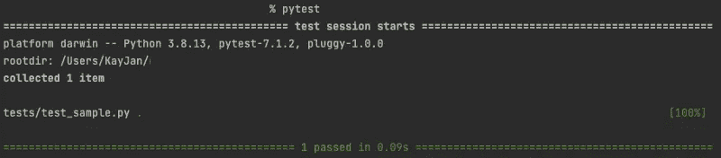

# 10 分钟内完成标记、模仿和固定装置的 Pytest

> 原文：<https://towardsdatascience.com/pytest-with-marking-mocking-and-fixtures-in-10-minutes-678d7ccd2f70>

## 用 Python pytest 编写健壮的单元测试


杰夫·谢尔登在 [Unsplash](https://unsplash.com?utm_source=medium&utm_medium=referral) 上拍摄的照片

在我的[上一篇关于单元测试的文章](/unit-testing-with-mocking-in-10-minutes-e28feb7e530)中，我阐述了单元测试的目的、单元测试生态系统和最佳实践，并用 Python 内置的`unittest`包演示了基本和高级的例子。有不止一种方法(和不止一个 Python 包)来执行单元测试，本文将演示如何用 Python `pytest`包实现单元测试。本文将紧密跟随上一篇文章的流程，因此您可以比较`unittest` vs. `pytest`的各个组件。

虽然`unittest`包是面向对象的，因为测试用例是以类的形式编写的，但是`pytest`包是功能性的，导致代码行更少。就个人而言，我更喜欢`unittest`,因为我觉得代码可读性更强。也就是说，这两个包，或者更确切地说是框架，都同样强大，在它们之间进行选择只是个人喜好的问题。

[](/unit-testing-with-mocking-in-10-minutes-e28feb7e530) [## 10 分钟后模拟单元测试

### 使用内置的 unittest Python 包有效地测试您的代码库

towardsdatascience.com](/unit-testing-with-mocking-in-10-minutes-e28feb7e530) 

***更新*** *:本文是系列文章的一部分。查看其他“10 分钟内”话题* [*此处*](https://medium.com/@kayjanwong/list/in-10-minutes-eeaa9aa67055) *！*

# 目录

1.  [设置 Pytest](https://medium.com/p/678d7ccd2f70/#026e)
2.  [单元测试的结构](https://medium.com/p/678d7ccd2f70/#7fc6)
3.  [运行单元测试](https://medium.com/p/678d7ccd2f70/#944e)
4.  [高级:内置断言](https://medium.com/p/678d7ccd2f70/#d31e)
5.  [高级:跳过单元测试(通过标记)](https://medium.com/p/678d7ccd2f70/#8c34)
6.  [高级:单元测试中的模拟](https://medium.com/p/678d7ccd2f70/#8145)
7.  [高级:其他](https://medium.com/p/678d7ccd2f70/#ce33)

# 设置 Pytest

与`unittest`不同，`pytest`不是内置的 Python 包，需要安装。这可以简单地通过终端上的`pip install pytest`来完成。

请注意，`unittest`的最佳实践也适用于`pytest`，因此

*   所有的单元测试必须写在一个`tests/`目录中
*   文件名应该严格以`tests_`开头
*   函数名应该严格以`test`开头

必须遵循命名约定，以便检查器可以在运行时发现单元测试。

# 单元测试的结构

```
def test_function_with_scenario_one():
    print("Testing function with scenario one")
    assert 1 + 1 == 2, f"Check addition value {1 + 1} does not match {2}"
```

`pytest`中的单元测试是在函数中编写的，断言是在函数中做出的。这使得`pytest`很容易理解，并且单元测试代码看起来短小精悍！

# 运行单元测试

可以通过在命令行中键入`pytest`来运行单元测试，这将发现所有的单元测试，如果它们遵循命名约定的话。单元测试输出返回测试运行的总数、通过、跳过和失败的测试数、运行测试所用的总时间以及失败堆栈跟踪(如果有)。



图 1:运行单元测试——作者图片

要对特定的目录、文件或函数运行单元测试，命令如下

```
$ pytest tests/
$ pytest tests/test_sample.py
$ pytest tests/test_sample.py::test_function_one
```

还有更多定制可以附加到命令中，例如

*   `-x`:立即退出或快速失败，在遇到第一次测试失败时停止所有单元测试
*   `-k "keyword"`:指定选择性运行测试的关键字，可以匹配文件名或函数名，可以包含`and`和`not`语句
*   `--ff`:第一次失败，从上次失败的测试开始运行所有测试(**首选**)
*   `--lf`:上次失败，运行上次运行失败的测试(**缺点**:可能无法发现之前通过的测试中的失败)
*   `--sw`:逐步地，在第一次测试失败时停止，并从那里继续下一次运行(**缺点**:可能无法发现先前通过的测试中的失败)

额外提示:如果单元测试运行时间太长，你可以并行运行它们，而不是顺序运行！安装`pytest-xdist` Python 包，并在运行单元测试时将其添加到命令中，

*   `-n <number of workers>`:并行运行测试的工人数量

**调试错误**:当您的测试脚本从基本目录或任何源目录中的一个文件夹导入时，您可能会面临错误`ModuleNotFoundError`。例如，您的函数驻留在`src/sample_file.py`中，而您驻留在`tests/`目录中的测试脚本执行导入`from src.sample_file import sample_function`。

为了克服这个问题，在基本目录中创建一个配置文件`pytest.ini`,以指示相对于基本目录执行导入的目录。要添加到配置文件中的内容示例如下:

```
[pytest]
pythonpath = .
```

这个配置文件可以扩展到更多的用途，这将在后面的章节中详细说明。目前，这种配置允许您绕过`ModuleNotFoundError`错误。

> 在了解了单元测试的基本结构以及如何运行它们之后，是时候深入研究了！

实际上，单元测试可能不像调用函数和测试给定输入的预期输出那样简单。可以有高级的逻辑，例如浮点精度的计算、预期错误的测试、将测试分组在一起、单元测试的有条件跳过、模拟数据等。这可以通过`pytest`包中的上下文管理器和装饰器来完成(基本上已经为您编码好了！).

# 高级:内置断言

除了测试预期的输出，您还可以测试预期的错误，以确保函数在以非设计方式使用时会抛出错误。这可以通过`pytest.raises`上下文管理器，使用`with`关键字来完成。

```
import pytest

def test_expected_error():
    with pytest.raises(TypeError):
        assert 1 + "a", "This should raise an error"
```

# 高级:跳过单元测试(通过标记)

单元测试可以使用`pytest.mark` decorator 进行标记，这允许各种扩展功能，例如，

1.  **将单元测试分组**:多个单元测试可以作为一个组来运行
2.  **标记为失败**:表示单元测试预计会失败
3.  **标记为跳过/有条件跳过**:单元测试默认行为将被跳过，或者在满足某些条件时被跳过
4.  **标记为插入参数**:测试单元测试的各种输入

> 装饰者可以被堆叠以提供多种扩展功能。例如，可以将测试标记为一个组，并标记为跳过！

上面阐述的各种功能以这种方式实现，

## a)对单元测试进行分组

取代在一个文件夹、文件中或者通过关键字搜索来运行单元测试，单元测试可以被分组并且用`pytest -m <group-name>`来调用。测试的输出将显示运行的测试数量以及由于不在组中而被取消选择的测试数量。

这可以通过下面的例子用`pytest.mark.<group-name>`装饰器来实现，

```
import pytest

@pytest.mark.group1
def test_sample():
    pass
```

为了使这个工作，我们需要在配置文件中定义这个组，下面的内容可以添加到`pytest.ini`文件中的现有内容中，

```
markers =
    group1: description of group 1
```

## b)标记为失败

对于预计会失败的测试，可以用`pytest.mark.xfail`装饰器进行标记。如果单元测试失败(与正常场景中抛出错误相反)，输出将显示`xfailed`，如果单元测试意外通过，输出将显示`xpassed`。一个例子如下，

```
import pytest

@pytest.mark.xfail
def test_fail():
    assert 1 == 2, "This should fail"
```

## c)标记为跳过/有条件跳过

将一个单元测试标记为跳过或在满足某些条件时跳过与上一节类似，只是装饰者分别是`pytest.mark.skip`和`pytest.mark.skipif`。如果在较新的 Python 版本或较新的 Python 包版本中测试不再按预期工作，跳过单元测试是有用的。

```
import sys
import pytest

@pytest.mark.skip
def test_skip():
    raise Exception("This test should be skipped")

@pytest.mark.skipif(sys.version_info.major == 2, reason="requires Python 3.x")
def test_skipif():
    pass
```

## d)标记为插入参数

在某些情况下，我们会希望针对一些输入来测试函数，例如，针对正常情况和边缘情况来测试代码库。与在一个单元测试中编写多个断言或编写多个单元测试不同，我们可以按照如下方式自动测试多个输入，

```
import pytest

@pytest.mark.parametrize("n", [2, 4, 6])
def test_even_number(n):
    assert not n % 2, f"{n} is not an even number"

@pytest.mark.parametrize(["n", "expected_output"], [(1, 3), (2, 6)])
def test_multiplication(n, expected_output):
    assert n * 3 == expected_output, "Check multiplication"
```

# 高级:单元测试中的模拟

模拟在单元测试中用来替换函数的返回值。替换不应该在测试环境中运行的操作是有用的，例如，当测试环境没有相同的数据访问时，替换连接到数据库并加载数据的操作。

在`pytest`中，嘲讽可以代替函数内函数的返回值。这对于测试期望的函数和替换我们正在测试的期望函数中的嵌套函数的返回值是有用的。

> 因此，模拟减少了单元测试的依赖性，因为我们测试的是期望的函数，而不是它对其他函数的依赖性。

例如，如果所需的函数通过连接到数据库来加载数据，我们可以模拟加载数据的函数，使它不连接到数据库，而是提供要使用的替代数据。

要实现模拟，安装`pytest-mock` Python 包。在这个例子中，在`src/sample_file.py`文件中，我们定义了期望的函数和要模仿的函数。

```
def load_data():
    # This should be mocked as it is a dependency
    return 1

def dummy_function():
    # This is the desired function we are testing
    return load_data()
```

在测试脚本中，我们通过指定完整的点路径来定义要模拟的函数，并定义应该返回的值，

```
from src.sample_file import dummy_function

def test_mocking_function(mocker):
    mocker.patch("src.sample_file.load_data", return_value=2)
    assert dummy_function() == 2, "Value should be mocked"
```

Mocking 可以修补代码库中的任何函数，只要您定义完整的虚线路径。请注意，您不能模拟正在测试的期望函数，但是可以模拟期望函数所依赖的任何依赖项，甚至是嵌套依赖项。

# 高级:其他

## a) Pytest 配置

正如前面章节中所讨论的，配置文件`pytest.ini`可以在基本目录中定义，以绕过`ModuleNotFoundError`并定义单元测试组。现在看起来应该是这样的，

```
[pytest]
pythonpath = .
markers =
    group1: description of group 1
```

配置文件允许用户指定运行单元测试的默认模式，例如，`pytest --ff`用于失败的第一次设置，或者`pytest -ra -q`用于压缩的输出结果。默认模式可以通过在配置文件中添加行`addopts = -ra -q`来指示。

为了抑制警告，我们还可以将`ignore::DeprecationWarning`或`ignore::ImportWarning`添加到配置文件中。

可以向配置文件中添加更多的项目，但这些是更常见的项目。`pytest`配置文件的官方文档可以在[这里](https://docs.pytest.org/en/6.2.x/customize.html)找到。

## b)重用变量(通过夹具)

Fixtures 可以用来标准化跨多个单元测试的输入。例如，可以定义一个 fixture 来加载一个文件或创建一个对象，作为多个测试的输入，而不是在每个测试中重写相同的代码行。

```
import pytest

@pytest.fixture
def input_dict():
    return {"a": 1}

def test_fixture(input_dict):
    assert input_dict["a"] == 1, f"Check fixture {input_dict}"
```

夹具可以在同一个 Python 文件中定义，也可以在由`pytest`自动处理的文件`tests/conftest.py`中定义。

## c)考虑浮点精度

当断言数值的相等条件时，由于[浮点运算限制](https://docs.python.org/3/tutorial/floatingpoint.html)，小数点位置的值可能会有差异。

为了解决这个问题，我们可以用一定的容差来比较数值的相等性。默认情况下，使用`assert output_value == **pytest.approx**(expected_value)`将允许相等比较放宽到公差`1e-6`。

希望你已经学习了更多关于用`pytest`实现单元测试的知识，以及一些你可以用单元测试做的很酷的技巧。还提供了更多的功能，比如使用`monkeypatch`模仿数据，在 fixtures 中定义范围，结合`unittest` Python 包使用`pytest`，等等。有需求的话可以出续集；)

**感谢您的阅读！如果你喜欢这篇文章，请随意分享。**

# 相关链接

*   `pytest`文档:[https://docs.pytest.org](https://docs.pytest.org)
*   `pytest`教程:[https://www.tutorialspoint.com/pytest/index.htm](https://www.tutorialspoint.com/pytest/index.htm)