# python:2022 年要知道的 10 个终极技巧

> 原文：<https://towardsdatascience.com/python-10-ultimate-tricks-to-know-in-2022-4da9f799e2d1>

## 计算机编程语言

## 在喝咖啡的时候掌握这些省时又有效的技巧


照片由[布鲁斯·马斯](https://unsplash.com/es/@brucemars?utm_source=medium&utm_medium=referral)在 [Unsplash](https://unsplash.com?utm_source=medium&utm_medium=referral) 拍摄

**学习 Python 是必须的！**🔋

Python 现在很流行，主要是因为它简单易学。

如果我们学习 Python 的方法来完成任务，python-像所有其他编程语言一样更容易。我列出了作为 Python 用户应该知道的 10 个 Python 技巧和诀窍。

我把这篇文章写得很短，这样您就可以边喝咖啡边完成它，掌握最有用、最省时的 Python 技巧。

您可以使用此索引快速导航到您最喜欢的技巧。

```
***·*** [***Check if all the elements in a list are same***](#ef5d) ***·*** [***Remove Duplicates from a List***](#f24e) ***·*** [***Iterate over multiple lists simultaneously using zip()***](#b72a) ***·*** [***Merge 2 or more dictionaries***](#580d) ***·*** [***Multiple conditions in a single if-statement***](#9533) ***·*** [***Delete all items in the list***](#2626) ***·*** [***Sort Dictionary by Value***](#b2d7) ***·*** [***Access Dictionary Items***](#776a) ***·*** [***Print string output using f-strings***](#a258) ***·*** [***Regular Expressions — regex***](#5b6d)
```

好了，我们开始吧…🚀

# 检查列表中的所有元素是否都相同

这里最简单和 Python 化的方法是使用 Python 数据结构— **Set** 。

在 Python 中，与列表不同，集合不能多次出现相同的元素，也不能存储无序值。

也就是说，如果列表中的所有元素都相同，那么将其转换为集合将得到只有一项的集合。

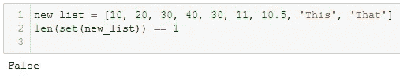

列表中的所有元素都不同|图片由作者提供

如您所见，列表中的所有元素都是不同的，因此结果集的长度将是 8。因此输出为*假*。

当输出*为真*时，列表中的所有元素都相同。看看下面的例子，

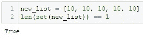

列表中的所有元素都相同|图片由作者提供

你可以在这里 更深入的了解 Python 数据结构 [***。***](https://corporatefinanceinstitute.com/resources/knowledge/other/python-data-structures/)

# 从列表中删除重复项

列表集属性的另一个经典用例是列表元素的重复数据删除。

正如我前面提到的，Python 中的集合只包含唯一的元素。因此，将列表转换为集合会删除列表中的所有重复项，并且每个元素只保留一个外观。✔️

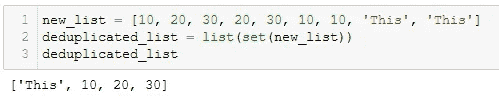

按作者删除列表|图像中多次出现的元素

如上图所示，我首先将`new_list`转换成一个集合以消除重复，然后再次将这个集合`set(new_list)`转换成一个列表以得到一个列表，该列表恰好包含每个`new_list`元素出现的一次。

你可以在我的一篇趋势文章中读到更多关于这个技巧的内容。

</5-most-powerful-one-liners-you-should-know-in-python-programming-c9d49a89b7f3>  

# 使用 zip()同时遍历多个列表

通常`for`循环用于迭代单个列表，然而，在不使用迭代计数器的情况下迭代多个列表`**zip()**`函数用于`for`循环。

根据定义，python 中的`zip()`函数用于将来自多个可迭代对象的元素按元素聚合到一个可迭代的元组中。

例如，在两个列表上使用`zip()`函数，如下例所示，生成一个元组列表


使用 zip() | Image by Author 的元组可迭代

`zip()`函数的这个属性可以在 for 循环中使用，在 Python 中迭代多个 iterables(列表或字典)。

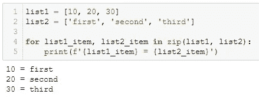

并行遍历多个列表|按作者排序的图片

很简单！

> 🚩注意:`zip()`当最小的或最短的可重复项用尽时，函数将停止从提供的可重复项生成元素元组。例如，如果 list_1 有 3 个元素，list_2 有 2 个元素， `zip()`将只返回 2 个元组，结果 for 循环将只执行 2 次迭代。

`zip()`的这个限制可以通过[**zip _ longest()**](https://docs.python.org/3/library/itertools.html#itertools.zip_longest)函数来克服。

# 合并 2 个或更多词典

合并两个或更多字典最简单的方法是使用`update()`方法，如下例所示。

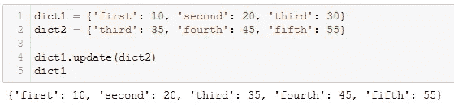

使用 update() | Image by Author 合并两个字典

方法`update()`接受另一个字典作为参数，并将这个传递的字典的内容合并到当前字典中。

🚩然而，`update()`方法改变了原始字典，即上面例子中的 dict1 用 dict2 中的元素更新。这不会用两个字典中的合并值创建一个新字典。

因此，另一个简单的解决方案是使用 ****kwargs** 。

当我们将`******`应用于字典时，它将字典中的内容扩展为键值对的集合。简而言之，它删除了键值对周围的花括号`{ }`。✔️

所以，`**dict1`相当于`‘first’: 10, ‘second’: 20, ‘third’: 30`

看看下面的例子，学习如何使用 ****kwargs** 合并两个字典。

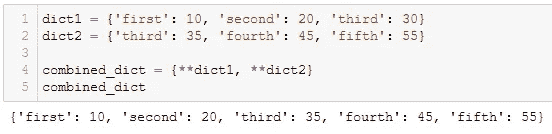

使用**kwargs | Image by Author 合并词典

使用 ****kwargs** 合并字典时，原始字典保持不变。💯

# 单个 if 语句中的多个条件

有时，您需要在 if 语句中传递多个条件，如果所有或任何条件为真，则运行一段代码。

🚩只要具备一两个条件，就可以在 if-statement 里面提到。但是，当您需要检查 4 个或更多条件时，if 语句看起来又长又混乱。

但是，不用担心！Python 内置的函数——`**all()**`和`**any()**`——可以帮你解决问题并节省你的时间。

根据定义，如果满足所有条件，`all()`将返回*真值*，如果满足至少一个条件，`any()`将返回*真值*。

您需要做的是用 Python 列出您想要检查的所有条件。和使用，

1️⃣ `**all(list_of_conditions)**`:当你想检查所有的条件是否都为真的时候。即所有条件都处于逻辑“与”状态。

举个例子，

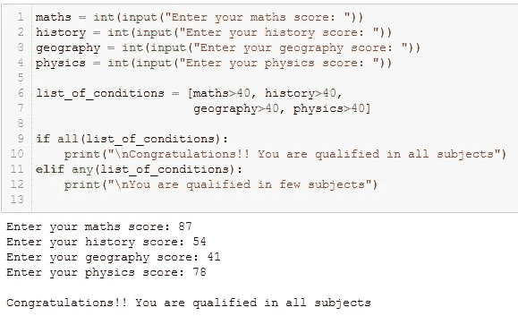

Python 内置函数 all() |图片作者

当所有条件变为真时，执行 if 语句下的代码块。

2️⃣ `**any(list_of_conditions)**`当你想检查任何一个条件是否为真时。即所有条件都是逻辑或，如下所述。

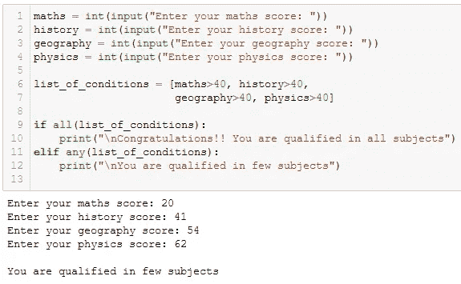

Python 内置函数 any() |图片作者

由于四个条件中只有三个为真，执行`elif`下的代码块。

通过这种方式，您可以高效清晰地在 if 语句中传递多个条件，而不会显得冗长。

# 删除列表中的所有项目

删除列表中所有条目的一种优雅方式是使用切片和`del`关键字。

根据列表中[索引的基础，列表中的所有项目都可以使用冒号(`**:**`)运算符进行选择，例如`list_name[:]`。](https://note.nkmk.me/en/python-slice-usage/)

要删除列表中的所有项目，只需在`list_name[:]`前添加`del`关键字，如下所示。

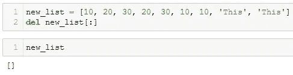

按作者删除列表|图像中的所有项目

这样，列表被清空，而不是完全删除它。可以使用新项目重新填充该列表。

或者，您也可以使用`**.clear()**`方法，如`new_list.clear()`将其清空。✔️

⚙️这在系统自动化项目中非常有用，你需要保存机器人位置一段时间，并在使用后删除它们，而不用删除列表本身。这在我上一份工作中非常有用。

# 按值对字典排序

Dictionary，我们都知道，作为一个键值对，默认情况下可以基于键排序。然而，有时我们需要根据值对字典进行排序。

可以使用`sorted`函数对字典进行排序，该函数只接受三个参数— `iterable`、`key`、`reverse`，使用`key`参数可以决定如何对字典进行排序。

下图显示了这两种方法，按键和按值对字典进行排序。

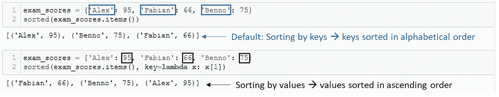

按值排序字典|按作者排序图像

默认情况下，排序是按字母顺序或升序进行的。要对字典进行降序排序，应该在排序函数中设置`reverse = True`。♻️

# 访问字典项目

根据您想从下面的字典中访问的内容，有四种方法。

> *使用。keys()，。值()和。items()* 🏆

**顾名思义，*。按键()*** 和 ***。values()*** 只能用来分别访问键和值。在上面例子中已经创建的字典中，

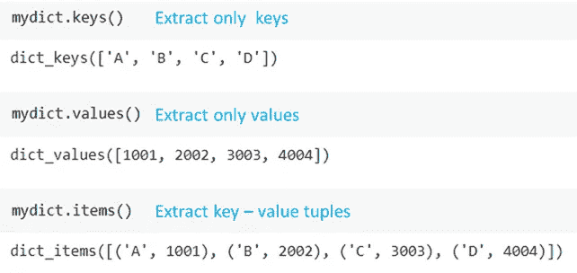

从 Python 字典中提取键、值和键值对|按作者排序的图片

如上图所示，***key-value***对作为元组，可以用`.items()`提取。

关于这个话题你可以在本期 [***有趣阅读***](https://pub.towardsai.net/python-dictionary-10-practical-methods-you-need-to-know-cbeb1c962bed) 中了解更多。

# 使用 f 字符串打印字符串输出

f-strings 是 *format()* 的简单实现，用于格式化指定的值并将其插入字符串的占位符中。

举个例子，

```
name = 'Alex'
age = '20'print('{} is {} years old'.format(name,age))Output:
Alex is 20 years old
```

上例中的 2 个花括号是两个变量的占位符— *姓名*和*年龄*。

虽然它可以满足目的，但是当您处理多个参数和更长的字符串时，`.format()`仍然会很长。

解决这个问题的一个简单方法是— **f 弦**。此类 f 字符串在要格式化的字符串开头有一个字母`***f***` ，并且在字符串中有多个占位符`***{}***` 。

与上面相同的例子用 f 弦简化如下。

```
name = 'Alex'
age = '20'print(f'{name} is {age} years old')Output:Alex is 20 years old
```

你可以在这里 阅读更多关于 f 弦 [***的内容。***](/five-must-know-string-methods-in-python-e97925d12eec)

⚡️ Python f-strings 提供了一种在 Python 中格式化字符串的更快、更可读、更简洁、更不容易出错的方法。

# 正则表达式—正则表达式

如果没有正则表达式，这个最有用的技巧列表是不完整的。💯

最常见的数据类型之一是文本或字符串，没有什么比这更强大的了💪🏻作为正则表达式来有效地分析这些数据。

正则表达式(regex)是用于从数据中提取文本模式的字符序列。使用 regex，您可以将输入数据与某些模式匹配，并用最少的代码用其他数据替换它。

为了利用这个工具，您需要在开始使用它之前简单地将包导入为`import re`。

这里有一个简单的例子。

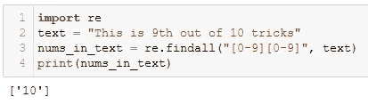

作者在文本|图片中有多少两位数

在这个例子中，我想找到所有出现在`text`中的两位数字。因此，我使用了文本模式`[0–9][0–9]`,并在命令`re.findall(“[0–9][0–9]”, text)`中搜索`text`中出现的所有这种模式。这就是为什么它只返回一个两位数的数字— `10`。

我找到了 [***这个***](https://www.w3schools.com/python/python_regex.asp) 很棒的资源来学习和练习 regex。

仅此而已！！

我希望你喝着咖啡读完了这篇文章，发现它令人耳目一新，非常有用。我使用 Python 已经有 4 年了，我发现这些技巧非常省时，而且在一段时间内非常有效

你可以通过 [**成为中级会员**](https://medium.com/@17.rsuraj/membership) 来探索中级物品。相信我，每月只需 5 美元，你就可以无限制地阅读《大众传媒》和《大众日报》的故事。当然，你的费用的一小部分会作为支持给我。🙂

别忘了注册我的电子邮件列表 来接收我文章的第一份拷贝。

**感谢您的阅读！**