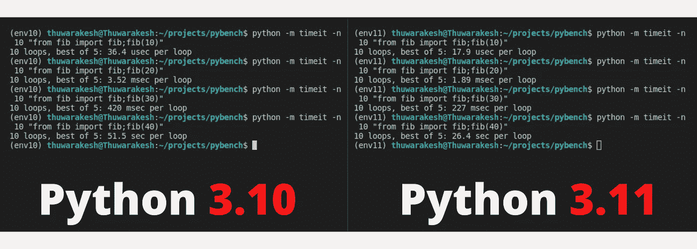
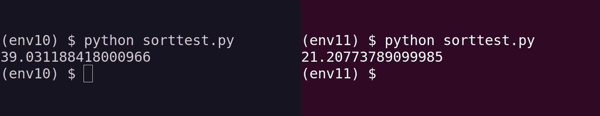
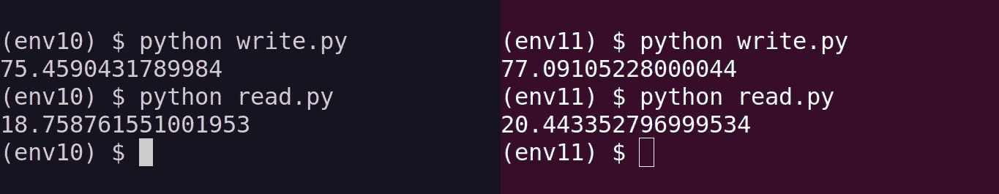

# Python 3.11 确实比 3.10 快

> 原文：<https://towardsdatascience.com/python-3-11-is-indeed-faster-than-3-10-1247531e771b>

## 与冒泡排序和递归函数并排比较证实了这一点


来自 [Pexels](https://www.pexels.com/photo/fashion-man-people-woman-6076414/) 的 [KoolShooters](https://www.pexels.com/photo/fashion-man-people-woman-6076414/) 摄影。

Python 3.11 重新发布版出来了。我很想知道里面有什么新东西。

当我打开变更日志时，我看到的第一件事完全吸引了我的注意力。

> Python 3.11 比 Python 3.10 快了**10-60%**。平均而言，我们在标准基准测试套件上测量到 1.25 倍的加速。详见[更快的 CPython](https://docs.python.org/3.11/whatsnew/3.11.html#faster-cpython) 。— [Python 3.11 Changelog。](https://docs.python.org/3.11/whatsnew/3.11.html)

这是我渴望的东西。

我在运行 Python 的生产系统上工作没有任何问题。但是 Python 速度不快的事实困扰着我。出于性能原因，我们总是需要使用 Cython 或 Tuplex 来转换关键代码。

</challenging-cython-the-python-module-for-high-performance-computing-2e0f874311c0>  

随着 Python 3.11 的发布，我相信它会走到尽头。

然而，我想亲自尝试一下。它如何加快我在数据科学领域的日常工作？

我特别感兴趣的是看看它在处理熊猫数据帧方面是否有任何改进。

因此，我决定亲自测试一下。

首先，让我们用一些斐波纳契数来试试。

</how-to-speed-up-python-data-pipelines-up-to-91x-80d7accfe7ec>  

# 如何安装 Python 3.11 预发布版本？

Windows 用户可以从[发布页面](https://www.python.org/downloads/release/python-3110b1/)下载安装程序。如果你在 Linux 上像我一样，这里是你需要得到它。

```
# If you're on Ubuntu 22.04 (Jammy Jellyfish,) you may not need the following line
$ sudo add-apt-repository ppa:deadsnakes/ppa$ sudo apt install Python3.11
```

在这篇文章中，我不得不经常在两个版本之间切换。因此，我创建了单独的虚拟环境来存放两个 Python 版本。

</poetry-to-complement-virtualenv-44088cc78fd1>  

我们可以用下面的命令来完成:

```
$ virtualenv env10 --python=3.10
$ virtualenv env11 --python=3.11# To activate v11 you can run,
$ source env11/bin/activate
```

# Python 3.11 相比 Python 3.10 有多快？

我创建了一个小函数来生成一些斐波那契数来找出答案。

```
def fib(n: int) -> int:
    return n if n < 2 else fib(n - 1) + fib(n - 2)
```

然后我测量了这个函数在两个 Python 版本中的性能。

</how-to-detect-memory-leakage-in-your-python-application-f83ae1ad897d>  

让我们用 Timeit 运行斐波那契数生成器来确定执行时间。以下命令将重复生成过程十次，并显示最佳执行时间。

```
# To generate the (n)th Fibonacci number
python -m timeit -n 10 "from fib import fib;fib(n)"
```

以下是 Python 3.10 和 Python 3.11 的对比结果。



Python 3.11 和 Python 3.10 的并行性能比较—图片由[作者提供。](https://thuwarkesh.medium.com)

如你所见，Python 3.11 的每一次尝试都优于 Python 3.10。执行时间在 3.11 版本中大致减半。

呜！太不寻常了！

但是我想检查它在熊猫任务中的表现。不幸的是，到目前为止，Numpy 和 Pandas 还没有支持 Python 3.11 的版本。

</how-to-do-a-ton-of-analysis-in-the-blink-of-an-eye-16fa9affce06>  

# 冒泡排序的性能基准。

由于我无法对熊猫进行基准测试，我在考虑一个涉及数字的替代方案。这将最终对数据科学家的生活产生影响。

所以，我想测试一下[冒泡排序](https://www.programiz.com/dsa/bubble-sort)。

</how-to-serve-massive-computations-using-python-web-apps-590e51624bc6>  

在下面的代码中，我们试图测量对一百万个数字进行排序所需的时间。

上面的代码在代码内部生成了一百万个随机数。然而，`timeit`函数被设置为仅测量冒泡排序函数执行的持续时间。

结果是惊人的！



Python 3.11 在冒泡排序挑战上的表现优于 3.10——图片由[作者提供。](https://thuwarakesh.medium.com)

Python 3.11 只用了 21 秒就完成了排序，而 3.10 的对应版本用了 39 秒。

# I/O 操作是否存在性能差异？

一个有趣的性能挑战是我们的程序在磁盘上读写信息的速度。

如果您正在处理一个庞大的文件列表，或者在不使用数据库的情况下存储/检索数据，I/O 性能是至关重要的。

</python-web-apps-are-a-terrible-idea-for-analytics-projects-36f1bd33e84b>  

这里有一个简单的测试，将 Python 3.11 和它的 3.10 兄弟进行对比。

我有两个程序。第一个将一百万个文件写入磁盘。

我们使用`timeit`函数来打印持续时间。通过设置`number`参数，我们可以多次重复该任务并取平均值。

第二个程序也使用了`timeit`函数。但是它只涉及读取一百万个文件。

下面是我们运行两个版本得到的输出。



尽管 Python 3.10 似乎比 Python 3.11 有优势，但这并不显著。事实上，多次运行这个实验会得出不同的结论。

# 最后的想法

3.11 似乎是 Python 历史上一个了不起的版本。

Python 3.11 仍然是预发布版本。因此，你不能指望你所有的第三方软件包都能正常工作。现在连 Numpy 和熊猫都不行了。

然而，关于 3.11 版本的一个有趣的说法是，它比前一个版本快 60%。

在这篇文章中，我做了一些实验来验证这个说法。而且 Python 3.11 确实更快。

您可以复制代码并亲自尝试。

> *感谢阅读，朋友！在*[***LinkedIn***](https://www.linkedin.com/in/thuwarakesh/)*[***Twitter***](https://twitter.com/Thuwarakesh)*，以及*[***Medium***](https://thuwarakesh.medium.com/)*上跟我打招呼。**
> 
> **还不是中等会员？请使用此链接* [***成为会员***](https://thuwarakesh.medium.com/membership) *因为，在没有额外费用的情况下，我为你引荐赚取一小笔佣金。**