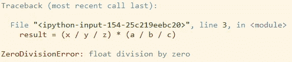
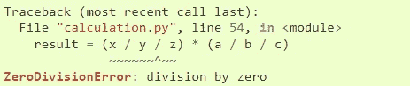
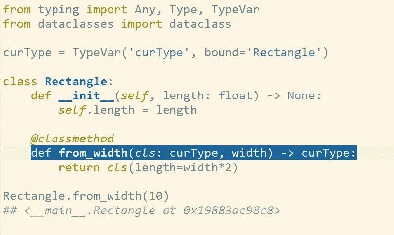
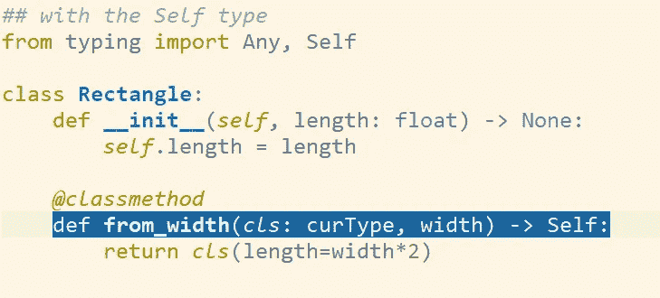
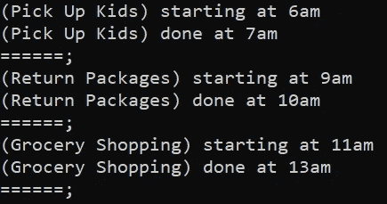
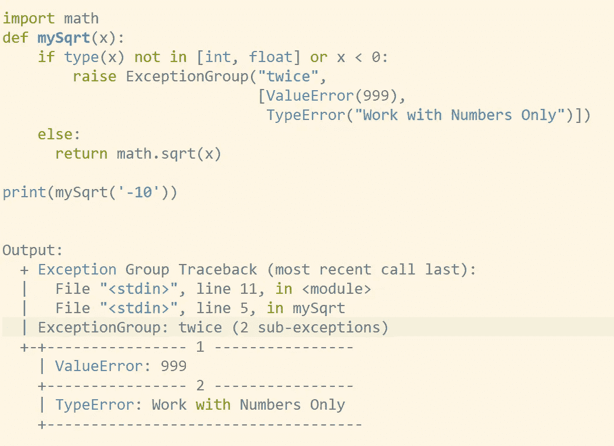
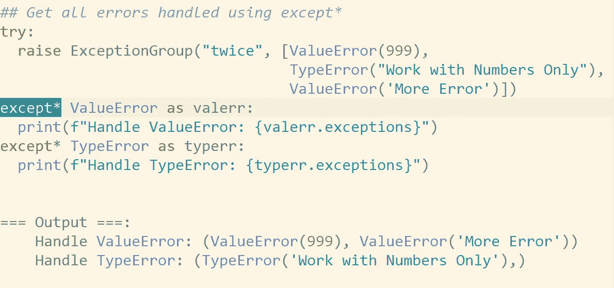
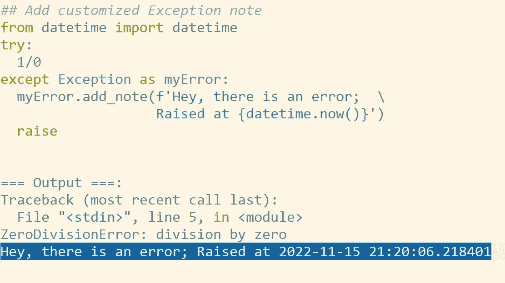

# Python 3.11:您将真正喜欢的新特性

> 原文：<https://towardsdatascience.com/python-3-11-new-features-that-you-will-truly-enjoy-9fd67882fdf>

## 世界各地志愿者的努力值得称赞


图片来源: [Unsplash](https://unsplash.com/photos/LJ9KY8pIH3E)

Python 3.11 于 2022 年 10 月 24 日发布，为我们提供了一些令人着迷的改进。你可以在这里看到[所有 pep 的完整文档。在本文中，我将为您带来 5 个很酷的新功能，外加额外的奖励，我想您会喜欢的。](https://docs.python.org/3.11/whatsnew/3.11.html)

## [PEP 657](https://peps.python.org/pep-0657/) :错误追溯定位器

在 Python 3.11 之前，当出现异常时，错误回溯中唯一的信息是描述错误的**行**。举个例子，

```
x, y, z = 1, 2, 0
a, b, c = 3, 4, 5
result = (x / y / z) * (a / b / c)
```

这段代码会抛出一个错误，因为我们在除`X/Y by Z`，等于 0。下面是错误消息，它很有意义，但不提供信息，因为我们仍然不知道代码的哪一部分导致了这个问题。



在 Python 3.11 中，我们会看到这个，



在错误定位器`~~^~~`的帮助下，很明显根本原因是 **Y 或 Z 为零**。当您的代码变得复杂时，这种带注释的回溯将更加强大。

## [人教版 673](https://peps.python.org/pep-0673/) :自身型

对于类型提示，以前，如果我们需要引用当前类本身，我们必须显式定义一个类型变量，如下所示。



现在在 3.11 中，我们可以使用一个`Self` 类型，它指的是封装类本身。这将消除定义类型变量的麻烦。



## [改进的{asyncio}](https://docs.python.org/3.11/whatsnew/3.11.html#asyncio) :异步上下文管理器

对于异步编程，代码仍然是一次执行一步，但是系统不会等待这一步完成后再进入下一步。

在 Python 中，这是由`{asyncio}`模块处理的。我们创建几个异步任务，等待每个任务运行，然后用`asyncio.gather()`收集它们。比如，让我们去跑跑腿，

在终端中运行它会得到这样的输出，



然而，在用`asyncio.gather`等待任务之前手动监控任务`list` 是很麻烦的。3.11 中引入了一个新的特性/类`TaskGroup()`，

`TaskGroup`的功能是作为一个上下文管理器，保存您的一组任务，这些任务将在退出时等待所有的任务。另外，语法更简单。

## [PEP 654](https://peps.python.org/pep-0654/) :异常组

异常处理的一个类似的*“分组”*特性是 3.11 中增加的**异常组**。我们可以把它想象成几个常规的异常被包装在一个异常中，



正如我们所看到的，当一个错误触发了`ExceptionGroup`时，它引发了两个子异常，显示在它自己的面板中。

为了处理`ExceptionGroup` ，Python 3.11 还添加了一个新的关键字`except*`，



通过`except*`，可以处理`ExceptionGroup` 中包含的多个错误。当在{ [*asyncio*](https://docs.python.org/3.11/whatsnew/3.11.html#asyncio) }中使用许多异步任务一起运行时，这个特性会更有效。

## [PEP 678](https://peps.python.org/pep-0678/) :自定义异常注释

错误处理的另一个很棒的新特性是带有`add_note`的异常注释，它允许您添加定制的消息。举个例子，



## 奖励 [PEP 659](https://peps.python.org/pep-0659/) :更快的执行速度

值得一提的是，由于更快的 CPython 计划，Python 3.11 预计将比其前辈 T22 快**10%-60%。**

## 结论:该不该升级到 Python 3.11？

看情况！就个人而言，**我反对升级生产环境**，因为你的项目中使用的某些库可能还不兼容 Python 3.11。

如果你想测试一下，我建议你在 Google colab 上测试一下。您可以运行以下命令将 Python 版本升级到 3.11，

```
!sudo apt-get update -y
!sudo apt-get install python3.11
!sudo update-alternatives --install /usr/bin/python3 python3 /usr/bin/python3.7 1
!sudo update-alternatives --install /usr/bin/python3 python3 /usr/bin/python3.11 2
```

在本文中，我们只介绍了最有趣的新特性；请务必查看[官方发布文件](https://docs.python.org/3/whatsnew/3.11.html)了解所有改进和变更。

******🎥加入我们的 YouTube 数据科学家和开发者社区*** [***【数据与 Kat 对话】***](https://www.youtube.com/channel/UCbGx9Om38Ywlqi0x8RljNdw) ***😄热门视频:*** [***为什么有的人学编码比较快？***](https://www.youtube.com/watch?v=Cw2Co8enZhM)

***想要更多数据科学和编程技巧？使用*** [***我的链接***](https://yilistats.medium.com/membership) ***注册 Medium，获得我所有内容的全部访问权限。***

**你可能会觉得鼓舞人心的其他博客，**

<https://levelup.gitconnected.com/3-small-sql-errors-that-cost-a-data-science-job-offer-7ee920084aed>  </6-sql-tricks-every-data-scientist-should-know-f84be499aea5> 