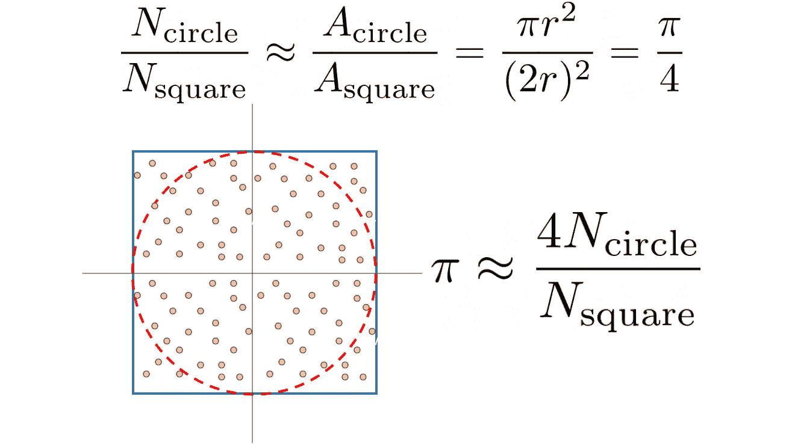
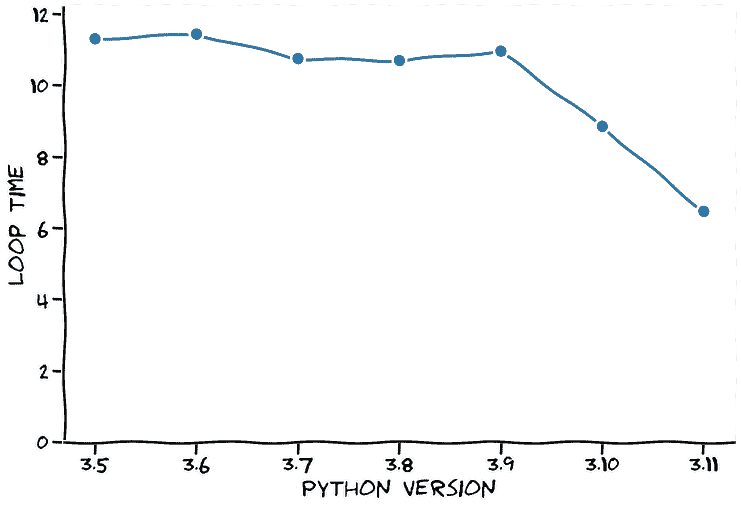
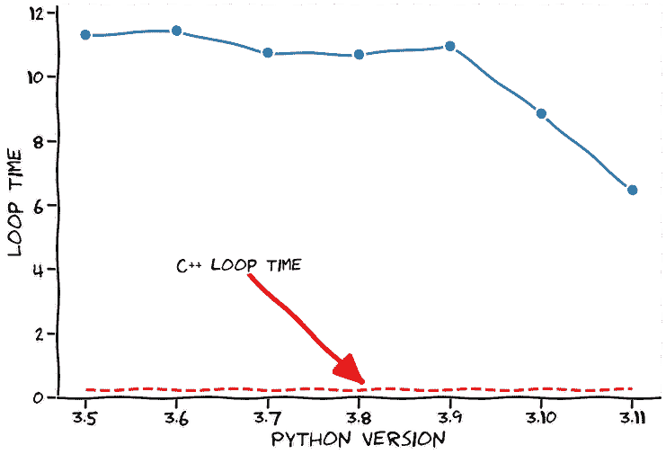
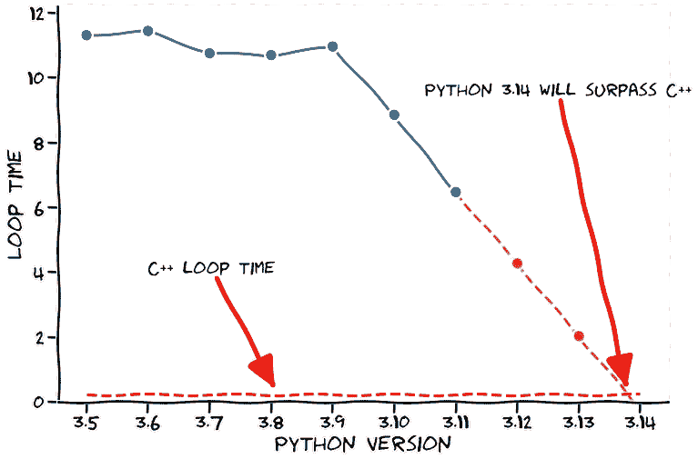

# Python 3.14 将比 C++更快

> 原文：<https://towardsdatascience.com/python-3-14-will-be-faster-than-c-a97edd01d65d>

## 令人印象深刻的新 Python 3.11 基准测试

Python 是数据科学(DS)和机器学习(ML)中使用最多的脚本语言之一。根据编程语言的流行程度，Python 是谷歌上搜索次数最多的语言。除了是一个伟大的*胶水*语言连接各种 DS/ML 解决方案在一起，它有许多库，几乎可以做任何与数据有关的事情。

大约一个月后，我们将迎来全新的 Python 年度版本:版本 3.11。我对这个新版本感到非常兴奋，因为这个版本的主要特点是速度显著提高。

在 LinkedIn 上，我已经看到了一些人测试新版本的帖子，他们的结果令人震惊。但是感受 Python 3.11 到底有多快的最好方法是自己运行测试。

在这篇文章中，我将分享我对 Python 3.11 的逐步分析。所有代码都可以在[我的 github 页面](https://github.com/dennisbakhuis/python3.11_speedtest)上找到。


照片由[斯潘塞·戴维斯](https://unsplash.com/@spencerdavis?utm_source=unsplash&utm_medium=referral&utm_content=creditCopyText)在 [Unsplash](https://unsplash.com/s/photos/formula-1?utm_source=unsplash&utm_medium=referral&utm_content=creditCopyText) 上拍摄

对编程语言进行基准测试一点也不简单。当你读到 *x* 比 *y* 快时，你永远要对这个结果半信半疑。一种算法的实现可能在 *x* 上更好，而另一种在 *y* 上更好。对于我们的基准测试来说，这要简单一些，因为我们是在用 Python 来测试 Python，但是我们可能已经从语言中选择了一些元素，这些元素只受到了很小的影响。考虑到这一点，我想介绍我用来进行基准测试的算法:使用蒙特卡罗方法估计圆周率。

这个算法的想法很简单，但是当 a 在大学的数学课上第一次看到它时，我大吃一惊。我们有一个大小为 2r 的正方形，在这个正方形中我们拟合了一个半径为 r 的圆*T21。现在我们拿一个在平面上产生数字的随机数发生器: *< -r，r >，< -r，r >* 。圆上的点与正方形上的点之比(即所有点)是面积比的近似值，我们可以用它来近似圆周率。这在等式中更清楚一点:*



图 1:蒙特卡罗方法估算圆周率的推导。两个面积之比是 Pi/4，因此，Pi 大约是 N_circle / N_all 的 4 倍。(图片由作者提供)。

在 Python 中，我从测试脚本中分离出实际的估计，这样我可以重复测试并取平均值。这里没有显示，但是我已经使用 [*Argparse*](https://docs.python.org/3/library/argparse.html) 对脚本进行了参数化，这是一个从命令行界面(CLI)解析参数的标准库。Python 代码如下所示:

这个脚本已经准备好运行了，但是我们想用它来测试 Python 的各种版本，而不仅仅是当前安装(或激活)的版本。测试多个版本的 Python 最简单的方法是使用 Docker。Python 维护[许多 docker 图片](https://hub.docker.com/_/python)。当然是所有受支持的版本，但也包括一些已停产(EOL)的版本，如 2.7 或 3.2。它也有候选版本的图像，例如版本 3.11。要使用 Docker，您需要安装它。在 Linux 和 Mac 上相对容易，在 Windows 上我不太确定，但可能也不难。我建议只安装 docker 命令行界面，桌面对我来说太臃肿了。要在容器化 Python 环境中运行本地脚本，请运行:

```
docker run -it --rm \
  -v $PWD/your_script.py:/your_script.py \
  python:3.11-rc-slim \
  python /yourscript.py
```

为了自动化各种版本的测试，我们当然也会使用 Python。这个脚本将简单地启动一个 [*子流程*](https://docs.python.org/3/library/subprocess.html?highlight=subprocess#module-subprocess) 来启动一个具有特定 Python 版本的容器，然后收集结果。没什么特别的:

当运行这些测试时，机器与机器之间的绝对数量不同，这取决于处理器(它是 CPU 密集型的)。以下是最近 7 个主要 Python 版本的结果:

```
The new Python 3.11 took 6.4605 seconds per run.Python 3.5 took 11.3014 seconds.(Python 3.11 is 74.9% faster)
Python 3.6 took 11.4332 seconds.(Python 3.11 is 77.0% faster)
Python 3.7 took 10.7465 seconds.(Python 3.11 is 66.3% faster)
Python 3.8 took 10.6904 seconds.(Python 3.11 is 65.5% faster)
Python 3.9 took 10.9537 seconds.(Python 3.11 is 69.5% faster)
Python 3.10 took 8.8467 seconds.(Python 3.11 is 36.9% faster)
```

Python 3.11 的基准测试平均耗时 6.46 秒。与之前的版本(3.10)相比，这几乎快了 37%。相当令人印象深刻！3.9 版和 3.10 版之间的差异大致相同，这使得 3.11 版的速度几乎快了 70%。我在图 2 中画出了所有的时间。



图 2:所有测试的 Python 版本的平均循环时间。(图片由作者提供)。

当谈到速度时，我们总是听到有人说:如果你想要速度，为什么不用 c 呢？

> c 比 Python 快多了！—那个人

虽然我的 C 很生疏，但我想我还是要试一试。我使用 GNU C++因为它有一个很好的时间测量库(chrono)。找到下面的代码:

众所周知，C++是一种编译语言，因此，我们需要在使用它之前编译源代码。当您安装了典型的`build-essentials`时，您可以键入:

```
g++ -o pi_estimate pi_estimate.c
```

编译完成后，只需运行构建可执行文件。输出应该是这样的:

```
Pi is approximately 3.14227 and took 0.25728 seconds to calculate.
Pi is approximately 3.14164 and took 0.25558 seconds to calculate.
Pi is approximately 3.1423 and took 0.25740 seconds to calculate.
Pi is approximately 3.14108 and took 0.25737 seconds to calculate.
Pi is approximately 3.14261 and took 0.25664 seconds to calculate.Each loop took on average 0.25685 seconds to calculate.
```

我们不得不同意*那个家伙*真的(读:真的)快。只花了 0.257 秒就完成了我们之前用 Python 编程的同样的循环。让我们将它作为一条线添加到之前的图中，如图 3 所示。



图 3: Python 版本与用 C++编译的相同基准的比较。(图片由作者提供)。

现在，在欣赏了前面的图一段时间后，我们清楚地看到 Python 获得了动力。自 3.9 版本以来，Python 的速度提高了约 35%。Python 开发者提到接下来的几个版本将会有显著的速度提升，因此，我们可以假设这个速度将会保持(*是的*，超级安全的假设)。

现在的问题是，在这种势头不变的情况下，Python 什么时候会超越 C++的时代。为此，我们当然可以使用外推法来预测下一个 Python 版本的循环时间。这些可以在图 4 中看到。



图 4:外推 Python 速度-> Python 3.14 将在速度上超越 C++。太神奇了！(图片由作者提供)。

结果真是惊艳！保持这个速度，Python 3.14 会比 C++更快。确切地说，循环时间将是 *-0.232* 秒，所以它将在您想要进行计算之前完成。时空连续体中似乎有一个洞，但这些计算是坚如磐石的。因此，我认为我们可能不得不质疑爱因斯坦和他的朋友们的工作。

## 放弃

虽然 Python 3.5 的这些基准测试..Python 3.11 是有效的，这种推断当然是开玩笑的。XKCD 样式的数字是对这一点的额外提醒；-).

如果您想在各种 Python 版本上运行这些测试或您自己的测试，请在 [my Github 页面](https://github.com/dennisbakhuis/python3.11_speedtest)上下载代码。

如果您有任何意见，请告诉我！在 LinkedIn 上随意连接。