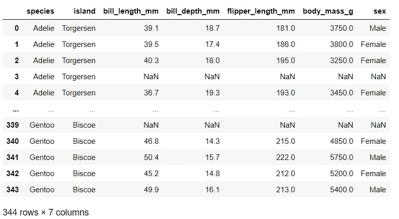

# Python 及其在 R 语言中用于数据框操作的类似命令

> 原文：<https://towardsdatascience.com/python-and-its-similar-commands-in-r-for-data-frame-manipulation-5d2e1f84e1db>

# Python 及其在 R 语言中用于数据框操作的类似命令

## Python 和 R 中数据争论的备忘单

威尔·斯旺在 [Unsplash](https://unsplash.com?utm_source=medium&utm_medium=referral) 上的照片

# 介绍

因为除了 Python 之外，我现在还在使用 R，所以我偶尔会对这两种语言的语法感到困惑，不得不查找它们。我不得不承认我有一条金鱼的记忆；这就是为什么毫无疑问，我浪费了很多时间去寻找。这就是我写这篇小抄的动机。希望它能为那些希望学习或开始学习这两种语言的人提供一份方便的小抄。

对于 Python 中的数据角力，我会用`Pandas`。另一方面，`tidyr`、`d plyr`或 R base 是用于文章中几乎所有命令的 R 包。

# 数据集

对于本文，我将使用 Python 和 R 中一个公开可用的名为`penguins`的数据集，它很容易获得，如下所示:

***数据来源参考:*** *Waskom，m .等人，2017。mwaskom/seaborn:v 0 . 8 . 1(2017 年 9 月)，芝诺多。可在:*[*https://doi.org/10.5281/zenodo.883859.*](https://doi.org/10.5281/zenodo.883859.)

以下是数据集的一瞥:

图 1:“企鹅”数据集——作者图片

# 数据浏览命令

在分析任何数据集之前，我们必须对数据有一个概述，并检查数据帧的一些基本信息，如数据类型、列数、行数等。例如，在这种情况下，`penguins`数据帧的某些方面检查如下:

图 2:数据概述——按作者

# 自动化 EDA

在自动化 EDA 库的支持下，EDA 变得前所未有的简单。我确实曾经写过一些 Python 自动化 EDA 库，我发现它们有助于快速生成对数据集的透彻理解。你可以在 [***Python 库阅读更多你可能错过的***](/3-python-libraries-for-effective-eda-that-you-might-have-missed-3320f48ff070) ***有效 EDA 的详细内容。***

我认为有必要在这个备忘单上提供这样的库建议，以方便您在单行代码中检查数据。

## 计算机编程语言

图 Python 中 EDA 的自动化库——作者

这里是对自动化 EDA 的强大库之一`DataPrep`的一瞥。

图 4:作者的 EDA-Gif 数据准备

## 稀有

许多 R 包也提供自动化 EDA，只需一行代码。个人认为 R 的包比 Python 的更多样化。我正在收集这些库，也许我很快就能和你分享这些可爱的包的一些细节。

图 4:R 中 EDA 的自动化库——按作者

图 5: ExPandar 库示例——作者 Gif

# 数据过滤

## 切片数据帧

例如，我只想选择数据的一列`species`来显示。在 R 和 Python 中都有几种方法可以做到。

图 6:切片方法——按作者

## 用行条件选择数据

大多数情况下，您必须选择特定条件的子集进行分析。选择的子集必须满足一个或多个要求。

在 Python 中，你可以使用带有合理逻辑表达式的`loc`、`query`或`apply(lambda x:...)`方法来产生结果。另一方面，在 R 中，我们可以通过使用`filter`或`which`和`subset.`的 base R 方法来过滤行。下面的代码显示了我如何通过不同的方式获得比斯开岛雌性企鹅的数据。

图 7:按作者过滤行

## 选择包含特定模式的子集

当我们想要检索包含所需字符串的数据时，情况又如何呢？比如选择名字以`Ad`开头或者以`lie`结尾的企鹅的信息。

图 8:过滤字符串——按作者

# 聚合和分组

## **巨蟒**

聚合和 group by 函数在数据转换阶段非常重要。以下是我经常用来操作数据的最常用命令。如你所见，在下面的例子中，我们有`nunique,` `mean,` `max,` `min,` `sum,` `median`的聚合函数，我想通过`**island & sex**` 对数据进行分组，以查看不同企鹅种类的特征。

图 9:Python——按作者分组和聚合

## **R**

图 10: R—分组依据和聚集依据—作者

# 整理

在分组和聚合之后，通常会进入按降序或升序对值进行排序的步骤。在 Python 中，`sort_values()`是我经常使用的函数。同时，在 R 中，我更喜欢使用`dplyr`包中的`arrange()`函数，因为我发现这样最容易记住。

下面的例子展示了我是如何按照企鹅的体型大小降序排列它们的。

## 计算机编程语言

图 11:Python——按作者排序

## 稀有

图 12: R—按作者排序

# **改变栏目**

例如，您想在聚合后重命名您的列或者使列名更容易记住，您可以使用函数`rename().`这个函数在 Pandas 和 Dplyr 中都有，目的相同。下面的代码还展示了一些示例，在这些示例中，您可以删除不需要的列或添加新列。

## 计算机编程语言

图 13: Python —按作者调整列

## 稀有

图 14: R—按作者调整列

# 结论

我相信联系一些你已经很熟悉的东西可以帮助你更有效地学习新知识。我希望这些指针在您将来使用 Python 或 R 数据操作时能够派上用场。祝你好运！