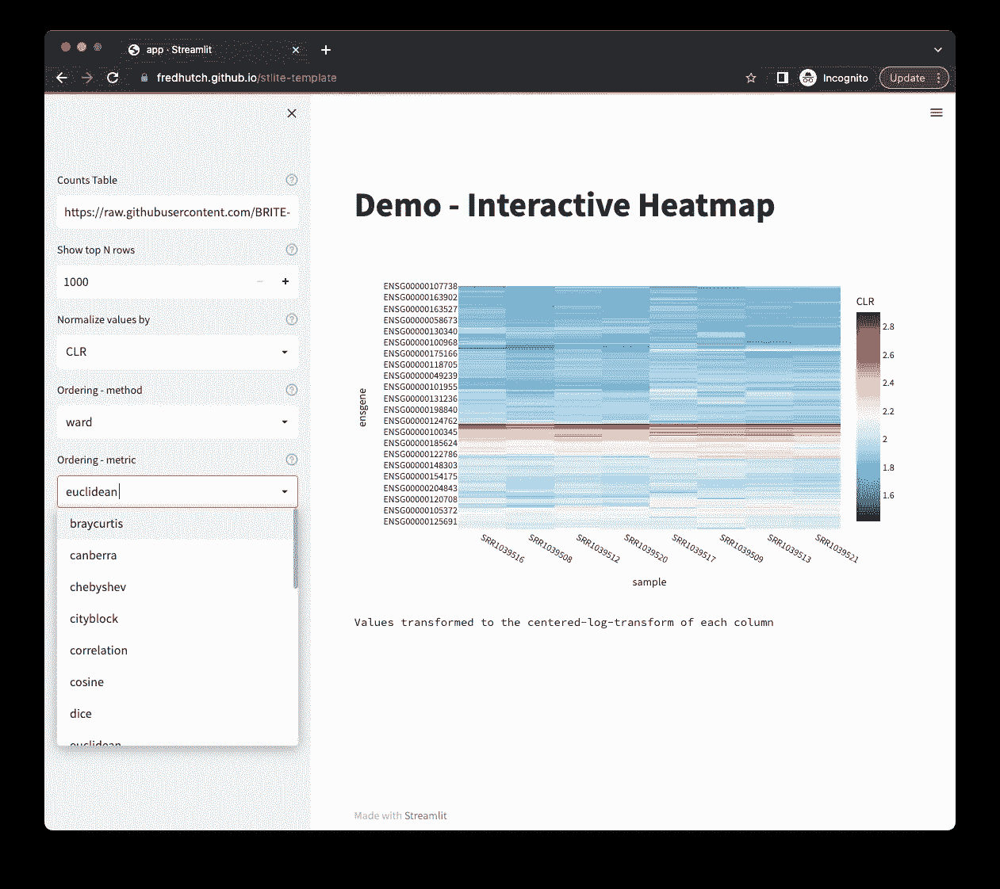
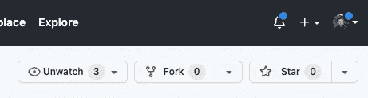
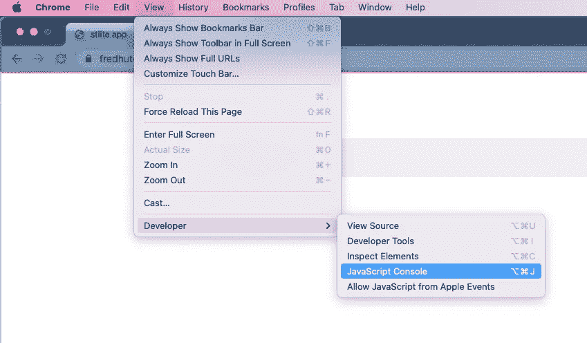
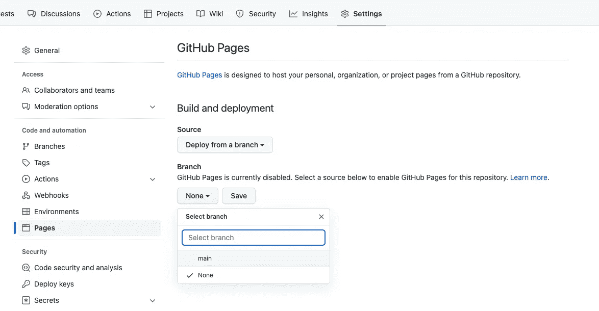

# 基于 Python 的数据，即(无需安装)

> 原文：<https://towardsdatascience.com/python-based-data-viz-with-no-installation-required-aaf2358c881>

## 为非计算用户编写和交付交互式 Python 应用


多萝西娅·奥德尼在 [Unsplash](https://unsplash.com?utm_source=medium&utm_medium=referral) 上的照片

无论你在什么类型的组织工作，从事数据科学的人都有一系列的计算技能和背景。精通计算的研究人员面临的最大挑战之一是如何最有效地将有用的工具交付给他们不太擅长计算的同事。虽然 python 是一个非常强大的数据分析和可视化工具，但对于非计算研究人员来说，在自己的计算机上安装和运行基于 Python 的应用程序并不容易。

然而，最近在 [WebAssembly](https://webassembly.org/) 开源项目中的创新使得在 web 浏览器中直接运行 Python 代码成为可能。现在，你可以建立一个静态网页，直接在用户的机器上执行所有需要的计算，而不是让 Python 服务器一直运行。在本教程中，我将带你通过几个简单的步骤来设置一个基于 Python 的 web 应用程序(使用 [Streamlit](https://streamlit.io/) ),由用户*启动，而不需要安装任何东西*。

# 在数据科学中权衡收益和成本

作为一名生物信息学家，我一直在寻找新的工具来帮助我的合作者进行真正有用的分析。但是，决定采用一种新工具并不纯粹基于它能提供什么——我还必须权衡学习它的难度。很长一段时间以来，web 开发的世界让我觉得遥不可及，纯粹是因为学习 JavaScript 和 HTML/CSS 的明显困难。

虽然 Python(和 R)确实都可以用来建立交互式 web 应用程序，但这些库( [Flask](https://flask.palletsprojects.com/) 、 [Dash](https://dash.plotly.com/) 、 [Streamlit](https://streamlit.io/) 和 [Shiny](https://shiny.rstudio.com/) )旨在运行在主动服务器上，这些服务器在后端执行计算，然后将结果发送到用户浏览器的前端。以这种方式运行 web 应用程序本来就困难得多，这既是因为保持机器持续运行的成本，也是因为提供受保护的网络连接的复杂性。有一些很棒的托管解决方案，用于共享基于 R 和 Python 的应用程序，但它足够复杂，我不太倾向于建立自己的版本。

# 它是如何成为可能的

彻底改变了软件开发前景的变革性工具是 [WebAssembly](https://webassembly.org/) ，它使编译 Python 代码成为可能，从而可以直接在 web 浏览器中运行。编写在 web 浏览器中运行的代码是非常棒的，因为你不再需要要求用户安装任何依赖项——他们几乎肯定已经有了 web 浏览器。

在 JS 中实现了 Python 的项目叫做 [Pyodide](https://pyodide.org/en/stable/) 。使用这个框架， [Yuichiro Tachibana](https://github.com/whitphx) 制作了一个名为 [stlite](https://github.com/whitphx/stlite) 的 Python GUI 库 [Streamlit](https://streamlit.io/) 的端口。使用 stlite 可以编写完全在 web 浏览器中运行的 Python 代码，这意味着用户不需要安装任何东西就可以运行它。

如果我不是 Streamlit 的超级粉丝，我可能不会对此感到如此兴奋。这个 Python 库使得构建一个简单的 GUI 变得非常容易，它可以驱动您喜欢的任何类型的数据可视化。与多个强大的绘图库( [Pyplot](https://matplotlib.org/stable/tutorials/introductory/pyplot.html) 、 [Altair](https://altair-viz.github.io/) 、 [Vega Lite](https://vega.github.io/vega-lite/) 、 [Plotly](https://plotly.com/python/) 、 [Bokeh](https://docs.bokeh.org/en/latest/) 、 [pydeck](https://deckgl.readthedocs.io/en/latest/) 和 [graphviz](https://graphviz.org/) )进行了本机集成，以及对[用户输入](https://docs.streamlit.io/library/api-reference/widgets)、[页面布局](https://docs.streamlit.io/library/api-reference/layout)和[媒体显示](https://docs.streamlit.io/library/api-reference/media)的灵活控制。

最重要的是，大脑空间开销很低——您不需要学习太多就可以启动并运行。如果您已经在使用 Python，并且希望快速原型化和部署一个交互式 web 应用程序，那么绝对值得您花时间探索 Streamlit。

现在，这些 Streamlit 应用程序可以提供给用户，并直接在浏览器中运行。

# 预期用途和限制

你可以用 Python 和 stlite 制作一个有效的 GUI，只要你记得它是直接在用户的浏览器中运行的。

*   加载需要一分钟——你的用户会从耐心中受益；
*   需要大量内存、CPU 或 I/O 的操作很可能会导致问题——尽量让计算变得轻量级；
*   您需要读入的任何文件也必须对用户的浏览器可用，或者通过(1)自己托管它们，(2)在公共 URL 访问它们，或者(3)当用户将它们“上传”到浏览器时；
*   访问控制很重要——任何可以访问网页的人都可以运行应用程序*和*读取其源代码。

# 入门指南

本指南将带您了解:

1.  在 GitHub 上复制模板库
2.  添加您的 Streamlit 应用程序
3.  本地测试
4.  使用 GitHub 页面在 web 上公开部署

要使用本指南，您应该熟悉(1)在 GitHub 上操作软件仓库和(2)在本地运行 Streamlit。

为了了解如何将 GitHub 存储库转化为交互式数据可视化应用程序，您可以看到这个模板存储库([Fred hutch/ST lite-template](https://github.com/FredHutch/stlite-template))已被托管在[https://fredhutch.github.io/stlite-template/](https://fredhutch.github.io/stlite-template/)。



作者图片

模板中的示例应用程序读入一组 RNAseq 计数(使用来自 [BRITE-REU 编程研讨会](https://github.com/BRITE-REU/programming-workshops)的数据)，通过 CLR 或比例丰度对数据进行归一化，对行和列执行关联聚类，并向用户显示交互式热图。

# 1.派生模板存储库

导航到[Fred hutch/stlite-template](https://github.com/FredHutch/stlite-template)存储库，并[将其](https://docs.github.com/en/get-started/quickstart/fork-a-repo)分支到您自己的帐户或组织中。请务必更改名称和描述，因为您将制作全新的东西。



作者图片

# 2.添加您的 Streamlit 应用程序

运行应用程序所需的所有代码都应该放在存储库中。根据您的应用程序的功能，您可能还需要采取一些额外的步骤:

1.  将所有 Python/streamlit 代码放在文件`app.py`中；
2.  在`index.html`的第 38 行添加 app 导入的任何库(如`requirements: ["click", "scipy", "plotly"],`)；
3.  如果你的 streamlit 应用中有任何`@st.cache`decorator，添加参数`show_spinner=False`(解释 stlite 中的一个已知 bug)

# 2a。读入数据

我遇到的这个过程中最棘手的部分是如何读入外部数据源(例如 CSV 文件)。幸运的是，解决方案并没有变得太复杂。

核心问题是 Pyodide 目前不支持`requests`库。这导致在使用像`pd.read_csv`这样有用的函数时出错，这些函数在幕后使用`requests`。相反，从浏览器内部读入远程文件的最佳方式(记住，所有文件对您的用户来说都是远程的，甚至是您在存储库中设置的任何附加文件)是使用`pyodide.http`库。

然而，在 Python 内部进行本地测试时，`pyodide`库是不可用的，就像`requests`库在浏览器内部运行时是不可用的一样。

为了解决这个问题，我制作了一个小的助手函数，它使用适合执行上下文的库从 URL 读取 CSV:

```
import streamlit as st
import importlib
import requests
from io import StringIO
if importlib.util.find_spec("pyodide") is not None:
    from pyodide.http import open_url@st.cache(show_spinner=False)
def read_url(url:str, **kwargs):
    """Read the CSV content from a URL""" # If pyodide is available
    if importlib.util.find_spec("pyodide") is not None:
        url_contents = open_url(url)
    else:
        r = requests.get(url)
        url_contents = StringIO(r.text) return pd.read_csv(
        url_contents,
        **kwargs
    )
```

您可以根据需要随意复制或修改这些代码，以读入您的应用程序可能需要的数据文件。

# 2b。暂存数据

最有趣和最有用的应用程序以某种方式处理和转换数据，以便显示和与用户交互。在考虑如何将数据导入应用时，有三个主要选项:

1.  使用公共 URL 上的可用数据(如示例库中的[所示)；](https://github.com/FredHutch/stlite-template)
2.  要求用户使用 [streamlit 文件上传实用程序](https://docs.streamlit.io/library/api-reference/widgets/st.file_uploader)直接上传文件；
3.  自己托管数据，将数据上传到应用程序可以访问的位置。

虽然自己托管数据(选项 3)可能看起来令人生畏，但实际上使用下面概述的使用 GitHub Pages 发布您的应用程序的步骤是非常容易的。一旦您将应用程序发布到特定的 URL，您添加到存储库中的任何附加文件也将在该 URL 可用，并且可以由应用程序读取。因此，如果你想添加一些应用程序可以读取的数据文件，请按照本教程从头到尾了解它将在哪个 URL 可用，然后更新你的应用程序以从该 URL 读取。

# 3.本地测试

在部署您的应用程序之前，在本地进行测试是非常有帮助的。首先，您可以使用 Python 的本地副本(安装了 streamlit)启动该应用程序，包括:

```
streamlit run app.py
```

调试完您发现的任何错误后，下一步是启动一个本地 web 服务器，直接在浏览器中测试您的代码:

```
python3 -m http.server
```

在浏览器中检查错误时，最好打开 JavaScript 控制台(在 Chrome 中显示):



作者图片

# 4.使用 GitHub 页面在 web 上公开部署

虽然部署网站有很多方法，但我发现 GitHub Pages 是将代码库转变为公共网页的最简单的方法。为企业级帐户付费的用户也可以创建私人网站，但任何人都可以创建面向公众的页面。

需要明确的是，即使你的库是私有的，发布的网页仍然是公开的——你已经被警告过了。

要部署到 web:

1.  导航到您的存储库的网页(`www.github.com/<ORG>/<REPO>`)；
2.  点击“设置”；
3.  点击“页面”(在“代码和自动化”下)；
4.  在“分支机构”下，选择“主分支机构”(或您想要设置的回购分支机构)；
5.  就是这样！



作者图片

您将很快能够在基于您的组织和存储库名称的 URL 上找到您的网页(尽管有自定义域名的选项)。如`https://<ORG>.github.io/<REPO>/`。

例如，模板库`[https://github.com/FredHutch/stlite-template](https://github.com/FredHutch/stlite-template)`在`[https://fredhutch.github.io/stlite-template/](https://fredhutch.github.io/stlite-template/)`作为网页托管。

回到上传静态数据文件的解释，任何添加到模板库中的文件都可以被具有该 URL 的应用读取，例如`[https://fredhutch.github.io/stlite-template/data_file.csv](https://fredhutch.github.io/stlite-template/data_file.csv.)` [。](https://fredhutch.github.io/stlite-template/data_file.csv.)

# 包扎

既然你已经成功地构建了你的第一个无服务器的 web 应用程序，也许有必要思考一下 GUI 在你的工作中可能扮演的角色，如果有的话。虽然将一个工具直接放在你的用户/客户/合作者手中是非常吸引人的，但是很明显，并不是所有的工具*都应该放在他们手中。*

数据科学中的许多任务需要大量的计算资源，这要么需要在笔记本电脑上运行太长时间，要么需要通过强大的授权和身份验证控制来访问远程资源。其他任务由复杂的参数输入驱动，这些输入可能不容易向非专业用户解释，或者可能返回难以解释的结果。

网络应用的理想 GUI 将提供*响应*和*信息*可视化，允许用户以静态图像不可能的方式探索和发现。值得探索鼠标悬停数据、交互式小部件和任何其他可以暴露数据的丰富特性和复杂性的方式的机会。如果你*真的*成功，有人会从你的数据中发现一些你自己都没有意识到的东西。