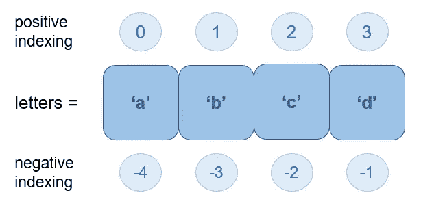

# 你需要知道的 Python 基础知识:数据结构

> 原文：<https://towardsdatascience.com/python-basics-you-need-to-know-always-data-structures-2c0f290e4747>

## 数据结构是一种存储、组织和处理数据的格式，它允许您高效地对数据执行操作


保罗·花冈在 [Unsplash](https://unsplash.com?utm_source=medium&utm_medium=referral) 上的照片

例如，存储人们的电子邮件地址，记录全天每小时的温度等。这些结构中的数据可以被称为元素。

有许多数据结构，几乎所有的数据结构都可以在任何编程语言中实现——要么它们内置于语言中，要么它们可以被创建或导入。

在本文中，我们将使用 Python 来探索数据结构。

因此，有 4 种数据结构被直接内置到 python 中— **列表、字典、集合和元组—** ，我们将在本文中讨论它们。在我们进入这些结构之前，有一件事需要快速理解，那就是**可变性的概念——改变的能力。**一些数据结构是可变的，即该结构可以被修改——在创建数据结构之后，可以添加、移除和更新元素。其他数据结构是不可变的，即，在它们被创建之后，不能对它们进行修改。

## 目录

> 列表将数据存储为方括号内逗号分隔的元素。它是有序的、连续的、异构的、索引的、可变的、非唯一的数据结构。

```
odd = [1, 3, 5, 7, 9]
```

**有序:**当您插入元素时，列表会保持它们的顺序。

**顺序:**一个列表可以被迭代。

**异构:**存储在一个列表中的元素可以是不同的数据类型，所以你可以拥有一个包含一个整数、一个字符串、一个浮点数的列表。由于这个特性，数据不那么紧密地打包在一起(内存方面)，因此列表会占用更多的空间。

**索引:**列表中的每个元素都有一个与之关联的索引，基本上就像一个地址。索引用于访问元素。

*正索引*从列表中第一个元素的 0 开始，一直到最后一个元素的 n-1，其中 n 是元素的数量。这就是所谓的向前遍历。

*负索引*从列表中最后一个元素的-1 开始，一直到第一个元素的-n，其中 n 是元素的数量。这就是所谓的反向遍历。



按作者。

**可变:**在 python 中，列表在后台被实现为动态数组，因此它们是可变的。您可以添加、删除和修改列表中的元素，python 会相应地自动释放或分配内存。一些操作，比如在列表的开头添加或删除一个元素，开销很大，因为列表中每隔一个元素的索引都需要改变。

**非唯一:**同一个元素可以在一个列表中存储两次，即列表可以包含重复的值。

我们来编码吧！

创建列表—您可以使用方括号[]或通过调用 list()方法来创建列表。

```
ids = [234, 534, 239, 392]letters = list(‘shubhangi’) 
#creating a list of a string breaks the string into individual #characters
>>> ['s', 'h', 'u', 'b', 'h', 'a', 'n', 'g', 'i']names = list([‘shubhangi’, ‘nita’, ‘pooja’, ‘jordan’])
>>> ['shubhangi', 'nita', 'pooja', 'jordan']mixed = [234, ‘shubhangi’, ‘nita’, 23.9]
```

将元素添加到列表末尾

```
names.append(‘shagun’)
>>>['shubhangi', 'nita', 'jordan', 'shagun']names.append(‘nita’)
>>>['shubhangi', 'nita', 'pooja', 'jordan', 'shagun', 'nita']
```

向列表的特定索引添加元素

```
names.insert(2, ‘nidhi’)
>>>[‘shubhangi’, ‘nita’, ‘nidhi’, ‘pooja’, ‘jordan’, ‘shagun’, ‘nita’]
```

计算相同值出现的次数

```
names.count(‘nita’)
>>>2
```

从列表中删除具有特定值的元素。如果该值的元素出现多次，则只删除第一次出现的元素。

```
names.remove(‘pooja’)
>>>[‘shubhangi’, ‘nita’, ‘nidhi’, ‘jordan’, ‘shagun’, ‘nita’]names.remove(‘nita’)
>>>[‘shubhangi’, ‘nidhi’, ‘jordan’, ‘shagun’, ‘nita’]
```

移除特定索引处的元素

```
names.pop(3)
>>>[‘shubhangi’, ‘nidhi’, ‘jordan’, ‘nita’]
```

从列表中删除最后一个元素

```
names.pop()
>>>[‘shubhangi’, ‘nidhi’, ‘jordan’]
```

获取具有特定值的元素的索引

```
names.index(‘jordan’)
>>>2
```

颠倒列表

```
names.reverse()
>>>[‘jordan’, ‘nidhi’, ‘shubhangi’]
```

**列表理解:**这是我最喜欢的列表部分。你可以以理解的形式创建、添加、修改列表，或者对列表做任何事情，这是一种更加优雅和全面的将多行代码转换成一行代码的方式！

假设您想要一个从 1 到 40 的数字平方列表。一个乏味的方法是

```
squares = []
for x in range (1, 41):
    squares.append(x**2)>>>[1, 4, 9, 16, 25, 36, 49, 64, 81, 100, 121, 144, 169, 196, 225, 256, 289, 324, 361, 400, 441, 484, 529, 576, 625, 676, 729, 784, 841, 900, 961, 1024, 1089, 1156, 1225, 1296, 1369, 1444, 1521, 1600]
```

有了列表理解，你可以简单地写

```
squares = [x**2 for x in range (1,41)]
>>>[1, 4, 9, 16, 25, 36, 49, 64, 81, 100, 121, 144, 169, 196, 225, 256, 289, 324, 361, 400, 441, 484, 529, 576, 625, 676, 729, 784, 841, 900, 961, 1024, 1089, 1156, 1225, 1296, 1369, 1444, 1521, 1600]
```

你也可以在列表理解中添加一个 if 条件！让我们从“正方形”列表中创建一个由可被 2 整除的数字组成的列表

```
nums = [num for num in squares if num%2==0]
>>>[4, 16, 36, 64, 100, 144, 196, 256, 324, 400, 484, 576, 676, 784, 900, 1024, 1156, 1296, 1444, 1600]
```

我们再加一个 else 吧！

```
result = [num if num%2==0 else ‘no’ for num in squares]
>>>[‘no’, 4, ‘no’, 16, ‘no’, 36, ‘no’, 64, ‘no’, 100, ‘no’, 144, ‘no’, 196, ‘no’, 256, ‘no’, 324, ‘no’, 400, ‘no’, 484, ‘no’, 576, ‘no’, 676, ‘no’, 784, ‘no’, 900, ‘no’, 1024, ‘no’, 1156, ‘no’, 1296, ‘no’, 1444, ‘no’, 1600]
```

注意:当只有一个 *if* 条件时，则 *if* 在 *for* 之后。当存在 *if-else* 条件时，则 *if* 和 *else* 先于 *for* 。

切片:这是列表的另一个很酷的特性！这是一种使用索引从列表中提取子集的方法。基本语法是

*<name of list>*[*<starting index>*:*<end index>*:*<index jump>*]

```
names = [‘shubhangi’, ‘nita’, ‘nidhi’, ‘pooja’, ‘jordan’, ‘shagun’]
```

获取整个列表

```
names[::]
>>>[‘shubhangi’, ‘nita’, ‘nidhi’, ‘pooja’, ‘jordan’, ‘shagun’]
```

获取两个索引之间的元素

```
names[1:5]
>>>[‘nita’, ‘nidhi’, ‘pooja’, ‘jordan’]
#(elements with index 1, 2, 3, 4)
```

从列表中提取替代元素

```
names[::2]
>>>[‘shubhangi’, ‘nidhi’, ‘jordan’]
#(starts at index 0, skips the next index, returns the next element, # and so on)
```

获取两个索引之间的替代元素

```
names[1:6:2]
>>>[‘nita’, ‘pooja’, ‘shagun’]
```

颠倒列表

```
names[::-1]
>>>[‘shagun’, ‘jordan’, ‘pooja’, ‘nidhi’, ‘nita’, ‘shubhangi’]
```

**元组**

> 元组将数据存储为括号内逗号分隔的元素。它是不可变的、异构的、有序的、顺序的和索引的。

```
odd = (1, 3, 5, 7,9)
```

**不可变:**元组本身是不可变的，这意味着不能动态地添加、删除或修改元素。一旦元组被初始化，它就不能被改变。这就是为什么它们比列表更有内存效率，因为内存在创建时就固定了。这也使得查找活动更快。

**异构:**像列表一样，元组可以保存不同数据类型的元素，包括不同的数据结构。例如，一个元组可以有一个字符串，后跟一个浮点，再跟一个列表。因此，尽管元组是不可变的，但它可以保存可变对象。由于这个原因，数据不那么紧密地打包在一起(就像在列表中一样)。

**有序:**和列表一样，元组保留了元素的顺序。顺序将始终与您创建的顺序相同。

**顺序:**元组和列表一样是可迭代的。

**索引:**元组的索引方式与列表完全相同，因此元素的访问方式也相同。

所以基本上，元组是一个不可变的列表。

我们来编码吧！

创建元组

```
data = (1, 3, ‘strawberry’, [9, 3, 4])even_nums = 2, 4, 6, 8
>>> (2, 4, 6, 8)type(even_nums)
>>> <class ‘tuple’>nums = even_nums, (1, 3, 5, 7) # nested tuples
>>> ((2, 4, 6, 8), (1, 3, 5, 7))letters = tuple([‘a’, ‘b’, ‘c’])
>>> (‘a’, ‘b’, ‘c’)# initialise a tuple with only one element. if done without the
# comma it won’t create a tuple
single = 1,
>>> (1,)
single_test = (1)
type(single_test)
>>> <class 'int'>
```

解包元组(将其值存储到单独的变量中)

```
a, b, c, d = even_nums
print(a, b, c, d)
>>> 2 4 6 8
```

除了不插入、删除或更新元素之外，其他方法与列表相同。

## 词典

> 字典以键值对的形式存储数据。它是一种顺序的、异构的、无序的、索引的、可变的数据结构。

```
numbers = {'odd':[1, 3, 5, 7, 9], 'even':[2, 4, 6, 8]}
```

很像一个电话地址簿，对于一个人的名字你有一个电话号码。名字是键，数字是值。一个键只能有一个值。值本身可以是另一种可以保存多个元素的数据结构，如列表。字典也称为映射、哈希映射、关联数组和查找表。

**Sequential:** 像列表和元组一样，字典也可以被迭代。

**异构:**和列表一样，字典可以保存不同数据类型的键和值。

**无序:** python 3.6.2 起在已建字典中是有序的；它们保留了插入键的顺序。不过在此之前，他们不会保留订单。

**Indexed:** 它的要点很简单，你可以根据元素的键来获取元素。这些键是字典的索引，它们可以是任何可哈希类型——可哈希对象的值在其生命周期内不会改变，因此任何不可变的对象都是可哈希的，比如数字和字符串。

**可变:**虽然字典中的键是不可变的，但是字典本身是可变的。这意味着您可以在创建后添加、删除和更新键值对。因为字典是可变的，所以它在创建时没有固定的大小——它是动态的。

字典在执行操作时也非常有效——对于查找、插入、更新和删除，它们的时间复杂度为 O(1)。

虽然这本字典可以直接在 Python 中获得，但它有不同特性的版本，可以从*集合*库和*类型*库中导入。其中一些版本如下:

*   有序字典:它保留了键插入的顺序，并且有一些基本字典没有的方法(python 3.6+普通字典也保留了插入顺序)
*   默认字典:如果您试图获取一个尚不存在的键值，它将返回一个默认值/响应
*   链式映射:这将多个字典组合成一个映射；在对映射执行查找时，会搜索映射中的每个字典，直到找到键
*   Counter:它对可散列对象进行计数，也就是说，它对一个元素出现的次数进行计数，并将其存储为一个值，将相应的元素作为键
*   映射代理类型:这是一个包装器，它基于原始的可变字典创建一个只读的，即不可变的代理字典

我们来编码吧！

创建词典

```
d = {‘a’:’apple’, ‘b’:’banana’} # using {}d = dict(a=’apple’, b=’banana’) # using dict() methodd = dict([(‘a’,’apple’), (‘b’,’banana’)]) # using dict method on a list of tuplesids = [234, 534, 239, 392]
names = ['shubhangi', 'nita', 'pooja', 'jordan']
students = dict(zip(ids, names))
>>>{234: 'shubhangi', 534: 'nita', 239: 'pooja', 392: 'jordan'} 
# using the zip method on two separate lists
```

获取字典的关键字

```
students.keys()
>>>dict_keys([234, 534, 239, 392])list(students) # returns keys as a list
>>>[234, 534, 239, 392]sorted(students) # returns keys in a sorted order
>>>[234, 239, 392, 534] 
```

获取字典的值

```
students.values()
>>>dict_values(['shubhangi', 'nita', 'pooja', 'jordan'])
```

获取特定键的值

```
# time efficient but can raise KeyError if key doesn't exist
students.get(239) 
>>>'pooja'# return default value if key is not present
students.get(123, 'not present') 
>>>'not present'students[239]
>>>'pooja'
```

删除特定的键值对

```
students.pop(239)
>>>{234: 'shubhangi', 534: 'nita', 392: 'jordan'}del students[239]
>>>{234: 'shubhangi', 534: 'nita', 392: 'jordan'}
```

检查字典中是否存在特定的关键字

```
234 in students
>>>True123 not in students
>>>True
```

检查字典是否为空

```
if students:
...print("not empty")
else:
...print("emptyy")
>>>not empty
```

迭代键值对

```
for k, v in students.items():
...print(k, v)
>>>234 shubhangi
534 nita
392 jordan
```

将键值对添加到字典中

```
students.update({123:'nidhi'})
>>> {234: 'shubhangi', 534: 'nita', 392: 'jordan', 123: 'nidhi'}students[901] = 'radhika'
>>>{234: 'shubhangi', 534: 'nita', 392: 'jordan', 123: 'nidhi', 901: 'radhika'}
```

字典理解:就像列表一样，字典也可以使用理解来制作和修改！

```
nums = { k: k**2 for k in (1, 2, 3)}
>>> {1: 1, 2: 4, 3: 9}nums.update((k, k**3) for k,v in nums.items())
>>>{1: 1, 2: 8, 3: 27}nums.update((k, v**3) for k,v in nums.items())
>>>{1: 1, 2: 64, 3: 729}
```

清空词典

```
nums.clear()
>>>{}
```

## **设置**

> 集合是花括号中逗号分隔的、无序的、唯一的元素的集合。它是可变的、无索引的和异构的。

```
vowels = {'a', 'e', 'i', 'o', 'u'}
```

**无序:**元素的顺序没有保持。

**唯一:**与列表不同，集合不存储重复值。

**未索引:**因为集合中的元素是无序的，所以没有索引。

**可变:**和列表一样，集合也是可变的。因此，可以在创建后添加和删除元素。然而，元素不能被改变，因为由于缺乏索引，无法访问特定的元素。

**异构:**集合可以保存不同数据类型的元素，只要它们是可散列的，即元素本身应该是不可变的。例如，集合中不能有列表。

集合允许诸如数学中的集合(有文氏图的那些)——交集、并集、差集等运算。所有这些操作的时间复杂度为 O(n)。

在 python 中，集合由 dictionary 数据类型支持，因此具有许多相似的特征。

还有一种类型的集合是不可变的，称为冻结集合。这可以用作字典中的键(因为它们是不可变的)或另一个集合的元素。

我们来编码吧！

创建集合

```
vowels = set(‘aeiou’)
>>> {‘u’, ‘e’, ‘o’, ‘i’, ‘a’}myname = set(‘shubhangi’)
>>> {‘u’, ’n’, ‘b’, ‘h’, ‘s’, ‘g’, ‘i’, ‘a’}
```

像列表和字典一样，集合也可以和理解一起工作！

```
even = {x for x in range (20) if x%2==0}
>>> {0, 2, 4, 6, 8, 10, 12, 14, 16, 18}
```

获取两个集合的交集，即两个集合中的公共元素

```
myname.intersection(vowels)
>>> {‘u’, ‘i’, ‘a’}
```

将两个集合连接在一起(获取它们的联合)

```
myname.union(vowels)
>>> {‘u’, ’n’, ‘e’, ‘o’, ‘b’, ‘h’, ‘s’, ‘g’, ‘i’, ‘a’}
```

获取在一个集合中存在而在另一个集合中不存在的元素

```
myname.difference(vowels)
>>> {’n’, ‘b’, ‘h’, ‘s’, ‘g’}
```

向集合中添加元素

```
myname.add(‘hora’)
>>> {‘u’, ’n’, ‘hora’, ‘b’, ‘h’, ‘s’, ‘g’, ‘i’, ‘a’}
```

从集合中移除元素

```
myname.remove(‘hora’)
>>> {‘u’, ’n’, ‘b’, ‘h’, ‘s’, ‘g’, ‘i’, ‘a’}
```

我希望这篇文章能帮助你学习/修改 python 中列表、集合、元组和字典的方式、时间和原因！除此之外，还有一些数据结构，比如数组、栈、队列、链表等等，它们可以从 python 库中导入或者使用现有的数据结构创建。我们将在以后的文章中讨论这一点:)