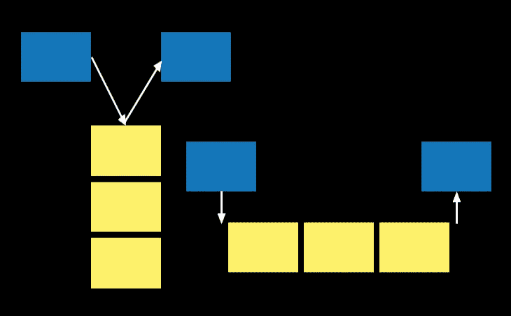

# Python 集合模块:被遗忘的数据容器

> 原文：<https://towardsdatascience.com/python-collections-module-the-forgotten-data-containers-f282bf6c1fe6>

## 如果您没有使用集合模块中的容器数据类型，您应该

图片作者。

在编程语言的学习过程中，开发我们自己的技巧来实现特定的任务并不少见。作为数据科学家，我们最终可能会有一些自己制作的小配方，使我们能够以特定的方式操纵数据。我们倾向于把这些食谱记在我们珍藏的笔记本上。

有时候，这些食谱使用的工具并不是最适合手头的任务。尽管如此，我们从不费心寻找更好的工具，因为这项工作是琐碎的。我们的实现是可行的——例如，实现一个计数器或者存储一个直播提要的最后十次出现。

当有更合适的数据容器时，我们可能会使用 Python 基本数据结构的某种组合来实现我们的目标。Python 的*集合*模块就是一个例子。这个有点被遗忘但很棒的模块实现了数据容器，如果你给它一个机会，它将极大地简化你的生活。也许一个*集合*模块容器将取代那些旧配方中的一个。

这个故事将回顾集合模块中一些最有用的数据容器。更多信息，请查看[官方文档](https://docs.python.org/3/library/collections.html)。

故事结构如下:

*   默认字典
*   双端队列
*   计数器
*   命名元组
*   最后的话

## 默认字典

列表中的第一个容器是模块中我最喜欢的容器， *defaultdict* 。它会以意想不到的方式简化你的生活。这个容器是一个字典，但是它的值是根据默认工厂初始化的。

通常情况下，我们希望字典中的所有值都是*列表*，例如。为每个键初始化*列表*既痛苦又麻烦。每次我们想对一个值进行列表操作时，我们必须检查这个键是否存在；如果没有，首先初始化*列表*，然后继续进行*列表*操作。非常头疼。嗯， *defaultdict* 解决了这个。

下面是*列表*默认工厂的一个例子:

> defaultdict( <class>，{'a': [1，2，3]})</class>

如果我们没有使用 *defaultdict* ，我们将不得不做这样的事情:

> {'a': [1，2，3]}

看着眼熟？

用*设置*为默认工厂怎么样？

> defaultdict( <class>，{'a': {1，2，3}})</class>

正如你所看到的，所有的键都保存了集合值，我们可以对它们进行集合操作，而不需要单独初始化每个键。

现在我们用 *int* 作为默认工厂；这对于计数很有用:

> defaultdict( <class>，{'a': 3})</class>

如果没有 *defaultdict* ，我们每次想要改变计数时都必须做这样的事情:

> {'a': 3}

如何不爱 *defaultdict* ？下次你打算使用普通的旧*字典*时，评估一下*默认字典*是否能更好地服务于你的目的。如果是这样的话，将会大大简化你的生活和代码。

## 双端队列

双端队列，或 *deque* ，是一个容器，它概括了队列(FIFO)和堆栈(LIFO)。在许多方面，这个容器类似于一个列表；但是，它实现了优化的固定长度操作。它还具有最大长度的性质；*列举了*没有的东西。

想象一个简单的用例；我们实时存储推文，并想要一个包含十条最新推文的容器。如果我们将 tweets 保存在一个*列表*中，每次我们添加一个，我们就必须检查长度是否大于十；在这种情况下，我们需要精简列表。有了 *deques* ，那就不再需要了；我们可以继续追加，它将保持预定义的最大长度。

虽然在某些方面可以将 *deques* 比作列表，但是它们要多得多；它们也可以用作 LIFO 或 FIFO 队列。它们类似于*队列*标准模块中的*队列*。然而，这是为线程之间的通信而设计的(线程锁等)。)，而 *deques* 只是一个数据结构。

由于 *deque* 不用于线程间通信，所以它不实现 put 方法，而是实现 append 和 extend。我们可以从右边追加:

> 德克([2，3，4]，maxlen=3)
> 
> 错误的

或者从左边追加:

> 德克([3，2，1])

我们可以进行浅拷贝，清除 *deque* :

> 德克([])
> 
> 德克([3，2，1])

我们可以用一个 iterable 来扩展*dequee*,就好像它是一个列表并计算出现次数:

> 德克([4，5，3，2，1，3，4])
> 
> 2
> 
> 1

我们可以得到整个*队列*或一个索引范围内元素的索引:

> 2, 4
> 
> 5

当然，我们可以加入流行元素。如果我们不能弹出元素，它怎么能被称为双端队列呢？

> 4
> 
> 德克([4，5，3，2，1，3])
> 
> 4
> 
> 德克([5，3，2，1，3])

我们可以删除元素:

> 德克([5，2，1，3])

反转*德克尔*:

> 德克([3，1，2，5])

非常方便的是，我们还可以旋转*按钮*或移动它:

> 德克([5，3，1，2])
> 
> 德克([1，2，5，3])

当您想要一个队列并且不关心多线程时，*队列*应该是您的首选数据结构。虽然队列是线程安全的，但是来自队列模块的队列更适合。

## 计数器

虽然我们可以使用*default dict*with*int*default factory 作为计数器，但是 collections 模块自己实现了一个计数器。*计数器*可以创建为空对象，稍后更新:

> 0

请注意，不在*计数器*上的按键计数始终为零。

我们可以通过直接更新元素或更新 iterables(列表、元组等)来增加每个元素的计数。)我们可以使用*元素*方法来获取*计数器*中的所有元素。

> 2 1
> 
> ['a '，' a '，' b']
> 
> a
> 
> a
> 
> b

对象中还有许多其他有用的方法，例如对最常见的元素进行排序，获得总计数，或者我个人最喜欢的减去计数器:

> [('a '，2)，(' b '，1)]
> 
> [('a '，2)]
> 
> 3
> 
> 计数器({'a': 1，' b': 1})
> 
> 计数器({'a': 1，' b': 0})

在前面的例子中，我们从一个空的*计数器*开始。然而，也可以从一个 iterable 或一个字典中创建一个*计数器*，其中包含每个键的计数:

> 计数器({'a': 2，' b': 1})
> 
> 计数器({'a': 2，' b': 1})

当在不太合适的数据结构(如普通的字典或列表)中实现计数器时，这种计数器实现可以为您省去很多麻烦。下一次你需要计算出现次数时，旋转一下*集合*模块中的*计数器*。

## 命名元组

如果我们寻求不可变的数据容器，Python 中的元组是很棒的。它们速度快，内存效率高；他们有什么不可爱的？我来告诉你；我不喜欢整数索引数据访问。显然，Python 核心开发人员也不喜欢这样。对于具有名称访问的*元组*已经有了许多迭代。其中一个数据容器是名为的*。*

我们首先需要使 tuple 类创建一个名为 tuple 的*。我们设置类名和属性名(元素，按照我们希望元组被索引的顺序)。然后，我们用实际数据实例化该类:*

> 人(姓名= '迭戈'，年龄=33 岁)
> 
> 迭戈，迭戈
> 
> 33, 33

虽然这是一个好的解决方案，但我并不完全信服。我觉得创作机制有些离奇。我会使用来自*类型化*模块的*命名元组*:

> 人(姓名= '迭戈'，年龄=0)
> 
> 迭戈，迭戈
> 
> 0, 0

如果你想了解更多关于 Python 中类型化数据结构的知识，可以看看这个故事。它对 Python 中的所有主要容器进行了彻底的比较，比如 *NamedTuple* 。

## 最后的话

下次当你使用 Python 的基本数据结构来实现一个感觉像是黑客的任务时，看看*集合*模块。你也许能找到适合这项工作的工具。

不要忘记查看官方文档以获取更多信息。

喜欢这个故事吗？通过我下面的推荐链接成为一个媒体成员来支持我的写作。无限制地访问我的故事和许多其他内容。

 [## 通过我的推荐链接加入 Medium-Diego Barba

### 作为一个媒体会员，你的会员费的一部分会给你阅读的作家，你可以完全接触到每一个故事…

medium.com](https://medium.com/@diego-barba/membership) 

我希望这个故事对你有用。如果你想知道更多类似的故事，请订阅。

 [## 每当迭戈·巴尔巴出版时，就收到一封电子邮件。

### 每当迭戈·巴尔巴出版时，就收到一封电子邮件。通过注册，您将创建一个中型帐户，如果您还没有…

medium.com](https://medium.com/subscribe/@diego-barba)