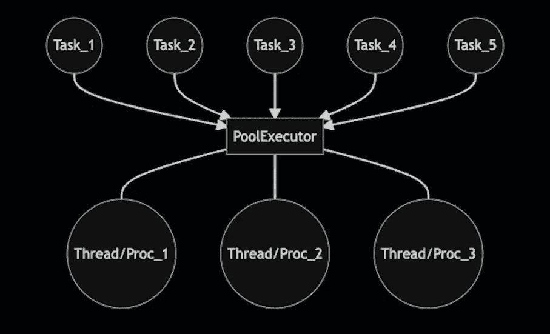

# Python 并发性——concurrent . futures

> 原文：<https://towardsdatascience.com/python-concurrency-concurrent-futures-15b56dc9a14d>

## Python 并发系列的第 3 部分。多线程和多处理带来的界面简单性。

图片作者。

# 浏览 Python 并发系列:

*以前的故事:*

    

在连续头疼处理[多线程](/python-concurrency-threading-and-the-gil-db940596e325)和[多进程](/python-concurrency-multiprocessing-327c02544a5a)代码之后，一个梦想开始成形:有没有一种更简单的方法来实现它？有办法隐藏线程、进程、队列和管道的创建吗？有没有一种方法可以将计算转移到其他地方，并获得结果？

原来有这么个办法。

`concurrent.futures`实现了一个简单、直观、坦率地说非常棒的 [API](https://docs.python.org/3/library/concurrent.futures.html) 来处理线程和进程。到目前为止，我们已经了解了多进程和多线程代码。我们知道如何创建进程和线程，但有时我们需要更简单的东西。

可能有些情况下，我们真的希望在代码中管理单独的进程或多线程。然而，对于数据科学家来说，进程和线程通常是实现并行性或从程序的主线程上卸载计算的手段。这里是`concurrent.futures`模块的亮点。它隐藏了多线程/进程代码的大部分复杂性，让我们专注于自己的事情，检索、处理和应用 CPU 密集型数据。

## 故事结构

*   `Future`
*   `map`发电机
*   重用池执行器
*   ProcessPool 和`Executor`类
*   多线程->多进程
*   多进程->多线程
*   这个故事的寓意

## `Future`

*未来*的概念是`concurrent.futures` [模块](https://docs.python.org/3/library/concurrent.futures.html)简洁背后的精髓。*未来*是一个还不存在但将来会存在的结果的代理。一个任务被提交给一个执行者，执行者给我们一个*未来。因此，我们可以把它看作是一种收据，这样我们以后就可以回来使用它来获得我们任务的结果。执行者将为我们管理所有的线程和进程管理。*

在底层，执行器是一个进程或线程池和一个任务调度器。

作为例子，我们将使用一个`ThreadPoolExecutor`。我们将提交一个休眠了`sleep_secs`的任务(`do_work()`，然后返回一个字符串。executor 类的`submit()`方法返回一个`Future`类的实例。

我们将探索两种不同的实现:

*   `wait_for_future()`:我们在创建未来之后立即调用`result`方法。这个调用会一直阻塞，直到结果准备好。
*   `get_future_after()`:我们在做了一些其他重要的事情(睡觉)之后，调用`result`方法。在这种情况下，我们等待的时间比任务所花费的时间要多；因此，当我们进行调用时，结果已经准备好了(没有阻塞)。

在这两个实现中，我们将跟踪时间并引入一些`print`语句来阐明`future`的行为。

> — — — —等待未来— —
> 已创建的未来| 0.00046324729919433594
> 等待未来… | 0.0004940032958984375
> 未来结果:foo | 5.00242519378621
> ———获得已创建的未来之后— — —
> 已创建的未来| 0.000028621

从打印语句中可以看出，`submit()`方法没有阻塞。只有当任务在被调用时没有完成时，`result()`方法才会被阻塞。

## `map`发电机

执行器有另一种调度任务的方法，即`map(`方法(完全类似于 Python 的`map()`)。此方法使用 iterable 的元素作为参数来执行给定的函数。本质上，这是一种编写`for`循环和存储期货的更紧凑的方式。在接下来的章节中，我们将讨论为什么这种方法是我最喜欢的并行计算方法之一。

`map()`返回一个发电机；因此，调用不会阻塞。但是，如果相应的任务没有完成，从生成器弹出元素可能会阻塞。

下面是一个简单的使用`map(`方法的例子。传递给`map()`的函数签名应该只有一个参数，即 iterable。如果我们的函数没有相同的签名，我们可以使用来自`functools`模块的`partial`函数:

> 地图生成器已创建| 0.001207113265991211
> 正在等待地图结果… | 0.0012679100036621094
> 地图结果:['foo-1 '，' foo-2 '，' foo-3 '，' foo-4 '，' foo-5 '，' foo-6 '，' foo-7 '，' foo-8 '，' foo-9 ']| 9.99380612373355

## 可重用的池执行器

在上一节中，我们使用了`ThreadPoolExecutor`作为上下文管理器(`with`语句)。虽然这种方法是首选的，因为它负责终止池，但它有一个明显的缺点；执行人不能重复使用。

我们经常需要连续访问池，并希望避免池创建和终止对性能的影响。在这种情况下，我们可以创建一个 executor 类的实例，在我们认为合适的地方使用它，并使用`shutdown()`方法手动终止它。

下面的例子说明了我们如何重用执行器:

> 一些地图结果:['foo-1 '，' foo-2 '，' foo-3 '，' foo-4 '，' foo-5 '，' foo-6 '，' foo-7 '，' foo-8 '，' foo-9']
> 更多地图结果:['foo-10 '，' foo-11 '，' foo-12 '，' foo-13 '，' foo-14 '，' foo-15 '，' foo-16 '，' foo-17 '，' foo-18 '，' foo-19']

## 进程池和`Executor`类

如果您还没有注意到，到目前为止给出的代码为 executor 导入使用了一个别名，`PoolExecutor`。有一个很好的理由，线程池(`ThreadPoolExecutor`)和进程池(`ProcessPoolExecutor`)实现了相同的接口。它们都继承自`Executor`类，并实现相同的[三个方法](https://docs.python.org/3/library/concurrent.futures.html):

*   `submit()`
*   `map()`
*   `shutdown()`

这是我最喜欢的`concurrent.futures` API 的特性之一，我们可以通过最少的代码重构从线程切换到进程。以下示例显示了使用`ProcessPoolExecutor`是多么简单:

> 映射结果:['foo-1 '，' foo-2 '，' foo-3 '，' foo-4 '，' foo-5 '，' foo-6 '，' foo-7 '，' foo-8 '，' foo-9 ']| 6.14733169555664

当通过`submit()`或`map()`计算进程池中的多个任务时，它们将被并行计算，直到达到池中的进程数。如果池中的进程数是 8，而任务数更大，那么在任何给定的时间最多只有 8 个并行任务在执行。

使用进程池，`map()`方法可用于并行化仅依赖于可迭代值的`for`循环。

## 多线程->多进程

在同一个程序中使用[多线程](/python-concurrency-threading-and-the-gil-db940596e325)和[多进程](/python-concurrency-multiprocessing-327c02544a5a)可能并不普遍，但我经常发现自己处于这种情况。也许太频繁了。

逻辑如下:

1.  一个事件触发一个线程；这可能是客户请求或一些传感器读数。
2.  在这个新线程中，我们需要做一些 CPU 繁重的工作，当然，我们希望它使用多个内核。所以我们使用多个进程进行一些并行计算。

虽然逻辑听起来非常简单，但是使用裸进程和线程实现这种方法可能会很麻烦。然而，`concurrent.futures` API 让它变得非常简单。下面的例子说明了这一点。在该示例中，CPU 密集型函数(`do_CPU_bound_work()`)被另一个函数(`do_parallel_work`)并行调用。该流程由两个线程同时执行:

> A 线程，做并行 _ 工作…
> B 线程，做并行 _ 工作…
> A 线程，完成
> B 线程，完成

如果我们使用`ThreadPoolExecutor`而不是裸线程，我们可以进一步简化它:

> A 线程，做并行 _ 工作……
> B 线程，做并行 _ 工作……
> A 线程，完成
> B 线程，完成

另一个很棒的特性是，我们可以从`future`或`map()`生成器获得计算结果，而不需要队列、管道或时髦的共享变量。

一个伟大的界面设计能把我们的生活简化到如此程度，真是不可思议。

## 多进程->多线程

如果我们不想从多个线程中产生进程，而是想从多个进程中产生线程，那该怎么办？没问题，我们可以用最简单的方法来做。以下示例显示了我们如何创建多个线程来处理来自多个进程的并发 I/O:

> A 进程，正在进行并行 I/O…
> B 进程，正在进行并行 I/O…
> B 进程，完成
> A 进程，完成

我们还可以从`concurrent.futures` API 创建流程:

> A 进程，执行并行 I/O…
> B 进程，执行并行 I/O…
> A 进程，完成
> B 进程，完成

## 这个故事的寓意

不爱`concurrent.futures`实现的接口很难。就我个人而言，这是我处理并发性的首选，无论是使用线程进行 I/O 还是使用进程进行并行计算。

如果您现在还没有使用它，那么您绝对应该使用它！

> 一切都应该尽可能简单，但不是更简单
> 
> ——阿尔伯特·爱因斯坦

我希望这个故事对你有用。 [*订阅*](https://medium.com/subscribe/@diego-barba) *到我的邮件列表如果你想知道更多这样的故事。*

*喜欢这个故事吗？通过我下面的推荐链接成为一个媒体成员来支持我的写作。无限制地访问我的故事和许多其他内容。*

 