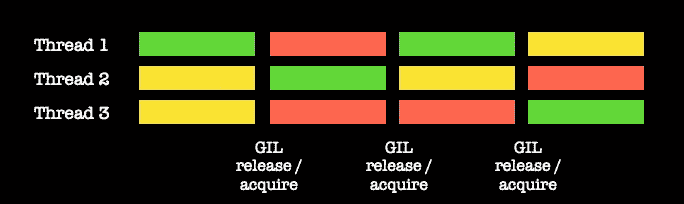

# Python 并发性——线程和 GIL

> 原文：<https://towardsdatascience.com/python-concurrency-threading-and-the-gil-db940596e325>

## Python 并发系列的第 1 部分。线程和 GIL 是 Python 中比较有争议的话题，但是大多数时候被误解了。

约翰·安维克在 [Unsplash](https://unsplash.com?utm_source=medium&utm_medium=referral) 上的照片

# 浏览 Python 并发系列:

*接下来的故事:*

</python-concurrency-multiprocessing-327c02544a5a>  </python-concurrency-concurrent-futures-15b56dc9a14d>  

有些人喜欢线程，但更多人讨厌线程。然而，在许多情况下，这种厌恶可能源于关于 Python 中线程工作方式的错误信息。是的，编写多线程应用程序可能很难看，我们必须非常小心以避免常见的陷阱。然而，在大多数情况下，**多线程是在 Python** 中实现并发的最简单的方式。

线程经常被比作多处理或异步编程。虽然这是有意义的，因为所有三种范式都实现了某种形式的并发，但在某些情况下，每种范式都比其他范式更有意义。无论何时有 I/O，线程都应该被认为是一个可靠的选择，不要让错误的厌恶阻止了你。

*Async* 炒作多，那是肯定的。但是一旦你在代码中写了`async def`，就没有回头路了。你必须全力以赴。你将穿过兔子洞，对你的应用程序进行一次大爆炸式的重写，把所有东西都改成*异步*。不总是最好的主意。

本系列将介绍 Python 中并发性的基础知识，以及我在那个时代遇到的见解。这样的事情我希望我在开始用 Python 做并发的时候就知道了，忽略它们导致了一些长期困扰代码的神秘 bug。

这个故事将解决线程和全局解释器锁(GIL)。希望在本系列的最后，您能给 threads 一个机会。如果幸运的话，您将不再认为 GIL 是 Python 中必须淘汰的烦人的东西。一旦我们理解了 GIL 是如何简化许多事情的，我们可能会开始从不同的角度看待它。

## 故事结构

*   纺一根线
*   守护进程
*   线程返回？？？行列
*   全局解释器锁(GIL)
*   I/O 和 CPU 绑定的线程
*   线程锁和线程安全
*   `join`方法
*   关键要点

## 纺一根线

线程模块不是 Python 中最受欢迎的模块之一。公平地说，它有点晦涩难懂。一开始就变得令人困惑的事情之一是创建线程的方式；等等，在 Python 中有两种创建线程的方法:

在这种方法中，我们将一个函数传递给作为目标的`Thread`对象(以及它的参数)。另一种方法是直接从`Thread`类继承并实现`run`方法。

这明显违反了 Python 的[禅。](https://peps.python.org/pep-0020/)

> 应该有一种——最好只有一种——显而易见的方法来做这件事。
> 
> PEP 20—Python 的禅宗

虽然从函数中运行线程可能更简单，但是当我们想要存储状态时，类方法是有用的。因此，在这种情况下，拥有两种方法并不是一个坏主意。

## 守护进程

在操作系统级别，*守护进程*是后台进程，运行时不与用户交互。在 Python 线程的上下文中，守护进程只是后台线程。**与普通线程的区别在于，当只有守护线程在运行**时，程序会退出。换句话说，程序将等待正常线程完成(不取消)；一旦完成，所有正在运行的守护进程将被终止，程序将退出。

例如，考虑下面这个我们将用作线程目标的函数，它休眠了`sleep_secs`:

考虑两个线程，一个普通线程和一个守护进程，分别有 20 秒和 10 秒的睡眠时间:

> 正常线程，休眠 20 秒:初始化
> 守护线程，休眠 10 秒:初始化
> 守护线程，休眠 10 秒:完成
> 正常线程，休眠 20 秒:完成

守护进程在正常线程之前完成，程序等待正常线程完成。然而，如果我们改变睡眠时间:

> 正常线程，休眠 10 秒:初始化
> 守护线程，休眠 20 秒:初始化
> 正常线程，休眠 10 秒:完成

正常线程在守护进程之前完成，程序不等待守护进程就退出。

Python 中的线程取消是不可能的，至少直接不可能；我们必须等待线程完成或实现另一个机制。有时，我们最终会得到一个因为一些流氓线程而拒绝退出的多线程程序，并且我们可能最终会在操作系统级别杀死这个进程。守护进程的作用就是避免这种令人头疼的问题。

## 线程返回？？？行列

线程的主要问题是如何返回函数的结果并不明显。虽然我们可能希望传递这样一个函数作为线程的目标:

然而，线程对象并不公开从其目标返回某些内容的方法:

虽然 Python 的异步协同例程使用线程实现了常规函数的返回，但人们必须发挥创造力。这种行为可能会阻止您在应用中使用多线程。但是不要烦恼；我们可以使用队列(`queue.Queue`)来提取结果。

我们可以在模块级别定义队列:

> 线程正在工作…
> 
> 线程正在工作…来自队列的函数结果

或者，我最喜欢的是，将一个队列作为参数(`q_out`)传递给线程函数，并将结果存储在那里:

> 线程正在工作…
> 
> 线程正在工作…来自队列的函数结果

这种队列方法也适用于永远运行的守护进程或线程。我知道这并不理想，尤其是在我们有许多线程和它们的队列的情况下，但是在较小的规模下这并不麻烦。

## 全局解释器锁(GIL)

多线程和 GIL 概念图。

与您可能听说的相反，Python 使用实际的 OS 线程(Unix 上的 POSIX 线程和 Windows 线程)。Python 是多线程的。你可能也听说过 Python 不能同时运行多个线程；这是真的。

早在 90 年代初，Python 解释器(CPython，最常用的一个)的多线程和内存管理就有问题。CPython 引用计数(内存管理)在比赛条件下遇到了麻烦。多个线程修改了程序中对象被引用的次数；偶尔，由于比赛条件，计数是错误的。

有时候，在应该计数的时候，计数从来没有达到 0；内存从未被释放；内存泄漏。在其他情况下，计数在不应该的时候达到了 0；该对象在不应该的时候被从内存中释放；程序崩溃了。

这个问题的解决方案是 GIL，一个在解释器级别实现的锁，以避免线程同时运行，确保引用计数在程序的生命周期内是正确的。

GIL 尽最大努力为所有活动线程提供时间，即使线程没有显式释放 GIL。线程在休眠(`time.sleep`)或执行 I/O 时释放 GIL。但是，如果一段时间过去了，线程还没有“自愿”释放 GIL，它将被迫这样做，从而给其他线程运行的机会。这个选择过程并不总是最佳的。

今天，对 Python 的一个主要批评是，它不是多线程的，并且不能(本机)利用多核等等。大多数人指责 GIL。然而，GIL 是一个简单而优雅的解决方案，它赋予了 Python 最珍贵的品质之一——简单，尤其是在内存管理方面。任何用 C++做过内存管理的人，无疑都能体会到 Python 的简单。

GIL 并不完美，但它让多线程变得非常简单且相对安全。主要问题是:

*   GIL 和操作系统不协调。有时，操作系统可能会将 CPU 时间给不持有 GIL 的线程，反之亦然。
*   如果发生事件，I/O 线程将发送一个 GIL 丢弃请求，并启动一个超时周期(5 毫秒)，从而导致额外的延迟。
*   GIL 将给予 CPU 绑定的线程更高的优先级。因此，给 I/O 线程增加了不希望的延迟。

如果你想更多地了解 GIL 及其局限性，请查看大卫·比兹利的这篇精彩的[主题演讲](https://www.youtube.com/watch?v=Obt-vMVdM8s&t=1771s)。

## I/O 和 CPU 绑定的线程

本节将分析套接字服务器(I/O)线程在与 CPU 绑定的线程竞争 GIL 时会发生什么。编写服务器应用程序时，最重要的是以最小的延迟确认客户端请求。只要客户端知道其请求正在被处理，请求本身就可能需要更长时间。因此，了解多线程套接字服务器在与 CPU 密集型线程竞争时的行为是至关重要的。

下面的代码实现了:

*   一个简单的服务器(`echo_server`)，它在给定的端口发送回它接收到的任何东西，一个 echo 服务器。
*   另一个函数执行 CPU 相关的任务(`hammer_cpu`)。
*   一切都储存在`time_data`字典里。
*   当程序退出时(控制 c 或 socket 客户端断开)，数据被保存到一个文件中(`save_time_data_to_file`)。为了捕捉退出信号，我们使用了 *atexit* 模块。
*   最后，主函数启动线程；我们将所需的 CPU 线程数作为参数传递。

要运行服务器，请执行以下操作:

`$ python [server script name].py [experiment_name] [number of CPU-bound threads]`

客户端是单线程的；它还存储数据，并在退出时保存。

要运行客户端:

`$ python [client script name].py [experiment_name]`

以下是发送到服务器的消息的接收时间图，分别对应于无 CPU 绑定线程、1 个、2 个和 3 个 CPU 绑定线程:

Echo 客户端接收时间[图片由作者提供]。

我们可以看到，随着 CPU 绑定线程数量的增加，不仅平均套接字响应时间会增加，而且它们的标准偏差也会增加。因此，echo 服务器变得更加不稳定。这是 GIL 和操作系统不太协调的一个例子。请记住，在发生事件的情况下，I/O 线程将请求 GIL，但即使它得到了，操作系统也可能决定运行另一个不持有 GIL 的 CPU 绑定线程。

## 线程锁和线程安全

尽管有些人迫不及待地想让 Python“放弃”GIL，但 GIL 让多线程编程变得尽可能简单。只要操作是[原子的](https://docs.python.org/3/faq/library.html#what-kinds-of-global-value-mutation-are-thread-safe)，即[线程安全的](https://docs.python.org/3/faq/library.html#what-kinds-of-global-value-mutation-are-thread-safe)，GIL 将确保没有竞争条件。换句话说，由于 GIL，没有两个操作会同时执行。

然而，大多数时候，我们希望进行非原子的操作，如果多线程没有正确完成，我们会遇到麻烦。考虑下面的例子:

有一个线程(`check_cache`)遍历`my_cache` 的元素，而另一个线程(`add_to_cache`)则添加项目。迭代不是原子的。所以我们会得到一个异常:

> "运行时错误:字典在迭代过程中改变了大小."

这个问题的解决方案是显式地使用线程锁。在下面的例子中，我们使用来自*线程*模块的`Lock`对象。我们只有在获得锁的情况下才能对`my_cache`进行操作；现在程序正常运行了。

所以多线程的关键是问自己:

> 我使用的对象和执行的操作是线程安全的吗？

如果没有，使用`Lock`。线程安全问题不仅仅是程序崩溃，如果不解决，我们可能会遇到各种各样的错误。我们可能会弄错库存、账户余额等等。

## 连接方法

[*线程*](https://docs.python.org/3/library/threading.html) 模块为多线程应用程序实现各种同步原语和实用程序。你可能需要的一切都会在那里找到。例如信号量、锁(前面讨论过的)和许多其他的。它还实现了处理线程的方法；我们不会一一介绍，只介绍一个:迄今为止我们还没有讨论过的最重要的方法`join`方法。

当我们`start`一个线程时，它不会阻塞。程序将继续执行下面的代码行，而不会等待线程完成。大多数时候这种行为恰恰是我们想要的；守护进程就是一个很好的例子；我们开火然后忘记。但是有时候，我们需要等待一个线程。在这种情况下，我们使用`join`方法。

考虑下面的代码片段和打印顺序:

> 线程函数 init
> 线程开始
> 等待线程…
> 线程函数循环完成
> 线程完成

`join`方法让程序在打印“等待线程”后等待(10 秒钟)

多线程应用的构建模块是使用队列和锁来连接线程。因此，我们必须彻底理解它们，以避免错误和重大错误。线程的特点是大多数潜在的异常都是隐藏的，直到最糟糕的时刻才会出现。

## 关键要点

线程是实现并发的一种简单方式。我们不需要事件循环、时髦的函数定义，也不需要生成额外的进程并与之通信。我们可以坚持 Python 基础，实现并发性。既然我们已经知道了 GIL 和线程同步与通信的基础知识，我们就可以着手多线程编程了。

主要的收获是线程对 I/O 有意义，而不是 CPU 受限的任务。每当有 CPU 线程时，操作系统和 GIL 之间缺乏协调就会变得更加明显。如果您需要进行 CPU 密集型计算，请尝试多处理或以下技巧:到处添加一些`time.sleep`,以便 CPU 绑定的线程释放 GIL，让 I/O 线程完成它们的工作。

我希望这个故事对你有用。 [*订阅*](https://medium.com/subscribe/@diego-barba) *到我的邮件列表如果你想知道更多这样的故事。*

*喜欢这个故事吗？通过我下面的推荐链接成为一个媒体成员来支持我的写作。无限制地访问我的故事和许多其他内容。*

<https://medium.com/@diego-barba/membership> 