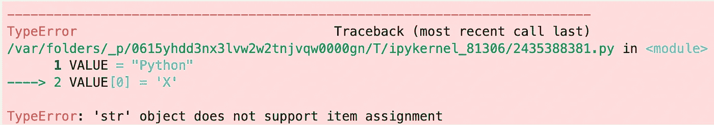
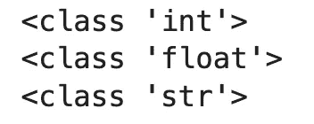
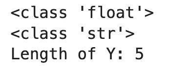
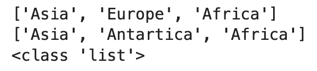
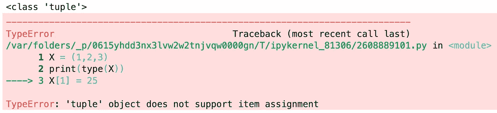
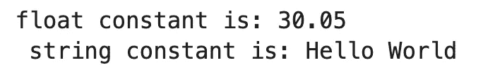

# Python 常量-您需要知道的一切

> 原文：<https://towardsdatascience.com/python-constants-everything-you-need-to-know-c3fc66609821>

## **Python 有常量吗？阅读来找出答案。**


照片由[内特·格兰特](https://unsplash.com/@nateggrant?utm_source=medium&utm_medium=referral)在 [Unsplash](https://unsplash.com?utm_source=medium&utm_medium=referral) 上拍摄

Python 常量有助于设计架构的动态和可更新特性，这对于任何编码架构都是必不可少的。提供具有这些特性的构造与代码块可以被其他人理解和开发的事实有关。

为了满足这些多方面的条件，代码中的表达式应该清晰、明确、简单。编程语言有许多有用的表达式来提供这种灵活性。在本文中——常量——是其中之一，它被详细分析并得到 Python 中编码实现的支持。

# Python 中的常量有哪些？

常量是编程语言的组成部分之一，也是为用户提供必要灵活性的工具之一。顾名思义，常量是允许用户分配值的单位，这些值在定义后不能编辑。

这里棘手的一点是，虽然常数不能被编辑，但它可以被更新。另一方面，有些情况下常量是可变的，下一节将通过例子详细讨论这些情况。常量不可变的 Python 示例如下:

```
VALUE = "Python" 
VALUE[0] = 'X'
```



图片 1-不支持的项目分配错误(作者图片)

打算把分配给`VALUE`“xy thon”的单词“Python”的首字母改一下，但是改不了。`VALUE`被定义为常量，不可编辑。当上面的代码块运行时，会出现错误“TypeError:“str”对象不支持项赋值。”，发生。如果我们想得到单词“Xython ”,我们需要给它赋值，就像我们定义单词“Python”的`VALUE`。也可以通过将常量“Python”赋给`VALUE`来将其更新为“Xython”。

常数对模型发展的促进作用也是不可否认的。某个数字、文本、列表或元组可以在程序中的多个地方使用。

例如，假设我们将从本地或互联网上的不同链接导入多个数据集。在这种情况下，在每个操作中，这个链接必须单独引入到要重新导入的命令中。但是，如果将这个链接赋给某个常量，并且在运行中需要链接的地方编写这个表达式，那么只改变这个赋给的链接就足够了，而不用逐个改变整个代码块中的数据。这也将使代码系统更容易理解和管理。

常量通常被赋给由大写字母组成的表达式，当然它们不是强制性的，但它们就像是开发人员随着时间的推移而发展起来的一种文化。

类似地，像“int”或“float”这样的值，和“str”值一样，可以赋给某些常量，使得编码模型的构建更加高效。例如，图像处理中使用的图像宽度和图像高度等参数在作品中不止一处出现。当这些表达式在运行开始时作为常量分配给`IMAGE_WIDTH`和`IMAGE_HEIGHT`时，只改变代码块开始处的值将节省改变整个结构的时间，并提供便利。

在 C 编程语言中，在对数据赋值时，是通过添加“int”等表达式来定义的，即 integer，它决定了数据的类型。另一方面，Python 在这种情况下提供了便利，并且自己分配数据类型。例如:

```
X = 22
print(type(X))

Y = 22.22
print(type(Y))

VALUE = "Python"
print(type(VALUE))
```

当通过运行上面的代码块检查常量的类型时，输出是:



图 2 —代码块输出(作者提供的图片)

尽管用户没有指定，但它将数字 22 指定为整数，22.22 指定为浮点数，单词“Python”指定为字符串。当然，这些类型也可以由用户指定，如下所示:

```
X = float(22)
print(type(X))

Y = str(22.22)
print(type(Y))

print("Length of Y:", len(Y))
```

当浮点值 22.22 被定义为字符串时，每个对象被定义为一个元素。因为有 4 个“2”值和 1”，长度值为 5:



图 3 —代码块输出(2)(图片由作者提供)

# Python 中用于数据类型的常数

有两种类型的对象:可变的(在创建后可以修改(编辑)的对象)和不可变的(在创建后不能修改(编辑)的对象。

**常量可变的 Python 数据类型:**

*   词典
*   目录
*   一组

构造了一个简单的列表对象类型，并观察到其修改如下:

```
CONTINENTS = ["Asia", "Europe", "Africa"]
print(CONTINENTS)

CONTINENTS[1] = "Antartica"
print(CONTINENTS)

print(type(CONTINENTS))
```

上述代码块的输出是:



图 4 —代码块输出(3)(图片由作者提供)

在`CONTINENTS`名单中把欧洲改成南极洲是成功的。由于 Python 列表对象是可变的，Python 执行操作时没有任何错误。

**常量不可变的 Python 数据类型:**

*   （同 Internationalorganizations）国际组织
*   元组
*   采用双字节对字符进行编码
*   漂浮物
*   线
*   弯曲件

更改 int、float 和 string 类型时，会出现上述错误信息。下面对元组类型进行了同样的操作:

```
X = (1,2,3)
print(type(X))
X[1] = 25
```

定义为`X`的元组类型常量的第二个元素“2”想要替换为“25”。输出如下:



图 5 —代码块输出(4)(图片由作者提供)

这里需要做的是重新定义`X = (1, 25, 3)`来避免这种错误。

# Python 中的命名常量

命名元组结构是一个类类型，它将给定值映射到`collections`模块下。通过这个映射过程分配的常数可以很容易地通过准备好的操作进行传递。

**用一个更具体的例子**:假设一节课的小考权重为 30%，期末考试权重为 70%，用`namedtuple`计算学生的平均分:

```
from collections import namedtuple

Grade = namedtuple('Grade', 'quiz final_exam')

student_1 = Grade(60.0, 75.0)
student_2 = Grade(60.0, 90.0)

def average_grade(student_ID):
    student_ID_average = (student_ID.quiz) * 0.3 + (student_ID.final_exam) * 0.7
    return student_ID_average

student_1_average = average_grade(student_1)
student_2_average = average_grade(student_2)
```

通过与 namedtuple 的映射，`Grade`被分配测验和`final_exam`结果。用户以`student_1`、`student_2`格式检索这些结果后，如上所述创建`average_grade`函数。因此，计算平均成绩时，小考占 30%，期末考试占 70%。

# Python 类中的常数

编码结构中有两种类型的常量:局部常量和全局常量。如果常量在类和 def 块之外定义，则称为全局常量，如果在类和 def 块之内定义，则称为局部常量。要在一个类中调用另一个类中的常数:

```
class Value:
    constant_f = 30.05
    constant_s = "Hello World"

class FinalValue(Value):
    def const(self):
        print("float constant is:", self.constant_f, "\n","string constant is:", self.constant_s)

value_in_class = FinalValue()
value_in_class.const()
```

`constant_f`被赋予浮点值 30.05，而`constant_s`被赋予字符串值“Hello World”。上面的代码块用于在`FinalValue`类中调用这个。输出是:



图片 6 —代码块输出(5)(图片由作者提供)

# 结论

常量结构不仅在 Python 中，而且在所有编程语言中都有非常重要的地位。它使构建的系统更容易理解，使工作更容易。

由于 Python 在语法上是一种用户友好的编程语言，所以它为常量的使用提供了一个非常有利的环境。通过理解常数，可以用更长的代码块完成的操作可以用更少的工作量完成。

*你对 Python 中的常量有什么看法？请在下面的评论区告诉我。*

喜欢这篇文章吗？成为 [*中等会员*](https://medium.com/@radecicdario/membership) *继续无限制学习。如果你使用下面的链接，我会收到你的一部分会员费，不需要你额外付费。*

<https://medium.com/@radecicdario/membership>  

*原载于 2022 年 6 月 3 日 https://betterdatascience.com**的* [*。*](https://betterdatascience.com/python-constants/)