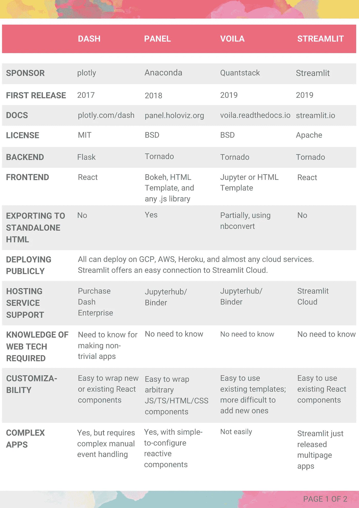
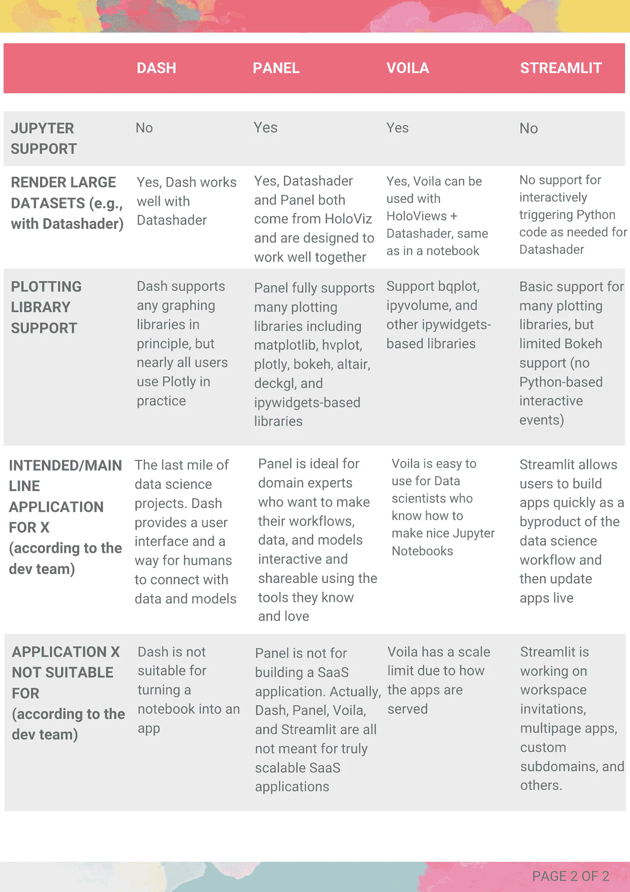

# Python 仪表板生态系统和景观

> 原文：<https://towardsdatascience.com/python-dashboarding-ecosystem-and-landscape-cc055b50c668>

## Plotly 仪表板，面板，瞧，和 Streamlit

mate usz waca wek 在 [Unsplash](https://unsplash.com/?utm_source=unsplash&utm_medium=referral&utm_content=creditCopyText) 上的照片

你是数据科学家还是数据分析师，喜欢通过可视化和仪表板从数据中获得洞察力？你是一个 Python 用户，对应该使用哪个 Python 库感到困惑吗？Python 为可视化数据和构建仪表板提供了许多令人惊叹的工具。可能会很混乱。

之前，我写过一篇关于 [Python 可视化前景](https://sophiamyang.medium.com/python-visualization-landscape-3b95ede3d030?sk=056a8796cf9010bfe98edd27acf61b40)的博文，涵盖了基本的可视化工具。本文讨论 Python dashboarding 工具。据[PyViz.org](https://pyviz.org/tools.html)称，有 11 个库用于创建用户可以与之交互的实时 Python 支持的 web 应用或仪表盘——bokeh、dash、streamlit、panel、gradio、visdom、voila、wave、jupyter-flex、ipyflex 和 bloxs。最流行的仪表板工具是[**【Plotly Dash】**](https://plotly.com/dash/)[**Panel**](https://panel.holoviz.org/)[**瞧吧**](https://voila.readthedocs.io/) 和 [**Streamlit**](https://streamlit.io/) 。

# 这些工具之间有什么区别，您应该使用哪种工具？

为了帮助用户做出决定，James Bednar(代表 PyViz，同时也是一个面板维护者)主持了一个 PyData 全球研讨会，每个工具的代表可以讨论和辩论它们的相似之处和不同之处。做出贡献的有 Marc Skov Madsen(用户和面板开发者，[awesome-panel.org](https://awesome-panel.org/home)和[awesome-streamlit.org](https://awesome-streamlit.org/)的创建者)、Adrien Treuille(Streamlit 的联合创始人兼首席执行官)、Nicolas Kruchten(Plotly Express 和 Dash 开发者的创建者)和 Sylvain Corlay(Voila 和 Jupyter 核心开发者的创建者)。

PyData talk 讨论的详细比较总结在本文末尾的表格中。根据我从演讲中学到的和我的经验，这里是最大的区别因素。

## 该工具是否支持您最喜欢的绘图库？

你最喜欢的绘图库有哪些？喜欢用 Matplotlib，Bokeh，Plotly，Hvplot，还是其他？

*   Dash 主要与 Plotly 联系在一起。如果你是一个 Plotly 用户，Dash 是你的自然选择。
*   Voila 通过 ipywidgets 接口支持各种库，比如 Matplotlib 和 Plotly。对于那些[不是 Bokeh](https://github.com/voila-dashboards/voila/issues/244) 之类的小工具的库来说，Voila 并不能很好地工作。
*   Streamlit 和 Panel 支持许多绘图库，包括 Matplotlib、Seaborn、Altair、Plotly、Bokeh、PyDeck、GraphViz 等等。
*   此外，如果您需要在一个情节中进行交互，例如创建[相互关联的情节](https://holoviz.org/tutorial/Interlinked_Plots.html)，Panel 为高级交互功能提供了丰富的支持，而 Streamlit 不允许与一个情节进行交互。

## 你用 Jupyter 笔记本吗？

作为一名数据科学家，我的工作流程通常从 Jupyter 笔记本或 JupyterLab 开始。对我来说，能够直接在 Jupyter 笔记本中与我的绘图进行交互并构建我的仪表板是非常重要的。Panel 和 Voila 与 data science Jupyter 笔记本工作流配合良好，而 Dash 和 Streamlit 则不然。具体来说:

*   Panel 和 Voila 完全支持在仪表板中使用 Jupyter 笔记本中的组件，以便轻松地在数据探索和共享结果之间切换。
*   Dash 无法与 Jupyter 顺利集成。JupyterDash 确实可以让你在笔记本上编写和显示 Dash 应用，但是需要额外的配置，而且不像 Panel/Voila 那样优雅。
*   Streamlit 无法与 Jupyter 顺利集成。

## **您是否需要构建复杂的应用程序或使用大数据？**

有时，我们需要构建复杂的可视化应用程序。例如，我们可能希望我们的应用程序支持多个页面，每个页面显示不同的功能和见解。只有 Panel 和 Dash 对多页应用有很好的坚实支持。Streamlit 一周前刚刚发布了多页面应用支持。

为了可视化大数据，Python 可视化世界经常使用 [Datashader](https://datashader.org/) 。查看我之前的[博客文章](/big-data-visualization-using-datashader-in-python-c3fd00b9b6fc)关于什么是 Datashader 以及 Datashader 如何工作。Panel 和 Datashader 都来自于 [Holoviz 生态系统](/visualization-and-interactive-dashboard-in-python-c2f2a88b2ba3)，并且被设计成可以很好地协同工作。除了 Panel，Dash 和 Voila 还支持 Datashader 进行大数据的服务器端渲染，而 Streamlit 不支持。

## **您需要支持多少并发用户？**

我们经常需要将我们的仪表板发送给许多利益相关者，如果我们的仪表板能够很好地扩展并支持许多并发用户就好了。Dash 伸缩性好；瞧，这是最糟糕的。Steamlit 和 Panel 在中间。具体来说:

*   Dash 是无状态的，不为每个访问者在服务器上存储数据，这使得支持许多用户变得简单，但编程却困难得多。
*   瞧，仪表板的每个访问者都需要一个完整的 Python 流程，这就限制了一次只能有几个访问者。
*   Streamlit 和 Panel 在中间，默认支持每访问者状态，但也允许缓存和共享状态。

## **您想与公众分享您的应用吗？**

如果你需要与公众分享你的仪表板应用，Steamlit 是最简单的。Streamlit 使用 Streamlit 云提供了简单的部署，因此它可能拥有最好的社区演示和贡献。其他工具都可以使用标准的云提供商共享，但它们需要单独配置。

为了突出上面讨论的要点:

*   该工具是否支持您最喜欢的绘图库？Streamlit 和 Panel 支持许多绘图库。Panel 为高级交互功能提供了丰富的支持。
*   你用 Jupyter 笔记本吗？如果是，那么选择面板或瞧。
*   您是否需要构建复杂的应用程序或使用大数据？如果是，则选择面板或仪表板。
*   您需要支持多少并发用户？如果您的仪表板需要高度可伸缩，请使用 Dash。
*   您想与公众共享您的应用程序吗？为了便于部署，请使用 Streamlit。

我自己最喜欢的 dashboarding 库是**面板**。我使用 Panel 构建了许多仪表板，因为我喜欢使用任何我喜欢的绘图库，有时需要构建复杂的应用程序，在 Jupyter 和 dashboarding 之间来回切换，通常在公司内部共享应用程序。

我希望本文和下表能够帮助您理解四个主要 Python dashboarding 库之间的异同，并帮助您选择最适合您的用例的库。快乐的仪表板！

作者制作的图像

鸣谢:感谢[马克·斯科夫·麦德森](https://twitter.com/MarcSkovMadsen)、[吉姆·贝德纳尔](https://twitter.com/JamesABednar)和[菲利普·鲁迪格](https://twitter.com/PhilippJFR)的反馈和支持。

参考:

Python Dashboarding 枪战和摊牌| PyData 全球 2021:[https://youtu.be/4a-Db1zhTEw](https://youtu.be/4a-Db1zhTEw)

. . .

2022 年 6 月[索菲亚杨](https://twitter.com/sophiamyang)

*原发布于*[*https://www . anaconda . cloud*](https://anaconda.cloud/dashboardlandscape)*。*