# Python 数据工程师面试问题

> 原文：<https://towardsdatascience.com/python-data-engineer-interview-questions-18a218c0bce1>

## 顶级公司为所有初露头角的数据工程师提供的关于 Python 概念和问题的全面指南，帮助他们准备下一次面试。


作者在 [Canva](https://www.canva.com/) 上创建的图片

今天我们将讨论数据工程面试中的 Python 面试问题。本文将涵盖 Python 中解决数据工程面试所需的概念和技能。作为一名数据工程师，你需要精通 SQL 和 Python。本博客将只涉及 Python，但如果你有兴趣了解 SQL，那么有一篇综合文章“ [*数据工程师面试问题*](https://www.stratascratch.com/blog/data-engineer-interview-questions/?utm_source=blog&utm_medium=click&utm_campaign=medium) ”。

根据对各种编程语言教程在谷歌上搜索频率的分析，Python 在 PYPL 编程语言流行指数中排名第一。对于数据工程和数据科学来说，Python 是许多其他语言中的佼佼者。

数据工程师通常处理各种数据格式，Python 使得处理这些格式变得更加容易。此外，数据工程师需要使用 API 从不同的来源检索数据。通常数据是 JSON 格式的，Python 也使得使用 JSON 更加容易。数据工程师不仅从不同的来源提取数据，还负责处理数据。最著名的数据引擎之一是 Apache spark，如果你懂 Python，你可以很好地使用 Apache Spark，因为他们为它提供了一个 API。Python 在最近一段时间成为了一个数据工程师的必备技能！现在让我们看看怎样才能成为一名优秀的数据工程师。

# 怎样才能成为一名优秀的数据工程师

数据工程是一个广泛的学科，有许多不同的角色和职责。数据工程活动的最终目的是为业务提供一致的数据流，使组织能够进行数据驱动的决策，并帮助数据科学家/分析师进行机器学习。

这种数据流可以通过许多不同的方式完成，其中一种方式是使用 Python。

一名优秀的数据工程师应该能够:

*   建立和维护数据库系统
*   精通 SQL 和 Python
*   构建数据流管道
*   了解云架构和系统设计概念
*   了解数据库建模

除了技术技能之外，一名优秀的数据工程师还应具备出色的沟通技巧。当你向公司里的非技术人员解释这些概念时，这些技能是特别需要的。现在你知道了什么是一个好的数据工程师，让我们看看数据工程师是如何使用 Python 的。

# 面向数据工程师的 Python


作者在 [Canva](https://www.canva.com/) 上创建的图像

现在，您已经对优秀数据工程师的素质有了一个大致的了解，让我们看看数据工程师是如何使用 Python 的，以及它的重要性。对于数据工程师来说，Python 最重要的用途是构建数据和分析管道。这些管道从多个来源获取数据，将其转换为可用的格式，然后放入数据湖或数据仓库，以便数据分析师和数据科学家可以使用这些数据。

*   出于许多原因，Python 是数据工程师中流行的语言，因为它易于使用和实用。它是世界上三大主流编程语言之一。事实上，根据 2020 年 11 月 TIOBE 社区的数据，它是第二大最常用的编程语言。
*   Python 在机器学习和人工智能中应用广泛。当生产中需要机器学习模型时，数据科学家和数据工程师密切合作。因此，在数据工程师和数据科学家之间有一个共同的语言是一个优点。
*   Python 是一种通用语言，它提供了许多用于访问数据库和存储技术的库。这是一种非常流行的运行 ETL 作业的语言。
*   Python 在各种应用程序和技术中使用，其中一个应用是在 Apache Spark 等数据引擎中的使用。Spark 有一个 API，数据工程师可以通过它运行 Python 代码。

因此，Python 因其多才多艺的特性而在所有数据工程师中变得非常流行。

现在是时候开始 Python 实践了。StrataScratch 上还有另一篇文章，关注数据科学家的 [Python 面试问题](https://www.stratascratch.com/blog/top-30-python-interview-questions-and-answers/?utm_source=blog&utm_medium=click&utm_campaign=medium)。那篇文章有一个全面的 Python 问题列表，集中在一个数据科学访谈上。

# Python 数据工程师面试练习题

# Python 数据工程师面试问题#1:工资最高的员工

问题链接:[https://platform . stratascratch . com/coding/10353-工资最高的工人](https://platform.stratascratch.com/coding/10353-workers-with-the-highest-salaries?code_type=2&utm_source=blog&utm_medium=click&utm_campaign=medium)

## 问题:

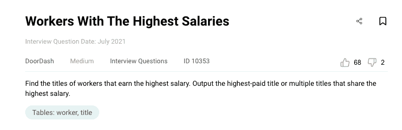

截图来自 [StrataScratch](https://platform.stratascratch.com/coding/10353-workers-with-the-highest-salaries?code_type=2&utm_source=blog&utm_medium=click&utm_campaign=medium)

该问题要求您找出工资最高的员工头衔。在这个问题中，有两个表。

**工作人员:**

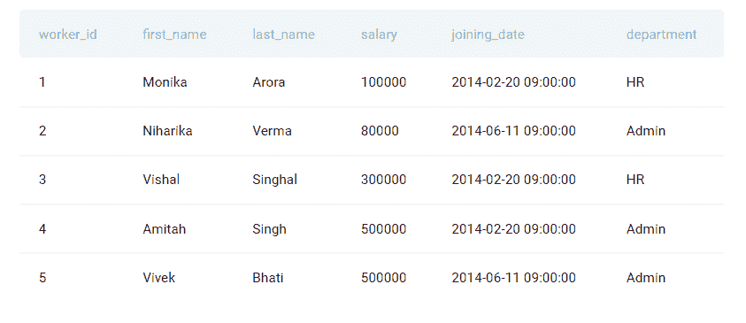

**标题:**

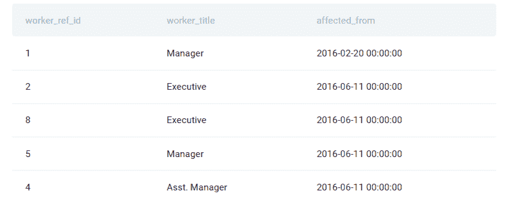

## 方法:

有两张桌子；工人和职称，它们都可以通过工人标识和工人引用标识连接。为了连接 pandas 中的表，让我们使列名保持一致。让我们使用“重命名”功能将标题表中的名称从 worker_ref_id 更改为 worker_id。

```
*# Import your libraries*
import pandas as pd
*# Change the columm name* 
title_worker_id = title.rename(columns = {'worker_ref_id':'worker_id'})
```

使用 pandas 的“合并”功能，将工人 ID 上的两个表连接起来，以在同一个数据框中获得 ID 和职称。将连接结果保存到不同的数据框中。

```
merge_df = pd.merge(worker, title_worker_id, on = 'worker_id')
```

查看最高工资:

```
merged_df['salary'].max()
```

勾选与最高薪资相对应的行:

```
rows_with_max_salary = merged_df[merged_df['salary'] == merged_df['salary'].max()]
```

这些问题仅询问员工职称，因此，我们将从上述数据框中仅选择员工职称。

```
result = rows_with_max_salary['worker_title']
```

## 最终代码:

下面是这个 python 数据工程师面试问题的最终代码。请注意，您应该在顶部导入所有相关/必要的库。

```
*# Import your libraries*
import pandas as pd
*# Change the columm name* 
title_worker_id = title.rename(columns = {'worker_ref_id':'worker_id'})merged_df = pd.merge(worker, title_worker_id, on = 'worker_id')*# Get Max Salary*rows_with_max_salary = merged_df[merged_df['salary'] == merged_df['salary'].max()]result = rows_with_max_salary['worker_title']
```

## 代码输出:

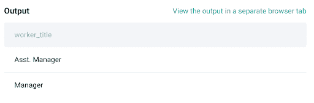

# Python 数据工程师面试问题#2:活动等级

问题链接:[https://platform . stratascratch . com/coding/10351-activity-rank](https://platform.stratascratch.com/coding/10351-activity-rank?utm_source=blog&utm_medium=click&utm_campaign=medium)

## 问题:


截图来自 [StrataScratch](https://platform.stratascratch.com/coding/10351-activity-rank?utm_source=blog&utm_medium=click&utm_campaign=medium)

这个 python 数据工程师面试问题有一个包含 4 个字段的表。

**google_gmail_emails**

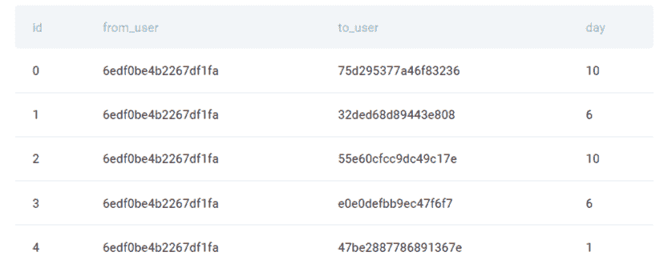

我们需要找到每个用户的电子邮件活动，然后根据他们的电子邮件活动按降序排列所有用户。如果有用户有相同的电子邮件活动，那么按字母顺序排列这些用户。

## 方法

第一步是计算每个用户的电子邮件活动。我们将使用 pandas 的“分组”功能对用户进行分组，然后统计该用户发送的电子邮件数量。结果将是一个序列，因此我们需要使用“to_frame”函数将其转换为数据帧，然后重置索引。

之后，根据发送的电子邮件总数按降序对数据进行排序，如果任何两个用户发送了相同的电子邮件，则按“发件人用户”按升序排序。为了在代码中包含这一点，我们将使用 sort_values，它将在第一个参数中接受两个变量，在函数的“升序”参数中接受“真/假”值。

```
*# Import your libraries*
import pandas as pd
*# Start writing code*
df = google_gmail_emails
df1 = df.groupby('from_user').id.count().to_frame('total_emails').reset_index().sort_values(['total_emails','from_user'],ascending=[False,True])
```

一旦我们根据电子邮件活动和用户对数据进行了分类，就该对数据进行排序了。这类似于在 SQL 中使用 RANK() OVER()函数。Pandas 有一个名为“rank()”的函数，它接受多个参数。

对于 rank()函数，第一个参数是一个等于“first”的方法。rank()函数提供了多种方法，您可以在这里查看详细内容。“First”方法的等级是按照它们在数组中出现的顺序来分配的，这符合我们的需要。

```
df1['rank'] = df1['total_emails'].rank(method='first',ascending = False)
```

因此，我们根据发送的电子邮件总数对每个用户进行排名。如果发送的电子邮件数量相等，我们将根据 from_user 字段按字母顺序排序。

## 最终代码:

为了更好的可读性，不要忘记在代码中包含注释。

```
*# Import your libraries*
import pandas as pd
*# Start writing code*
df = google_gmail_emails*# Group by from_user*
*# Count IDs*
*# Convert to Data Frame using to_frame*
*# Sort data using sort_values()*
df1 = df.groupby('from_user').id.count().to_frame('total_emails').reset_index().sort_values(['total_emails','from_user'],ascending=[False,True])*# Rank() the data*
df1['rank'] = df1['total_emails'].rank(method='first',ascending = False)
df1 
```

## 代码输出:


# Python 数据工程师面试问题 3:已完成的任务

问题链接:[https://platform . stratascratch . com/coding/2096-已完成-任务](https://platform.stratascratch.com/coding/2096-completed-tasks?utm_source=blog&utm_medium=click&utm_campaign=medium)

## 问题:

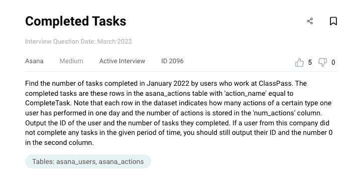

这个问题有两个表格。

**Asana_Users**

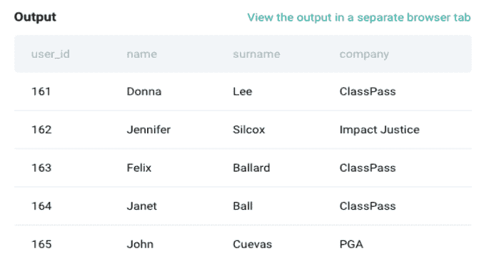

该表包含用户 id 和用户信息，如姓名和公司。

**体式 _ 动作**

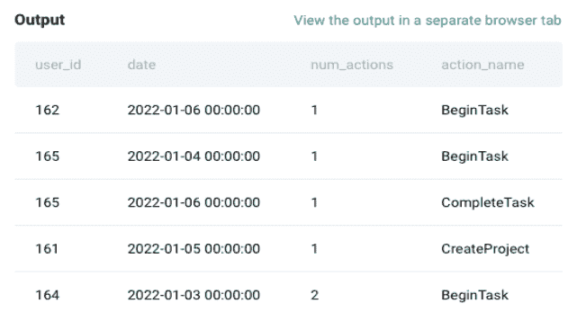

这看起来像一个事件表，其中每一行代表特定用户的一个操作、用户的操作数和操作名称。

## 方法:

有两张桌子；asana_users 和 asana_tables。所以第一步是连接 user_id 上的两个表。

```
*# Import your libraries*
import pandas as pd*# Start writing code*
asana_actions.head()df = asana_users.merge(asana_actions, left_on = 'user_id', right_on = 'user_id', how = 'left')
```

我们只需要关注 ClassPass 公司。因此，只为 ClassPass 过滤该数据帧。

```
df = df[df['company'] == 'ClassPass']
```

我们只需要关注 2022 年 1 月，因此过滤数据框架。我们可以在 pandas 'to_period '中使用一个函数。

```
df = df[df['date'].dt.to_period('m') =="2022-01"]
```

一旦我们过滤了 ClassPass 和一月份，就该计算每个用户的动作数量了。你可以使用熊猫的 groupby 函数。

```
df = df.groupby(['user_id','action_name'])['num_actions'].sum().unstack().fillna(0).reset_index()
```

最后，我们只需要选择两列；user_id 和 CompleteTask。就这么办吧！

```
df = df[['user_id','CompleteTask']]
```

## 最终代码:

```
*# Import your libraries*
import pandas as pd
*# Start writing code*
asana_actions.head()
df = asana_users.merge(asana_actions, left_on = 'user_id', right_on = 'user_id', how = 'left')
df = df[df['company'] == 'ClassPass']
df = df[df['date'].dt.to_period('m') =="2022-01"]
df = df.groupby(['user_id','action_name'])['num_actions'].sum().unstack().fillna(0).reset_index()
df = df[['user_id','CompleteTask']]
df
```

## 代码输出:

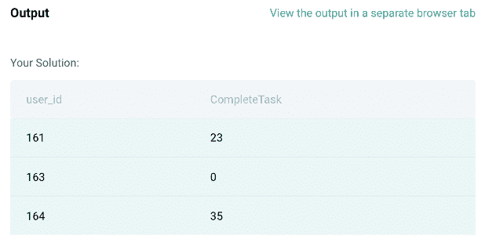

# Python 数据工程师面试问题#4:每个邮政编码的街道数量

问题链接:[https://platform . stratascratch . com/coding/10182-number-of-streets-per-zip-code](https://platform.stratascratch.com/coding/10182-number-of-streets-per-zip-code?utm_source=blog&utm_medium=click&utm_campaign=medium)

## 问题:

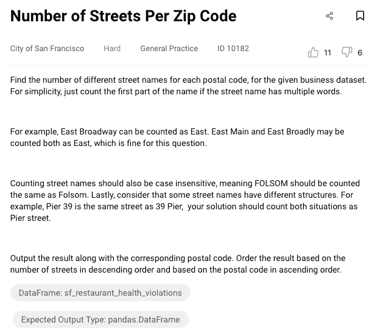

在这个 python 数据工程师面试问题中，我们需要根据问题中给出的一些条件，计算每个邮政编码的街道名称的数量。例如，如果街道名称有多个单词(East Main 可以算作 East)，我们需要只计算名称的第一部分。

这个问题有助于你练习拆分和操作文本进行分析。

有一个表格可以解决这个问题:

**Sf _ 餐厅 _ 卫生 _ 违规**

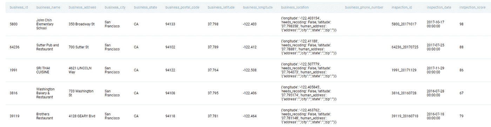

## 方法:

我们需要拆分公司地址以获得街道名称的第一部分。例如，“350 百老汇街”街道名称可以使用拆分功能拆分成不同的元素。让我们使用列表理解(Lambda 函数)来创建一个函数。

```
df = sf_restaurant_health_violationsdf['street'] = df['business_address'].apply(lambda x: x.split(' '))
```

上述代码的输出将给出一个元素列表。该字符串将被分解成多个元素，这取决于所使用的分隔符的类型。在这种情况下，我们使用“空格”作为分隔符，因此，“百老汇街 350 号”将被转换为列表[“350”、“百老汇”、“St”]。

这个问题提到了不区分大小写的街道名，因此我们需要降低()或提高()所有的街道名。让我们用小写来回答这个问题。此外，列表的第一个元素应该是一个单词，所以在第一个元素是一个数字的情况下，然后我们采取下一个元素。下面是为此实现的代码。

```
df['street'] = df['business_address'].apply(lambda x: x.split(' ')[1].lower() if str(x.split(' ')[0][0]).isdigit() == True else x.split(' ')[0].lower())
```

现在找出非唯一街道名称的数量。在 group by 函数之后，数据被转换为一个序列，因此，我们需要 _frame 函数将其转换回数据帧。让我们将街道的数量命名为“n_street ”,并使用 sort_values 函数对其进行降序排序。

```
result = sf_restaurant_health_violations.groupby('business_postal_code')['street'].nunique().to_frame('n_street').reset_index().sort_values(by='business_postal_code', ascending=True).sort_values(by='n_street',ascending=False)
```

## 最终代码:

```
import pandas as pddf = sf_restaurant_health_violationsdf['street'] = df['business_address'].apply(lambda x: x.split(' ')[1].lower() 
                if str(x.split(' ')[0][0]).isdigit() == True else x.split(' ')[0].lower())

result = sf_restaurant_health_violations.groupby('business_postal_code')['street'].nunique().to_frame('n_street').reset_index().sort_values(by='business_postal_code', ascending=True).sort_values(by='n_street',ascending=False)
```

## 代码输出:

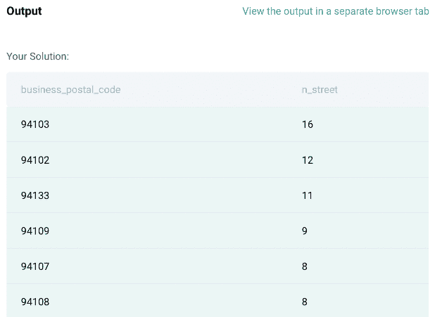

# Python 数据工程师面试问题 5:连续几天

问题链接:[https://platform . stratascratch . com/coding/2054-continuous-days](https://platform.stratascratch.com/coding/2054-consecutive-days?utm_source=blog&utm_medium=click&utm_campaign=medium)

## 问题:

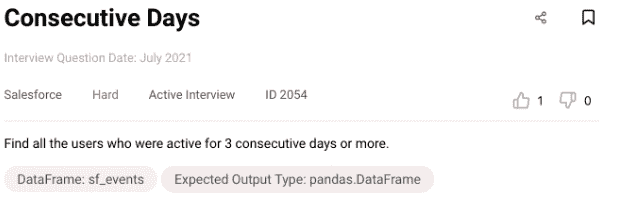

这个问题有一个表格如下。

**sf_events**

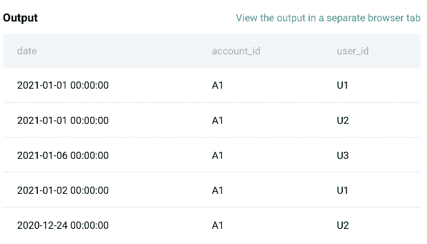

在这个问题中，你需要找到所有连续三天活跃的用户。

## 方法:

首先，这是 events 表，没有任何惟一的标识符，比如 event_id。因此，让我们使用 pandas 中的 drop_duplicates()函数删除这个表中的重复项。

```
*# Import your libraries*
import pandas as pd
*# Start writing code*
df = sf_events.drop_duplicates()
```

在这个表中，我们有用户 id、帐户 id 和日期，但是我们只需要两列作为问题；用户 ID 和日期。让我们只选择这两列，并使用 pandas 的 sort_values()函数对每个用户和每个日期的数据进行升序排序。

```
df = df[['user_id', 'date']].sort_values(['user_id', 'date'])
```

在下一步中，您需要考虑一个类似于 SQL 中的 LEAD()或 LAG()的函数。有一个叫做 SHIFT()的函数可以帮助我们移动日期。该函数采用一个称为**周期**的标量参数，该参数代表在所需轴上移动的次数。这个函数在处理时序数据时非常有用。让我们使用这个函数，通过添加 2 天来创建另一个列，因为我们需要连续 3 天活跃的用户。

```
df['3_days'] = df['date'] + pd.DateOffset(days=2)
df['shift_3'] = df.groupby('user_id')['date'].shift(-2)
*# Check Output*
df.head()
```

上述步骤的输出:

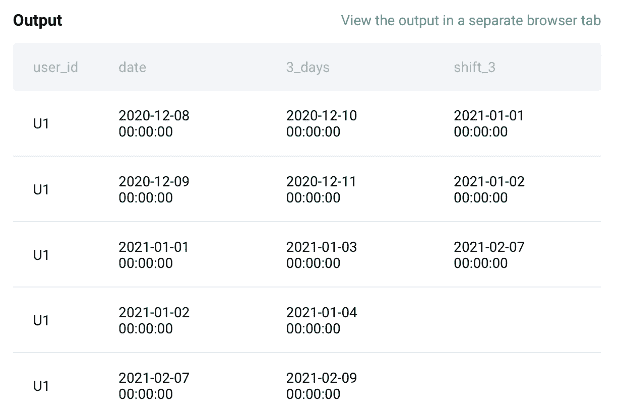

现在我们有了所需格式的数据，让我们比较“3_days”和“shift_3”列，看看它们是否相等。如果它们相等，那么我们提取相应的用户 ID，因为这就是问题所要问的。

```
df[df['shift_3'] == df['3_days']]['user_id']
```

## 最终代码:

```
*# Import your libraries*
import pandas as pd
*# Start writing code*
df = sf_events.drop_duplicates()df = df[['user_id', 'date']].sort_values(['user_id', 'date'])df['3_days'] = df['date'] + pd.DateOffset(days=2)
df['shift_3'] = df.groupby('user_id')['date'].shift(-2)
df[df['shift_3'] == df['3_days']]['user_id']
```

## 代码输出:

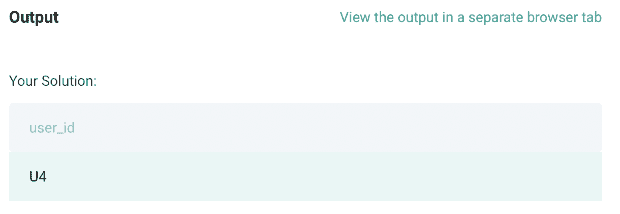

# Python 数据工程师面试问题#6:按床位排列主机

问题链接:[https://platform . stratascratch . com/coding/10161-ranking-hosts-by-beds](https://platform.stratascratch.com/coding/10161-ranking-hosts-by-beds?utm_source=blog&utm_medium=click&utm_campaign=medium)

## 问题:

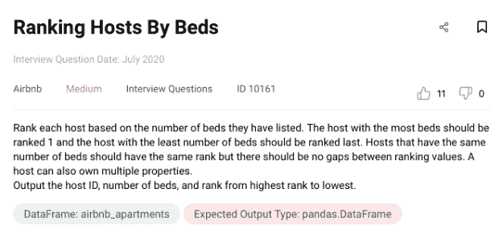

提供了一个表格来解决这个问题。在这个问题中，我们需要根据主机列出的床位数对主机进行排名。一个主机可能有多个列表。此外，一些主机可能有相同数量的床位，因此它们的等级应该相同。请查看提供的表格中的示例输出:

**Airbnb _ 公寓**

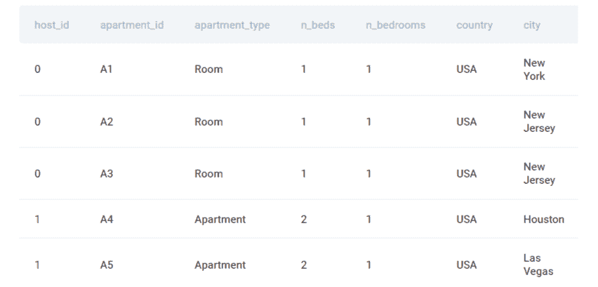

## 方法:

作为第一步，我们需要找到每个主机列出的床位总数。问题提到一个主机可能列出了多个属性，因此，我们需要使用 python 中的 groupby()函数将每个主机的床位数相加，然后将结果转换为数据框

```
*# Import your libraries*
import pandas as pd*# Start writing code*
result = airbnb_apartments.groupby('host_id')['n_beds'].sum().to_frame('number_of_beds').reset_index()
```

下一步是根据主机列出的床位数量对主机进行排名。我们已经有了在前面步骤中计算的主机和床位数列。让我们将 rank()函数与 Dense 方法结合使用，因为我们需要为网站上列出的具有相同床位数的主机提供相同的排名。

```
result['rank'] = result['number_of_beds'].rank(method = 'dense', ascending = False)
```

最后，我们需要根据排名对数据进行升序排序。让我们使用 sort_values()按照每个主机排名的升序对数据进行排序。

```
result = result.sort_values(by='rank')
```

## 最终代码:

```
*# Import your libraries*
import pandas as pd*# Start writing code*
result = airbnb_apartments.groupby('host_id')['n_beds'].sum().to_frame('number_of_beds').reset_index()*# Rank*
result['rank'] = result['number_of_beds'].rank(method = 'dense', ascending = False)
result = result.sort_values(by='rank')
```

## 代码输出:

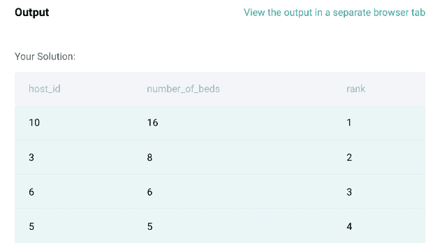

# Python 数据工程师面试问题 7:昂贵的项目

问题链接:[https://platform . stratascratch . com/coding/10301-贵-项目](https://platform.stratascratch.com/coding/10301-expensive-projects?utm_source=blog&utm_medium=click&utm_campaign=medium)

## 问题:

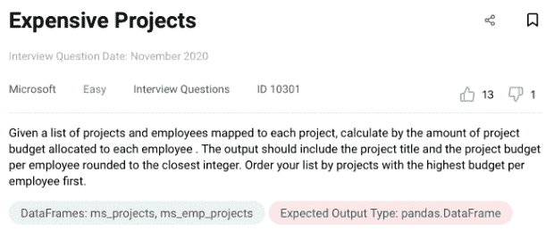

这个问题有两个表格。第一个名为“project_title”的表包含项目的名称/标题、项目 ID 及其预算。

**ms_projects**

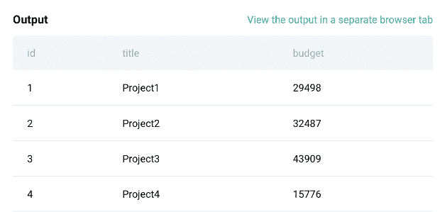

下一个表称为“ms_emp_project”，它将员工 ID 映射到每个项目 ID。

**ms_emp_projects**


该问题要求您计算分配给每个员工的项目预算金额。

## 方法:

问题中有两个表格，每个表格都有不同的信息。所以第一步是连接项目 ID 上的两个表。我们将使用 merge()函数将这些表连接在一起。结果将是一个数据帧，我们将它保存到一个名为 df 的变量中。

```
*# Import Libraries*
import pandas as pd
*# Start writing code*
df= pd.merge(ms_projects, ms_emp_projects, how = 'inner',left_on = ['id'], right_on=['project_id'])
```

下一步是统计每个项目的员工总数。因此，我们将使用 groupby()函数，按照项目标题和预算对数据进行分组，并计算分配给每个项目的员工数量。我们将重置结果数据帧的索引，并将其保存在一个名为 df1 的新变量中。

```
df1=df.groupby(['title','budget'])['emp_id'].size().reset_index()
```

下一步，我们将计算每个员工的预算。为此，我们将总预算除以分配给特定项目的员工人数。如问题中所述，我们将把它四舍五入到最接近的整数。

```
df1['budget_emp_ratio'] = (df1['budget']/df1['emp_id']).round(0)
```

下一步是根据分配给每个员工的预算按降序对数据进行排序。我们将使用 sort_values()函数来做到这一点，以保持函数的“升序”参数为 FALSE，因为我们需要降序。

```
df2=df1.sort_values(by='budget_emp_ratio',ascending=False)
```

最后，问题只提到将每个雇员的职称和预算作为输出，因此，我们将使用 df[[ ]]语法在 pandas 中只选择那些列。

```
result = df2[["title","budget_emp_ratio"]]
```

## 最终代码:

```
*# Import your libraries*
import pandas as pd*# Start writing code*
df= pd.merge(ms_projects, ms_emp_projects, how = 'inner',left_on = ['id'], right_on=['project_id'])df1=df.groupby(['title','budget'])['emp_id'].size().reset_index()df1['budget_emp_ratio'] = (df1['budget']/df1['emp_id']).round(0)df2=df1.sort_values(by='budget_emp_ratio',ascending=False)result = df2[["title","budget_emp_ratio"]]
```

## 代码输出:

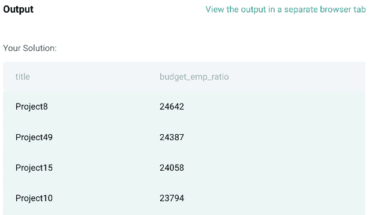

Python 编码动手练习到此结束。我们希望你感到自信。如果你需要更多的练习，这里有一个 [python 面试问题](https://www.stratascratch.com/blog/top-30-python-interview-questions-and-answers/?utm_source=blog&utm_medium=click&utm_campaign=medium)的综合列表，你可以参考一下。

## 结论

我们希望你对下一次数据工程面试有个好印象。在本文中，我们研究了数据工程面试的各个方面。我们探讨了如何成为一名优秀的数据工程师，需要哪些技能，并深入研究了 Python 及其对数据工程师的重要性，同时进行了一些实践。