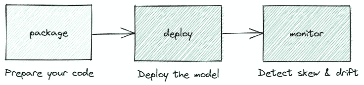
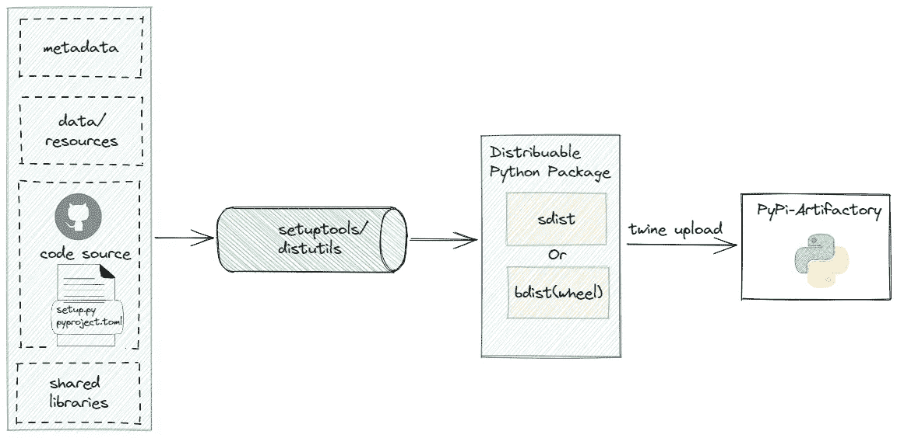

# Python 数据科学项目从实验到生产

> 原文：<https://towardsdatascience.com/python-data-science-projects-from-experimentation-to-production-da5b0801db73>

## Python 打包工作流的分步说明


图片由[梅尔·普尔](https://unsplash.com/@melpoole)在 Unsplash 上拍摄。

# **动机**

生产是机器学习(ML)项目的一个重要里程碑。正如你可能知道的，一旦机器学习算法可以生产，数据科学家必须与 ML 工程师携手合作，在生产中部署该算法。因此，为了增强团队协作并加速进入生产的过程，数据科学家和机器学习工程师都必须了解整个过程。

本文解释了这个过程，详细说明了要遵循的 3 个主要步骤，并介绍了整个 Python 工作流。

# 实验与生产

首先，让我们澄清实验和生产 ML 的区别。让我们假设我们有一个新项目。例如，一家零售公司希望预测新产品销售的成功。企业所有者为动员数据科学团队调查数据开了绿灯。我们假设技术委员会已经检查了数据是否可用。

## 在 ML **实验阶段:**

*   数据科学家使用**笔记本**设计 ML 算法，并访问一部分历史数据，如以前销售的产品、客户资料、产品元数据和历史收入。
*   **数据是静态的**，这意味着由于内存和处理能力的限制，我们只能访问历史原始零售数据的快照。
*   **模型训练是最优调整的**，意味着**ML 模型的参数最大化所选择的评估度量。**
*   ****设计优先级**是达到**最高**整体**精度。****
*   ****代码是非**必然**版本化的、模块化的、**和**简单的**。**
*   **此阶段忽略**沿袭、处理时间、**和**并行化**。**
*   **可解释性和公平性通常很好，但并不重要。**
*   **这个阶段的**挑战**是如何构思一个**高精度算法**。**

## **在 ML **生产阶段:****

*   ****开发环境是隔离的、安全的、**和**可扩展的** (Docker，Kubernetes)。我们可以安全地访问生产零售数据。**
*   ****数据是动态变化的。****
*   **生产中的**模特培训**是**持续评估**和**再培训。****
*   ****设计优先级**目标**快速推断**和**良好的可解释性。****
*   ****代码为** **、模块化、**和**简单**。**
*   ****自动化，血统，处理时间，**和**并行化** **是必需的。****
*   ****可解释性和公平性**至关重要。**
*   **这个阶段的挑战是如何让整个系统工作，同时达到令人满意的 ML 结果。**

**我们可以在张秀坤·克罗伊茨伯格等人的《机器学习操作:概述、定义和架构》的图 4 中看到，一个生产系统是多么复杂。**

# ****从实验转向生产****

**要将在笔记本中设计的 ML 算法投入生产，您必须经历三个一般步骤:**

****

**图片由作者提供。**

# ****1。包装****

**这一步指的是`preparing the code for production`、`building a package`、`uploading the pachakeg to a Python repository`、 *(* 官方库是 Python 包索引(PyPI))。一旦包在 Python 存储库中可用，就可以下载并安装到生产机器上。**

**在继续之前，我邀请您查看一下我的文章，它推荐了几个最佳实践。我非常确定所有列出的最佳实践都会对您有所帮助。**

## **代码准备**

**在构建源代码发行版之前，我们必须为生产准备代码(在笔记本中设计)。因此，我们必须考虑两个方面:代码重构和使用适当工具的代码交付自动化。**

**代码重构建议:**

*   ***去掉无用的评论。***
*   **重构部分代码，确保它易于维护。**
*   ***使用 load_XX，preprocess_XX，training，evaluate，export 等功能。***
*   ***为每个函数添加单元测试&注释。***
*   ***将笔记本转换成 python 模块。***

**代码交付自动化建议:**

*   ***使用* ***Git*** *对代码进行版本化。***
*   ***建立持续集成和交付(CI/CD)流程。***
*   ***使用****Docker****可以快速构建、测试和部署应用程序。参见* [***我的文章***](https://medium.com/towards-artificial-intelligence/devops-7f4c62f43eeb)**详细说明如何创建一个 docker 图像。****
*   ****在每次代码演化时自动运行代码验证(lint 检查、单元测试、安全检查)。****

## ***构建 Python 包***

***你可能会问什么是 Python 包。***

***`A Python package is a collection of Python modules whereas a module is a file that contains Python functions (definitions & statements).`***

***下图显示了打包过程的概述。***

******

***图片由作者提供。***

***Python 包包含:***

*   ****用户开发的 Python 模块****
*   ****数据/资源****
*   ****元数据(版本、包名等。)****
*   ****共享库****

***要构建 Python 包，你可以使用构建系统`[setuptools](https://setuptools.pypa.io/en/latest/).` Setuptools 是由 Python 打包权威维护的`[distutils](https://docs.python.org/3/library/distutils.html)`的扩展。请注意，Python 3.12 不再支持 [distutils](https://docs.python.org/3/library/distutils.html) 构建系统。Setuptools 有很多好处:它易于使用，自动查找包，支持构建隔离，允许修复 setuptools 的版本，并且在 Python 版本之间保持一致。***

***它可以与 pip 一起安装:***

```
*pip install setuptools*
```

***每个构建系统都需要一个文件描述符，其中包含项目属性，例如元数据、依赖项、项目模块以及要包含在包中的附加工具(如 flake8)的配置。 [**PEP 518**](https://peps.python.org/pep-0518/) 推荐使用`pyproject.toml`文件。它代替了`[setup.py](https://docs.python.org/fr/3/distutils/setupscript.html)`。pyproject.toml 位于项目的根目录中。查看[P**EP 621**了解如何在 pyproject.toml 中写入项目元数据。](https://peps.python.org/pep-0621/)***

***找到下一个基本 pyproject.toml 配置:***

***关于 pyproject.toml 部分的几句话:***

*   ***`project`:包含项目元数据***
*   ***`build-system`:指定构建系统和包的格式，在我们的例子中是 wheel***
*   ***`tool.setuptools`:定义包含源代码的目录***
*   ***`optional-dependencie`:保存附加库的列表***
*   ***`setuptools.dynamic`:指定在构建过程中计算的动态元数据字段。***

***所有上述属性让我们在使用我们的包时只捆绑用户需要的文件。使用属性的一个优点是生成的包更小。这意味着用户只需下载 pyproject.toml 中列出的所需依赖项。***

***由构建系统创建的包有两种类型:源代码发行版(sdist)或构建发行版(bdist)。***

*   ***`sdist`是平台不可知的，但缺点是我们不能立即使用它。相反，要使用它，我们需要自己构建包。***
*   ***`bdist`有点复杂，它构建了包，因此我们可以马上使用它。生成的包是特定于平台的，取决于 Python 版本和构建它的操作系统。尽管如此，norm[**PEP 427**](https://www.python.org/dev/peps/pep-0427/)**还是推出了一种新型的 bdist 叫做`wheel`。车轮分布允许跳过建设阶段，提高安装速度。因此，最好使用轮式组件。*****

*****要构建轮子包，我们需要安装构建包:*****

*****`pip install build`*****

*****使用以下命令开始构建过程:*****

*****`python -m build --wheel`*****

*****成功的构建将在`dist`目录中生成一个. whl 文件(例如 template-packaging-python-0 . 1 . 1-py3-none-any . whl ),格式如下:*****

*****`{library name}-{library version}-{python version}-{aplication binary interface tag}-{platform tag (os:os sdk version:cpu architecture)}`*****

*****为了将包上传到 PyPI，我们使用了 [Twine](https://pypi.org/project/twine) 。因此，让我们用 pip 安装麻绳:*****

```
***pip install twine***
```

*****然后，我们使用以下命令将包上传到您的 PyPI:*****

```
***twine upload dist/****
```

*****现在，该软件包可以安装在目标系统上了。*****

*****如果你想避免使用 pip-tools 来安装包，我建议你检查下一代的 *Python* 打包工具，如**[**poem**](https://python-poetry.org/)**、**[**Flit**](https://flit.pypa.io/en/latest/index.html)**、**[**Pipenv**](https://pypi.org/project/pipenv/)**、**或其他替代工具。*******

# *****2.部署*****

*****建议通过 CI/CDs 自动部署软件包。为此，选择一个基于云的托管服务，如 **Gitlab** 或其他由贵公司维护的替代服务，如**[**Jenkins**](https://www.jenkins.io/)**或**[**circle ci**](https://circleci.com/)。*******

*****部署本身指的是从 Python Artifactory 中自动检索构建包，并继续在集群中运行的容器中安装该包。*****

# *****3.班长*****

*****最后但同样重要的是，我们需要跟踪数据异常值、偏差和漂移。如果您使用顶点人工智能管道部署模型，您可以使用[顶点人工智能监控](https://cloud.google.com/vertex-ai/docs/model-monitoring)解决方案，否则请寻找由您的云提供商维护的适当解决方案。*****

# *****概述*****

*****这篇文章强调了实验和生产之间的区别。它展示了将您的 ML 项目转移到生产中所要遵循的三个主要步骤，并详细描述了 Python 打包工作流。*****

*****请在我的下一篇文章中继续关注关于部署和监控的更多细节。*****

# *****感谢您的阅读！*****

*****如果你想在收件箱里收到我未来的故事，别忘了订阅。*****

******如果你喜欢阅读我的故事，并想支持我成为一名作家，考虑注册成为一名媒体成员，并获得数以千计的数据工程和数据科学文章。******

*****[](https://medium.com/@anna.bildea/membership)  

*在*[*LinkedIn*](https://www.linkedin.com/in/ana-bildea-phd-2339b728/)*和* [Twitter](https://twitter.com/AnaBildea) 上找我！

查看我收集的 MLops 文章


[比尔代亚安娜](https://medium.com/@anna.bildea?source=post_page-----da5b0801db73--------------------------------)

## MLOps

[View list](https://medium.com/@anna.bildea/list/mlops-04b6c81c50c8?source=post_page-----da5b0801db73--------------------------------)4 stories*****