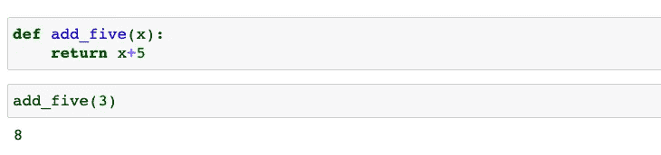
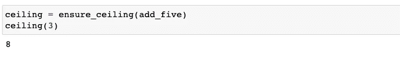
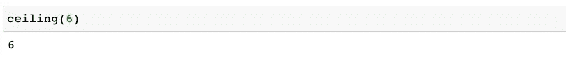
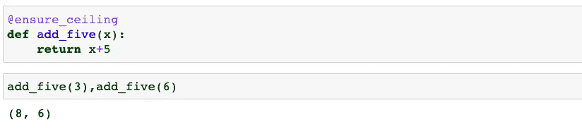
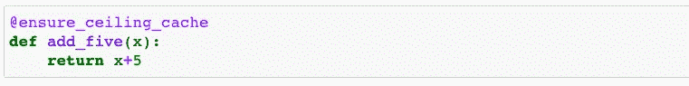
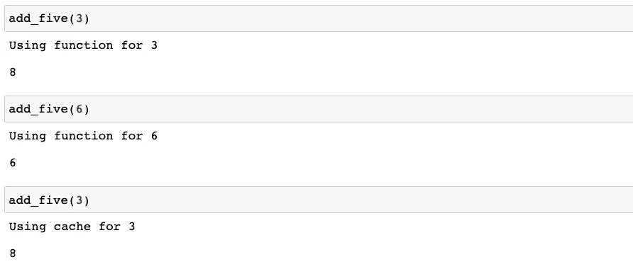

# Python Decorator:什么，为什么，以及如何

> 原文：<https://towardsdatascience.com/python-decorator-what-why-and-how-f6b2d86e858e>


朱莉安娜·马尔他在 [Unsplash](https://unsplash.com/s/photos/gift-wrapping?utm_source=unsplash&utm_medium=referral&utm_content=creditCopyText) 上拍摄的照片

Python decorator 是帮助我们高效编码的非常有用的工具。正如我在上一篇文章中提到的，高效编码是我成为更好的数据科学家所遵循的原则之一:

</seven-principals-i-follow-to-be-a-better-data-scientist-25a547d6acfc>  

在本文中，我想揭示 Python decorators 的用例，并讨论它们如何对您的日常编程任务有所帮助。

## **什么是 Python 装饰师**

Python decorator 的名字听起来可能很花哨，但本质上，它只不过是一个工具，您可以使用它来定制现有函数的输出，而无需修改函数本身。之所以称之为“ ***【装饰者】*** 是因为你可以把同样的概念应用到，就好像你在包装礼物一样。我们可以在不同的节日用不同的包装纸装饰礼物。即使礼物本身是一样的，我们也可以通过不同的装饰，在不同的场合送出。将这个比喻应用于 python 编程语言，礼物是 python 函数，包装器是 python 装饰器，而您的任务是不同的假日。在本文中，我将讨论 python decorators 的两个主要用例:一个是修改函数，另一个是缓存函数输出以保存未来的运行时。我们将在下一节看到这两个用例的例子。

## 为什么以及如何使用 Python Decorator

**1 -修改功能输出而不修改功能本身**

在讨论如何用 Python decorator 修改函数之前，让我们从一个简单的函数开始:

```
def add_five(x):
    return x+5
```

这个函数只是将输入 x 加 5，为了简单起见，我们假设 x 是数字。



作者代码

我们可以看到，当你调用这个函数时，它产生一个输出，在输入的基础上加 5。这是一个非常简单的函数，操作简单明了。现在，如果我们想使用这个函数，但是对输出应用一个条件，说输出不能大于 10，那该怎么办呢？我们可以在 **add_five()** 函数的基础上添加以下函数:

```
def ensure_ceiling(func):
    ceiling = 10
    def wrapper(x):
        value = func(x)
        return value if value < ceiling else x
    return wrapper
```

**assure _ ceiling()**函数接受一个函数作为输入。它首先将上限定义为 10。然后定义一个**包装器**函数，它接受输入函数的输入 x 并产生一个输出值。然后**包装器**函数的输出将使用上限条件进行修改。最后，**确保上限**函数返回**包装器**函数作为输出。然后我们可以修改 **add_five** 函数，将其作为**确保 _ 上限**函数的输入。让我们看看它是如何工作的:



现在，如果我们把 input 设为 3，**assure _ ceiling**函数会使用里面的包装函数产生一个值，这个值就是 **add_five(3)** 。**包装器**函数的输出是 8，因为 8 小于上限 10，这也是**确保上限(加五)**将返回的值。到目前为止，它的工作方式类似于 **add_five()** 。如果我们给的初始输入是 6 呢？那么 add_five(6)将是 11，高于 10 的上限。因此，它将返回输入本身，而不是返回 11，6:



我们在这里没有真正使用装饰器，尽管我们已经定义了装饰器函数。使用它的最有效方法是通过下面的代码:



写完**确保 _ 上限**函数后，我们可以在我们要修饰的函数的正上方用“@”符号“***【wrap】***”。应用后，我们可以直接调用修饰函数来获得修改后的输出。

**2 —缓存之前的运行结果**

装饰器也可以作为函数级缓存。使用同一个 **add_five()** 函数，我们可以在每次运行函数时保存输出，这样当后面给出相同的输入时，就可以快速抓取结果，而不需要再次运行函数。这是非常有用的，尤其是当函数需要很长时间才能运行并且会被重用的时候。让我们看看这里的例子。我们首先定义装饰者:

```
def ensure_ceiling_cache(func):
    ceiling = 10
    cache = {}
    def wrapper(x):
        if x in cache.keys():
           print(f’Using cache for {x}’)
        else:
           print(f’Using function for {x}’)
           value = func(x) if func(x) < ceiling else x
           cache[x] = value
     return cache[x]
 return wrapper
```

在装饰器中，我们包含一个“缓存”字典来保存每次运行的输出，然后定义一个 if/else 语句来决定我们是需要运行函数来获得结果，还是简单地使用缓存的字典。我们来看看它在 **add_five()** 中的用法:



现在，当我们调用 **add_five()** 函数时，它不仅会为输出应用一个上限，而且它还有一个保存在装饰器内部的缓存字典。第二次调用 **add_five(3)** 时，不会使用函数产生结果，只是简单的查找前面的结果是什么。



总之，我们已经使用 python decorator 修改了现有的函数，并缓存了以前的输出，以便在重复运行函数时节省时间。希望带有示例的用例简单易懂。你还遇到过哪些使用 python decorators 的场景？请在下面的评论中告诉我们！

感谢您的阅读！以下是我写的一些关于 Python 编程的其他文章:

*   [网页抓取雅虎财经新闻](https://zzhu17.medium.com/web-scraping-yahoo-finance-news-a18f9b20ee8a)
*   [使用 twint 获取并分析推特](https://pub.towardsai.net/getting-valuable-insights-and-visualizations-from-tweets-using-python-and-twint-28d9f9eb9128)
*   [python 字典排序的两种简单方法](/two-simple-method-to-sort-a-python-dictionary-a7907c266dba)
*   [使用 CVXOPT 从头开始实现 SVM](https://python.plainenglish.io/introducing-python-package-cvxopt-implementing-svm-from-scratch-dc40dda1da1f)

我还有[一份关于](https://medium.com/@zzhu17/list/data-science-interview-preparation-bfb0986a61a3)[机器学习](/20-machine-learning-related-questions-to-prepare-for-interviews-93bcba72f911)、[统计](/22-statistics-questions-to-prepare-for-data-science-interviews-d5651a8b3c56)、[概率](/12-probability-practice-questions-for-data-science-interviews-2ec5230304d9)、[案例研究](/structure-your-answers-for-case-study-questions-during-data-science-interviews-a14a02d21e6c)、[行为问题](/prepare-behavioral-questions-for-data-science-interviews-96e97f13be15)的数据科学家面试准备问题清单，如果需要可以查阅一下。

还有我的文章如果感兴趣的话:

<https://zzhu17.medium.com/my-blog-posts-gallery-ac6e01fe5cc3>  

订阅我的电子邮件列表:

<https://zzhu17.medium.com/subscribe>  

注册成为中级会员:

<https://zzhu17.medium.com/membership>  

或者在 YouTube 上关注我:

<https://youtube.com/channel/UCMs6go1pvY5OOy1DXVtMo5A> 