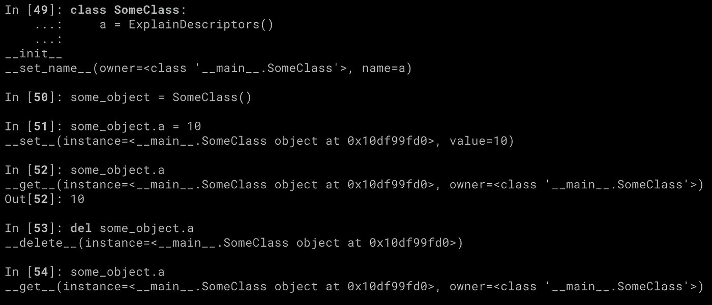
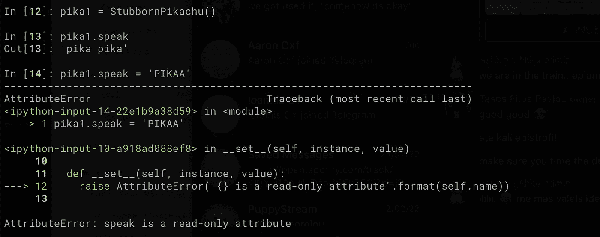
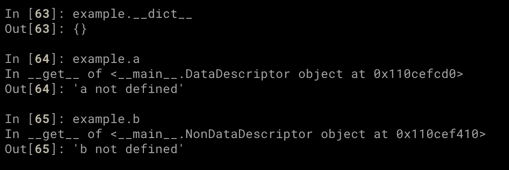
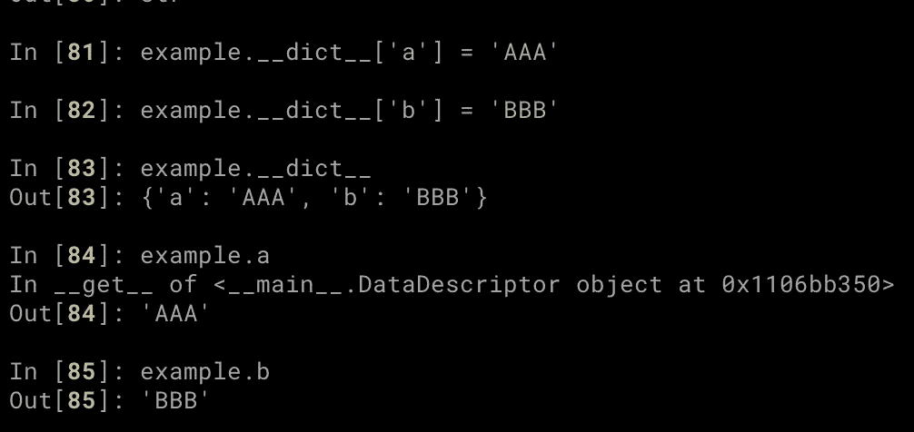
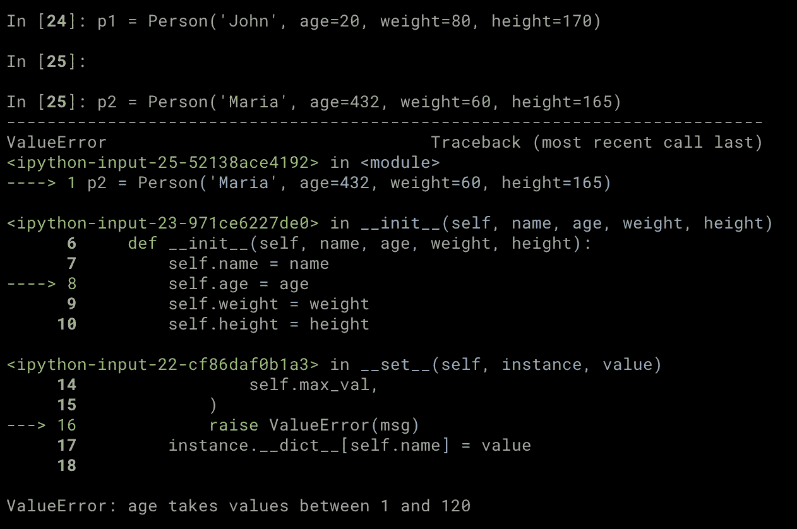

# Python 描述符及其使用方法

> 原文：<https://towardsdatascience.com/python-descriptors-and-how-to-use-them-5167d506af84>

## 用例子解释 Python 描述符


[亚历克斯·丘马克](https://unsplash.com/@ralexnder?utm_source=unsplash&utm_medium=referral&utm_content=creditCopyText)在 [Unsplash](https://unsplash.com/s/photos/python-code?utm_source=unsplash&utm_medium=referral&utm_content=creditCopyText) 上拍摄的照片

# 介绍

您可能不知道什么是 Python 描述符，但是如果您一直在用 Python 编程，那么您可能已经间接地使用过它们了！它们是属性(通过`@property` decorator 定义)和方法之类的东西的背后。

# 这是什么？

描述符是一个对象，它:

*   实现**描述符协议**和
*   **被分配给一个属性**。

简单来说，对象需要定义以下任何一种方法:

```
__get__(self, instance, owner=None) -> value
__set__(self, instance, value) -> None
__delete__(self, instance) -> value
```

对于 [Python 3.6 及以上版本](https://www.python.org/dev/peps/pep-0487/):

```
__set_name__(self, owner, name)
```

当这种情况发生时:

*   访问属性 do`obj.attribute`调用`__get__`方法，
*   设置一个值做`obj.attribute = new_value`调用`__set__`方法，
*   删除属性做`del obj.attribute`调用`__delete__`方法，

假设描述符定义了所有这些方法。你可能想知道`__set_name__`是做什么的？

它允许描述符知道它被赋予的属性的名称。当实现描述符协议的对象被分配给一个属性时，它会自动被调用。

为了查看所有这些操作，让我们创建一个定义描述符协议中所有方法的对象，并添加一组`print`语句——不要在生产代码中这样做:)。

```
*class* ExplainDescriptors:
    *def __init__*(self):
        print('__init__')

    *def __set_name__*(self, *owner*, *name*):
        print(f'__set_name__(owner={*owner*}, name={*name*})')
        self.name = *name

    def __get__*(self, *instance*, *owner*=*None*):
        print(f'__get__(instance={*instance*}, owner={*owner*})')
        *return instance*.__dict__.get(self.name)

    *def __set__*(self, *instance*, *value*):
        print(f'__set__(instance={*instance*}, value={*value*})')
        *instance*.__dict__[self.name] = *value

    def __delete__*(self, *instance*):
        print(f'__delete__(instance={*instance*})')
        *del instance*.__dict__[self.name]
```

现在我们可以看到每个方法何时被调用以及它的参数是什么。



调用描述符的所有方法。图片由作者提供。

`instance`被设置为相关对象，`owner`被设置为其类。

再来看一个更实际的例子(这次没有`print`语句)！

```
class ReadOnlyAttribute:
  def __init__(self, value):
    self.value = value

  def __set_name__(self, owner, name):
    self.name = name   def __get__(self, instance, owner=None):
    return self.valuedef __set__(self, instance, value):
    msg = '{} is a read-only attribute'.format(self.name)
    raise AttributeError(msg) class StubbornPikachu:
  speak = ReadOnlyAttribute('pika pika')
```

在上面的例子中，我们创建了一个只读描述符，并将其分配给属性`speak`。我们没有在`instance`中存储任何东西，因为我们希望所有的`Pikachu`对象说同样的事情——它们都共享相同的描述符。

任何改变我们的`StubbornPikachu`所说的话的尝试都会遭遇失败(或者更具体地说是`AttributeError`)。



pika1 拒绝说别的。图片由作者提供。

# 描述符类型

描述符有两种类型。

*   **数据描述符**:定义`__get__`和`__set__`或`__delete__`，
*   **非数据描述符**:仅定义`__get__`。

我们上面定义的`**ReadOnlyAttribute**` **是一个数据描述符**，因为它定义了`__set__`，即使当你试图使用它时它会产生一个错误。

Python 方法就是一个非数据描述符的例子。为什么？嗯，Python 函数是实现`__get__`的对象，方法是分配给属性的函数，这使它们成为非数据描述符！

了解两者之间的区别很重要，因为在查找链中，数据描述符的优先级高于非数据描述符。那是什么意思？

当您使用`obj.attribute`语法访问属性时，Python

*   首先查找名为`attribute`的数据描述符，
*   如果没有找到，它就在`obj.__dict__`中检查一个`attribute`键，
*   如果失败，它将检查非数据描述符。

让我们看一个例子。

```
*class* DataDescriptor:
    *def __set_name__*(self, *owner*, *name*):
        self.name = *name

    def __get__*(self, *instance*, *owner*=*None*):
        default_value = '{} not defined'.format(self.name)
        print('In __get__ of {}'.format(self))
        *return instance*.__dict__.get(self.name, default_value)

    *def __set__*(self, *instance*, *value*):
        print('In __set__ of {}'.format(self))
        *instance*.__dict__[self.name] = *value

class* NonDataDescriptor:
    *def __set_name__*(self, *owner*, *name*):
        self.name = *name

    def __get__*(self, *instance*, *owner*=*None*):
        default_value = '{} not defined'.format(self.name)
        print('In __get__ of {}'.format(self))
        *return instance*.__dict__.get(self.name, default_value)

*class* Example:
    a = DataDescriptor()
    b = NonDataDescriptor()
```

在上面的代码中，我们创建了两个描述符，并将它们分配给类`Example`的属性`a`和`b`。除了`DataDescriptor`具有`__set__`方法之外，它们是相同的。



这两个属性都是通过描述符的 __get__ 方法来访问的。图片由作者提供。

我们可以看到，由于我们没有为`example`定义`a`和`b`——因此`example.__dict__`是空的——这两个属性都是通过它们的描述符的`__get__`方法来访问的。让我们看看当我们将它们设置为一些值时会发生什么。



在示例中出现“b”之后。__dict__ 不再使用分配给 b 的 NonDataDescriptor 的 __get__ 方法。图片由作者提供。

访问`a`仍然使用`__get__`方法，因为数据描述符优先于`__dict__`中的内容。然而，为了访问`b`，我们直接进入`example.__dict__`，因为它在非数据描述符之前被检查。

# 如何使用描述符

当您有多个具有相似行为的属性时，使用描述符是有意义的。

例如，假设我们正在实现一个名为`Person`的类，其属性有`name`、`age`、`weight`和`height`。我们可能希望检查这些属性的值是否有意义(例如，我们不能让一个人的年龄为负)。一种方法是在`__init__`中有一堆`if`语句。然而，如果您必须为许多属性这样做，这可能会很快变得很糟糕。有一些像下面这样的东西看起来更好，也更容易阅读！

```
*class* Person:
    age = BoundedNumber(1, 120)
    weight = BoundedNumber(1, 250)
    height = BoundedNumber(1, 230)

    *def __init__*(self, name, *age*, *weight*, *height*):
        self.name = name
        self.age = *age* self.weight = *weight* self.height = *height*
```

在上面的代码中`BoundedNumber`是一个数据描述符，它检查分配给属性的值是否在两个数字之间。下面给出了实现。

```
*class* BoundedNumber:
    *def __init__*(self, *min_val*, *max_val*):
        self.min_val = *min_val* self.max_val = *max_val

    def __set_name__*(self, *owner*, *name*):
        self.name = *name

    def __set__*(self, *instance*, *value*):
        *if* self.min_val > *value or value* > self.max_val:
            msg = '{} takes values between {} and {}'.format(
                self.name, 
                self.min_val, 
                self.max_val,
            )
            *raise* ValueError(msg)
        *instance*.__dict__[self.name] = *value

    def __get__*(self, *instance*, *owner*=*None*):
        *return instance*.__dict__[self.name]
```

注意在`__set__`方法中，我们如何将`value`存储在`instance`(当前对象)中，而不是描述符中，即`self`。所有的`Person`对象将共享相同的描述符，所以在那里存储值是没有意义的。

现在，当我们试图用无效值初始化一个对象时，我们会得到一个错误，这是意料之中的。



行动中的描述符。图片由作者提供。

# 结论

在这篇文章中，我们学习了 Python 描述符以及如何使用它们。有关更多细节和示例，请务必查看下面的参考资料。

[](https://eminik355.medium.com/subscribe) [## 每当阿耳忒弥斯·卡尼出版时，就收到一封电子邮件。

### 每当阿耳忒弥斯·卡尼出版时，就收到一封电子邮件。通过注册，您将创建一个中型帐户，如果您还没有…

eminik355.medium.com](https://eminik355.medium.com/subscribe) 

**出自同一作者。**

[](/why-you-should-use-context-managers-in-python-4f10fe231206) [## 为什么应该在 Python 中使用上下文管理器

### 在 Python 中实现和使用上下文管理器。

towardsdatascience.com](/why-you-should-use-context-managers-in-python-4f10fe231206) [](/how-not-to-use-python-lists-d06cbe8e593) [## 如何不使用 Python 列表

### 理解 Python 中的可变对象。

towardsdatascience.com](/how-not-to-use-python-lists-d06cbe8e593) [](https://medium.com/analytics-vidhya/multi-armed-bandits-part-1-epsilon-greedy-algorithm-with-python-code-534b9e2abc9) [## 多臂强盗:Epsilon-Greedy 算法和 Python 代码

### 了解 Epsilon-Greedy 的工作原理。为所有实验提供完整的 python 代码。

medium.com](https://medium.com/analytics-vidhya/multi-armed-bandits-part-1-epsilon-greedy-algorithm-with-python-code-534b9e2abc9) [](/going-bayesian-testing-rate-metrics-82e872b79175) [## 走向贝叶斯:测试速率度量

### 如何在没有 p 值和置信区间的情况下运行速率度量的 A/B 测试？

towardsdatascience.com](/going-bayesian-testing-rate-metrics-82e872b79175) 

# 参考

[1][https://docs.python.org/3/howto/descriptor.html](https://docs.python.org/3/howto/descriptor.html)

[2]https://realpython.com/python-descriptors/