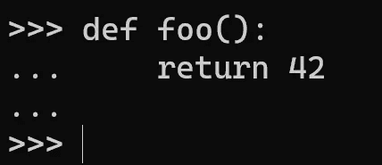
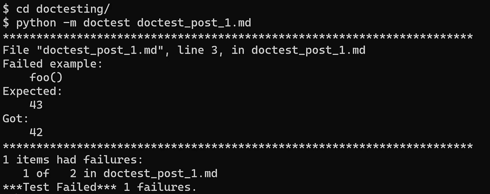
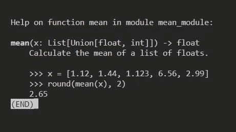

# 用 doctest 测试 Python 文档:简单的方法

> 原文：<https://towardsdatascience.com/python-documentation-testing-with-doctest-the-easy-way-c024556313ca>

## PYTHON 编程

## doctest 允许文档、单元和集成测试，以及测试驱动的开发


doctest 允许保持最新的代码文档。照片由[伊斯哈格·罗宾](https://unsplash.com/@esmiloenak?utm_source=medium&utm_medium=referral)在 [Unsplash](https://unsplash.com?utm_source=medium&utm_medium=referral) 上拍摄

代码测试不一定很难。更重要的是，[测试使编码变得更容易和更快——甚至，至少对一些开发人员来说，更令人愉快](https://medium.com/geekculture/make-yourself-enjoy-writing-unit-tests-e639711c10bd)。然而，为了让测试变得愉快，我们使用的测试框架需要对用户友好。

Python 提供了几个测试框架，目前最流行的三个是`[pytest](https://docs.pytest.org/en/7.2.x/contents.html)`和内置的`[unittest](https://docs.python.org/3/library/unittest.html)`和`[doctest](https://docs.python.org/3/library/doctest.html)`。前两种侧重于单元测试。`doctest`是不同的，它的主要目的——但*肯定不是唯一的目的——是文档测试。*

`doctest`也是这篇文章的主旨。我将介绍这个特别有趣的工具，希望您能看到，尽管它很简单，但它非常有用。老实说，`doctest`是我最喜欢的 Python 包，正如我在这次[“本周 PyDev”](https://www.blog.pythonlibrary.org/2022/10/24/pydev-of-the-week-marcin-kozak/)采访中强调的。在上面，我写道，如果我们希望测试是愉快的，我们需要一个用户友好的工具。说`[doctest](https://docs.python.org/3/library/doctest.html)`用户友好是一种保守的说法——它是我见过的最简单、最友好的测试工具。

说到这里，我觉得很困惑，为什么我认识的大多数 python 爱好者很少使用或者根本不使用`doctest`。我希望这篇文章能让他们——还有你——相信将`doctest`引入日常编码程序是值得的。

我提到的`doctest`很简单。的确，它是如此的简单，以至于看完这篇短文就足够你使用它了！

# `doctest`是关于什么的？

`doctest`是一个标准库测试框架，所以它与您的 Python 安装一起提供。这意味着你不必安装它。虽然它不是为复杂的单元测试场景而设计的，但它使用简单，而且在大多数情况下功能强大。

`doctest`模块提供了`pytest`和`unittest`都没有的: [*文档测试*](https://en.wikipedia.org/wiki/Documentation_testing) 。简而言之，文档测试对于测试您的代码文档是否是最新的非常有用。这是相当多的功能，尤其是在大型项目中:只需一个命令，您就可以检查所有示例是否正确。因此，在每次新的提交、合并和发布之后，它取代了反复阅读文档中的代码示例。您还可以将`doctest` ing 添加到 CI/CD 管道中。

`doctest`采用的方法使用了我们称之为回归测试的方法。原则上，您从示例中运行代码，保存输出，并且在将来您可以运行`doctest`来检查示例是否提供相同的输出——这意味着它们以它们应该的方式工作。如您所见，这将该工具的使用限制在不会随会话变化的对象上。因此，您不能使用这种方法来测试输出的随机元素。一个例子是对象的，它们在不同的会话中是不同的。这个限制并不是特定于`doctest`的，但是它在这个测试框架中似乎比在其他框架中更重要。幸运的是，`doctest`提供了处理这种限制的工具。

与任何测试工具一样，您可以——也应该——在对代码进行任何更改之后运行`doctest`,以便检查这些更改是否没有影响输出。有时他们会，由于他们的性格(例如，你修复了一个 bug，现在功能工作正常了——但是不同了)；如果是这种情况，您应该更新相应的测试。如果更改不应该影响输出，但是它们影响了输出，正如失败的测试所表明的，代码有问题，因此是代码需要进一步的更改。

# **利用** `**doctest**` **，结合实例**

要编写`doctest` s，您需要提供代码和预期的输出。在实践中，您以类似于在[Python 解释器](https://docs.python.org/3/tutorial/interpreter.html)中的代码及其输出的方式编写测试。

让我用一个简单的例子来描述一下。考虑下面的函数，它是`doctest`的一部分:

```
>>> def foo():
...     return 42
```

(您可以导入该函数，但我们稍后将返回到这一点。)这是我在 Python 解释器中看到的情况:



Python 解释器中 foo()函数的定义。作者图片

我们看到了一个微小的区别。当你在解释器中定义一个函数时，你需要按两次回车键，这就是为什么我们会在函数的末尾看到额外的省略号。`doctest`代码不需要这个额外的省略号行。更重要的是，在解释器中编码时，不必在每个省略号行之前(省略号之后)额外添加空格，而需要在`doctest`代码中做；否则，缩进看起来好像是由三个空格组成的，而不是四个。还有一个区别——实际上是一个很好的区别——在 Python 解释器中，您不会看到代码高亮显示。例如，当您编写文档测试时，您可能会在 [Markdown](https://www.markdownguide.org/) 或 [reStructuredText](https://docutils.sourceforge.io/rst.html) 文件中看到它。

我想你会同意这些不是很大的差异，而是好的差异。多亏了他们，`doctest`代码看起来很漂亮。

因此，`>>>`和`...`(Python 省略号)构成了测试的基本部分，因为`doctest`使用它们来识别新命令刚刚开始(`>>>`)以及前一行的命令正在继续(`...`)。

上面定义`foo()`函数的 cope 片段仍然不是有效的`doctest`，因为它只定义了函数。要编写一个测试，我们需要调用函数并包含它的预期输出:

```
>>> foo()
42
```

就是这样！这是我们的第一个`doctest` ——你已经了解了关于这个工具你需要知道的大部分内容！总之，此`doctest`将如下所示:

```
>>> foo()
42
>>> def foo():
...     return 42
```

您可以从 shell 运行测试。您也可以从 Python 解释器中完成，但是由于它需要与其中一个 shell 方法相同的代码，所以我不会重点介绍这一点；你也很少需要它。？？？*不清楚的句子！！！*

假设测试保存为`doctest_post_1.md`。要运行它，请打开 shell，导航到测试文件所在的文件夹，然后运行以下命令(它在 Windows 和 Linux 中都可以工作):

```
$ python -m doctest doctest_post_1.md
```

如果测试通过，你将什么也看不到。如果失败，您将在 shell 中看到这个。为了了解其工作原理，让我们将测试中的 42 改为 43:

```
>>> foo()
43
```

这将是输出:



在 shell 中运行的 doctest(失败)的输出。作者图片

你可以用另一种方法做这件事。考虑以下模块:

```
# mathmodule.py
"""The simplest math module ever.

You can use two functions:
>>> add(2, 5.01)
7.01
>>> multiply(2, 5.01)
10.02
"""

def add(x, y):
    """Add two values.

    >>> add(1, 1)
    2
    >>> add(-1.0001, 1.0001)
    0.0
    """
    return x + y

def multiply(x, y):
    """Multiple two values.

    >>> multiply(1, 1)
    1
    >>> multiply(-1, 1)
    -1
    """
    return x * y

if __name__ == "__main__":
    import doctest

    doctest.testmod()
```

使用这个 name-main 块，您可以简化 shell 命令:

```
$ python doctest_post_1.md
```

这运行模块，运行它意味着运行它所有的`doctest`。

当您想要查看详细的输出时，添加一个`-v`标志。下面，我使用了这个标志，它导致了下面的输出:

```
$ python doctest_post_1.md -v
Trying:
    add(2, 5.01)
Expecting:
    7.01
ok
Trying:
    multiply(2, 5.01)
Expecting:
    10.02
ok
Trying:
    add(1, 1)
Expecting:
    2
ok
Trying:
    add(-1.0001, 1.0001)
Expecting:
    0.0
ok
Trying:
    multiply(1, 1)
Expecting:
    1
ok
Trying:
    multiply(-1, 1)
Expecting:
    -1
ok
3 items passed all tests:
   2 tests in __main__
   2 tests in __main__.add
   2 tests in __main__.multiply
6 tests in 3 items.
6 passed and 0 failed.
Test passed.
```

它相当杂乱，说实话，我几乎从不使用它。它的主要优势是我们在最后看到的，测试的总结。然而，在开发时，我不需要它，因为我通常运行测试来检查某个特定的功能是否通过测试。因此，这一点很重要，`doctest` s 应该相当快，因为你通常不会请求一个特定的测试，你只需从一个模块中运行所有的测试。

上面，我们展示了如何编写和运行`doctest`,所以是时候考虑实际问题了，也许还有更复杂的例子。`doctest`测试通常有两个位置:

*   在函数/类/方法文档字符串中
*   在文档文件中

因为它们可能有显著的不同，所以让我们逐一讨论它们。

## `**doctest**` **文档字符串中的 s**

考虑以下函数:

```
# mean_module.py
from typing import List, Union

def mean(x: List[Union[float, int]]) -> float:
    """Calculate the mean of a list of floats.

    >>> x = [1.12, 1.44, 1.123, 6.56, 2.99]
    >>> round(mean(x), 2)
    2.65
    """
    return sum(x) / len(x)
```

这就是如何在 docstring 中编写`doctest`测试的方法。这里，我们在函数 docstring 中做了，但是您可以将它写在*任何* docstring 中，放在四个`doctest`位置:

*   模块文档字符串
*   函数 docstring(就像上面的例子)
*   类文档字符串
*   方法文档字符串

使用 docstrings，我认为是`doctest`最常见的用法。请记住，无论一个函数的 docstring 包含什么，它都会出现在它的帮助页面中，您可以通过调用`help()`函数在 Python 解释器中看到它。例如:

```
>>> from mean_module import mean
>>> help(mean)
```

解释器将消失，取而代之的是您将看到下面的`mean()`功能的帮助页面:



mean()函数的帮助页面。作者图片

这是我在`doctest`测试中欣赏的另一件事:与 docstrings 结合，它们产生帮助页面，因此代码文档是干净的和最新的。有时函数或方法非常复杂，以至于很难看出应该如何使用它们。然后，通常，像添加到 docstring 中的一两个`doctest`测试这样小的东西会比类型提示和代码以及 docstring 的其余部分一起提供更多的信息。

但是，请记住，不要让用文档测试淹没文档字符串。虽然在其中包含许多这样的测试可能很诱人，但是您不应该这样做。阅读这样的文档字符串是不愉快的。最好将关键的测试放在 docstring 中，将剩余的测试移到别处。您可以将它们移动到一个专用的`doctest`文件中，或者将它们翻译成`pytest`测试。两种解决方案我都用过。

## `**doctest**`文档文件中的**年代**

您可以在各种类型的文件中编写文档测试。我更喜欢降价。md)但是可以在 reStructuredText(。rst)甚至文本(。txt)文件。但是，不要试图在使用特定编码的文件中这样做，比如 e of。例如，`doctest`不能与。rtf 文件。

下面的代码块展示了一个带有 doctests 的 Markdown 文件的例子。为了节省空间，我将在这里只包括基本的测试，但它们足以显示如何创建这样的文件。

考虑`mathmodule`模块的以下自述文件(README.md ):

```
# Introduction

You will find here documentation of the mathmodule Python module. 

It contains as many as two functions, `add()` and `multiply()`.

First, let's import the functions:

```python
>>> from mathmodule import add, multiply

```

## Using `add()`

You can use the `add()` function in the following way:

```python
>>> add(1, 1)
2
>>> add(2, 5.01)
7.01

```

## Using `multiply()

You can use the `multiply()` function in the following way:

```python
>>> multiply(1, 1)
1
>>> multiply(-1, 1)
-1

```
```

如您所见，这里没有哲学:您在典型的代码块中添加了`doctest`。有两件事你应该记住:

*   在完成代码块之前添加一个空行。否则，`doctest`会将`````视为输出的一部分。
*   不要忘记导入您将在测试文件中使用的所有对象；这里，这些是`add()`和`multiply()`功能。这在你看来可能是一个基本的错误，甚至可能太基本了。即使这是最基本的，我也经常这样做；我甚至在这里，当写上述自述文件。

如您所见，我在代码块中包含了所有的测试，但是即使是在代码块之外编写的测试也会运行。然而，我认为这样做没有任何意义。

# `doctest`工具

上面，我们已经学习了`doctest`的基本用法。然而，我们可以用它做更多的事情。通过使用所谓的指令，我们可以使用大多数附加的`doctest`功能。

指令直接添加在被测试的代码之后，使用如下所示的特定语法。当需要指令的命令被分成几行时，您可以将指令添加到其中的任何一行中(我马上会给出一个例子)。指令改变`doctest`的行为；例如，测试可以忽略输出的一部分，规范化空白，捕捉异常，等等。

## 省略

也许最重要和最常用的指令是省略号:`# doctest: +ELLIPSIS`。下面，你可以看到上面的`multiply`函数的两个测试，一个没有，另一个有`ELLIPSIS`指令:

```
>>> multiply(2.500056, 1/2.322)
1.0766821705426355
>>> multiply(2.500056, 1/2.322) # doctest: +ELLIPSIS
1.076...
```

因此，您需要在输出中的测试代码和省略号之后添加指令，输出中省略号所在的任何内容都将被忽略。这是另一个例子:

```
>>> multiply
<function multiply at 0x7...>
```

在上面的例子中，您可以使用结束的`>`字符，但不是必须的。

## 输出中的长行

长队可能是一种负担。我们有两种方法来处理输出中过长的行:(i) `\`和(ii)*`NORMALIZE_WHITESPACE`*指令。**

***方法(一):使用* `*\*`。像在 Python 代码中一样，我们可以使用反斜杠(`\`)将输出分成几行，如下所示:**

```
**>>> s1 = "a"*20
>>> s2 = "b"*40
>>> add(s1, s2)
'aaaaaaaaaaaaaaaaaaaa\
bbbbbbbbbbbbbbbbbbbbbbbbbbbbbbbbbbbbbbbb'**
```

**这场考验确实会通过。上面的输出格式非常难看，但是当我们需要在函数、类或方法 docstring 中拆分行时，情况会更糟:**

```
**def add(x, y):
    """Add two values.

    >>> add(1, 1)
    2
    >>> add(-1.0001, 1.0001)
    0.0
    >>> add(s1, s2)
    'aaaaaaaaaaaaaaaaaaaa\
bbbbbbbbbbbbbbbbbbbbbbbbbbbbbbbbbbbbbbbb'
    """
    return x + y**
```

**如您所见，将这一行分成两部分需要我们将第二行移动到它的最开始；否则，`doctest`会看到以下输出:**

```
**'aaaaaaaaaaaaaaaaaaaa    bbbbbbbbbbbbbbbbbbbbbbbbbbbbbbbbbbbbbbbb'**
```

**所以测试会失败。**

**注意*这是处理行间字符串分割的唯一方法*。当您需要拆分长输出(例如，一个列表、一个元组等)时，下一个方法会更好。**

***方法(二)* `NORMALIZE_WHITESPACE` *指令*。这个方法不使用难看的反斜杠。相反，它使用了`NORMALIZE_WHITESPACE`指令:**

```
**>>> multiply([1, 2], 10) #doctest: +NORMALIZE_WHITESPACE
    [1, 2, 1, 2, 1, 2, 1, 2, 1, 2,
     1, 2, 1, 2, 1, 2, 1, 2, 1, 2]**
```

**如果没有指令，该测试将无法通过:**

```
**Failed example:
    multiply([1, 2], 10)
Expected:
    [1, 2, 1, 2, 1, 2, 1, 2, 1, 2,
     1, 2, 1, 2, 1, 2, 1, 2, 1, 2]
Got:
    [1, 2, 1, 2, 1, 2, 1, 2, 1, 2, 1, 2, 1, 2, 1, 2, 1, 2, 1, 2]**
```

**但是它通过了指令。只要有可能，我就用这个指令代替反斜杠，除了拆分长字符串。**

## **例外**

**上面，我们讨论了省略号指令。然而，省略号也有助于异常处理，也就是说，当我们想测试一个抛出错误的例子时:**

```
**>>> add(1, "bzik")
Traceback (most recent call last):
    ...
TypeError: unsupported operand type(s) for +: 'int' and 'str'**
```

**输出清楚地显示已经引发了一个异常，并且我们测试了它是否是预期的异常。**

**你能看出这个省略号的例子和前面的例子有什么不同吗？请注意，尽管我们在这里使用了省略号，但是在测试异常输出时，我们并不需要提供省略号指令。我想这是因为在测试中捕捉异常是如此频繁，以至于`doctest`创建者决定将省略号的这种用法构建到`doctest`语法中，而不需要添加省略号指令。**

> **当测试异常输出时，我们不必提供省略号指令。**

## **排除故障**

**`doctest`为[调试](https://docs.python.org/3/library/doctest.html#debugging)提供了几种机制。既然我们在讨论基础，我将只介绍一种机制，这是最简单的，但至少对我来说，也是最直观和最有用的。说实话，自从我开始用`doctest`以来，我只用这种方法，满足我的需求绰绰有余。**

**该方法使用内置的`pdb`模块和内置的`breakpoint()`函数。我们可以通过两种方式使用`doctest`进行调试:**

1.  **调试通过`doctest`测试的特定功能。**
2.  **调试一个`doctest`会话。**

***公元 1 年。调试通过* `doctest`测试的特定功能。在这种情况下，使用`breakpoint()`在函数中设置一个点，并运行 doctest。无非是使用`breakpoint()`进行标准调试，而是通过运行`doctest`来进行。**

**让我们使用`doctest`来调试下面的模块，它被命名为`play_debug.py`，只包含一个函数。**

```
**def play_the_debug_game(x, y):
    """Let's play and debug.

    >>> play_the_debug_game(10, 200)
    142
    """
    x *= 2
    breakpoint()
    x += 22
    y *= 2
    y -= 300
    return x + y**
```

**下面，您将看到 shell 截图，其中包含在模块上运行`doctest`后的调试会话。在输出中，我用省略号替换了路径。**

```
**$ python -m doctest play_debug.py
> .../play_debug.py(9)play_the_debug_game()
-> x += 22
(Pdb) l
  4         >>> play_the_debug_game(10, 200)
  5         142
  6         """
  7         x *= 2
  8         breakpoint()
  9  ->     x += 22
 10         y *= 2
 11         y -= 300
 12         return x + y
[EOF]
(Pdb) x
20
(Pdb) n
> .../play_debug.py(10)play_the_debug_game()
-> y *= 2
(Pdb) x
42
(Pdb) c**
```

**所以，这是`pdb`调试器的标准用法。这不是真正的`doctest`调试，而是通过`doctest`运行的代码的调试。我经常在代码开发过程中使用这种方法，尤其是当代码还没有包含在工作应用程序中的时候。**

***公元 2 年。调试一个* `doctest` *会话*。与前一种方法不同，这种方法意味着调试实际的测试会话。你以类似的方式做它，但是这一次，你在一个测试中增加一个点，而不是在一个函数中。例如:**

```
**def play_the_debug_game(x, y):
    """Let's play and debug.

    >>> game_1 = play_the_debug_game(10, 200)
    >>> game_2 = play_the_debug_game(1, 2)
    >>> breakpoint()
    >>> game_1, game_2
    (142, -272)
    """
    x *= 2
    x += 22
    y *= 2
    y -= 300
    return x + y**
```

**现在开始一个环节:**

```
**$ python -m doctest play_debug.py
--Return--
> <doctest play_debug.play_the_debug_game[2]>(1)<module>()->None
-> breakpoint()
(Pdb) game_1
142
(Pdb) game_2
-272
(Pdb) game_1 + game_2
-130
(Pdb) c**
```

**这种类型的调试在各种情况下都很有用，在这些情况下，您想要检查测试会话中正在发生什么；例如，当测试以一种意想不到的方式进行，所以你想检查发生了什么。**

# **先进的例子**

**在前面的章节中，我展示了使用基本的`doctest`工具的简单例子。正如已经提到的，我很少使用更高级的工具。这是因为`doctest`是以一种方式设计的，它的基本工具确实能使一个人取得很多成就。也许这就是我如此喜欢这个测试框架的原因。**

**作为一个高级使用`doctest`的例子，我将使用两个文件——一个表示文档，另一个表示单元测试——来自我的一个 Python 包`[perftester](https://github.com/nyggus/perftester)`。如果你想看更多的例子，你可以去包的 [GitHub](https://github.com/) 仓库。正如你在[中看到的测试/文件夹的自述文件](https://github.com/nyggus/perftester/tree/main/tests)，我把`perftester`当作一个实验:**

> **在`perftester`中使用`doctest` ing 作为唯一的测试框架是一个实验。`perftester`中的测试非常丰富，收集在四个位置:[主 README](https://github.com/nyggus/perftester/blob/main/README.md) ，主 perftester 模块中的 docstrings，[docs 文件夹](https://github.com/nyggus/perftester/blob/main/docs)，以及 [this 文件夹](https://github.com/nyggus/perftester/blob/main/tests)。**

**请注意，软件包的主自述文件充满了`doctest`——但这仅仅是开始。要了解更多信息，请访问 [docs/](https://github.com/nyggus/perftester/tree/main/docs) 文件夹，里面全是 Markdown 文件，每个都是一个`doctest` ing 文件。虽然这些是可测试的*文档文件*，但是[测试/文件夹](https://github.com/nyggus/perftester/tree/main/tests)中的文件构成了实际的测试文件。换句话说，我使用`doctest`作为唯一的测试框架，用于文档、单元和集成测试。在我看来，实验是成功的，最终的结论是，当你的项目中不需要复杂的单元和集成测试时，你可以使用`doctest`作为唯一的测试框架。**

**我在这个项目中没有使用`pytest`并不意味着我决定完全停止使用`pytest`。我的常规方法是连接`doctest`和`pytest`。我使用`doctest`进行基于测试的开发，但是一旦一个函数、类或方法准备好了，我会将一些测试转移到`pytest`文件中，只保留一些测试作为`doctest` s。我通常用`doctest` s 编写 READMEs，如果我需要添加一个 doc 文件，我通常会用`doctest`测试将它变成一个 Markdown 文件。**

**让我给你看一下`perftester`的 docs 文件夹`[docs/most_basic_use_time.md](https://github.com/nyggus/perftester/blob/main/docs/most_basic_use_time.md)`中的一个文档文件的片段(大约一半)。在下面的代码中，我换行以缩短它们。**

```
**# Basic use of `perftester.time_test()`

```python
>>> import perftester as pt
>>> def preprocess(string):
...    return string.lower().strip()
>>> test_string = "  Oh oh the young boy, this YELLOW one, wants to sing a song about the sun.\n"
>>> preprocess(test_string)[:19]
'oh oh the young boy'

```

## First step - checking performance

We will first benchmark the function, to learn how it performs:

```python
>>> first_run = pt.time_benchmark(preprocess, string=test_string)

```

`first_run` gives the following results:

```python
# pt.pp(first_run)
{'raw_times': [2.476e-07, 2.402e-07, 2.414e-07, 2.633e-07, 3.396e-07],
 'raw_times_relative': [3.325, 3.226, 3.242, 3.536, 4.56],
 'max': 3.396e-07,
 'mean': 2.664e-07,
 'min': 2.402e-07,
 'min_relative': 3.226}
```

Fine, no need to change the settings, as the raw times are rather short,
and the relative time ranges from 3.3 to 4.6.

# Raw time testing

We can define a simple time-performance test, using raw values, as follows:

```python
>>> pt.time_test(preprocess, raw_limit=2e-06, string=test_string)

```

As is with the `assert` statement, no output means that the test has passed.

If you overdo with the limit so that the test fails, you will see the following:

```python
>>> pt.time_test(preprocess, raw_limit=2e-08, string=test_string) #doctest: +ELLIPSIS
Traceback (most recent call last):
    ...
perftester.perftester.TimeTestError: Time test not passed for function preprocess:
raw_limit = 2e-08
minimum run time = ...

```

# Relative time testing

Alternatively, we can use relative time testing, which will be more or
less independent of a machine on which it's run:

```python
>>> pt.time_test(preprocess, relative_limit=10, string=test_string)

```

If you overdo with the limit so that the test fails, you will see the following:

```python
>>> pt.time_test(preprocess, relative_limit=1, string=test_string) #doctest: +ELLIPSIS
Traceback (most recent call last):
    ...
perftester.perftester.TimeTestError: Time test not passed for function preprocess:
relative_limit = 1
minimum time ratio = ...

```
```

**请注意以下几点:**

*   **我使用的唯一指令是省略号指令。我不需要更高级的东西。**
*   **我想展示命令`# pt.pp(first_run)`的输出。因为它包含许多随机值(代表基准测试结果)，所以我没有让这个代码块进行`doctest`测试。我只是简单地陈述了结果。**

**下面，我给出一个测试文件`[tests/doctest_config.md](https://github.com/nyggus/perftester/blob/main/tests/doctest_config.md)`的一个部分(*默认值*)。与上面的 doc 文件不同，这个文件包括单元测试，而不是文档。因此，您不会在整个文件中看到太多文本——在这一部分也没有文本。这些是单元测试，仅此而已:**

```
**## Defaults

```python
>>> import perftester as pt
>>> pt.config.defaults
{'time': {'number': 100000, 'repeat': 5}, 'memory': {'repeat': 1}}

>>> original_defaults = pt.config.defaults
>>> pt.config.set_defaults("time", number=100)
>>> pt.config.defaults
{'time': {'number': 100, 'repeat': 5}, 'memory': {'repeat': 1}}

>>> pt.config.set_defaults("time", repeat=20)
>>> pt.config.defaults
{'time': {'number': 100, 'repeat': 20}, 'memory': {'repeat': 1}}
>>> pt.config.set_defaults("time", repeat=2, number=7)
>>> pt.config.defaults
{'time': {'number': 7, 'repeat': 2}, 'memory': {'repeat': 1}}

>>> pt.config.set_defaults("memory", repeat=100)
>>> pt.config.defaults
{'time': {'number': 7, 'repeat': 2}, 'memory': {'repeat': 100}}

>>> pt.config.set_defaults("memory", number=100)
Traceback (most recent call last):
    ...
perftester.perftester.IncorrectArgumentError: For memory tests, you can only set repeat, not number.

>>> pt.config.set_defaults("memory", number=100, repeat=5)
Traceback (most recent call last):
    ...
perftester.perftester.IncorrectArgumentError: For memory tests, you can only set repeat, not number.

>>> pt.config.set_defaults("memory", repeat=5, number=100)
Traceback (most recent call last):
    ...
perftester.perftester.IncorrectArgumentError: For memory tests, you can only set repeat, not number.

>>> pt.config.defaults = original_defaults

```
```

**请注意，在这个片段中，除了输出之外，我使用的唯一其他工具是省略号，用于表示在一些命令后抛出的异常。**

# ****结论****

**也许你认为我没有给你展示太多的`doctest` …你是对的。但是你所学到的将足以让你编写甚至相当高级的测试；在我看来，这就是你需要了解的关于`doctest` ing 的大部分内容。**

**这并不意味着我们`doctest`旅程的结束。我们将在下一篇文章中回到这个问题，因为`doctest` ing 提供了更高级的工具，也许您会想要使用。例如，我们将学习如何在测试驱动开发(TDD)中使用`doctest`；以及如何在 PoC 项目中有效地使用它。**

# **脚注**

**在`doctest`的情况下，对于初学者来说基本不代表。虽然我几乎每天都在使用这个包，但我很少使用比本文中介绍的工具更高级的工具。**

# **资源**

**[](https://medium.com/geekculture/make-yourself-enjoy-writing-unit-tests-e639711c10bd) [## 让自己享受编写单元测试的乐趣

### 大多数开发人员不喜欢编写测试。如果你是其中之一，尽你所能去改变它。

medium.com](https://medium.com/geekculture/make-yourself-enjoy-writing-unit-tests-e639711c10bd)  [## doctest -测试交互式 Python 示例- Python 3.11.0 文档

### 源代码:Lib/doctest.py 通过验证所有交互的…

docs.python.org](https://docs.python.org/3/library/doctest.html)  [## 完整的 pytest 文档

### 为功能测试请求一个唯一的临时目录

docs.pytest.org](https://docs.pytest.org/en/7.2.x/contents.html)  [## 单元测试-单元测试框架- Python 3.11.0 文档

### 源代码:Lib/unittest/__init__。py(如果你已经熟悉了测试的基本概念，你可能想…

docs.python.org](https://docs.python.org/3/library/unittest.html)  [## 2.使用 Python 解释器- Python 3.11.0 文档

### Python 解释器通常作为/usr/local/bin/python3.11 安装在可用的机器上…

docs.python.org](https://docs.python.org/3/tutorial/interpreter.html)  [## 重组文本

### reStructuredText 是一个易于阅读、所见即所得的纯文本标记语法和解析器系统。这是…

docutils.sourceforge.io](https://docutils.sourceforge.io/rst.html) [](https://www.markdownguide.org/) [## 降价指南

### 解释如何使用 Markdown 的免费开源参考指南。

www.markdownguide.org](https://www.markdownguide.org/) [](https://github.com/nyggus/perftester) [## GitHub - nyggus/perftester:一个轻量级 Python 包，用于 Python 的性能测试…

### 使用 pip 安装:perftester 仍在大量测试中。如果您发现任何不符合预期的情况，请…

github.com](https://github.com/nyggus/perftester) [](https://medium.com/@nyggus/membership) [## 通过我的推荐链接加入媒体——玛茜·科萨克

### 阅读马尔钦·科萨克(以及媒体上成千上万的其他作家)的每一个故事。您的会员费直接支持…

medium.com](https://medium.com/@nyggus/membership)**