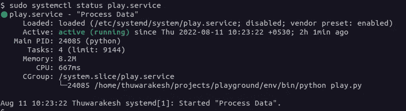

# 如何在 Python 中创建文件系统触发器

> 原文：<https://towardsdatascience.com/python-file-change-trigger-6f8a6c94c13e>

## 如何以编程方式轻松监控文件的创建、修改和删除


照片由 [Pixabay](https://www.pexels.com/photo/multi-colored-folders-piled-up-159519/) 拍摄

假设您使用一个客户端系统，该系统将文件上传到 FTP 文件夹。一旦文件出现在文件夹中，我们就必须对其进行处理，并将其推送到数据库中。

实时仪表板正在访问数据库。因此，我们必须毫不拖延地更新数据库。

您可以运行定期任务并检查文件夹内容。但是让我们假设你更新数据库越快，对用户越好。使用周期性任务时，小延迟的成本很高。随着任务运行得越来越频繁，周期越来越短可能需要更多的资源。

我们需要构建一个文件系统触发器来完成这项任务。

# 监控文件夹中的新文件创建。

我们可以使用 Python 脚本主动监听文件夹中的文件系统事件。

我们可以从安装一个名为 Watchdog 的 Python 包开始。它可以通过 PyPI 存储库获得。

```
pip install watchdog# If you're using Poetry instead of Virtualenv
poetry add watchdog.
```

这里有一个例子。以下 Python 脚本将监视当前目录中的文件更改。它会记录所有发生的变化。

使用 Watchdog 在 Python 中监控文件更改的示例。

上述代码的重要部分是 FileProcessor 类。但是在进入之前，我们应该创建一个 observer 对象来附加一个事件处理程序。

我们可以使用 schedule 方法将事件处理程序附加到观察者。在上面的例子中，我们已经附加了它来监视当前目录及其所有下游目录中的事件。

如果您运行这段代码并在当前目录中创建新文件，我们可以看到 Python 脚本在终端上打印事件。


Python 脚本监听当前文件夹的变化-作者截屏。

我们在 observer 对象的`schedule`方法中使用了当前文件夹。您也可以使用您选择的任何路径。您也可以选择从命令行参数获取它。

下面是对将我们的脚本转换成 CLI 的代码的修改。现在，您可以使用命令行参数将路径传递给 monitor。

现在，您可以在终端中运行脚本，如下所示

```
python <YourScript>.py /somewhare/in/your/computer
```

在我之前的文章中，你可以了解更多关于使用 Python 创建命令行界面的内容。

</a-simplified-guide-to-create-clis-for-your-data-science-project-bf9bcaa26e1>  

# 处理程序类中的文件更改

在我们的例子中，我们通过子类化“FileSystemEventHandler”类创建了一个事件处理程序。所有的事件处理程序都应该这样。

父类有几个文件系统事件方法的占位符。我们使用了“on_create”方法来处理所有新文件的创建。同样，您也可以使用 on_deleted、on_modified、on_moved 和 on_any_event 方法来处理其他类型的事件。

让我们更新 on_create 来处理文件并将值插入数据库。如果与您的用例无关，请随意跳过这一部分。

如果您曾经使用过 Sqlalchemy 和 Pandas，这段代码可能看起来非常熟悉。值得注意的是我们如何获得新创建文件的路径。

“FileSystemEventHandler”类中的每个事件触发器都引用其事件参数中的路径。我们可以用代码中所示的`src-path`标签来访问它。

如果您运行代码并让 Python 脚本监听更改，它也会立即将这些更改推送到数据库。

# 在后台提供您的应用程序。

到目前为止，您已经注意到我们的应用程序运行在一个活动的终端上。但在生产中这样做并不明智。终端会话的任何内容都会影响应用程序。

在后台运行此类服务的最佳方式是通过系统服务。Windows 用户可以使用工具 [NSSM](https://nssm.cc/) (非吸吮服务管理器。)如果您浏览一下他们的文档，这将非常简单。

但是在这篇文章中，我将讲述 Linux 使用 [systemctl](https://www.digitalocean.com/community/tutorials/how-to-use-systemctl-to-manage-systemd-services-and-units) 的方式。

您可以通过在“/etc/systemd/system”文件夹中创建包含以下内容的文件来创建新的系统服务。你可以给它起任何扩展名为'的名字。'服务'

```
[Unit]
Description="Process Data"[Service]
Restart=always
WorkingDirectory=<PATH_TO_PROJECT_DIRECTORY>
ExecStart=<PATH_TO_PYTHON_EXECUTABLE> <YOUR_SCRIPT>.py[Install]
WantedBy=multi-user target
```

完成后，您可以在终端上运行以下命令来激活服务。

```
# To make your new service available to systemctl utility.
$ systemctl daemon-reload # To start the service 
$ systemctl start <YOUR_SERVICE_FILE_NAME>.service
```

这将启动该过程。现在，随着新文件在我们的 FTP 目的地上被创建，该服务将处理它们并将其上传到数据库。我们的实时数据库将毫无延迟地获得新数据。

您可以使用以下命令检查您的服务是否正常运行。

```
systemctl status <YOUR_SERVICE_FILE_NAME>.service
```



Systemctl 运行 Python 脚本——截图由[作者提供。](https://thuwarakesh.medium.com)

# 最后的想法

随着世界向更健壮的系统间集成发展，处理文件系统变化现在已经很少见了。但是这并不意味着文件系统触发器没有用处。

在许多情况下，我们需要监控新文件的创建或修改。以日志流处理为例。您可以使用这里描述的技术来处理新的日志行，并将其推送到数据仓库。

我已经用了很长时间了。我也不认为有必要降低它。

> 感谢阅读，朋友！在[**LinkedIn**](https://www.linkedin.com/in/thuwarakesh/)[**Twitter**](https://twitter.com/Thuwarakesh)[**Medium**](https://thuwarakesh.medium.com/)上跟我打招呼。
> 
> 还不是中等会员？请使用此链接 [**成为会员**](https://thuwarakesh.medium.com/membership) 因为，在没有额外费用的情况下，我赚取了一点佣金。