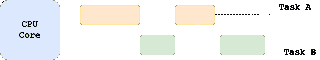

# 什么是 Python 全局解释器锁(GIL)？

> 原文：<https://towardsdatascience.com/python-gil-e63f18a08c65>

## 理解 Python 中全局解释器锁的用途以及它如何影响多线程


由[奥斯曼·拉纳](https://unsplash.com/@osmanrana?utm_source=unsplash&utm_medium=referral&utm_content=creditCopyText)在 [Unsplash](https://unsplash.com/s/photos/lines?utm_source=unsplash&utm_medium=referral&utm_content=creditCopyText) 拍摄的照片

## 介绍

在我最近的一篇文章中，我讨论了编程中的一些基本概念，即*并发性*、*并行性*、*多线程*和*多处理*和[它们如何在 Python](/multithreading-multiprocessing-python-180d0975ab29) 中实现。

在这种情况下最有争议的话题之一，无疑是 Python 的**全局解释器锁**，它本质上保护解释器——在 Python 中——不是线程安全的。

在今天的文章中，我们将重温线程和多处理，并介绍全局解释器锁。此外，我们还将讨论 GIL 带来的限制，以及如何找到解决办法。我们还将讨论一些相关的概念，如线程安全和竞争条件。

## 全局解释器锁

在 **CPython** 中，全局解释器锁(GIL)是一个互斥锁，一次只允许一个线程控制 Python 解释器。换句话说，锁确保在任何给定时间只有一个线程在运行。因此，不可能利用具有线程的多个处理器。

> **GIL** ，是一个互斥体，保护对 Python 对象的访问，防止多个线程同时执行 Python 字节码— [Python Wiki](https://wiki.python.org/moin/GlobalInterpreterLock)

由于 **CPython 的内存管理不是线程安全的**， **GIL** 防止竞争情况，而**确保线程安全**。Python 中的线程共享相同的内存——这意味着当多个线程同时运行时，我们并不知道线程访问共享数据的确切顺序。

## 线程安全和竞争条件

线程安全代码以不干扰其他线程的方式操作共享数据。因此，每次只有一个线程运行，GIL 确保永远不会有**竞争条件**。

为了更好地理解什么是竞争条件，让我们考虑一个线程示例，其中我们有一个名为`x`的共享变量:

```
x = 10
```

现在让我们假设两个线程正在运行，执行下面概述的操作:

```
# Thread 1
x += 10# Thread 2
x *= 5
```

现在，根据线程访问共享变量`x`的顺序，我们可能会得到不同的结果。例如，如果我们假设`Thread 1`首先访问共享变量`x`，结果将是`100`。

```
x += 10  # Thread 1: x = 20
x *= 5   # Thread 2: x = 100
```

或者，如果`Thread 2`先访问`x`，结果会不同:

```
x *= 5   # Thread 2: x = 50
x += 10  # Thread 1: x = 60
```

甚至还有第三种情况，线程 1 和 2 同时读取共享变量。在这种情况下，它们都将读入初始值`x`(等于`10`)，并且根据哪个线程将最后写入其结果，`x`的结果值将是`20`(如果线程 1 最后写入其结果)或`50`(如果第二个线程最后写入其结果)。

这是一个我们称之为**竞争条件**的例子。换句话说，当系统或代码的行为依赖于由不可控事件定义的执行顺序时，就会出现争用情况。

这正是 CPython GIL 所做的。它通过确保在任何给定时间只有一个线程在运行来防止竞争情况。这让一些 Python 程序员的生活变得更加轻松，但同时也带来了限制，因为多核系统不能在线程环境中使用。

## Python 中的线程与多处理

如前所述，Python 进程不能并行运行线程，但它可以在 I/O 绑定操作期间通过上下文切换并发运行线程。请注意，并行性和并发性听起来可能是等价的术语，但实际上它们不是。

下图说明了在使用`[threading](https://docs.python.org/3/library/threading.html)` Python 库时，两个线程是如何执行的以及上下文切换是如何工作的。



Python 中的线程(并发)——来源:作者

现在，如果您想利用多处理器和多核系统的计算能力，您可能需要看看允许进程并行执行的`[multiprocessing](https://docs.python.org/3/library/multiprocessing.html)`包**。当**执行 CPU 受限的任务**时，这通常是有用的。**

****

**Python 中的多处理(并行)—来源:作者**

**多进程旁路全局解释器锁，因为它允许每个进程拥有自己的解释器，从而拥有自己的 GIL。**

**要更全面地了解 Python 中的**多处理和线程**，请务必阅读下面分享的相关文章，该文章本质上是对 Python 中的**并发**和**并行**的深入探究。**

**</multithreading-multiprocessing-python-180d0975ab29> ** 

## **在 Python 中避开 GIL**

**值得一提的是，一些替代的 Python 实现，即 [Jython](https://wiki.python.org/moin/Jython) 和 [IronPython](https://wiki.python.org/moin/IronPython) 没有全局解释器锁，因此它们可以利用多处理器系统。**

**现在回到 CPython，尽管对于许多程序员来说，GIL 的概念非常方便，因为它使事情变得容易得多。此外，开发人员并不真的必须与全局解释器锁交互(甚至接触)，除非他们需要用 C 扩展编写。在这种情况下，当扩展阻塞 I/O 时，您必须释放 GIL，以便进程中的其他线程可以接管并执行。**

**一般来说，GIL 的概念肯定不是理想的，因为在某些情况下，现代多处理器系统不能被充分利用。然而与此同时，许多长时间运行或阻塞的操作正在 GIL 之外**执行。这些操作包括输入输出、图像处理和数字运算。因此，只有在**花费时间在 GIL 内部**的多线程操作中，GIL 才会成为瓶颈。****

**摆脱全局解释器锁是 Python 社区中的一个常见话题。取代 GIL 绝对不是一件容易的事情，因为这些特性和要求都需要满足。**

**然而，Sam Gross 最近提出了一个 CPython 的概念验证实现，它支持多线程，而没有被称为`[nogil](https://github.com/colesbury/nogil/)`的全局解释器锁。这个概念验证实际上演示了如何删除 GIL，从而使 CPyhton 解释器可以随着 CPU 内核的增加而扩展。**

**你可以在`nogil`作者的[这篇文章](https://docs.google.com/document/d/18CXhDb1ygxg-YXNBJNzfzZsDFosB5e6BfnXLlejd9l0)中找到更多细节和潜在问题的答案。即使这可能是一个潜在的解决方案，也不要期望任何改变会很快发生。**

## **最后的想法**

**在今天的文章中，我们讨论了围绕 Python 最有争议的话题之一，即全局解释器锁(又名 GIL)。我们已经看到了它的用途以及它最初被实现的原因，但是此外，我们还讨论了它的存在所带来的限制。此外，我们讨论了线程安全，并通过一个例子演示了什么是竞争条件以及 GIL 如何防止它。**

**最后，我们讨论了通过利用多核系统，最终避开 Python GIL 并实现真正并行的潜在方法。**

**[**成为会员**](https://gmyrianthous.medium.com/membership) **阅读媒体上的每一个故事。你的会员费直接支持我和你看的其他作家。你也可以在媒体上看到所有的故事。****

**<https://gmyrianthous.medium.com/membership> ** 

****你可能也会喜欢****

**</augmented-assignments-python-caa4990811a0> ** **</dynamic-typing-in-python-307f7c22b24e> **