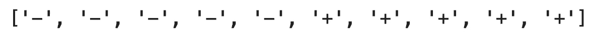
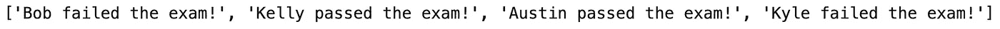

# Python If-Else 语句在一行中-三元运算符解释

> 原文：<https://towardsdatascience.com/python-if-else-statement-in-one-line-ternary-operator-explained-eca2be64b7cc>

## **Python 中的单行条件句？以下是何时使用和何时不使用它们。**


Emile Perron 在 [Unsplash](https://unsplash.com?utm_source=medium&utm_medium=referral) 上的照片

Python 不是最快的编程语言，但是写起来可读性和效率都很好。大家都知道什么是[条件语句](https://docs.python.org/3/tutorial/controlflow.html)，但是你知道你可以用一行 Python 代码写`if`语句吗？事实证明你可以，今天你将会了解到这一切。

读完之后，你会在一行中了解 Python 的 If Else 语句的一切。你会明白什么时候使用它们，什么时候最好避免它们，坚持传统的条件语句。

不想看书？请观看我的视频:

# 正常的 If 语句有什么问题？

完全没有。将条件语句拆分成多行代码已经是多年来的惯例。大多数编程语言要求使用花括号，因此单行的`if`语句不是一个选项。其他语言只允许在一行中编写简单的条件句。

然后是 Python。在深入一行 If Else 语句之前，让我们先简单回顾一下常规条件句。

例如，您可以使用以下语法检查条件是否为真:

```
age = 16if age < 18:
    print('Go home.')
```

在这种情况下，变量`age`小于 18，因此`Go home.`被打印到控制台。您可以通过添加一个`else`条件来增加趣味，如果第一个条件是`False`，就会对该条件进行评估:

```
age = 19if age < 18:
    print('Go home.')
else:
    print('Welcome!')
```

这次`age`大于 18，所以`Welcome!`被打印到控制台。最后，可以添加一个或多个`elif`条件。这些用于捕获中间情况。例如，如果`age`介于 16(包括)和 18(不包括)之间，您可以打印完全不同的内容:

```
age = 17if age < 16:
    print('Go home.')
elif 16 <= age < 18:
    print('Not sure...')
else:
    print('Welcome!')
```

变量`age`为 17，意味着`elif`下的条件为`True`，因此`Not sure...`被打印到控制台。

非常基本的东西，所以我们自然不想花这么多行代码来编写它。事实证明，您可以在 Python 中使用**三元运算符**来计算单行中的条件。

# Python 中的三元运算符

三元运算符存在于一些编程语言中，它允许您缩短简单的 If-Else 块。它接受 3 个或更多操作数:

1.  **真值** —条件评估为`True`时返回的值。
2.  **条件** —如果为真，则返回*值所必须满足的布尔条件。*
3.  **假值** —条件评估为`False`时返回的值。

在代码中，它看起来像这样:

```
a if condition else b
```

甚至可以用 Python 的三元运算符编写 else-if 逻辑。在这种情况下，语法略有变化:

```
a if condition1 else b if condition2 else c
```

我不得不承认——这样写的时候看起来有点抽象。从下一节开始，您将看到大量的实际例子。

# 单行 If 语句(不带 Else)

单行的`if`语句仅仅意味着你删除了新的一行和缩进。您仍然在编写相同的代码，唯一的变化是它只需要一行而不是两行。

**注意**:单行`if`语句只有在条件后面有一行代码的情况下才有可能。在任何其他情况下，将将要执行的代码包装在函数中。

下面是如何将我们的两行`if`语句转换成单行条件语句:

```
age = 17if age < 18: print('Go home.')
```

和以前一样，`age`小于 18，所以`Go home.`被打印出来。

如果你想打印三行而不是一行呢？如前所述，最佳实践是将代码包装在函数中:

```
def print_stuff():
    print('Go home.')
    print('.......')
    print('Now!')

age = 17    

if age < 18: print_stuff()
```

Python 中的单行`if`语句相当无聊。当您添加一个`else`条件时，真正的时间和空间节省优势就出现了。

> 如果您添加一个或多个`else`条件，您将从单行`if`语句中获益最多。

# 单行 If-Else 语句

现在我们可以充分利用 Python 的三元运算符的威力。如果`age`小于 18，下面的代码片段将`Go home.`存储到新变量`outcome`中，否则将`Welcome!`存储到新变量中:

```
age = 19outcome = 'Go home.' if age < 18 else 'Welcome!'
print(outcome)
```

正如您所猜测的，`Welcome!`被打印到控制台，因为`age`被设置为 19。如果你想打印多行或者处理更复杂的逻辑，把你想执行的所有东西都打包到一个函数里——就像以前一样。

现在，您对三元运算符如何在简单的单行 if-else 语句中工作有了清晰的了解。我们可以通过向操作符添加更多的条件来增加复杂性。

# 单行 If-Elif-Else 语句

在单行代码中编写多个条件时，一定要小心。如果这一行有 500 个字符，逻辑仍然有效，但是几乎不可能阅读和维护它。

在一行中包含两个条件应该没问题，因为代码仍然易于阅读。如果`age`小于 16，以下示例将打印`Go home.`，如果`age`介于 16(含)和 18(不含)之间，将打印`Not Sure...`，否则将打印`Welcome`:

```
age = 17outcome = 'Go home.' if age < 16 else 'Not sure...' if 16 <= age < 18 else 'Welcome'
outcome
```

# 示例:列表操作的单行条件

将一些逻辑应用于列表包括将逻辑应用于每个列表项，从而遍历整个列表。在考虑真实世界的例子之前，让我们看看如何在一行代码中为每个列表项编写条件语句。

# 如何在一行中写 IF 和 FOR

您需要对三元运算符进行两处修改:

*   用括号将整行代码括起来`[]`
*   在最后一个`else`后面追加列表迭代代码(`for element in array`

下面是通用语法的样子:

```
[a if condition else b for element in array]
```

这并不难，但让我们用一个例子来说明这一点。下面的代码片段显示了如果范围的当前数字大于 5，则输出`+`，否则输出`-`。数字范围从 1 到 10(包括 1 和 10):

```
['+' if i > 5 else '-' for i in range(1, 11)]
```



图片 Python 中单行的 If 和 For(图片由作者提供)

现在让我们再看一个真实世界的例子。

# 学生通过考试了吗？

首先，我们将宣布一份学生名单。每个学生都是一个 Python 字典对象，有两个键:姓名和考试分数:

```
students = [
    {'name': 'Bob', 'score': 42},
    {'name': 'Kelly', 'score': 58},
    {'name': 'Austin', 'score': 99},
    {'name': 'Kyle', 'score': 31}
]
```

如果分数为 50 分或以上，我们希望打印该学生已通过考试。如果分数低于 50 分，我们希望打印该学生未通过考试。

在传统的 Python 语法中，我们将手动迭代列表中的每个学生，并检查分数是否大于 50:

```
outcomes = []for student in students:
    if student['score'] > 50:
        outcomes.append(f"{student['name']} passed the exam!")
    else:
        outcomes.append(f"{student['name']} failed the exam!")

print(outcomes)
```



图 2-使用传统 Python 语法的列表迭代(图片由作者提供)

代码可以工作，但是我们需要 5 行代码来进行简单的检查并存储结果。您可以使用新获得的知识将代码量减少到一行:

```
outcomes = [f"{student['name']} passed the exam!" if student['score'] > 50 else f"{student['name']} failed the exam!" for student in students]
print(outcomes)
```


图 3-一行条件语句和一个 Python 循环(图片由作者提供)

结果是相同的，但是我们有一个更短更整洁的代码。它只是处于不可读的边界上，这通常是与三元运算符和单行循环的权衡。你通常不能同时拥有可读的代码和简短的 Python 脚本。

> 仅仅因为你能在一行中写一个条件，并不意味着你应该。可读性是优先考虑的。

让我们看看在哪些情况下你更适合传统的`if`陈述。

# 小心单行条件句

代码占用更少的垂直空间并不意味着它更容易阅读。现在你会看到一个完美的例子。

下面的代码片段检查每个可能等级(1–5)的条件，最后一个`else`条件捕获无效输入。这些条件需要编写 12 行代码，但是整个代码片段可读性很强:

```
grade = 1if grade == 1:
    print('Grade = 1')
elif grade == 2:
    print('Grade = 2')
elif grade == 3:
    print('Grade = 3')
elif grade == 4:
    print('Grade = 4')
elif grade == 5:
    print('Grade = 5')
else:
    print('Impossible grade!')
```

正如所料，您将看到`Grade = 1`被打印到控制台，但这不是我们感兴趣的。我们想把上面的代码片段翻译成一行带有三元运算符的 if-else 语句。

这是可能的——但是最终的结果是混乱和不可读的:

```
grade = 1outcome = 'Grade = 1' if grade == 1 else 'Grade = 2' if grade == 2 else 'Grade = 3' if grade == 3 else 'Grade = 4' if grade == 4 else 'Grade = 5' if grade == 5 else 'Impossible grade'
print(outcome)
```

这是一个极端情况的例子，你有多个条件需要评估。最好坚持使用传统的`if`语句，即使它们占用更多的垂直空间。

**带回家点**:拥有两个以上条件的三元运算符简直是编写和调试的噩梦。

# 结论

这就是你需要知道的关于 Python 中单行 if-else 语句的一切。您已经学习了关于三元运算符的所有内容，以及如何编写从单个`if`到中间五个条件的条件。

记住保持你的代码简单。最终，更易于阅读和维护的代码是写得更好的代码。仅仅因为你可以把所有的东西都塞进一行，并不意味着你应该这样做。一旦你需要做出一些改变，你会后悔的。

编写长条件的一种更简洁的方法是使用[结构模式匹配](https://betterdatascience.com/python-structural-pattern-matching/)——这是 Python 3.10 中引入的新特性。它为 Python 带来了受人喜爱的`switch`语句，以获得额外的可读性和开发速度。

*大家怎么看待 Python 中的单行 if-else 语句？你经常使用它们吗？还是你已经转向结构模式匹配了？请在下面的评论区告诉我。*

*喜欢这篇文章吗？成为* [*中等会员*](https://medium.com/@radecicdario/membership) *继续无限制学习。如果你使用下面的链接，我会收到你的一部分会员费，不需要你额外付费。*

[https://medium.com/@radecicdario/membership](https://medium.com/@radecicdario/membership)

# 保持联系

*   注册我的[简讯](https://mailchi.mp/46a3d2989d9b/bdssubscribe)
*   在 YouTube[上订阅](https://www.youtube.com/c/BetterDataScience)
*   在 [LinkedIn](https://www.linkedin.com/in/darioradecic/) 上连接

*原载于 2022 年 1 月 10 日 https://betterdatascience.com**[*。*](https://betterdatascience.com/python-if-else-one-line/)*