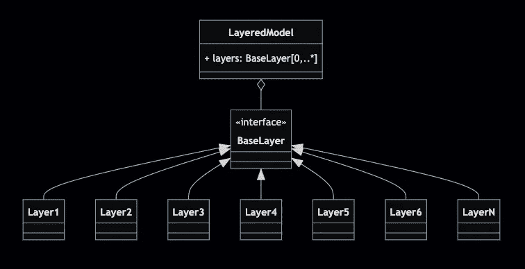
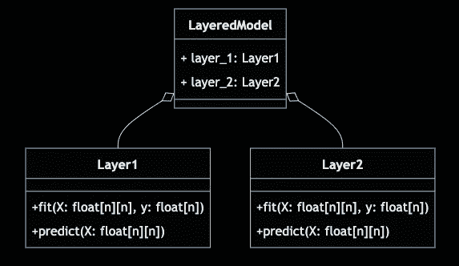

# Python 接口:数据科学家为什么要关心？

> 原文：<https://towardsdatascience.com/python-interfaces-why-should-a-data-scientist-care-2ed7ff80f225>

## 类接口，抽象层，继承，那不是软件开发者的问题吗？作为一名数据科学家，您为什么要关心呢？

图片作者。

接口使得几乎所有我们喜爱的数据科学库成为可能。这是一个足够好的理由，至少对我来说，去关心。但是让我们深入探讨这个问题。在当前故事的上下文中，**接口**是一个**面向对象(OO)** 的概念，用于**定义其他对象的属性和行为**。

当我们要设计一个软件时，界面是很方便的:

*   依赖于尚不存在但将来会存在的对象(例如，插件或用户定义的对象)
*   允许具有相同核心行为但功能和内部逻辑略有不同的可互换对象
*   将核心逻辑与外部依赖项(如数据库或外部 API)隔离开来

这些想法听起来很有前途，但是说实话，它们听起来更像软件开发人员的行话(事实上，是一个面向对象的软件开发人员)。作为一名数据科学家，你为什么要关心呢？

*   我们喜欢的大多数库，如 Keras 或 scikit-learn，都使用接口来定义模型属性。它们中的大多数允许您在模型中编写定制对象。
*   如果你需要用像 sklearn 的 API 那样令人愉悦的 API 来编写你自己的工具，你将需要接口。
*   在 Python 中，一切都是对象，所以了解 OO 的基础知识是必须的。

## 为什么是界面？

思考下面这个问题。我们有两个模型(每一个都是一个类，*层 1* 和*层 2* )，具有*拟合*和*预测*方法。我们还有另一个模型(另一个类， *LayeredModel* )，它将两个*层*模型以某种方式组合在一起。此时，我们测试您的代码，一切正常；是吗？

类图:没有接口的模型组合。图片作者。

虽然 *LayeredModel* 可以工作，但是它有几个弱点:

*   如果你改变了*图层 1* 或*图层 2、*中的某个东西，很可能你也需要改变*图层模型*；这是导致灾难的原因。
*   两个模型， *Layer1* 和 *Layer2* ，行为相同( *fit* 和 *predict* )，但是没有明确的方式陈述这一点。
*   如果我们想添加更多的层会发生什么？
*   如果 *LayerdModel* 使用图层，那让 *LayerdModel* 自己做一个图层不是很有意义吗？这样做将允许构建更复杂的组合。

我们如何解决这样的问题？

进入界面。

我们为模型定义了一个接口(*基础层*)。一个复合模型，如 *LayeredModel，*将依赖于实现该接口的模型。然后，我们对这些层进行编码，使它们都实现(遵守)接口。这样做可以解决我们的大部分问题。

类图:中间有接口依赖的模型组合。图片作者。

唯一缺少的是让*layer model*也实现接口，我们将创建一个简单干净的方法来构建可堆叠模型的管道。

在 Python 中有许多定义和使用接口的方法，它们都有各自的优缺点。在这个故事中，我们将回顾最常见的接口声明方式，并浏览一些示例和常见模式。

## 故事结构

*   声明接口
    -非正式接口
    -抽象基类(ABC)
    -协议
    - zope.interface
    -利弊总结
*   使用 ABC 构建复杂模型
*   使用协议构建复杂模型
*   ABC:部分实施
*   ABC 对协议和多重继承问题
*   最后的话

## 声明接口—非正式接口

在 Python 中定义接口最简单的方法是通过一个常规类；以下示例定义了一个类，用作 sklearn 的 API 样式模型的接口:

您可以看到 *fit* 和 *predict* 方法没有实现，只是用类型(注释)和一个 docstring 描述了它们应该做的事情。

我们将通过继承该接口并覆盖 *fit* 和 *predict* 方法来使用该接口。我们假设从接口继承的所有类都实现了接口:

这种方法有一个严重的缺点；如果我们从接口继承，但是什么都不做(“传递”)，那么子类将有方法，但是它们不会被实现(它们不返回任何东西)。因此，我们不能假设所有的子类都实现了接口。这种行为会给我们的代码带来问题:

解决这个问题的一个方法是定义一个更强的接口，在这个接口中，我们在所有方法中引发一个“NotImplementedError”异常。这样做不允许我们重复相同的继承然后什么都不做(“传递”)的反模式:

这种声明接口的方式(非正式的)有一个很大的缺点；除了在名称中包含 interface 一词之外，没有明确的方法来说明该类是一个接口。记住，我们使用接口是为了让代码更加清晰。另一个缺点是，这些接口类仍然可以像普通类一样被实例化，这并不是很好。

## 声明接口—抽象基类(ABC)

Python 的 ABC(抽象基类)来自 *abc* 模块，解决了非正式接口产生的大部分问题。

为了创建相同的接口，我们创建一个类并从 ABC 继承，然后对未实现的方法使用 *abstractmethod* decorator:

通过这样做，我们实现了:

*   **清晰:**很明显，这不是一个普通的班级；它显然是一个抽象层，应该被继承。
*   **实现约束:**如果我们从接口继承而不实现方法，就会引发错误。
*   实例约束:如果我们试图实例化接口，将会引发一个异常。

实施限制的示例:

正确实施的示例:

使用抽象基类是声明接口的首选方法，但是有一点需要注意。它们太笼统了；ABC 可以用于许多其他事情。当一个 ABC 仅仅是一个接口或者更多的东西时，这一点并不总是清楚的(我们将在随后的部分中对此进行研究)。

## 声明接口—协议

协议是接口领域的新生事物。它首先出现在 PEP 544 for Python 3.8 的类型模块中。这是一种定义接口的隐式方式；然而，它只有在使用类型提示和进行静态类型检查(例如，mypy)时才有帮助。然而，我发现这种声明接口的方式是我个人最喜欢的。无论如何，如果你现在不使用类型提示和静态类型检查，你可能应该这样做。

声明接口的方式与 ABC 非常相似，但是我们从协议继承，并且不使用 *abatractmethod* decorator。

要实现接口，我们只需遵循协议类型:

您可以看到没有任何引用(除了 docstring)表明这个类与接口有某种联系。

这是另一个例子:

这是一个不遵守协议的类的示例:

如您所见，没有实际引用该协议；事实上，你可以问问自己协议这种东西有什么用。

最后，协议的用途来了。

现在让我们定义一些使用模型接口(协议)的代码(带有静态类型信息)，在本例中是一个函数:

然后使用带有 *DummyLayer* 和 *AnotherDummyLayer* 的函数，如果我们进行静态类型检查，一切都是完美的。但是，如果我们使用 *WrongDummyLayer* 作为函数参数，就会出现错误；因为我们声明该函数的参数符合协议，而 *WrongDummyLayer* 不符合协议。

对协议的主要批评是它不符合 Python 的[Zen(PEP 20)](https://peps.python.org/pep-0020/)

> …显式比隐式好…
> 
> Python 的禅

## 声明接口— zope.interface

界面之旅的最后一站是 zope.interface，它是一个第三方库。我没有使用过这种声明接口的方式；然而，出于传统原因，我不得不将它包括在内。从 Python 2 开始就有了。

下面是我们声明接口的方式:

我们从 zope.interface.Interface 继承，到目前为止，一切顺利。我们使用 Zope . interface . implementer decorator 来声明某个类实现了接口:

这里是我发现第一个问题的地方。在这个特例中， *fit* 方法返回类本身的一个实例(“return self”)；目的是像 *fit()那样做链接。预测()*。在前面的例子中，实现者的 *fit* 方法返回的对象类型是接口类型。静态类型检查没有错误。然而，在本例中，有一个错误。我们必须将其修改为:

这听起来不是什么大事，但确实如此。就类型而言，说一个类实现一个接口意味着实现的是与接口相同的类型。所以一般来说，我们想说 *fit* 方法返回一个接口类型的对象。

## 声明接口——利弊总结

**非正式接口**优点:

*   直觉的
*   不需要依赖

**非正式接口**缺点:

*   声明接口时意图不太明确

**ABC** 优点:

*   直觉的
*   强大的功能

**ABC** 缺点:

*   很难说基类只是一个接口还是一个更一般的抽象层，因此是另一种设计模式

**协议**优点:

*   简单的
*   直觉的
*   优雅的

**协议**缺点:

*   隐式(搅乱了 Python 的禅)
*   没有静态类型检查是没有用的

赞成者:

*   非常明确的意图，名字说它“接口”

zope.interface 缺点:

*   第三方依赖性
*   不太擅长类型提示

## 使用 ABC 构建复杂模型

现在我们来看一个使用用 ABCs 声明的接口的实际例子。让我们定义我们的*基础层接口；这个*接口*是*与前面的例子非常相似:

然后，我们构建一个模型，该模型使用遵循*基础层*接口的模型(层)。这个模型*layereddmeanmodel*本身就是一个接口实现者:

然后我们建立两个简单的模型，一个总是预测 0，另一个总是预测 1:

我们使用模型:

注意，我们可以用接口定义做很多事情。我们本可以在*layereddmeanmodel 中使用 N 层；事实上，我们可以使用 *LayeredMeanModels* 作为另一个 *LayeredMeanModel 的层。这就是接口的力量。**

## 使用协议构建复杂模型

现在我们重复上一个例子，但是使用协议。代码非常相似，除了 ABC 继承和 *abstractmethod* decorator。

同样，接口(协议)仍然是隐式的，只有在静态类型检查器中出现类型错误时才会出现。

## ABC:部分实施

当我们谈到用 ABC 声明接口时，我们说我们可以将 ABC 用于比接口更多的地方。ABC 的主要用途之一是用于部分实施。创建一个包含一些抽象方法(未实现)和一些可能使用抽象方法的已实现方法的 ABC 是很常见的。

让我们对这个对话进行编码，我们使用与之前类似的例子，但是现在我们包括了一个 *fit_predict* 方法(已实现)，它使用了 *fit* 和 *predict* 方法(未实现):

因此，当我们从基类继承并实现 *fit* 和 *predict* 方法时， *fit_predict* 方法通过继承变得可用:

这个例子清楚地显示了 ABC 是如何比接口更普遍地被使用的。

## ABC 对协议和多重继承问题

当仅仅使用 ABC 作为接口时，一个潜在的“问题”是多重继承。当我们有两个实现相同接口的对象时:

它们之间非常相似:

除了一些属性(在这种情况下，name 属性)，我们希望避免重复的代码，而是让两个 *LayerZeros* 从第四个类继承 fit 和 predict 方法，在这种情况下，LayerZerosMixin:

我们最终会发现两个分层的人都有多个父母。大多数 OO 开发人员不赞成多重继承；有些人甚至认为它是反模式。这就是为什么许多 OO 语言不允许多重继承。在 Python 中，将单词 Mixin 添加到额外继承类的标题中，可以神奇地解决这个问题。这是面向对象社区中正在进行的辩论。

逻辑层面的问题，问题是多重继承有时会打破继承的规范意义，一个*就是一个*关系。例如，假设我们有雇员和一个收银机来支付他们的工资。假设我们有一个支付员工工资的 *Person* 类和一个 *CashRegister* 类。如果我们做了类似于 *Employee(Person)* 的事情，即 *Employee* 类继承自 *Person* ，那么一切都没问题，因为该雇员是一个人(至少目前是这样)。但是我们可以做一些类似于 *Employee(Person，CashRegister)* 的事情，在 *Employee* 类中包含支付功能。毕竟，报酬决定了就业。这很棘手，因为员工不是收银员。在 Python 和其他支持多重继承的语言中，一种表明*雇员*不是*收银机*的方法是将类名重写为*收银机混合信息*。

正如我所说，这是一场持续的辩论。

## 最后的话

正确的选择是一个偏好的问题。使用 ABC 还是协议由你决定。就个人而言，我对接口使用协议，对部分实现使用 ABCs 这是我自己的规则。

数据科学家的唯一工作是创建 jupyter 笔记本和腌模型的日子已经一去不复返了。很可能你会被期望开发成品而不是模型和情节。这意味着通过数据采集，一直到模型的已部署 API，都要进行编码。换句话说，您需要将您的数据科学技能与软件开发结合起来。在这一点上，接口将使你的生活更容易，你的代码更干净。

我希望这个故事对你有用。如果你想知道更多类似的故事，请订阅。

 [## 每当迭戈·巴尔巴出版时，就收到一封电子邮件。

### 每当迭戈·巴尔巴出版时，就收到一封电子邮件。通过注册，您将创建一个中型帐户，如果您还没有…

medium.com](https://medium.com/subscribe/@diego-barba) 

喜欢这个故事吗？通过我下面的推荐链接成为一个媒体成员来支持我的写作。无限制地访问我的故事和许多其他内容。

 [## 通过我的推荐链接加入 Medium-Diego Barba

### 作为一个媒体会员，你的会员费的一部分会给你阅读的作家，你可以完全接触到每一个故事…

medium.com](https://medium.com/@diego-barba/membership) 

如果我错过了什么，请让我知道。对于任何质疑、批评等。，留言评论。