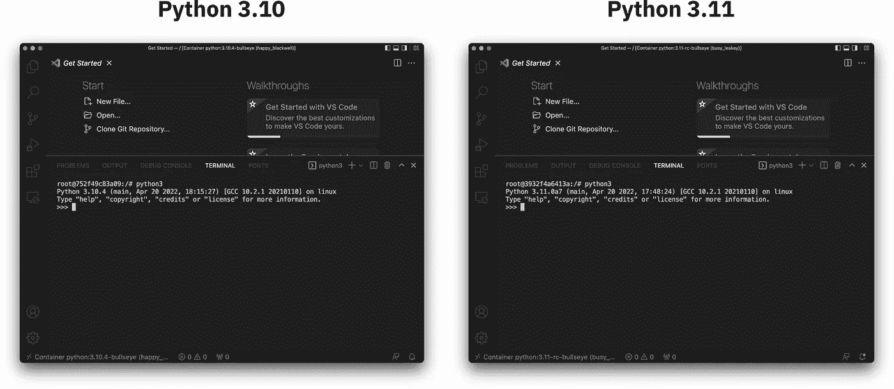
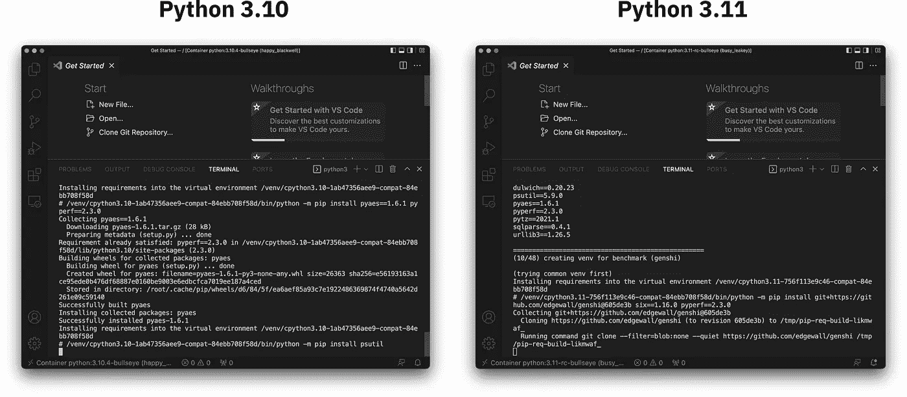
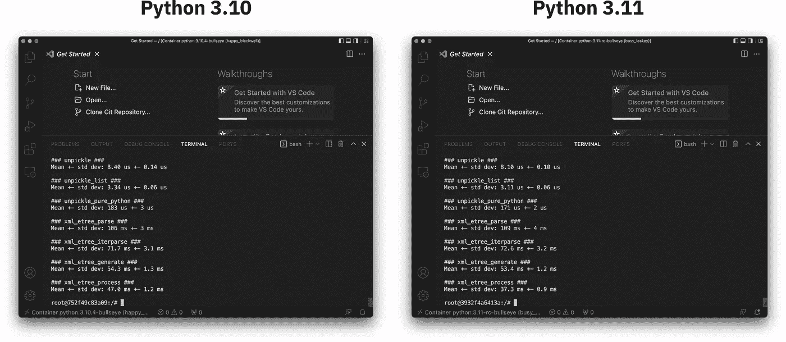
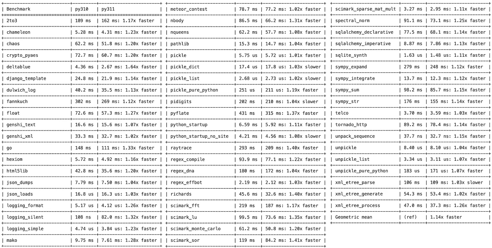

# Python 将快 64%——Python 3.10 与 Python 3.11 基准测试

> 原文：<https://towardsdatascience.com/python-is-about-to-become-64-faster-python-3-10-vs-python-3-11-benchmark-3a6abcc25b90>

## 为 Python 3.11 激动吧——终于到了显著提高性能的时候了


马修·布罗德尔在 Unsplash[上的照片](https://unsplash.com?utm_source=medium&utm_medium=referral)

众所周知，Python 不是最快的编程语言。这种情况即将改变，或者至少会朝着正确的方向发展。最新的 Python 版本——Python 3.11——预计将于 2022 年 10 月发布。更好的是有一个发布候选(RC)版本可供我们使用。

这正是我们今天要做的。我们将在不同的 Docker 容器中安装 Python 3.10 和 3.11，并在一组基准测试中比较它们。我计划使用 [pyperformance 包](https://pyperformance.readthedocs.io/)来完成这项工作，因为它将完成所有繁重的工作。

**TL；DR** —平均来说，Python 3.11 比 Python 3.10 快 14%。在一些基准测试中，新版本稍微慢了一些，但在其他测试中，它的速度提高了 64%。我在配有 10 核 CPU 的 M1 Pro MacBook Pro 16 上运行了基准测试。每个 Python 版本都安装在 Docker 中，Docker 使用了 5 个逻辑 CPU 内核。相对而言，您的里程可能会有所不同，但您应该会看到类似的结果。

不想看书？请观看我的视频:

# 如何在 Docker 中安装 Python 3.11

如果你想跟着做，你需要安装 Docker。它是任何数据科学工具带中的必备工具，因此不应该成为问题。Docker 运行后，打开两个终端标签。

首先，我们将在后台获取并运行 Python 3.10:

```
docker run -t -d python:3.10.4-bullseye
```

在第二个例子中，我们将做同样的事情，但针对 Python 3.11:

```
docker run -t -d python:3.11-rc-bullseye
```

Docker 将需要一些时间来下载和启动这两个图像，这取决于您的硬件配置和互联网速度。完成后，您可以打开两个 Visual Studio 代码窗口，并将它们附加到 Docker 容器(使用 Docker VSCode 扩展，右键单击图像，并选择“附加 Visual Studio 代码”)。或者，您也可以只附加壳。

进入容器后，启动新的 VSCode 集成终端并检查 Python 版本:



图 Visual Studio 代码中附加的 Python 3.10 和 3.11 容器(图片由作者提供)

你可以看到，我左边是 Python 3.10，右边是 Python 3.11。接下来，我们将安装`pyperformance`包并运行基准测试。

# 如何用 PyPerformance 运行 Python 基准测试

好了，我们让两个容器都运行并附加在 VSCode 中。那是困难的部分。

下一步是安装`pyperformance`包。在**的两个**容器中运行以下命令:

```
python3 -m pip install pyperformance
```

安装后，在 Python 3.10 容器附带的 VSCode 窗口中运行以下 shell 命令:

```
pyperformance run -o py310.json
```

并在 Python 3.11 容器中运行类似的命令:

```
pyperformance run -o py311.json
```

这些命令将运行几十个基准测试，所以去喝杯咖啡吧——这需要一些时间。



图 2 —在 Docker 中的 3.10 和 3.11 上运行 Python 基准测试(图片由作者提供)

一旦完成，`pyperformance`会将输出分别保存到`py310.json`和`py311.json`文件中:



图 3 —两个 Python 版本的基准测试都已完成(图片由作者提供)

每个文件都在一个单独的 Docker 容器中，所以为了实际比较这两个文件，您必须将 JSON 文件下载到您的本地机器上(或者将文件从一个容器上传到另一个容器)。

我已经在本地下载了它们，并在 Python 虚拟环境中安装了 pyperformance 包。接下来看看他们怎么比。

# Python 3.10 和 Python 3.11——哪个更快？

最好将两个 JSON 文件放在同一个文件夹中。在终端窗口中打开该文件夹，并运行以下 shell 命令:

```
pyperf compare_to py310.json py311.json --table
```

以下是输出结果:



图 4 — Python 3.10 与 3.11 的基准测试结果(图片由作者提供)

我统计了五次测试，其中 Python 3.10 比 Python 3.11 略快。在其他方面，Python 3.11 比 Python 3.10 快 64%。按照几何平均数，Python 3.11 比 Python 3.10 快 14%。

# Python 3.10 与 Python 3.11 基准对比总结

这就是 Python 3.10 和 Python 3.11 之间的性能比较。值得注意的是，Python 3.11 还没有发布，所以我们将一个完全稳定的版本与一个候选版本进行比较。可能正式发布后两者差距会更大。只有时间能证明一切。

*你对即将到来的 Python 版本有什么看法？看到 Python 跑得更快，你是兴奋，还是根本不在乎？请在下面的评论区告诉我。*

*喜欢这篇文章吗？成为* [*中等会员*](https://medium.com/@radecicdario/membership) *继续无限制学习。如果你使用下面的链接，我会收到你的一部分会员费，不需要你额外付费。*

[](https://medium.com/@radecicdario/membership) [## 通过我的推荐链接加入 Medium-Dario rade ci

### 作为一个媒体会员，你的会员费的一部分会给你阅读的作家，你可以完全接触到每一个故事…

medium.com](https://medium.com/@radecicdario/membership) 

## 推荐阅读

*   [学习数据科学先决条件(数学、统计和编程)的 5 本最佳书籍](https://betterdatascience.com/best-data-science-prerequisite-books/)
*   [2022 年学习数据科学的前 5 本书](https://betterdatascience.com/top-books-to-learn-data-science/)
*   [用 Python 打印列表的 7 种方法](https://betterdatascience.com/python-list-print/)

## 保持联系

*   雇用我作为一名[技术作家](https://betterdatascience.com/contact/)
*   在 YouTube[上订阅](https://www.youtube.com/c/BetterDataScience)
*   在 [LinkedIn](https://www.linkedin.com/in/darioradecic/) 上连接

*原载于 2022 年 4 月 28 日 https://betterdatascience.com*[](https://betterdatascience.com/python-310-vs-python-311/)**。**