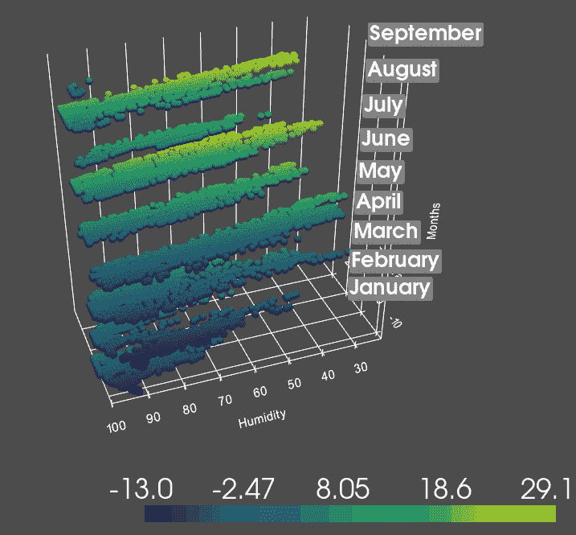
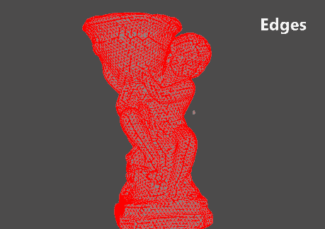
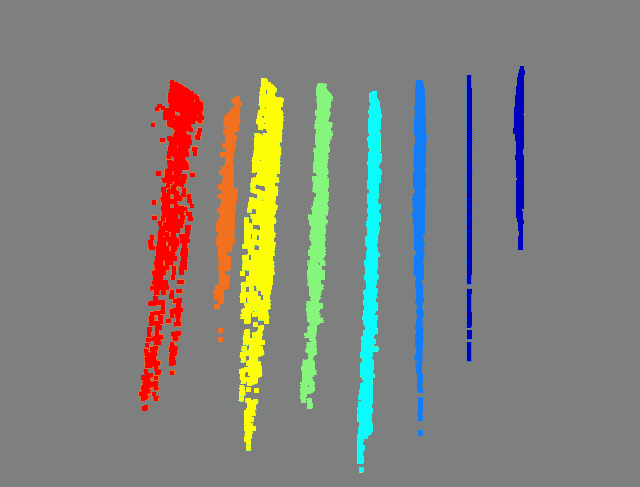
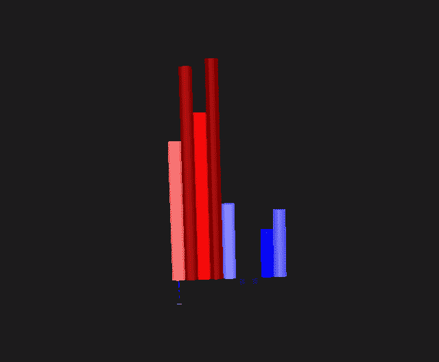
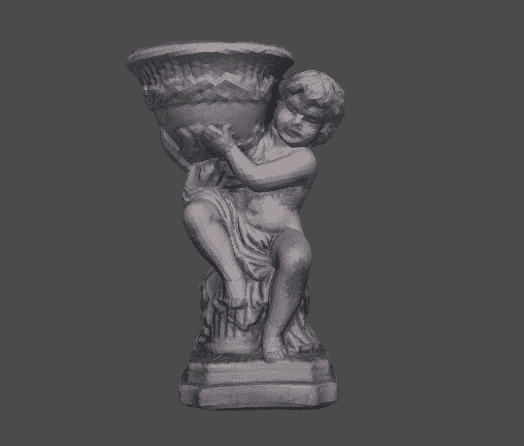
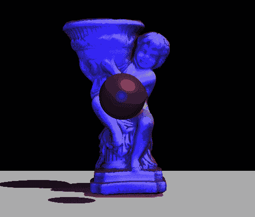
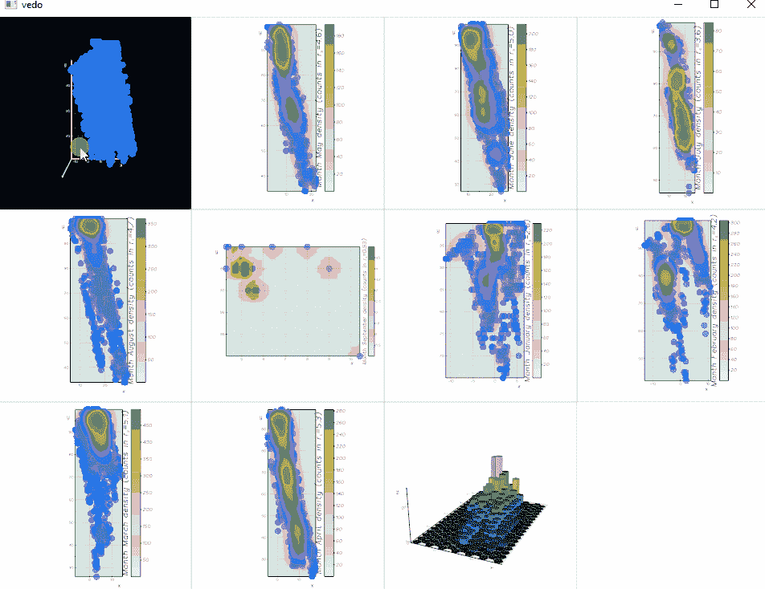

# 用于网格、点云和数据可视化的 Python 库(第 1 部分)

> 原文：<https://towardsdatascience.com/python-libraries-for-mesh-and-point-cloud-visualization-part-1-daa2af36de30>

## 八个最好的 Python 库，用于惊人的 3D 可视化、绘图和动画

> 关于用 Python 创建令人惊叹的 3D 可视化、绘图和动画的最佳库的教程。谁说你需要 C++知识来创建快速响应的点云、网格或数据集可视化？本实践教程将为您提供纲要和代码片段，帮助您启动并运行这 8 个库— [Open3D](http://www.open3d.org/) 、 [Trimesh](https://trimsh.org/index.html) 、 [Vedo](https://vedo.embl.es/) (V3do)、 [Pyrender](https://github.com/mmatl/pyrender) 、 [PlotOptiX](https://plotoptix.rnd.team/) 、 [Polyscope](https://polyscope.run/py/) 、 [PyVista](https://docs.pyvista.org/) 和 [Simple-3dviz](https://simple-3dviz.com/) 。这是第 1 部分，详细介绍了 Open3D、Trimesh、PyVista 和 Vedo(V3do)。


PyVista(左)、Trimesh(中)和 Vedo(右)的输出示例|图片由作者提供

这是针对 3D 工作和可视化的 Python 库的计划教程的第 1 部分。在本部分中，我们将介绍前 4 个可视化库——open 3d、Trimesh、PyVista 和 Vedo，而第 2 部分将重点介绍 Pyrender、PlotOptiX、Polyscope 和 Simple-3dviz。如果您对用于分析和处理网格、点云或数据集的库感兴趣，我还将在后面的文章中介绍广泛使用的任务库，如体素化、特征提取、距离计算、表面生成和网格划分等。在前两篇文章中，我们将主要关注可视化和动画。



作者使用 PyVista | Image 以 3D 方式显示不同月份的天气(温度/湿度)数据

很长一段时间，人们需要使用 Matplotlib 来可视化 Python 中的 3D 内容。使用它的好处是，如果您安装了 Python，那么您很可能拥有使用 Matplotlib 在 3D 中可视化数据所需的一切。坏的方面是它不支持 GPU 硬件加速，这意味着一旦你在 3D 中通过了一定数量的点或面，事情往往会变得缓慢和无反应。这导致许多人使用[点云库](https://pointclouds.org/) ( **PCL** )作为网格和点云可视化和分析的一揽子解决方案。PCL 仍然是最好的 3D 分析库之一，它是用 C++构建的这一事实保证了它的通用性和响应性。两个主要问题阻止了它的完善 Python 包装器只包含主 PCL 库的一小部分功能，在 Windows 上运行它是一项令人沮丧的工作，有大量的编译错误、缺失或损坏的功能，以及不太理想的教程。简而言之——如果你在 Linux 中工作，并且不害怕 C++，那么 PCL 就是你要走的路。但是其他人呢？

近年来，越来越多的 Python 库开始涌现，试图填补这一空白。其中一些库(如 Open3D、Trimesh 和 Vedo)非常健壮，包含许多不同的功能，用于分析、生成和处理网格和点云。其他如 Simple-3dviz、Polyscope 和 Pyrender 则更倾向于创建快速而漂亮的可视化和动画。对于本文，我选择了 8 个库，它们提供了不同级别的可视化和许多附加选项——从内置的手动控件到大量的照明和动画选项以及光线跟踪视觉效果。所有的代码都可以在 GitHub 库[这里](https://github.com/IvanNik17/python-3d-analysis-libraries)获得。下图展示了一些可视化的可能性，以及提取的特征。



一些可能的可视化选项和提取特征的示例。这些是作者用 PyVista | Image 做的

这篇文章远不是所有可用库的详尽列表，值得注意的是，缺少了像 [pyntcloud](https://github.com/daavoo/pyntcloud) 、 [vpython](https://vpython.org/) 、 [Mayavi、](https://docs.enthought.com/mayavi/mayavi/index.html)和其他库所基于的 base [VTK](https://vtk.org/) 这样的库。我选择跳过这些库，因为它们的安装相对复杂，或者因为它们对大型点云和网格的可视化能力不够理想。但是我计划将它们包含在下一篇探索 3D 分析和操作的文章中。

此外，还有 Python 包装库，用于直接通过 Python 使用广为人知的可视化和操作应用程序，如 [CloudCompare](https://www.danielgm.net/cc/) 和 [Meshlab](https://www.meshlab.net/) 。 [CloudComPy](https://github.com/CloudCompare/CloudComPy) 和 [PyMeshLab](https://github.com/cnr-isti-vclab/PyMeshLab) 创建直接连接到 Python 的接口，绕过使用 GUI 甚至打开应用程序的必要性。我们将在后面的文章中更详细地讨论这些包装器库。

让我们直接进入每一个库——研究如何安装它们，进行初始设置，最后编写一些简单的可视化代码。为了展示网格和点云以及数据集的可视化可能性，我提供了两者。首先，一个天使雕像出现在**中。obj** 格式 [**这里**](https://github.com/IvanNik17/python-3d-analysis-libraries/tree/main/mesh) 和点云在**。txt** 格式[此处 。该物体已在许多文章[1]、[2]、[3]中介绍，也可作为大型摄影测量数据集[4]、[5]的一部分下载。第二，在**中包含天气数据的时间序列数据集。csv** 格式](https://github.com/IvanNik17/python-3d-analysis-libraries/tree/main/point_cloud) [**此处**](https://github.com/IvanNik17/python-3d-analysis-libraries/tree/main/dataset) 。气象元数据被用作检测监控录像中长期异常的研究的一部分[6]。这些数据是使用[丹麦气象研究所(DMI)](https://confluence.govcloud.dk/display/FDAPI) 提供的开源 API 提取的，并且[可以在商业和非商业、公共和私人项目中免费使用](https://www.dmi.dk/friedata/guides-til-frie-data/vilkar-for-brug-af-data/)。为了使用数据集，熊猫是必需的。它默认出现在 Anaconda 安装中，可以通过调用`conda install pandas`轻松安装。

# 使用 Open3D 进行可视化


Open3D 结果|作者图片

Python 中发展最快的 3D 处理库之一。它构建于 C++之上，但公开了 C++和 Python 的所有功能，使其快速、灵活且健壮。该库的目标是 3D 处理，就像 OpenCV 是计算机视觉一样——一站式解决方案，包含您需要的一切，并可以轻松连接到其他库。例如 PyTorch 和 Tensorflow，用于通过名为 [Open3D-ML](http://www.open3d.org/docs/release/open3d_ml.html) 的扩展来构建深度学习网络，以处理点云、体素和深度图。

安装非常简单，提供了下载选择器来定制您的安装首选项。该库也可以在 Linux、Mac 和 Windows 上开箱即用，并支持从 3.6 开始的 Python 版本。

如果您正在使用 Anaconda，我们可以首先创建一个新环境`open3d_env`，然后安装 Open3D。在我的例子中，我直接指定我希望在新环境中使用 Python 3.8，但是您可以选择任何支持的版本。

```
conda create -n open3d_env python=3.8
conda activate open3d_env
pip install open3d
```

一旦安装完毕，我们可以通过导入它`import open3d as o3d`并调用`print(o3d.__version__)`来检查一切是否正常。如果没有错误，我们就可以开始了！

Open3d 的 io 模块包含加载网格`o3d.io.read_triangle_mesh`和点云`o3d.io.read_point_cloud`的便捷函数。如果网格有纹理和材质，那么加载它们的更简单的方法是在调用读取网格时通过设置标志`enable_post_processing = True`来启用网格后处理。在我们的例子中，读取天使雕像网格的代码是:

在我们的例子中，我也调用 numpy，因为默认情况下，Open3D 结构不能被查看和打印，但是它们可以很容易地转换成 numpy 数组，如上面的代码所示。可以轻松访问导入网格的所有信息。

为了可视化导入的网格，我们需要首先创建一个`Visualizer()`对象，它将包含所有的 3D 对象、灯光和摄像机，并将监听键盘、鼠标和动画回调。下面的代码设置场景，创建一个窗口，并导入所有的 3D 对象。

我们可以使用`create_window`函数在 visualizer 中创建一个新窗口，它接受名称、宽度、高度以及在屏幕上的位置的输入。然后我们可以通过调用`add_geometry`方法将任何 3D 几何图形添加到可视化工具中。在我们的例子中，我们还通过调用`create_sphere`创建了一个原始对象——围绕天使雕像的球体。我们还可以创建其他基本体，如立方体、圆柱体、圆环体等。我们可以通过调用`compute_vertex_normals()`或`compute_triangle_normals()`来计算特定 3D 对象的法线。最后，我们可以通过直接在对象上调用`translate()`方法来翻译对象。

接下来，我们设置希望在更新周期中运行的任何回调函数。在我们的例子中，我们想要创建一个动画，所以我们调用`register_animation_callback(rotate_around)`，其中 rotate_around 是函数的名称。键盘和鼠标回调也可以做同样的事情。该函数如下所示。

在这个函数中，我们首先通过调用`get_rotation_matrix_from_xyz`为天使网格和球体创建旋转矩阵，并给它每个方向所需的旋转值，用弧度指定。然后，我们在每个网格上调用`rotate`方法，创建 3D 旋转矩阵和一个中心，这是它们将绕其旋转的枢轴。最后，为了能够可视化这些变化，我们为每个网格调用`update_geometry()`方法，并调用`update_renderer()`来更新整个可视化器。完整的代码如下所示。

Open3D 主要针对网格和 3D 点云的分析和操作，但我们也可以在 3D 中可视化多维数据。我们可以通过首先从天气数据集中提取感兴趣的列来证明这一点。出于我们的目的，我们将查看“温度”和“湿度”列。由于数据包含时间戳，我们使用这些时间戳来提取每个天气读数的月份。我们最后将这三列转换成一个 numpy 数组，因为 Open3D 可以将数组转换成点云对象。代码如下。



按月计算的温度和湿度|图片由作者提供

一旦我们有了数据，我们可以通过在 Open3D 中初始化一个点云来可视化它。为了更好地观察这些点，我们也可以通过调用`get_view_control()`来旋转摄像机。下面给出了可视化的代码。

# 使用 Trimesh 进行可视化


Trimesh 结果|作者图片

是一个纯粹基于 Python 的库，用于网格和点云的加载、分析和可视化。它广泛用于在统计分析和机器学习之前对 3D 资产进行预处理。以及像 Cura 这样的 3D 打印应用的一部分。它也是我们将要讨论的其他库的基础，比如 Pyrender 和 Vedo。

Trimesh 在基础库中不包含可视化部分，但使用可选的 [pyglet](http://pyglet.org/) 游戏和交互式应用程序库作为基础。它在其基础上实现了可视化、回调和操作特性，并包含了大量开箱即用的内置可视化交互。它还可以在 Linux、Mac 和 Windows 上运行，没有任何问题或解决方法。它也可以用于 Python 2 和 Python 3。

对于安装，唯一需要的必备库是 numpy。同样，我们使用 Anaconda 环境来创建一个环境，并在其中安装所有东西。同样，我们安装 pyglet 来可视化网格。如果只需要分析和操纵网格，可以跳过最后一行。

```
conda create -n trimesh_env python=3.8
conda activate trimesh_env
conda install numpy
pip install trimeshpip install pyglet
```

一旦所有东西都安装好了，我们就可以通过调用`import trimesh`来检查所有东西是否工作。如果我们想要从 trimesh 获取所有消息到控制台，那么我们需要调用`trimesh.util.attach_to_log()`,在调用 trimesh 函数之后会打印出一个详细的输出。这在调试阶段非常有用。

加载网格是通过调用`trimesh.load()`方法来完成的，带有可选的 file_type 输入，其中可以明确说明具体的网格类型。一旦网格被加载，就可以直接提取很多信息——例如，它是否防水`mesh.is_watertight`，它的凸包`mesh.convex_hull`，体积`mesh.volume`等。如果网格由多个对象组成，可以通过调用`mesh.split()`将它们分割成多个网格。下面给出了加载 3D 网格、创建球体图元和设置场景的代码。

通过调用`trimesh.primitives`，我们可以访问不同的图元，如盒子、胶囊和挤压，以及从点和面的数组构建网格。在我们的例子中，我们创建一个球体并给它一个半径。我们设置了一个包含天使网格和球体的场景。作为场景的一部分，每个节点都是独立的节点。最后，我们显示场景并指定一个名为 rotate_objects 的回调函数。每次场景更新时都会调用该函数。它在下面的代码中给出。

由于 Trimesh 不包含自动更新的转换函数，我们需要`import time`并使用 time.time()来获得一个增量时间变化，我们可以用它来更新旋转。我们首先使用 numpy 创建一个空的齐次变换矩阵来改变球体的位置。我们只需要改变矩阵的平移部分，我们使用的想法是，如果我们使用正弦和余弦函数改变 X 和 Z 位置，我们将实现圆周运动。

我们使用内置函数从 Trimesh `trimesh.tranformations.rotation_matrix()`生成一个旋转矩阵，它使用角度和轴作为输入并返回一个旋转矩阵。我们选择代表网格和球体的节点，方法是根据它们添加到场景中的时间来选择它们。如果我们有多个对象，我们可以根据它们在场景中的名称来获取它们，或者在字典中保存一个引用，指示哪个对象包含哪个节点。我们最后从场景中调用 update 函数，并给它我们想要更新的节点，以及转换矩阵。完整的代码可以在下面看到。

Trimesh 与 Open3D 一样，是针对网格和点云的分析和操作，但其渲染潜力可以用于统计可视化。我们将通过创建一个 3D 柱形图来演示这一点，该柱形图用于可视化气象数据集中每个月的平均“温度”数据。为此，我们首先使用 Pandas 的`groupby`函数计算每月的平均温度，并根据日期-时间列的月频率对数据进行分组。



各月平均气温|图片由作者提供

一旦我们提取了每月的平均温度读数，我们就使用 trimesh 圆柱体对象来表示读数。这种表现形式既有圆柱体的高度，也有从红色到蓝色的颜色梯度，红色代表最高温度，蓝色代表最低温度。为了生成色图，我们使用`trimesh.visual.interpolate()`函数来生成标准化的颜色值。由于 trimesh 中的圆柱体从它们的中心开始缩放，我们也基于平均温度将它们向下移动，因此我们得到底部对齐的柱形图。下面给出了可视化的代码。

# 使用 PyVista 进行可视化



PyVista 结果|作者图片

P [yVista](https://docs.pyvista.org/index.html) 是一个强大的功能齐全的绘图和网格分析库，它建立在可视化工具包(VTK)之上。它简化了 VTK 接口，使得对不同函数的调用更容易、更 pythonic 化。它可以用于点云和网格，它使用 OpenGL，使其易于创建平滑的可视化和动画。该库有大量的示例和教程，从简单的可视化到复杂的分析和转换工具，如切片、重采样、点云表面重建、网格平滑、光线跟踪、体素化等。

该库运行在 Linux、Mac 和 Windows 上，需要 Python 3.7+。因为它是建立在 VTK 之上的，所以它要求至少与 numpy 一起安装。安装非常简单，可以通过 pip 或 Anaconda 完成。对于我们的用例，我们再次创建一个 anaconda 环境，并使用 Anaconda 来安装库。这还会安装所有依赖项。

```
conda create -n pyvista_env python=3.8
conda activate pyvista_env
conda install numpy
conda install -c conda-forge pyvista
```

一旦安装了库，可以通过首先导入它`import pyvista as pv`然后调用`pv.demos.plot_wave()`来测试它。如果带有正弦波的绘图窗口开始，那么库已经成功安装。

通过连接到 [meshio](https://github.com/nschloe/meshio) 可以很容易地导入网格和点云。为了导入它们，我们可以调用`pyvista.read()`，为了加载网格的纹理，我们可以调用`pyvista.read_texture()`。一旦网格被加载，额外的信息可以从中提取，如边，网格质量，顶点之间的距离等。它也可以很容易地重新采样。

这里我们需要提到的重要一点是，如果我们想要使用 PyVista 实现动画或实现键盘、鼠标或 UI 交互的非阻塞可视化，我们需要安装 [pyvistaqt](https://qtdocs.pyvista.org/) ，它用 qt 功能扩展了 PyVista。可以通过调用以下命令轻松安装附加库:

`conda install -c conda-forge pyvistaqt`

完成后，我们可以通过`from pyvistaqt import BackgroundPlotter`导入，使用后台绘图仪结构创建非阻塞图。如果你不需要非阻塞可视化，那么直接调用`pyvista.Plotter`并使用它就足够了。下面给出了加载天使网格和纹理、创建背景绘图仪、旋转球体和光源的代码。

一旦我们创建了`BackgroundPlotter`，我们就可以设置它的大小、背景等。我们改变 camera_position，使其停留在 *xy* 轴。这也可以通过在 X、Y、Z 以及旋转或向上方向上设置一组摄像机位置来实现。我们还设置了相机的剪辑范围，因为有时对象会被缺省值剪辑。我们通过给它一个半径和中心位置来创建一个球体。其他图元也可以用同样的方法创建——圆柱体、箭头、平面、长方体、圆锥体、圆盘等。最后，我们通过调用`pyvista.Light`创建一个点光源，默认是创建一个点光源，但是我们可以隐式地创建平行光、聚光灯等。我们设置灯光的颜色、位置和焦点。接下来，我们将所有这些对象添加到绘图仪，并创建一个回调监听器来更新场景和生成简单的动画。

这里我们需要指明两个要点。使用`add_callback`创建回调时，强烈建议明确指定更新周期的间隔。第二件事是当使用 pyvistaqt 绘图仪时，总是在 show 函数后调用`app.exec_()`，因为这确保了创建的绘图仪窗口不会在一次迭代后关闭。最后，回调`update_scene()`中调用的函数如下所示。

在这里，我们使用 PyVista 提供的简化旋转函数在网格和球体的每个轴`rotate_y`上旋转，同时调用`implace=True`来确保旋转将直接设置到网格。由于灯光不包含直接旋转的方法，我们根据`sphere.center`的位置更新它的位置。最后，我们更新整个绘图仪。PyVista 可视化的完整代码可以在下面看到。

PyVista 致力于 3D 数据的分析和可视化，这使得它成为生成多维和时序数据集可视化的完美库。我们将通过建立在前一章中使用 Open3D 创建的简单可视化来演示这一点。为此，我们从天气数据集中提取相同的列——“温度”和“湿度”,并从日期时间信息中生成“月份”列。完成初始设置后，我们可以直接使用 PyVista 创建 3D 绘图。PyVista 有许多与 2D 绘图库类似的功能，如 matplotlib 和 seaborn，其中的值可以直接用于创建伪彩色，标签可以直接添加到点。下面的代码给出了最初的熊猫操作。


通过 3D 网格和图例按月显示温度和湿度|图片由作者提供

一旦 pandas 数据经过预处理并提取了所需的信息，我们就通过调用`pyvista.add_points`建立一个 3D 点云对象来包含所选的数据集列。该函数也可以直接获取一个`scalars`字段，该字段用于给点着色并创建一个图例。然后，我们设置标签对象，并在每个月的级别上给它们一个位置。我们最后初始化一个 3D 网格，命名轴并创建一个简单的回调函数来旋转摄像机。可视化和回调函数的代码如下所示。

# 使用视频进行可视化



视频结果|作者图片

Vedo(或 V3do)是一个用于科学分析和可视化 3D 对象的 Python 库。它可用于绘制 1d、2d 和 3d 数据、点云、网格以及体积可视化。Vedo 使用 Trimesh 作为一些网格和点云处理、导入/导出和生成的后端，并通过提供大量科学指导的功能来构建它。它可以生成直接导入 Latex 的矢量插图和可视化，并用于生成物理模拟、深度学习层概述以及机械和 CAD 级别的切片和图表。

Vedo 基于 VTK，安装前需要 it 和 numpy 在场。它可以在 Linux、Mac 和 Windows 上运行，并且需要 Python 3.5 及更高版本。对于我们的用例，我们再次创建一个 anaconda 环境，并使用 Anaconda 来安装库。

```
conda create -n vedo_env python=3.8
conda activate vedo_env
conda install numpy
conda install -c conda-forge vedo
```

一旦所有东西都安装好了，我们可以通过调用`import vedo`然后可视化一个原语`vedo.Sphere().show(axis=1).close()`来测试安装。这只是生成一个球体的简写，直接用轴显示，然后设置一旦我们关闭窗口程序就结束。如果我们看到一个旁边有轴的球体，一切都按预期运行。

Vedo 可以在 CLI 界面中直接调用`vedo path_to_your_3D_object`来运行。一旦一个窗口被打开，就有许多键和组合可以被按下以改变可视化，连同鼠标旋转、平移和缩放。最后，通过调用`vedo --convert path_input_3D_object --to path_output_3d_object`或者直接在`--to`后添加需要的文件格式，可以直接调用 Vedo 进行文件格式转换。

使用`vedo.load(path_to_3d_object)`加载网格和点云很简单。如果网格有纹理，需要使用`mesh.texture(path_to_texture)`将其额外加载到创建的 3D 对象中。一旦加载了网格，就可以进行许多快速交互和分析步骤。一个切割工具，通过调用`addCutterTool(your_mesh, mode = "sphere")`，使用“饼干刀”形状切割网格的部分——球体、平面、盒子。另一个是徒手切割，可以使用`FreeHandCutPlotter(your_mesh)`手动分割网格。网格上的其他操作也可以完成——比如通过调用`your_mesh.fillHoles(size=size_to_fill)`来填充孔洞。例如，通过调用`vedo.Sphere`或`vedo.Box`也可以很容易地生成原语。下面给出了加载天使网格和生成图元的代码。

网格的材料，以及它们的属性，如颜色、金属和粗糙度，可以通过调用 3D 对象的`lighting()`方法来设置。有多种预制样式可供选择，包括“默认”、“金属”、“塑料”、“闪亮”、“光滑”，还可以定制。我们还创建了一个盒子作为天使网格停留的表面，并投射阴影，以及一个球体。我们可以通过直接调用`rotate`和`translate`或者调用`x(), y(), z()`方法来移动对象。一旦所有的 3D 对象被创建和定位，我们制作两个灯，并设置绘图仪对象来可视化一切。这方面的代码如下所示。

我们创建了两个点光源——一个白色的，强度较小的作为环境光，另一个强度较大的，蓝色的，随着球体移动。我们在视频设置中设置了我们想要实现的交互性。我们创建一个绘图仪，并通过调用`plotter.addShadows()`指定生成阴影。最后，我们调用 show 方法，以及所有想要显示的 3D 对象和灯光。如果需要生成大量的对象，我们也可以将它们添加为一个列表。我们将交互性设置为 0，就像我使用的视频版本一样，如果不这样做，动画有时会无法运行。最后，由于维多是建立在 VTK 的基础上，它使用了它的事件系统。与 PyVista 的不同之处在于，Vedo 没有在每次更新循环中运行的隐式定时器功能。这就是为什么我们需要通过调用`plt.timerCallback('create', dt=delta_time_for_updating)`首先创建我们的定时器函数。一旦创建完成，我们就可以给这个定时器添加一个回调函数。该函数将在每次调用定时器时运行。请注意，要使回调起作用，需要将“计时器”名称写成如图所示。下面给出了功能`rotate_object`。

在函数中，我们再次使用一种速记方法`rotateY`来旋转天使雕像和球体。在该方法中，我们还可以设置对象旋转的支点。由于灯光不包含旋转方法，我们采用球体的位置，并直接设置灯光位置。我们最后调用`plt.render()`函数，这样渲染器就可以更新了。下面是完整的代码。

像 PyVista 一样，Vedo 是一个专门的库，用于在 3D 中可视化数据和数据集。它扩展了 PyVista 中的许多功能，只需对数据调用函数就可以轻松地创建统计分析可视化。它还有一个更好的添加标签和文本、科学符号甚至 LateX 的实现。Vedo 和 PyVista 也可以利用 VTK，在渲染的基础上创建多个子图和渲染。我们将通过为“温度”和“湿度”数据创建多个子图以及数据密度图，并将它们与直方图可视化相结合来探索这一点。我们准备数据的方式与前面的例子相同——使用 pandas 初始提取列，并创建 month 和 month name 列。代码如下所示。



温度和湿度密度图，以及作者提供的 3D 直方图|图像

数据经过预处理后，可以通过首先调用 Vedo `Plotter`对象并设置将要创建的子图数量来创建可视化。在这里，我们还通过设置`sharecam = 0`来指定每个子图都有一个单独的摄像机。这使得可视化更加沉重，但是每个子图形都可以单独操作。然后对于每个月，我们用 3D 轴创建一个图，我们调用`.density()`函数来计算点密度体积，然后用一个标量条叠加。对于最后一个子图，我们将`vedo.pyplot.histogram`与数据集、可视化模式和轴名称一起调用。下面给出了可视化的代码。

# 结论

W 当我开始写这篇文章时，它被计划为只是一个部分，然后去不同的库分析和操作三维网格和统计数据。我决定将这篇文章分成两部分，这样我可以更好地解释这些库的细节。这一点很重要，因为无论您想做什么——纯粹的结果可视化[1，6],从网格和点云生成 3D 特征[2],或者创建高清渲染[3],了解 Python 中可用于 3D 任务的工具都很重要。天使雕像可以自由地用于可视化和实验，以及大量其他使用 SfM 从[4]和[5]重建的 3D 对象。更多关于天气时间序列数据集的信息可以在[这里](https://www.kaggle.com/datasets/ivannikolov/longterm-thermal-drift-dataset)阅读。

接下来的第 2 部分将关注接下来的 4 个可视化库— [Pyrender](https://github.com/mmatl/pyrender) 、 [PlotOptiX](https://plotoptix.rnd.team/) 、 [Polyscope](https://polyscope.run/py/) 和 [Simple-3dviz](https://simple-3dviz.com/) 。从这些，我们将把重点放在 PlotOptiX 和 Pyrender 上，它们可以产生光线跟踪结果(PlotOptiX)或高度动态的照明场景(Pyrender)。我们还将讨论 Polyscope 和 Simple-3dviz，它们是轻量级、简单易用的 3D 可视化工具，可用于日常使用和科学数据演示。

# **参考文献**

1.  **尼科洛夫，I.** ，&麦德森，C. (2016 年 10 月)。在不同的拍摄条件下，对 motion 3D 重建软件的近距离结构进行基准测试。在*欧洲-地中海会议*(第 15-26 页)。施普林格、湛；【https://doi.org/10.1007/978-3-319-48496-9_2 
2.  **尼科洛夫，I.** ，&麦德森，C. (2020)。粗暴还是吵闹？SfM 重建中噪声估计的度量。*传感器*、 *20* (19)、5725；[https://doi.org/10.3390/s20195725](https://doi.org/10.3390/s20195725)
3.  **尼科洛夫，I. A.** ，&麦德森，C. B. (2019，2 月)。测试 SfM 图像捕获配置的交互式环境。在*第十四届计算机视觉、成像和计算机图形学理论与应用国际联合会议(Visigrapp 2019)* (第 317–322 页)。科学出版社数字图书馆；[https://doi.org/10.5220/0007566703170322](https://doi.org/10.5220/0007566703170322)
4.  **尼科洛夫，我.**；Madsen，C. (2020)，“GGG 基准 SfM:在不同捕获条件下对近距离 SfM 软件性能进行基准测试的数据集”，门德利数据，第 4 版；[https://doi.org/10.17632/bzxk2n78s9.4](https://doi.org/10.17632/bzxk2n78s9.4)
5.  **尼科洛夫一世**；麦德森，C. (2020)，“GGG——粗糙还是嘈杂？SfM 重建中的噪声检测指标”，门德利数据，V2；[https://doi.org/10.17632/xtv5y29xvz.2](https://doi.org/10.17632/xtv5y29xvz.2)
6.  **Nikolov，I.** ，Philipsen，M. P .，Liu，j .，Dueholm，J. V .，Johansen，A. S .，Nasrollahi，k .，& Moeslund，T. B. (2021)。漂移中的季节:研究概念漂移的长期热成像数据集。在*第三十五届神经信息处理系统会议上；*[https://openreview.net/forum?id=LjjqegBNtPi](https://openreview.net/forum?id=LjjqegBNtPi)