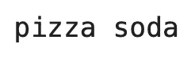
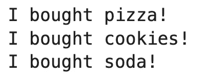
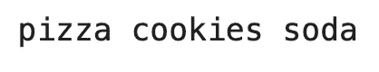
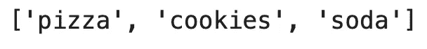
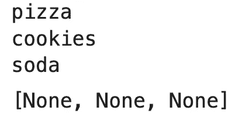
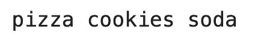
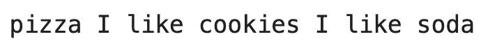
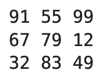

# Python 列表打印——打印列表的 7 种不同方式，你必须知道

> 原文：<https://towardsdatascience.com/python-list-print-7-different-ways-to-print-a-list-you-must-know-9b790fbb24d5>

## **探索用 Python 打印和格式化列表的无限可能性**


阿诺德·弗朗西斯卡在 [Unsplash](https://unsplash.com?utm_source=medium&utm_medium=referral) 上的照片

Python 的列表数据结构是为了简单和灵活而构建的。我们将看看任何人如何利用列表作为自动化和完成乏味任务的重要工具。

我将展示几种不同的用 Python 打印列表的技术。我将介绍使用 Python 内置的`print()`方法打印列表的基础知识，使用循环打印列表，以及一些巧妙的格式化技巧，比如在多行上打印列表。

不想看书？请观看我的视频:

# Python 中的列表是什么？

任何编程语言最重要的特性之一就是定义变量的能力。变量允许程序员存储信息，如数字或文本串，并有效地重用它。这是使计算机成为如此了不起的工具的部分原因；我们可以给它们一些信息，它们可以比人类更容易地记住和操作这些信息。

像变量一样，Python 列表也存储信息。更具体地说，它们储存信息序列。这与您可能熟悉的模拟列表没有什么不同。如果一个人想储存一系列要做的事情，这样他们一整天都会记得，他们可以写一个要做的事情清单。购物清单是另一个例子。

虽然一些编程语言中的数组和列表结构需要学习时髦的语法，并对它们可以保存的数据类型有严格的规则，但 Python 列表没有这些！这使得它们使用起来非常简单，而且同样灵活。现在我们来看看如何定义列表和访问列表中的信息。看看这个:

```
my_list = ['pizza', 'cookies', 'soda']
```

在这里，我定义了一个名为`my_list`的列表，它的元素是字符串，但是列表的元素也可以是数字，比如整数和浮点数，其他列表，或者不同类型的混合。你可能会认为这个列表代表了购物清单上的项目和我想要购买的数量。

如果我想专门访问这些信息，我会使用一种叫做列表索引的技术。使用列表索引，只需将希望访问的元素的编号(从 0 开始)放在列表名称后面的方括号中。例如，如果我想打印`my_list`的第一个和第三个元素，我会使用下面的代码:

```
print(my_list[0], my_list[2])
```

输出:



图 1 —用 Python 打印单个列表元素(图片由作者提供)

请注意我是如何使用索引 0 和 2 来表示第一个和第三个元素的，因为 Python 索引是从 0 开始的。

现在，这肯定是有用的，但你可能想知道这比处理普通变量更有效。毕竟，在上面的例子中，我们必须指定想要单独打印的每个元素。

接下来，我将向您展示如何开始利用 Python 的一些其他内置特性来更高效地访问列表中的信息。

# 使用 For 循环打印 Python 列表

也许访问和操作列表中信息的最直观的方式之一是使用循环的*。这种技术如此直观的原因是，它读起来不像编程，更像书面英语！*

假设你想向朋友描述你购买购物清单上物品的意图。你可能会说这样的话，“对于我购物清单上的每一件商品，我都想购买这个数量”。你可以用 Python 写几乎相同的东西来遍历你的 Python 列表。让我们根据 Python 列表的内容打印一些格式化的字符串！

```
for element in my_list:
    print(f"I bought {element}!")
```

输出:



图 2-在 for 循环中打印 Python 列表(图片由作者提供)

在这里，您可以看到我能够遍历列表中的每个元素，而不必手动指定每个元素。想象一下，如果你的列表有 50，000 个元素，而不是只有 3 个，这会节省多少工作量！

您还可以结合使用 for 循环和内置的 Python `range()`方法来遍历列表:

```
for element in range(len(my_list)):
    print(f"I bought {my_list[element]}!")
```

这里的输出是相同的，但是`element`现在引用的是索引位置，而不是像上一个例子那样引用列表中的实际元素。我们再次使用列表索引来访问由`element`指定位置的元素。

现在，我们有所进展。希望您能看到 Python 为访问存储在列表中的信息序列提供了一些很好的工具。让我们来看看其他一些打印 Python 列表的方法！

# 使用*运算符打印 Python 列表

另一种打印列表所有内容的方法是使用`*`或“splat”操作符。splat 操作符可用于将列表的所有内容传递给函数。例如，内置的 Python 方法`print()`可以在 splat 操作符之前输入列表名称时，逐个元素地打印 Python 列表。

让我们看看这在代码中是什么样子的:

```
print(*my_list)
```

输出:



图 3-使用*运算符打印 Python 列表(图片由作者提供)

就这么简单！

# 用 Print()方法打印列表

如果您想要一种比这更容易使用的技术，您可以简单地将列表的名称传递给`print()`方法本身！您应该注意到，在这种情况下，输出看起来会有点不同。看看你是否能发现不同之处:

```
print(my_list)
```

输出:



图 4-使用 print()方法打印 Python 列表(图片由作者提供)

这种情况下的输出更加“原始”。列表周围仍然有方括号，每个元素周围都有引号。

# 用 map()方法打印一个列表

打印列表元素的另一种方法是使用 Python 内置的`map()`方法。这个方法有两个参数:一个应用于列表中每个元素的函数和一个列表。这里，我们将传递`print`作为应用于每个元素的函数，并将传递`my_list`作为我们的列表。此外，`map()`返回一个 map 对象，所以我们必须将结果转换成一个列表，以便正确打印元素。

```
list(map(print, my_list))
```

输出:



图 5 —使用 map()方法打印列表(图片由作者提供)

可以忽略输出中的`[None, None, None]`。这仅仅是指`print()`方法不返回任何值。它只是打印！

# 用 join()方法打印列表

另一种打印 Python 列表的简便方法是使用`join()`方法。`join()`是一个字符串方法，意味着它必须在字符串上被调用。我们一会儿就会明白这意味着什么。使用这种方法，您可以指定一个分隔符，当列表中的每个元素都被打印出来时，该分隔符将出现在它们之间。如果听起来很复杂，我相信代码片段会让它变得清晰。

```
print(' '.join(my_list))
```

输出:



图 6-使用 join()方法打印 Python 列表(图片由作者提供)

您可以在代码中看到，我们正在使用我们的好朋友`print()`方法来打印列表。不同的是，我们从指定一个字符串开始。在这种情况下，字符串只是一个空格。然后，正如我之前提到的，我们在这个字符串上调用字符串方法`join()`，并在我们的列表中传递它。这有效地连接了我们列表中的每个元素，并用一个空格将它们连接起来。我们打印出这个结果，输出让人想起我们已经看过的一些以前的方法的输出。

# 使用自定义分隔符在单行上打印列表

正如我在上一节中提到的，我们也可以使用`join()`方法打印带有自定义分隔符或分隔符的列表。我们需要对上一个例子中的代码做的唯一改变是改变我们调用`join()`的字符串。我们在第一个例子中使用了空格，但是你可以使用任何字符串！这里，我们将使用字符串`" I like "`(注意开头和结尾的空格)。

```
print(' I like '.join(my_list))
```

输出:



图 7-打印带有自定义分隔符的列表(作者图片)

您可以看到，我们没有用空格连接列表元素，而是用自定义分隔符`" I like "`将它们连接在一起。当您想要创建 CSV 或 TSV(逗号分隔或制表符分隔值)文件时，这很有用。这些是数据科学应用中非常常见的格式。您只需要指定一个`","`或`"\t"`作为您的分隔符字符串。

# 高级:如何在 Python 中垂直打印列表？

在一些高级用例中，您可能有一个列表列表，并且希望垂直打印列表项。用单个列表很容易做到，但用更复杂的数据结构就不那么直观了。

检查以下列表—它包含三个列表，每个列表代表三名学生在测试中的分数(总共 3 次测试):

```
test_scores = [[91, 67, 32], [55, 79, 83], [99, 12, 49]]
```

要获得第一个学生的分数，我们可以使用以下语法访问元素:

```
test_scores[0][0], test_scores[1][0], test_scores[2][0]
```

但是写起来很乏味，而且不可伸缩。相反，我们可以使用两个 for 循环——第一个获取三个列表，第二个获取单个列表项。然后，您可以使用自定义结束字符调用`print()`方法。不要忘记在与第一个循环相同的缩进级别再次调用`print()`方法——否则，所有元素都将打印在同一行:

```
for i in range(len(test_scores)):
    for j in test_scores:
        print(j[i], end=' ')
    print()
```

输出:



图 8-垂直打印 Python 列表(图片由作者提供)

您可以通过使用`zip()`方法进一步简化语法:

```
for t1, t2, t3 in zip(*test_scores):
    print(t1, t2, t3)
```

输出是相同的，但是代码要短得多。

# 结论

我希望通过这些例子，您能更好地理解 Python 提供的访问存储在 Python 列表中的信息的各种方法。这些技术为程序员提供了对格式的大量控制，只需一行代码，您就可以得到想要的结果输出！Python 做了出色的工作，使得这样的任务变得非常简单，有时就像用英语写作一样简单。

请务必继续关注更深入的 Python 教程！

## 推荐阅读

*   [学习数据科学先决条件(数学、统计和编程)的 5 本最佳书籍](https://betterdatascience.com/best-data-science-prerequisite-books/)
*   [2022 年学习数据科学的前 5 本书](https://betterdatascience.com/top-books-to-learn-data-science/)
*   [如何在本地安装阿帕奇气流](https://betterdatascience.com/apache-airflow-install/)

## 保持联系

*   雇用我作为一名技术作家
*   订阅 [YouTube](https://www.youtube.com/c/BetterDataScience)
*   在 [LinkedIn](https://www.linkedin.com/in/darioradecic/) 上连接

*喜欢这篇文章吗？成为* [*中等会员*](https://medium.com/@radecicdario/membership) *继续无限制学习。如果你使用下面的链接，我会收到你的一部分会员费，不需要你额外付费。*

[](https://medium.com/@radecicdario/membership)  

*原载于 2022 年 3 月 21 日 https://betterdatascience.com**的* [*。*](https://betterdatascience.com/python-list-print/)