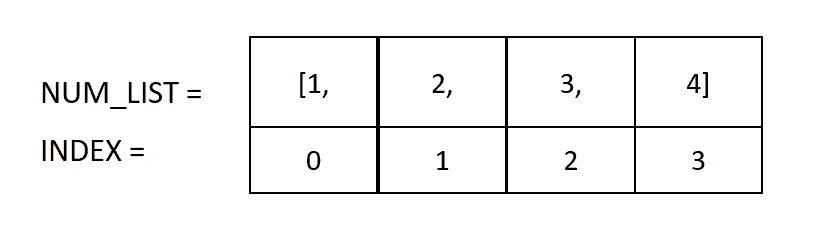
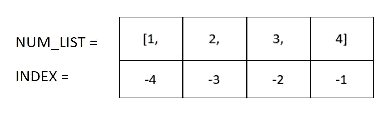
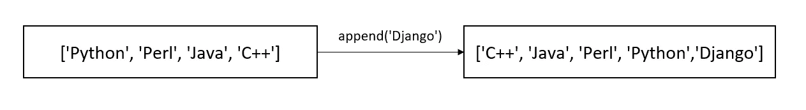
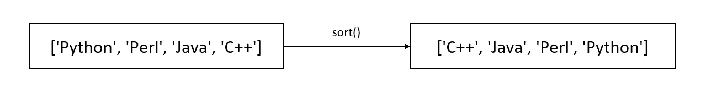
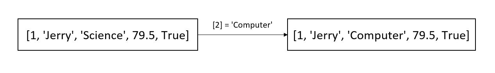
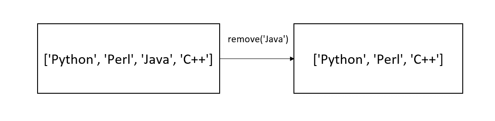
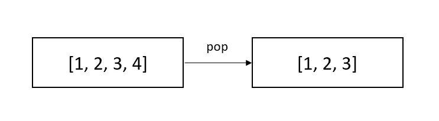
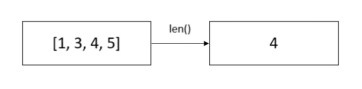
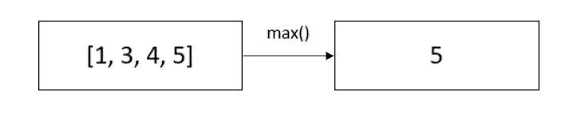

# Python 列出了| 10 个数据操作的必备操作

> 原文：<https://towardsdatascience.com/python-lists-10-must-know-operations-for-data-manipulation-8ee99fb130a2>

Python 列表(作者图片)

Python list 是 Python 中最灵活的内置数据类型之一，因为它可以容纳一组数据类型—字符串、整数、布尔等。这个博客将讨论你需要知道的所有重要的 python 列表概念。

# 列表的属性

Python 列表是有序且可变的。让我们进一步理解这一点:

1.  **有序**:列表中的元素有一个定义好的顺序。新元素被添加到列表的末尾。
2.  **可变**:我们可以修改列表，即添加、删除和改变 python 列表的元素。

# 如何创建 Python 列表？

Python 列表是使用方括号创建的，其中定义了列表的元素。列表中的元素用逗号分隔。使用下面的代码，我们可以创建一个数字列表(num_list)和一个具有整数和字符串变量类型的混合数据类型列表(mix_list)。

我们也可以用两个方括号创建一个列表列表。例如，我们可以使用下面的列表来存储房子的尺寸。

# 列表上的操作

以下是开始使用 python 列表执行数据操作任务时需要了解的 10 个最重要的操作。

## 1.访问列表的元素

我们可以使用索引[0]、[1]等来访问 python 列表的元素。索引从 0 开始，所以列表的第 n 个元素的索引是“n-1”。

要访问一个列表的连续元素，我们可以使用冒号“:”并像这样设置索引的范围[1:5]。输出中不考虑范围内的最后一个索引，因此[1:5]将给出从索引 1 到 4 的元素。

我们可以使用负索引来访问最后一个。索引 1 将给出最后一个元素，索引 2 将给出倒数第二个元素，依此类推。

## 2.向列表中添加(或追加)元素

可以使用 append 和 insert 函数将元素添加(或追加)到 python 列表中。

使用 insert 函数，我们可以在列表的任何位置添加元素。该函数有两个参数:1)我们要插入元素的索引。2)我们想要插入的元素。

append 函数用于将元素添加到列表的末尾。

## 3.排序列表

我们可以对列表中的元素进行升序或降序排序。在下面的代码中，我们按照升序和降序对主题列表进行排序(使用“reverse = True”)。

## 4.更新列表的元素

因为列表是可变的，我们可以使用元素的索引来更新列表的元素。

例如，在下面的代码中，我们使用索引“科学”将“科学”更新为“计算机”。

## 5.删除列表元素

我们可以使用非常直观的 remove 函数轻松删除列表中的元素。

假设，我们想从主题列表中删除‘Java ’,那么我们可以使用 remove 函数删除它，并提供‘Java’作为参数。

## 6.弹出列表的元素

pop 函数用于从列表中移除或弹出最后一个元素，并输出剩余的元素。

## 7 .**。列表中元素的长度/数量**

我们可以使用 length 函数找到列表中元素的总数。

## **8。列表中的最大元素**

使用非常直观的 max 函数，我们可以很容易地找到列表中的最大值。

Max 函数仅适用于同质列表，即包含相同数据类型元素的列表。

## **9。连接列表**

我们可以使用“+”操作符很容易地连接两个列表。(串联相当于追加两个列表)。

## 10。遍历一个列表

我们还可以遍历列表中的元素，这是一个非常有用的操作，在数据分析中经常使用。

> *如果你想学习 python 进行数据科学和分析，那么你可以查看我的 Udemy* [***课程***](https://www.udemy.com/course/python-course-for-data-analysis-numpy-pandas-matplotlib/?referralCode=C8C67D9CADF02A263E24) ***。***

# 谢谢大家！

如果你觉得我的博客有用，那么你可以 [***关注我***](https://anmol3015.medium.com/subscribe) *每当我发表一个故事时，你都可以直接得到通知。*

*如果你自己喜欢体验媒介，可以考虑通过* [***报名成为会员***](https://anmol3015.medium.com/membership) *来支持我和其他几千位作家。它每个月只需要 5 美元，它极大地支持了我们，作家，而且你也有机会通过你的写作赚钱。*