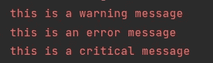
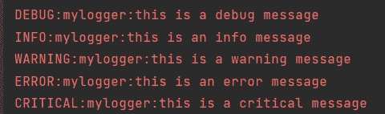
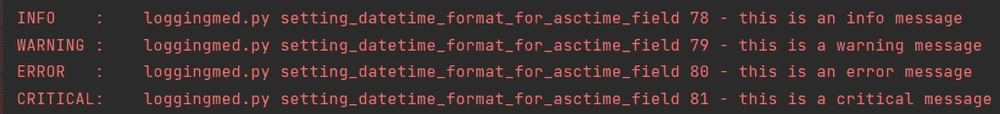
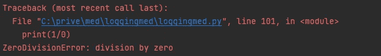

# 绝对初学者的 Python 日志记录

> 原文：<https://towardsdatascience.com/python-logging-for-absolute-beginners-8e89032b1b4c>

## 停止使用 print 语句进行调试，转而使用更高级的语句

一堆漂亮的原木(图片由 Sebastian Pociecha 在 Unsplash 上拍摄)

日志对于理解应用程序中发生了什么是必不可少的。您不仅可以更容易地捕捉错误，调试也变得更快，因为您有一个很好的跟踪线索，可以直接找到问题。

日志不仅使开发和调试变得更加容易，还有许多其他的优势，我们将在本文中讨论。我们来编码吧！

# 但是首先

让我们首先通过将日志与调试 Python 代码最常用的方式进行比较来理解日志:仅仅使用`print()`语句。简而言之:日志记录提供了打印所提供的一切，甚至更多。让我们来看一下为什么日志记录优于打印的主要优点。

## 设置重要性—在调试模式下执行

有 5 种主要的日志记录类型，它们都有不同的重要性级别

1.  调试
2.  信息
3.  警告
4.  错误
5.  批评的

所以你可以用`logger.debug(somevalue)`或`logger.error(somevalue)`来代替`print(somevalue)`。您可以**设置应用程序范围内的日志级别**。这意味着，如果您将日志记录器设置为`warning`级别，它将只处理`warning`日志和以上所有内容，忽略较低的重要性级别，如`logger.debug()`和`logger.info()`语句。

这样做的最大好处是，您可以在调试模式下启动您的应用程序，此时记录器被设置为最低级别(`debug`)。然后，您将看到应用程序中发生的一切，使开发和调试变得更加容易。一旦你的代码准备好生产，你可以设置你的日志记录器到`error`级别，例如，只捕捉严重的日志。

## 附加信息—元数据

日志记录提供了更多信息。假设您记录了一个错误。除了打印错误消息之外，您还可以添加各种元数据，将您直接引向错误:

*   **日期时间**
*   发出日志的文件的**文件名**和**路径**
*   **发出日志的函数名称**
*   **行号**
*   用户定义的**消息**

假设您在大型应用程序中收到一条日志，指出了问题所在。您可以像下面的例子一样记录错误:

有了这些额外的信息，你可以超快的调试和修复你的代码。

## 流式传输和保存日志—将日志记录到文件或 api

除了打印消息之外，你还可以给你的日志添加处理程序，让**把你的每个日志添加到磁盘上的一个文件**中，甚至**把它发送到一个 API** ！

这些功能非常有用。你的应用崩溃了吗？只需阅读日志文件，看看崩溃前发生了什么。

使用 HTTP 处理程序将您的日志发送到一个 API 让您的日志立即到达需要它们的地方。您可以创建一个 API 来监视所有传入的日志(来自各种应用程序),并在需要时通知您。这也是在你的应用上收集用户统计数据的好方法。

 [## 用 5 行代码创建一个快速、自动记录、可维护且易于使用的 Python API

### 非常适合只需要一个完整、有效、快速和安全的 API 的(没有经验的)开发人员

towardsdatascience.com](/create-a-fast-auto-documented-maintainable-and-easy-to-use-python-api-in-5-lines-of-code-with-4e574c00f70e) 

# 实例—代码部分

解释够了，给我看看代码！在这一部分中，我们将重点关注日志记录的基础知识:

*   设置记录器
*   设置日志记录级别
*   确定我们想要记录哪些信息(字段),将日志写入文件

*在* [***这篇文章***](https://mikehuls.medium.com/colored-logs-for-python-2973935a9b02)**中，我们将着重于为日志添加颜色，以便我们可以更容易地分析它们，而在* [***这篇文章***](https://mikehuls.medium.com/python-logging-saving-logs-to-a-file-sending-logs-to-an-api-75ec5964943f) *中，我们将使用处理程序将日志写入文件和 API。**

## *设置记录器*

*这部分不是很难；我们将导入这个包并使用`getLogger`方法获得一个日志记录器。*

**我们也可以使用* `*logging.warning(msg="a message")*` *，这将使用 root logger。最佳实践是使用 getLogger 方法，这样我们的记录器就不会混淆。**

*现在我们可以像这样注销:*

*我的控制台中的输出如下所示:*

**

*记录一些消息(图片由作者提供)*

*您会注意到我们正确地忽略了调试和信息消息。**这是因为默认情况下记录器被设置为** `**warning**` **级别**。让我们解决这个问题。*

## *设置日志记录级别*

*设置日志默认值很简单:*

**

*现在我们所有的日志都被处理了(图片由作者提供)*

*正如您将看到的，它现在将打印出我们所有的日志。此外，我们还会收到一些**更多的信息**:我们会看到日志的**级别名称**和日志记录器的**名称**。这些被称为**字段**。在下一部分中，我们将定制我们的字段以及我们的日志消息的外观。*

*设置 logging.basicConfig 的级别后，您可以使用`logger.setLevel(level=logging.ERROR)`动态设置您的记录器的级别。*

* [## 面向绝对初学者的 Cython:通过简单的两步将代码速度提高 30 倍

### 为速度惊人的应用程序轻松编译 Python 代码

towardsdatascience.com](/cython-for-absolute-beginners-30x-faster-code-in-two-simple-steps-bbb6c10d06ad)* 

## *设置字段*

*在前一部分中，您已经看到了默认情况下记录的两个字段:级别名称和记录器名称。让我们定制:*

*让我们首先检查我们的输出:*

**

*我们的日志现在承载了更多的信息(图片由作者提供)*

*我们没有看到调试消息，因为我们已经将日志级别设置为 INFO。此外，您可以看到我们已经在`logging.basicConfig`中指定了日志字段和日期时间格式。*

*字段是这样指定的`%(THEFIELDNAME)s`。有许多可用字段:*

*Python 日志模块中最常用的可用于日志记录的字段*

**查看更多字段* [*此处*](https://gist.github.com/mike-huls/86763de2233d4cbc2b2a1b84bba19b9c) *。**

*另请注意，我们可以对我们的字段进行一点样式化。使用`%(levelname)-8s`中的`-8`，我们指定它应该是 8 个字符长，如果它比这个长度短，就添加空格。*

## *打印出堆栈跟踪*

*当您的代码出错时，您会看到如下所示的堆栈跟踪:*

**

*堆栈跟踪示例(作者图片)*

*日志模块还允许我们捕捉这个异常并记录下来！这很容易做到:*

*添加`exc_info=True`会将堆栈跟踪放入我们的日志消息中，并为我们提供更多关于导致我们错误的原因的信息。在下面的文章中，我们将看到，我们可以将这个堆栈跟踪写到一个文件中，甚至可以将它发送到一个 API，以便将它存储在一个数据库中，或者对它做任何事情。*

* [## 在 Docker 和 Compose 中使用环境变量和文件的完整指南

### 通过这个简单的教程，保持你的容器的安全性和灵活性

towardsdatascience.com](/a-complete-guide-to-using-environment-variables-and-files-with-docker-and-compose-4549c21dc6af)* 

# *结论*

*在本文中，我们已经介绍了 Python 中日志记录的基础知识，我希望向您展示日志记录相对于打印的所有优势。下一步是添加文件处理程序，这样我们就可以将日志保存到文件中，通过电子邮件或 API 发送。请查看这篇文章。*

*如果你有任何改进这篇文章的建议；请评论！与此同时，请查看我的其他关于各种编程相关主题的文章，比如:*

*   *[面向绝对初学者的 cyt hon——两步代码速度提高 30 倍](https://mikehuls.medium.com/cython-for-absolute-beginners-30x-faster-code-in-two-simple-steps-bbb6c10d06ad)*
*   *[Python 为什么这么慢，如何加速](https://mikehuls.medium.com/why-is-python-so-slow-and-how-to-speed-it-up-485b5a84154e)*
*   *绝对初学者的 Git:借助视频游戏理解 Git*
*   *[在 Python 中使用相对路径的简单技巧](https://mikehuls.medium.com/simple-trick-to-work-with-relative-paths-in-python-c072cdc9acb9)*
*   *[Docker:图像和容器的区别](https://mikehuls.medium.com/docker-for-absolute-beginners-the-difference-between-an-image-and-a-container-7e07d4c0c01d)*
*   *[Docker 对于绝对初学者——什么是 Docker 以及如何使用它(+示例)](https://mikehuls.medium.com/docker-for-absolute-beginners-what-is-docker-and-how-to-use-it-examples-3d3b11efd830)*
*   *[绝对初学者的虚拟环境——什么是虚拟环境，如何创建虚拟环境(+示例](https://mikehuls.medium.com/virtual-environments-for-absolute-beginners-what-is-it-and-how-to-create-one-examples-a48da8982d4b))*
*   *[创建并发布你自己的 Python 包](https://mikehuls.medium.com/create-and-publish-your-own-python-package-ea45bee41cdc)*
*   *[用 FastAPI 用 5 行代码创建一个快速自动记录、可维护且易于使用的 Python API](https://mikehuls.medium.com/create-a-fast-auto-documented-maintainable-and-easy-to-use-python-api-in-5-lines-of-code-with-4e574c00f70e)*

*编码快乐！*

*—迈克*

*附注:喜欢我正在做的事吗？ [*跟我来！*](https://mikehuls.medium.com/membership)*

* [## 通过我的推荐链接加入媒体-迈克·赫斯

### 作为一个媒体会员，你的会员费的一部分会给你阅读的作家，你可以完全接触到每一个故事…

mikehuls.medium.com](https://mikehuls.medium.com/membership)*