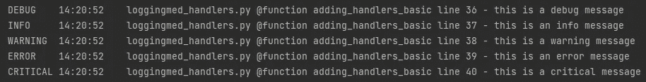
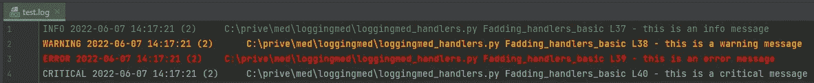

# Python 日志记录——将日志保存到文件中，并将日志发送到 API

> 原文：<https://towardsdatascience.com/python-logging-saving-logs-to-a-file-sending-logs-to-an-api-75ec5964943f>

## 将日志放在调试代码需要的地方

我们将我们的日志发送到需要它们的地方(图片由 [Unsplash](https://unsplash.com/photos/M0ubHuffWmY) 上的 [Dineo Motau](https://unsplash.com/@kingdineo) 提供)

包括登录到您的 Python 应用程序对于了解您的程序做什么和快速调试是必不可少的。它允许您尽可能快速、轻松地解决错误。你的程序可以记录有用的信息，但是当出现问题时*它如何通知你*？我们无法在崩溃的应用程序中读取终端日志！

本文向您展示了使用处理程序保存日志的两种方法。第一种是最简单的；只需**使用 FileHandler 将所有日志写入文件**。第二种方法使用 HttpHandler**将您的日志发送到 HTTP 端点**(类似于 API)。

  

让我们先了解一下日志记录时使用处理程序的概念。如您所知，您可以通过创建一个记录器，然后调用该记录器上的一个日志记录方法来记录消息，如下所示:

当我们在上面的例子中调用`error`方法的`debug`、`info`时，我们的日志记录器必须*处理这些日志记录调用。默认情况下，它只是将消息(带有一些元数据，按照`basicConfig`中的格式指定)打印到控制台。*

在下面的部分中，我们向日志记录器添加了更多的处理程序，它们对日志做其他的事情。对于每个处理程序，我们可以指定级别、字段和格式，如下所示。

  

# 代码示例—实现处理程序

在本文中，我们的目标是为我们的日志记录器添加三个处理程序，每个都有自己的格式:

*   **流处理程序**
    用于打印到控制台。我们想打印所有日志(`debug`及以上)
*   **文件处理器**
    将日志保存在一个文件中。我们希望保存除`debug`日志之外的所有日志
*   **HTTP 处理器**
    通过 HTTP 发送日志(例如发送到一个 API)。我们只想发送`error`和`critical`日志

所有这些记录器都将单独配置；他们将有自己的格式和级别。

  

## 1:设置我们的记录器

首先，我们将创建我们的记录器，简单明了:

请注意，我们不再对`basicConfig`做任何事情。我们用`setLevel`方法设置默认级别，接下来我们将分别为每个处理程序指定格式和级别。

溪流中的一根木头(我几乎讲完了木头笑话)(图片由[扎克·史密斯](https://unsplash.com/@zacksmith)在 [Unsplash](https://unsplash.com/photos/kSxzRXZJrag) 上拍摄)

## 2.添加流处理程序

我们将配置流处理程序，将日志发送到控制台，并打印出来:

注意，我们首先专门为流处理程序创建了一个`Formatter`。然后我们将定义实际的 StreamHandler，指定我们希望输出到 sys.stdout(控制台),然后我们将格式化程序设置为处理程序。然后，我们将处理程序添加到日志记录对象中。

结果是:

我们的控制台输出(图片来自作者)

我们已经成功地将日志打印到了控制台上！查看下面的文章，了解如何在您的控制台上创建**彩色日志:**

  

## 3.添加文件处理程序

这些步骤与流处理程序完全相同。不同之处在于我们指定了另一种格式和不同的级别。

结果:

颜色是由 PyCharm 插件添加的(图片由作者提供)

打开`test.log`文件表明我们不仅仅是写了一个文件，我们还可以清楚地看到日志与 streamHandler 的格式不同。还要注意，我们没有将`debug`日志保存到文件中。就像我们想要的一样。

一旦您使用 filehandler 一段时间，您的日志文件就会变得相当大。查看 [**这篇文章**](https://mikehuls.medium.com/my-logging-file-gets-too-big-python-logging-to-multiple-files-c7fccf97d3a4) 可以解决那个问题。

  

## 4.添加 HTTP 处理程序

这些步骤与上一步没有太大区别:

这几行简短的代码将我们的日志通过 HTTP 发送到一个 URL。

***重要的*** *:然而，这个处理程序有一个主要的缺点:它阻塞线程直到它完成请求。在未来，我将重点关注为非阻塞 HTTP 处理程序实现自定义日志处理程序。**[***关注我***](https://mikehuls.medium.com/membership) *敬请关注！**

* * 

# *结论*

*在本文中，我们已经讨论了流、文件和 HTTP 的处理程序。还有一些我们没有处理的，比如套接字处理程序和 SMTP 处理程序。因为这篇文章已经很长了，我还没有在这篇文章中涉及到这些，但也许在未来的文章中会涉及到，所以请一定要关注我。*

*我希望一切都像我希望的那样清楚，但如果不是这样，请让我知道我能做些什么来进一步澄清。同时，看看我的其他关于各种编程相关主题的文章，比如:*

*   *[面向绝对初学者的 cyt hon——两步代码速度提高 30 倍](https://mikehuls.medium.com/cython-for-absolute-beginners-30x-faster-code-in-two-simple-steps-bbb6c10d06ad)*
*   *[Python 为什么这么慢，如何加速](https://mikehuls.medium.com/why-is-python-so-slow-and-how-to-speed-it-up-485b5a84154e)*
*   *[Git 绝对初学者:借助视频游戏理解 Git](https://mikehuls.medium.com/git-for-absolute-beginners-understanding-git-with-the-help-of-a-video-game-88826054459a)*
*   *[在 Python 中使用相对路径的简单技巧](https://mikehuls.medium.com/simple-trick-to-work-with-relative-paths-in-python-c072cdc9acb9)*
*   *面向绝对初学者的 Docker:图像和容器的区别*
*   *[Docker(面向绝对初学者)——Docker 是什么以及如何使用(+示例)](https://mikehuls.medium.com/docker-for-absolute-beginners-what-is-docker-and-how-to-use-it-examples-3d3b11efd830)*
*   *[绝对初学者的虚拟环境——什么是虚拟环境，如何创建虚拟环境(+示例](https://mikehuls.medium.com/virtual-environments-for-absolute-beginners-what-is-it-and-how-to-create-one-examples-a48da8982d4b))*
*   *[创建并发布自己的 Python 包](https://mikehuls.medium.com/create-and-publish-your-own-python-package-ea45bee41cdc)*
*   *[用 FastAPI 用 5 行代码创建一个快速自动记录、可维护且易于使用的 Python API](https://mikehuls.medium.com/create-a-fast-auto-documented-maintainable-and-easy-to-use-python-api-in-5-lines-of-code-with-4e574c00f70e)*

*编码快乐！*

*—迈克*

**又及:喜欢我正在做的事吗？* [*跟我来！*](https://mikehuls.medium.com/membership)*

* *