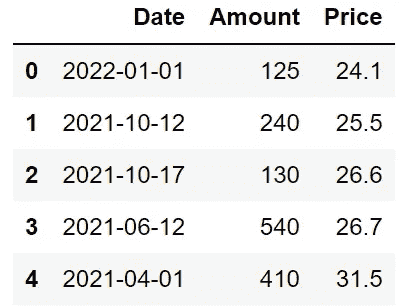

# Python Pandas 让您完全控制时间戳

> 原文：<https://towardsdatascience.com/python-pandas-gives-you-full-control-over-timestamps-10fe26c96a9e>

## 从几年到几纳秒。


照片由[洪林肖](https://unsplash.com/@mshaw_1234?utm_source=unsplash&utm_medium=referral&utm_content=creditCopyText)在 [Unsplash](https://unsplash.com/s/photos/cockpit?utm_source=unsplash&utm_medium=referral&utm_content=creditCopyText)

Pandas 是使用最广泛的数据分析和操作库之一。我已经广泛使用 Pandas 大约 3 年了，我可以告诉你，我使用它进行数据操作的次数比使用它进行数据分析的次数多得多。

我很确定对于大多数数据科学家来说都是一样的。原因是现实生活中的数据集或原始数据通常不是适合数据分析和建模的格式。因此，它需要大量的清洁、操作和预处理。

我使用 Pandas 三年来的经验是，它提供了灵活有效的方法来解决数据操作任务。在本文中，我将尝试展示操纵熊猫时间戳是多么容易。

> 如果你想在我发表新文章时收到电子邮件，别忘了订阅。

# 时间戳

Timestamp 相当于 Python 的 Datetime，在大多数情况下可以互换。时间戳可以用来表示特定日期的日期或时间。它们可以下降到纳秒级。以下是一些时间戳示例:

```
import pandas as pd# Date
pd.Timestamp("2021-10-05")# output
Timestamp('2021-10-05 00:00:00')# Date, hour, minute
pd.Timestamp("2021-10-05 15:40")# output
Timestamp('2021-10-05 15:40:00')
```

我们还可以通过使用整数指定组件来创建时间戳。

```
# Date, hour, minute
pd.Timestamp(year=2021, month=10, day=5, hour=15, minute=40)# output
Timestamp('2021-10-05 15:40:00')
```

我们刚刚看到了如何创建一个时间戳。然而，我们几乎总是处理大型数据集，而不是单一的信息。幸运的是，Pandas 提供了几个函数和方法来对数据帧执行矢量化操作。

让我们首先创建一个示例 DataFrame，它包含一个日期列和一些其他列。

```
df = pd.DataFrame({
    "Date" : pd.Series(["2022-01-01","2021-10-12",
                        "2021-10-17","2021-06-12",
                        "2021-04-01"], 
                        dtype="datetime64[ns]"),
    "Amount": [125, 240, 130, 540, 410],
    "Price": [24.1, 25.5, 26.6, 26.7, 31.5]
})
```



df(作者图片)

用于包含日期和时间信息的列的数据类型是`datetime64[ns]`。

```
df.dtypes# output
Date      datetime64[ns]
Amount             int64
Price            float64
dtype: object
```

日期列中的每个值都是一个时间戳。

```
type(df["Date"][0])# output
pandas._libs.tslibs.timestamps.Timestamp
```

# 日期偏移

我们可以使用两个函数来操作包含日期和时间值的列。第一个是`DateOffset`。

让我们在数据框的日期列中添加 2 个月。

```
df["Date"] + pd.DateOffset(months=2)# output
0   2022-03-01
1   2021-12-12
2   2021-12-17
3   2021-08-12
4   2021-06-01
Name: Date, dtype: datetime64[ns]
```

日期列中的每个值都加上 2 个月。

虽然日期列中的值只显示日期而不显示任何时间信息，但是我们可以添加时间间隔，如小时、分钟等。

```
df["Date"] + pd.DateOffset(hours=5)# output
0   2022-01-01 05:00:00
1   2021-10-12 05:00:00
2   2021-10-17 05:00:00
3   2021-06-12 05:00:00
4   2021-04-01 05:00:00
Name: Date, dtype: datetime64[ns]
```

为了做减法，我们可以将加号改为减号，或者在函数中使用一个负数。

```
df["Date"] - pd.DateOffset(years=1)
df["Date"] + pd.DateOffset(years=-1)# output
0   2021-01-01
1   2020-10-12
2   2020-10-17
3   2020-06-12
4   2020-04-01
Name: Date, dtype: datetime64[ns]
```

我们也可以使用浮点数来指定要加或减的值。例如，以下代码行将 1.5 天添加到日期列中。

```
df["Date"] + pd.DateOffset(days=1.5)# output
0   2022-01-02 12:00:00
1   2021-10-13 12:00:00
2   2021-10-18 12:00:00
3   2021-06-13 12:00:00
4   2021-04-02 12:00:00
Name: Date, dtype: datetime64[ns]
```

要加或减的值可以通过使用不同单位的组合来指定。以下代码行添加了 1 个月 1 天 2 小时的间隔。

```
df["Date"] + pd.DateOffset(months=1, days=1, hours=2)# output
0   2022-02-02 02:00:00
1   2021-11-13 02:00:00
2   2021-11-18 02:00:00
3   2021-07-13 02:00:00
4   2021-05-02 02:00:00
Name: Date, dtype: datetime64[ns]
```

`DateOffset`功能支持以下单元:

*   `years`
*   `months`
*   `weeks`
*   `days`
*   `hours`
*   `minutes`
*   `seconds`
*   `microseconds`
*   `nanoseconds`

# 时间增量

我们可以用来操作日期和时间的另一个函数是`Timedelta`。逻辑与`DateOffset`功能相同，但语法不同。

> `Timedelta`功能不再支持`year`和`month`单元，但我们可以将它用于其他几个单元，如`week`、`day`、`hour`等。

让我们做一些例子来演示如何使用这个函数。以下代码行将 2 周添加到日期列中。

```
df["Date"] + pd.Timedelta(value=2, unit="W")# output
0   2022-01-15
1   2021-10-26
2   2021-10-31
3   2021-06-26
4   2021-04-15
Name: Date, dtype: datetime64[ns]
```

分别使用`value`和`unit`参数分别定义数量和单位。支持以下单位:

*   `W`:周
*   `D`:日
*   `H`:小时
*   `T`:分钟
*   `S`:秒
*   `L`:毫秒
*   `U`:微秒
*   `N`:纳秒

我们也可以使用小写字母，如 w 代表星期，h 代表小时，等等。

我们可以用减号代替正号，或者在函数中用负数来减去一个值。

```
df["Date"] + pd.Timedelta(value=-5, unit="d")# output
0   2021-12-27
1   2021-10-07
2   2021-10-12
3   2021-06-07
4   2021-03-27
Name: Date, dtype: datetime64[ns]
```

`Timedelta`函数也接受字符串来定义要增加或减少的持续时间。我们只需要确保正确地写出单位。例如，以下代码行将 6 周添加到日期列中。

```
df["Date"] + pd.Timedelta("6 W")# output
0   2022-02-12
1   2021-11-23
2   2021-11-28
3   2021-07-24
4   2021-05-13
Name: Date, dtype: datetime64[ns]
```

使用字符串的一个好处是我们可以用多个单位来定义持续时间。以下是添加 3 周 4 天 2 小时的示例。

```
df["Date"] + pd.Timedelta("3 W 4 D 2 H")# output
0   2022-01-26 02:00:00
1   2021-11-06 02:00:00
2   2021-11-11 02:00:00
3   2021-07-07 02:00:00
4   2021-04-26 02:00:00
Name: Date, dtype: datetime64[ns]
```

顺序无关紧要，因此下面的代码行执行与上面相同的操作。

```
df["Date"] + pd.Timedelta("4 D 3 W 2 H")
```

与其他数据类型一样，Pandas 能够操作和处理时间戳。它提供了高度灵活和高效的方法，加快了典型数据清理和处理工作流中的任务。

如果你想在我发表新文章时收到电子邮件，别忘了订阅。

*你可以成为* [*媒介会员*](https://sonery.medium.com/membership) *解锁我的全部写作权限，外加其余媒介。如果您使用以下链接，我将收取您的一部分会员费，无需您支付额外费用。*

[](https://sonery.medium.com/membership) [## 通过我的推荐链接加入 Medium-Soner yl DRM

### 作为一个媒体会员，你的会员费的一部分会给你阅读的作家，你可以完全接触到每一个故事…

sonery.medium.com](https://sonery.medium.com/membership) 

感谢您的阅读。如果您有任何反馈，请告诉我。