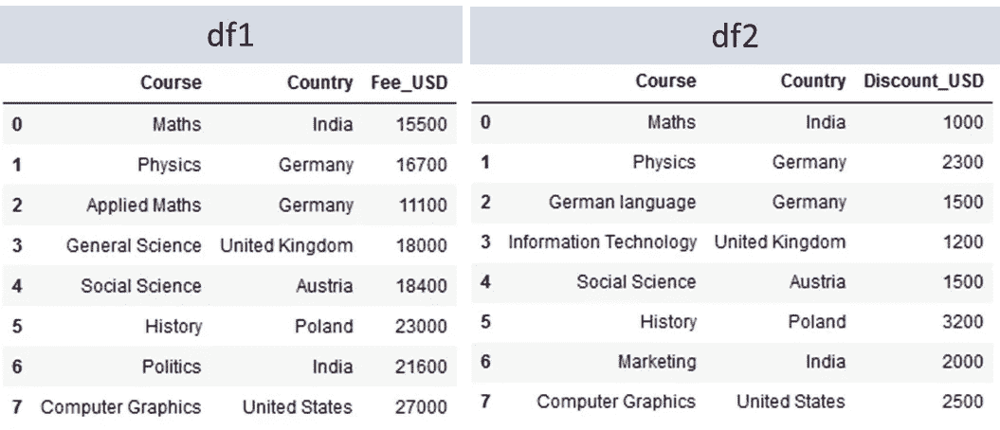
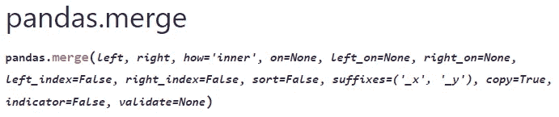
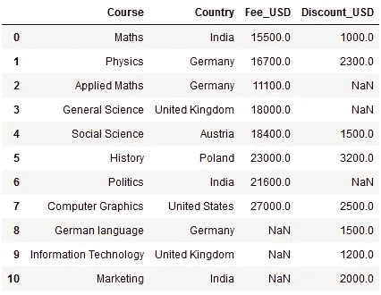
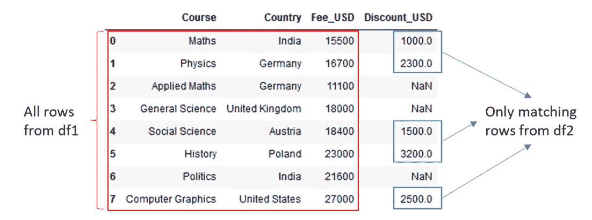
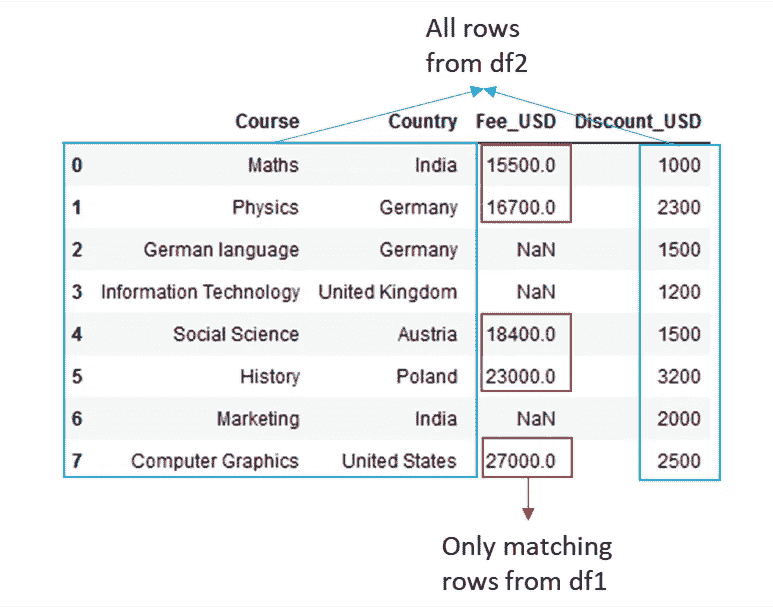
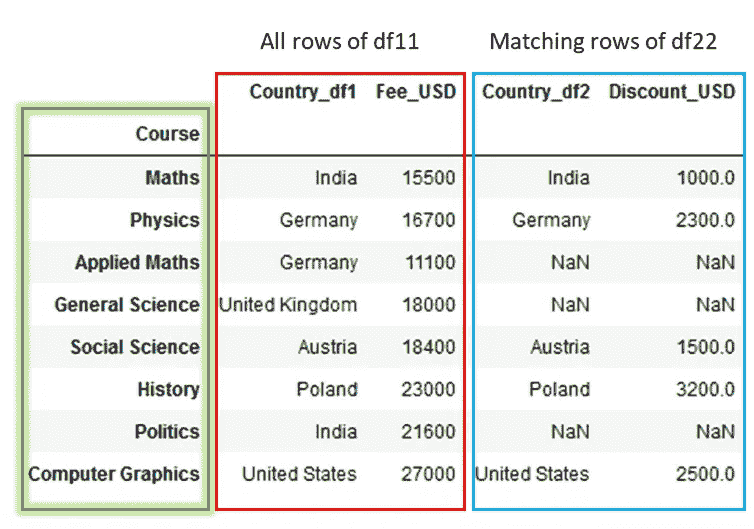
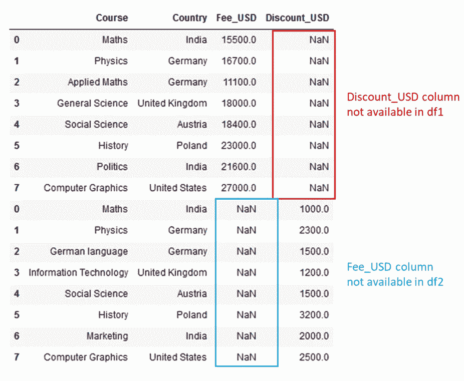
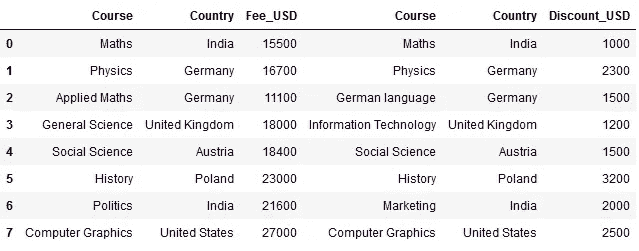
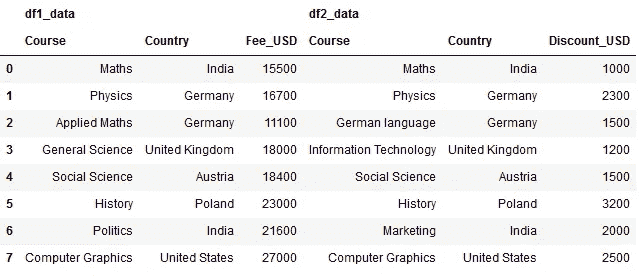

# Python 熊猫把戏:连接数据集的 3 种最佳方法

> 原文：<https://towardsdatascience.com/python-pandas-tricks-3-best-methods-4a909843f5bc>

## 计算机编程语言

## Python 大师的 merge、concat、join 在你的咖啡时间！


照片由 [Duy Pham](https://unsplash.com/@miinyuii?utm_source=medium&utm_medium=referral) 在 [Unsplash](https://unsplash.com?utm_source=medium&utm_medium=referral) 上拍摄

**Python 是数据分析的最佳工具包！**🔋

数据分析任务所需的数据通常来自多个来源。因此，学习整合这些数据的方法非常重要。

在本文中，我列出了使用 Python pandas 方法组合多个数据集的三种最佳且最省时的方法。

```
**merge()**: To combine the datasets on common column or index or both.
**concat()**: To combine the datasets across rows or columns.
**join()**: To combine the datasets on key column or index.
```

我把这篇文章写得很短，这样您就可以边喝咖啡边完成它，掌握最有用、最省时的 Python 技巧。

您可以使用下面的索引快速导航到您最喜欢的技巧。

```
**·** [**merge()**](#1d6f) **·** [**join()**](#2a17) **·** [**concat()**](#a00b)
```

> *🚩*注意:我将使用我为练习创建的[虚拟课程数据集](https://github.com/17rsuraj/data-curious/blob/master/TowardsDataScience/Dummy_course_data.xlsx)。它可以在 [Github](https://github.com/17rsuraj/data-curious/blob/master/TowardsDataScience/Dummy_course_data.xlsx) 上找到供您使用。我在整篇文章中使用熊猫。

好了，我们开始吧…🚀

在开始之前，让我们使用下面的代码在 dataframes 中获取两个数据集— ***df1*** ( *表示课程费用*)和 ***df2*** ( *表示课程折扣*)。

```
import pandas as pd
df1 = pd.read_excel("Dummy_course_data.xlsx",
                    sheet_name="Fees")
df2 = pd.read_excel("Dummy_course_data.xlsx",
                    sheet_name="Discounts")
```



示例数据集|按作者分类的图像

这些是简单的 7 x 3 数据集，包含所有虚拟数据。

让我们使用 pandas 来探索结合这两个数据集的最佳方式。

# `merge`

`pandas.merge()`以数据库方式合并两个数据集，即数据帧在公共列或索引上连接🚦

如果数据集与列上的列组合，DataFrame 索引将被忽略。

要使用`***merge()***`，你至少需要提供下面两个参数。

```
1\. Left DataFrame
2\. Right DataFrame
```

例如，组合上述两个数据集，而不提及任何其他内容，例如，我们希望在哪些列上组合这两个数据集。

```
**pd.merge(df1,df2)**
```


熊猫`merge` 默认设置|作者图片

`pd.merge()`自动检测两个数据集之间的公共列，并在该列上组合它们。

在这种情况下,`pd.merge()`使用默认设置并返回一个最终数据集，该数据集只包含两个数据集的公共行。因此，这会导致内部连接。

这可能是合并两个数据集的最简单的方法。

然而，`**merge()**`是定义合并行为的最灵活的选项。



熊猫合并选项列表|作者图片

虽然这个列表看起来很令人生畏，但是通过练习，你会掌握合并各种数据集。

目前，需要记住的重要选项是`**how**`，它定义了进行何种合并。此选项的其他可能值有— `‘outer’` 、`‘left’`、`‘right’`。

让我告诉你这是如何工作的。♻️

> **how = 'outer'**

```
pd.merge(df1, df2, how='outer')
```



`pandas merge`外部连接|作者图片

这个`‘outer’`连接类似于 SQL 中的连接。它从两个数据集中返回匹配的行和不匹配的行。

一些单元格用`**NaN**`填充，因为这些列在两个数据集中没有匹配的记录。例如，对于课程*德语*、*信息技术*、*市场营销*，在 *df1* 中没有*费用 _ 美元*值。因此，在合并后， *Fee_USD* 列将被这些课程的`NaN`填充。

由于第二个数据集 df2 与 df1 在列 Course 和 Country 上有 3 行不同，合并后的最终输出包含 10 行。即 *df1* 的 *7 行*加上 *df2 的 *3 行*。*

✔️:在数据科学工作面试中经常会有这样的问题— *将数据集与外部连接组合后，输出中总共有多少行。上面提到的这一点可能是这个问题的最佳答案。*

> **怎么= '左'**

```
pd.merge(df1, df2, how='left')
```



熊猫`merge` 左加入|图片作者

根据定义，left join 返回左侧数据帧中的所有行，并且只返回右侧数据帧中的匹配行。

这里发生了完全相同的情况，对于在 *Discount_USD* 列中没有任何值的行，`NaN`被替换。

现在让我们看看使用`right`连接的完全相反的结果。

> **how = '右'**

```
pd.merge(df1, df2, how='right')
```



熊猫`merge` 右加入|作者图片

右连接返回右数据帧即 *df2* 的所有行，并且只返回左数据帧即 *df1* 的匹配行

使用`how = ‘left’`也可以得到相同的结果。你需要做的只是将`pd.merge()`中提到的数据帧的顺序从`df1, df2`改为`df2, df1`。

最终输出中各列的✔️ ️The 顺序将根据您在`pd.merge()`中提到数据帧的顺序而改变

> **左 _ 开**和**右 _ 开**

如果您想要合并两个具有不同列名的数据集，即列本身具有相似的值，但两个数据集中的列名不同，则必须使用此选项。

您可以在`left_on`中提及左侧数据集的列名，在`right_on`中提及右侧数据集的列名。

你可以在这里 进一步探索熊猫`merge()` [***下的所有选项。🌍***](https://pandas.pydata.org/docs/reference/api/pandas.merge.html)

在他的文章 [**中，Admond Lee**](/why-and-how-to-use-merge-with-pandas-in-python-548600f7e738) 已经很好地解释了所有的熊猫`merge()`用例为什么以及如何在 Python 中使用与熊猫的合并 **。**

还有更简单的熊猫`merge()`的实现，你可以在下面看到。

# `Join`

与 pandas 模块中的函数`merge()`不同，`join()`是一个在数据帧上操作的实例方法。这使得我们可以灵活地只提及一个数据帧来与当前数据帧组合。

事实上，`pandas.DataFrame.join()`和`pandas.DataFrame.merge()`被认为是访问`pd.merge()`功能的便捷方式。因此它没有`merge()`本身灵活，提供的选项也很少。


作者图片

在 join 中，只有`‘other’`是必需的参数，它可以取单个或多个数据帧的名称。因此，您可以灵活地在单个语句中组合多个数据集。💪🏻

比如，我们用`**join()**`把 *df1* 和 *df2* 组合起来。由于这两个数据集具有相同的列名课程和国家，我们也应该使用`**lsuffix**`和`**rsuffix**`选项。

```
df3 = df1.join(df2,
               lsuffix = '_df1',
               rsuffix = '_df2')
df3
```


使用 pandas DataFrame `join` |作者图片合并索引上的两个数据集

根据定义，`*join()*` 在索引上组合两个数据帧(默认为*)这就是为什么输出包含来自两个数据帧的所有行&列。*

✔️如果您想使用公共列— *Country* 连接两个数据框架，您需要将 *Country* 设置为 *df1* 和 *df2* 中的索引。可以像下面这样做。

> 为了简单起见，我将`df1`和`df2`分别复制到`df11`和`df22`中。

```
df11 = df1.copy()
df11.set_index('Course', inplace=True)df22 = df2.copy()
df22.set_index('Course', inplace=True)
```

上面的代码块将使列 *Course* 成为两个数据集中的索引。

```
df4 = df11.join(df22,
                lsuffix = '_df1',
                rsuffix = '_df2',
                on='Course')
df4
```



使用 pandas `DataFrame join()` |作者图片在公共列上组合数据框架

如上所示，生成的数据帧将把*国家*作为其索引。

> *🚩*注意:`pandas.DataFrame.join()`默认返回“左”连接，而`pandas.DataFrame.merge()`和`pandas.merge()`默认返回“内”连接。

> 在合并和加入❓❓之间感到困惑

看看 [**熊猫加入 vs .合并**](/pandas-join-vs-merge-c365fd4fbf49#:~:text=We%20can%20use%20join%20and,join%20on%20for%20both%20dataframes.) 作者[饶彤彤](https://medium.com/u/840a3210fbe7?source=post_page-----4a909843f5bc--------------------------------)他非常好地描述了这些工具之间的区别，并解释了何时使用什么。

转到合并数据集的最后一种方法..

# 串联

Concat 函数沿行或列连接数据集。因此，当在索引上对齐时，它只是将多个数据帧堆叠在一起。📚

它还提供了一系列选项来提供更大的灵活性。


[pandas.pydata.org 提供的信息](https://pandas.pydata.org/docs/reference/api/pandas.concat.html)

只有`‘objs’`是必需的参数，您可以传递要组合的数据帧列表，作为`axis = 0`，数据帧将沿行组合，即它们将一个叠一个，如下所示。

```
pd.concat([df1, df2])
```



使用作者提供的【T2 |图片】合并两个数据集

与基于公共列中的值组合数据帧的`pandas.merge()`不同，`pandas.concat()`只是将它们垂直堆叠。数据帧中不存在的列用`NaN`填充。

两个数据集也可以通过制作`axis = 1`并排堆叠，如下所示。

```
pd.concat([df1,df2], axis=1)
```



使用 concat | Image by Author 并排连接两个数据集

简单吧？？但是等等，

> 我怎么知道哪个数据来自哪个数据框架❓

这时，分层索引开始出现，`pandas.concat()`通过选项`keys`为它提供了最佳解决方案。你可以如下使用它，

```
pd.concat([df1,df2], axis=1,
          keys = ["df1_data","df2_data"])
```



使用 concat | Image by Author 的分层索引

这种数据标记实际上使得提取对应于特定数据帧的数据变得容易。✔️

> *🚩*注意:键中标签的顺序必须与`pandas.concat()`第一个参数中数据帧的写入顺序相匹配

仅此而已！！😎

我希望你喝着咖啡读完这篇文章，发现它超级有用，令人耳目一新。我使用 Python 已经有 4 年了，我发现这些组合数据集的技巧非常省时，而且在一段时间内非常有效

您可以通过 [**成为中级会员**](https://medium.com/@17.rsuraj/membership) 来探索中级物品。相信我，你可以**在 Medium 和每日有趣的 Medium digest 上获得无限的**故事。当然，你的费用的一小部分会作为支持给我。🙂

别忘了在我的电子邮件列表 中注册 [**来接收我文章的第一份拷贝。**](https://medium.com/subscribe/@17.rsuraj)

**感谢您的阅读！**