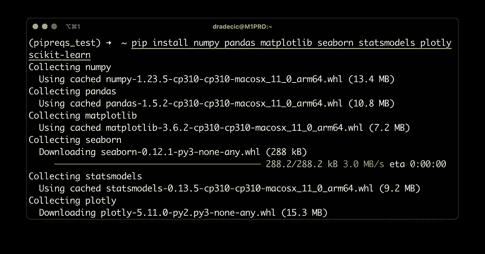
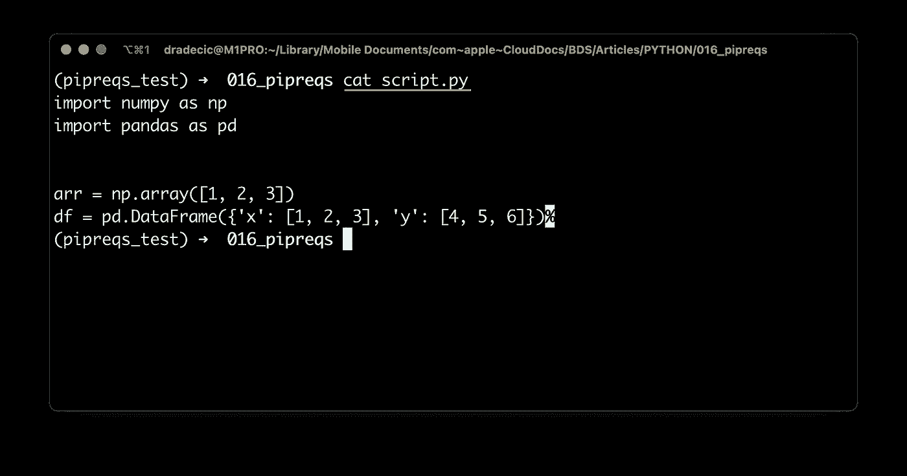
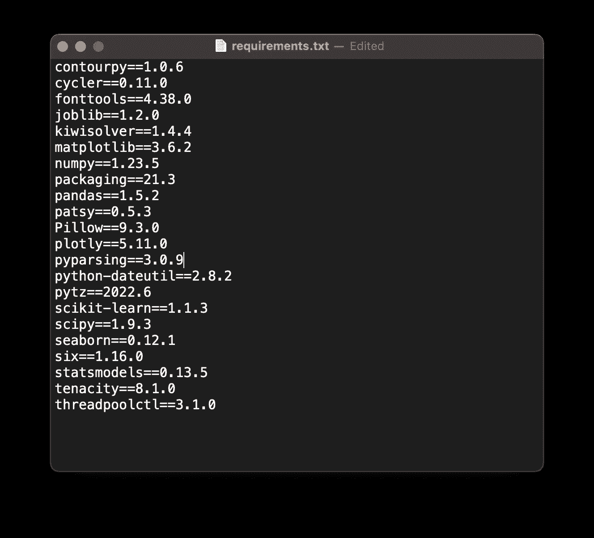
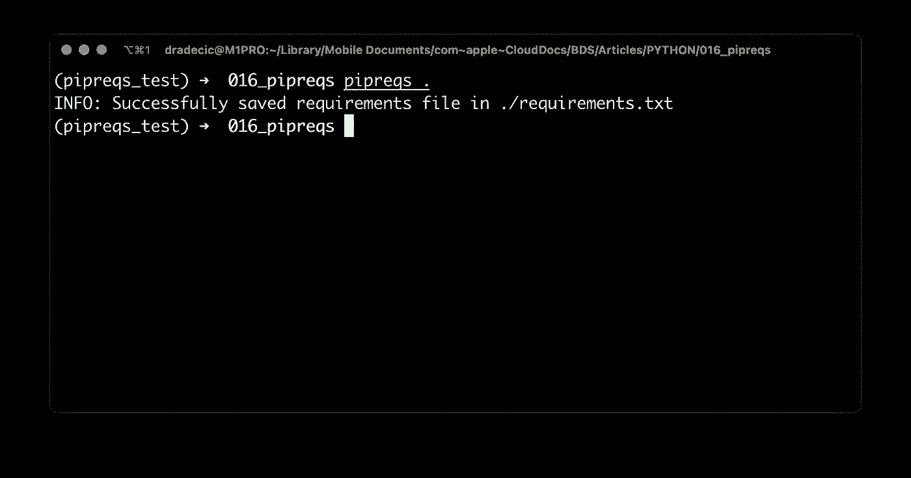
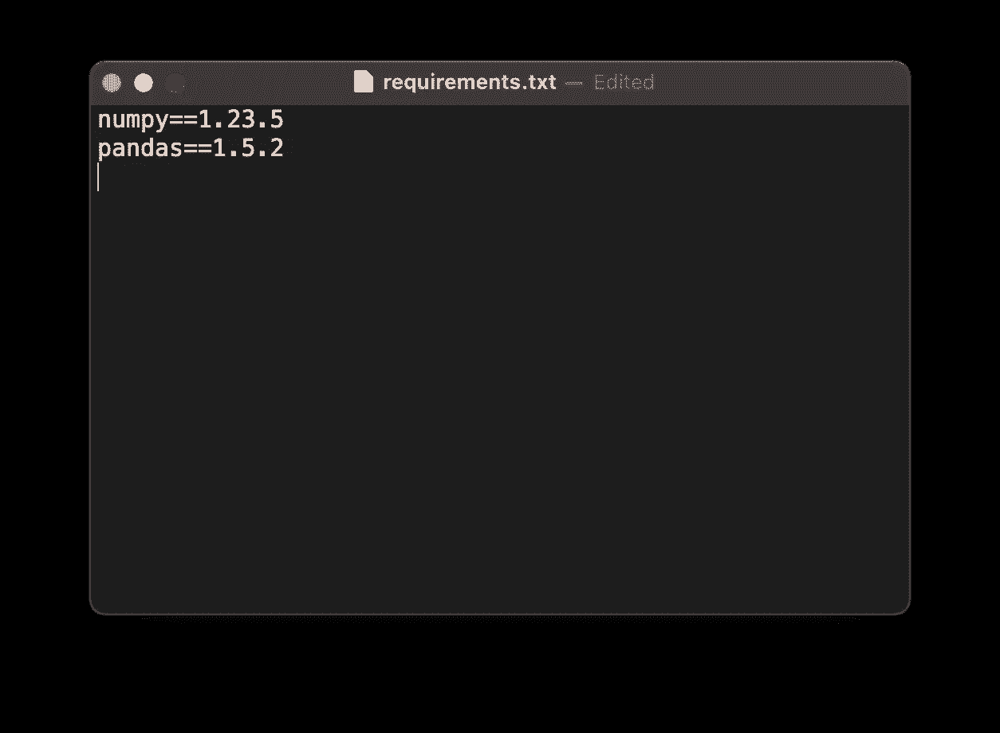
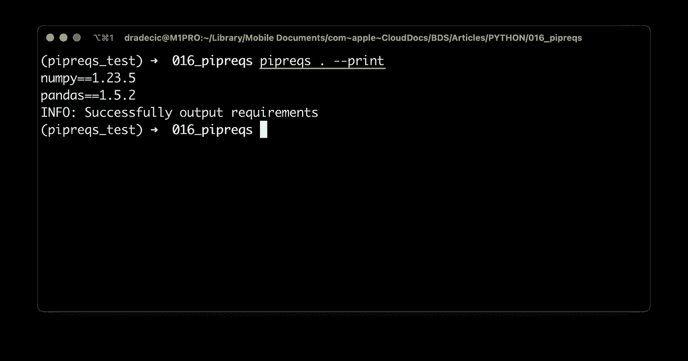
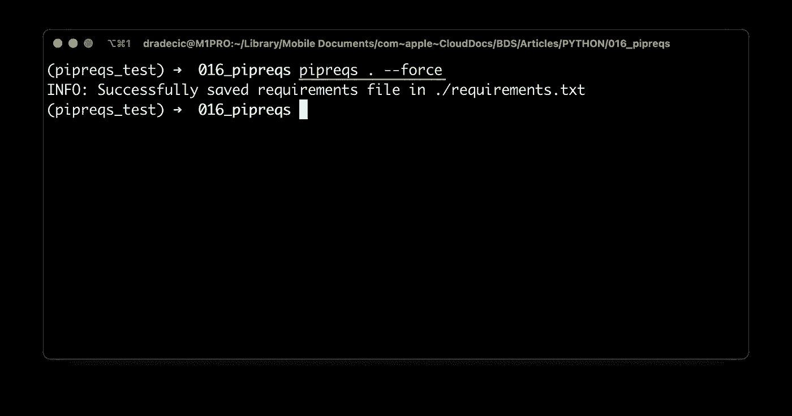
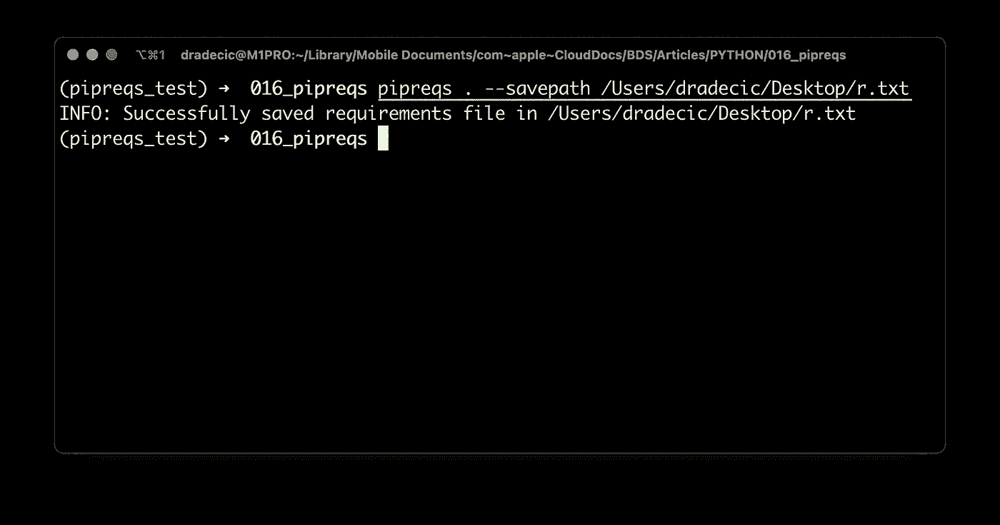

# python pip reqs——如何像正常人一样创建 requirements.txt 文件

> 原文：<https://towardsdatascience.com/python-pipreqs-how-to-create-requirements-txt-file-like-a-sane-person-c82da5d5cd13>

## **想在 requirements.txt 中只包含您使用的库吗？试试 pipreqs，这是一个用于创建更精简的需求文件的 Python 模块。**


文章缩略图(图片由作者提供)

每个 Python 项目都应该有一个`requirements.txt`文件。它存储项目运行所需的所有库的信息，并且在部署 Python 项目时是必不可少的。传统上，这是通过`pip freeze`命令完成的，该命令输出安装在虚拟环境中的所有库。

但是如果您只想要项目中使用的那些呢？这就是 pipreqs 发挥作用的地方。它做的和`pip freeze`一样，但是更好。

想象一下，您创建了一个新的虚拟环境，并安装了一系列依赖项。在项目期间，您决定不使用一些库，但是您忘记了从环境中删除它们。用`pip freeze`生成的`requirements.txt`文件会包含使用过的和未使用过的库，这只是浪费资源。

有一个更好的方法，今天你会了解到这一切。

不想看书？好吧，你不必:

# 如何使用 Python Pipreqs 创建 requirements.txt 文件

我们开始吧。基于 Python 3.10，我用 Anaconda 创建了一个名为`pipreqs_test`的新虚拟环境。您可以自由使用 Anaconda 或任何其他环境管理器:

```
conda create --name pipreqs_test python=3.10 -y
conda activate pipreqs_test
```

从这里开始，让我们用 pip 安装一些 Python 库:

```
pip install numpy pandas matplotlib seaborn statsmodels plotly scikit-learn
```

下面是 shell 输出:



图 1 —使用 pip 安装 Python 库(图片由作者提供)

现在，创建一个只使用 Numpy 和 Pandas 的 Python 脚本:

```
import numpy as np
import pandas as pd

arr = np.array([1, 2, 3])
df = pd.DataFrame({'x': [1, 2, 3], 'y': [4, 5, 6]})
```

我已经把我的命名为`script.py`:



图片 2-Python 文件的内容(图片由作者提供)

让我们首先来看看发出一个`pip freeze`命令会将什么保存到需求文件中:

```
pip freeze > requirements.txt
```

事实证明，大量的库——包括使用过的和未使用过的，以及它们的依赖关系:



图 3——使用 pip 冻结生成的需求文件(图片由作者提供)

如果您在一台新机器上运行这个脚本，并从一个`requirements.txt`文件安装 Python 依赖项，将会安装许多未使用的库。如果您能设法只安装项目中使用的库，那就更好了。

这就是 pipreqs 的闪光点。但是首先，我们必须安装它:

```
pip install pipreqs
```

Pipreqs 的工作方式是扫描给定目录中的所有`.py`文件，并在 Python 文件中寻找导入。这样，它应该只将您实际使用的库写到`requirements.txt`。

下面是保存需求的一般命令:

```
pipreqs <path-to-python-project-folder>
```

如果您在 Python 项目文件夹中，只需运行以下命令:

```
pipreqs .
```

您将看到以下输出:



图 4——使用 pipreqs 创建 requirements.txt 文件(图片由作者提供)

依赖项现在被保存到`requirements.txt`中，所以让我们看看里面有什么:



图 5——使用 pipreqs 生成的需求文件(图片由作者提供)

令人惊讶的是——只有熊猫和熊猫被包括在内！这些都是在新机器或新环境中运行项目所需的依赖项。

但你对 Pipreqs 能做的就这些吗？接下来让我们来看几个“高级”用例。

# Pipreqs 还能做什么？

您可以通过将它们打印到控制台来检查项目中使用了哪些库:

```
pipreqs <path-to-folder> --print
```

结果如下:



图 6 —打印依赖关系(作者提供的图片)

这不会将依赖关系写到文件中，所以请记住这一点。

您也可以强制覆盖`requirements.txt`文件。如果你已经有了需求文件，这个命令是需要的，因为单独运行`pipreqs .`不会覆盖它:

```
pipreqs <path-to-folder> --force
```

更新后的`requirements.txt`文件现已保存:



图 7 —强制覆盖 requirements.txt 文件(图片由作者提供)

您也可以将`requirements.txt`文件保存到不同的目的地。请确保包含完整的文件路径，包括文件名:

```
pipreqs <path-to-folder> --savepath <path-to-file>
```

我是这样把文件保存到桌面上的:



图 8 —将 requirements.txt 保存到不同的位置(图片由作者提供)

这几乎就是你对 Pipreqs 所能做的一切。还有一些额外的选项和参数，但这些是您在 99%的时间里都会用到的。

接下来让我们做一个简短的回顾。

# 总结 Python Pipreqs

通过`pip freeze`用老方法生成需求文件没有错。它只是包括一堆不必要的库和它们的依赖项，因为安装在一个环境中的所有东西(或者上帝禁止的，全球范围内)都会被选中。

Pipreqs 通过扫描给定项目文件夹中的 Python 文件并寻找实际导入的库来解决这一不便。这不是什么开创性的东西，但它会让你的项目更整洁，这总是受欢迎的。

你用什么来跟踪项目的依赖关系？你认为 Pipreqs 是更好的选择吗？请在下面的评论区告诉我。

*喜欢这篇文章吗？成为* [*中等会员*](/@radecicdario/membership) *继续无限制学习。如果你使用下面的链接，我会收到你的一部分会员费，不需要你额外付费。*

[](https://medium.com/@radecicdario/membership)  

## 保持联系

*   雇用我作为一名技术作家
*   订阅 [YouTube](https://www.youtube.com/c/BetterDataScience)
*   在 [LinkedIn](https://www.linkedin.com/in/darioradecic/) 上连接

*原载于 2022 年 12 月 5 日 https://betterdatascience.com**[*。*](https://betterdatascience.com/python-pipreqs/)*