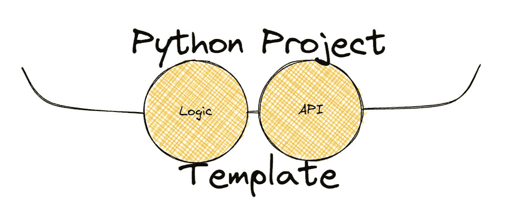
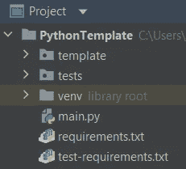
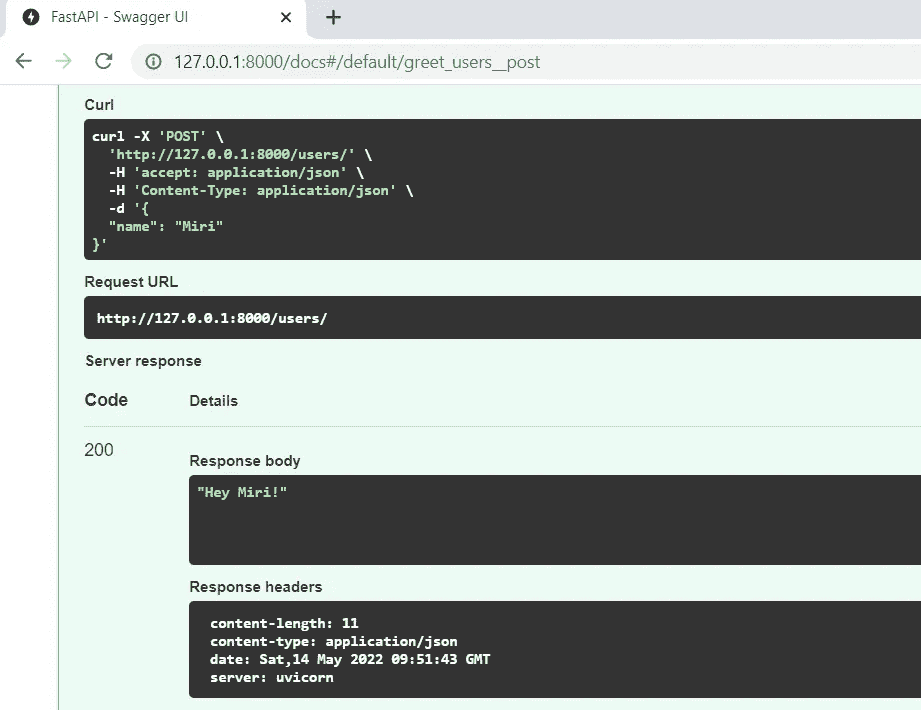
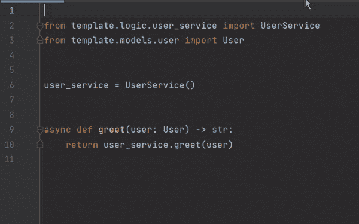
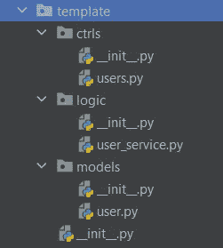
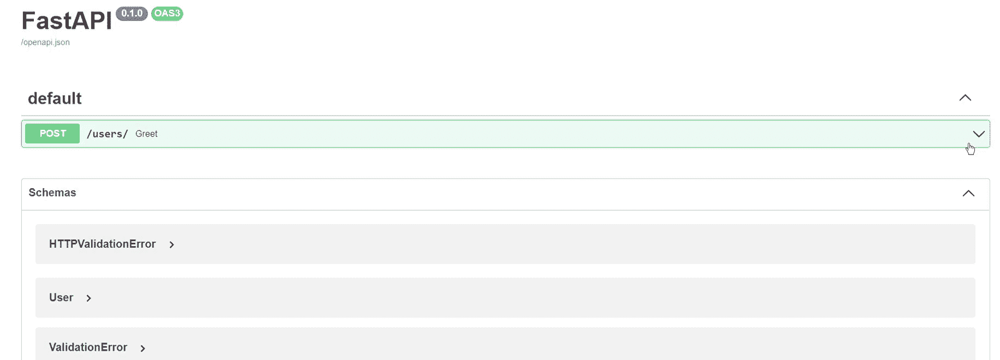

# 用于快速设置的 Python 项目模板

> 原文：<https://towardsdatascience.com/python-project-template-for-a-quick-setup-d3ba1821e853>

## 分享一个 python 模板，它帮助我加速了使用 FastAPI 和 pydantic 的开发设置

在过去的几个月里，我发现自己需要为面试任务建立一个快速的 python 环境。在工作中，我通常有可以从其他项目中导入的模板，在那里我删除了不必要的逻辑并开始工作。我发现从头开始设置环境比我预期的要花更长的时间，而寻找不是针对初学者或小项目的文档甚至要花更长的时间。

我创建了一个模板并上传到 GitHub，你可以在这里得到它[。](https://github.com/MirYeh/PythonTemplate)



创建于 [ExcaliDraw](http://excalidraw.com)

# TL；速度三角形定位法(dead reckoning)

*   建立一个虚拟环境。
*   定义 API。
*   使用 FastAPI 公开它。

# 虚拟环境

设置虚拟环境对于保持项目依赖关系与其他项目分离非常重要。这样，我们可以创建一个稳定、可靠且易于在团队成员之间复制的项目环境。

为了设置虚拟环境，我将带你去 [Daniela Brailovsky](https://medium.com/u/faecd39bdbb4?source=post_page-----d3ba1821e853--------------------------------) 的[关于 Python 中的虚拟环境的博客文章](https://medium.com/@dbrailo/virtual-environments-in-python-2773ac8dd9ae)。


Daniela Brailovsky 用 Python 写的关于 venvs 的博客——3 分钟阅读

# 模板概述

对于这个例子，我创建了一个名为`PythonTemplate`的项目，它包含几个文件，比如入口点`main.py`文件和需求文件。需要注意两个主要目录— `template`包含代码(除了入口点之外的所有内容)和`tests`包含测试代码的代码:



建议的项目结构

为了简单起见，我创建了一个接收用户的 HTTP POST 请求并输出问候的项目。

输入—包含用户名的 JSON 结构:

```
curl -X 'POST' \
  'http://127.0.0.1:8000/users/' \
  -H 'accept: application/json' \
  -H 'Content-Type: application/json' \
  -d '{
  "name": "Miri"
}'
```

输出—问候:

```
"Hey Miri!"
```

正如您在 FastAPI UI 中看到的:



预期的输入和输出

现在您已经看到了它应该是什么样子，让我们来看一下模板！我们将从业务逻辑开始。

# Python 项目模板

## 商业逻辑

*   在`template.models.user`下创建一个用户模型类。因为我使用的是 FastAPI，所以我将使用`[pydantic.BaseModel](https://pydantic-docs.helpmanual.io/usage/models/)`来表示这个类:

*   在`template.logic.user_service`下创建一个服务类:

现在我们有了一些逻辑，让我们看看如何使用 FastAPI 来公开这个逻辑。

## 暴露逻辑

在`template.ctrls.users`目录下创建一个控制器模块。
在这个模块中，我们调用我们的逻辑，并使用 [APIRouter](https://fastapi.tiangolo.com/tutorial/bigger-applications/) 通过 FastAPI 的路由公开它:

如您所见，公开控制器逻辑需要 3 行代码——导入`fastapi.APIRouter`,用路径前缀创建“用户”`APIRouter`,并用路由器和 HTTP 方法注释您想要公开的函数！



控制器逻辑&通过 FastAPI 公开

这是我们创建的`template`目录结构:



模板目录结构

现在让我们转移到`main.py`入口点。

## 服务器端入口点

在 main 中，我们创建我们的 FastAPI 应用程序，添加我们的`users`路由，并使用`[uvicorn](https://www.uvicorn.org/#:~:text=from%20your%20application...-,example.py,-%3A)`运行它:

通过[本地服务器](http://127.0.0.1:8000/docs)试用您的应用程序！



实际应用

就这样——你收到了来自你的应用程序的问候！

使用模板时不要忘记添加测试！

本文中的 gif 是使用 [Windows 屏幕捕捉功能](https://www.tomshardware.com/how-to/screen-record-in-windows)、 [ezgif](https://ezgif.com/video-to-gif) 裁剪视频和 [xconvert](https://www.xconvert.com/convert-video-to-gif) 将视频转换为 gif 创建的。

特别感谢[埃拉·谢尔](https://medium.com/u/3f4ff048c2b7?source=post_page-----d3ba1821e853--------------------------------)、[丽娅·科恩](https://medium.com/u/c9af24f665e5?source=post_page-----d3ba1821e853--------------------------------)和[娜奥米·克里格](https://medium.com/u/ce7969d594d?source=post_page-----d3ba1821e853--------------------------------)，他们帮助改进了这篇文章！