# Python 平方根:Python 中求平方根的 5 种方法

> 原文：<https://towardsdatascience.com/python-square-roots-5-ways-to-take-square-roots-in-python-445ea9b3fb6f>

## **Python 开平方的方法不止一种。学习 Python 中平方根的 5 种方法+一些额外的高级技巧。**


丹·克里斯蒂安·pădureț在 [Unsplash](https://unsplash.com?utm_source=medium&utm_medium=referral) 上的照片

在学习了 Python 中求一个数的平方的 [4 种方法之后，现在是时候处理相反的运算了——Python 平方根。本文将教你用 Python 计算平方根的五种不同方法，并以一个关于 Python 列表的立方根和平方根的附加部分结束。](https://betterdatascience.com/python-squaring/)

让我们从介绍主题开始，并解决在 Python 中计算平方根时必须考虑的潜在问题。

# Python 平方根介绍

简单地说，一个数的平方根是一个值，当它与自身相乘时，返回相同的数。这是平方的逆运算。

例如，3 的平方是 9，9 的平方根是 3，因为 3×3 是 9。这是一个有点难以用一句话来解释的概念，但是当你看到它在行动时，你就明白了。

在深入研究 Python 中求平方根的不同方法之前，让我们先来看看哪些数字可以和不可以求平方根。

## 正数的平方根

平方根只适用于正数。现在，忽略负责计算的代码，只关注结果。

以下代码片段打印数字 1 和 25 的平方根:

```
import math

a = 1
b = 25

# Square root of a positive number
a_sqrt = math.sqrt(a)
b_sqrt = math.sqrt(b)

# Print
print("Square root of a positive number")
print("--------------------------------------------------")
print(f"Square root of {a} = {a_sqrt}")
print(f"Square root of {b} = {b_sqrt}")
```

以下是输出结果:

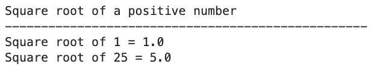

图 1-正数的平方根(图片由作者提供)

因此，1x1 = 1，5x5 = 25，这就是平方根的基本工作原理。但是如果你取零的平方根呢？

## 零的平方根

现在，零既不是质数，也不是合数，所以找不到它的[质因数分解](https://www.cuemath.com/numbers/prime-factorization/)。因此，零的平方根是零:

```
import math

a = 0

# Square root of a zero
a_sqrt = math.sqrt(a)

# Print
print("Square root of a zero")
print("--------------------------------------------------")
print(f"Square root of {a} = {a_sqrt}")
```

以下是输出结果:

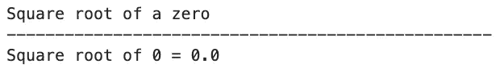

图 2 —零的平方根(图片由作者提供)

只剩下一个用例，那就是负数。

## 负数的平方根

用[实数](https://study.com/learn/lesson/negative-square-root-overview-examples.html)无法计算负数的平方根。两个负数相乘总会得到一个正数。

尽管如此，让我们试一试:

```
import math

a = -10

# Square root of a negative number
a_sqrt = math.sqrt(a)

# Print
print("Square root of a negative number")
print("--------------------------------------------------")
print(f"Square root of {a} = {a_sqrt}")
```

它会导致一个错误:

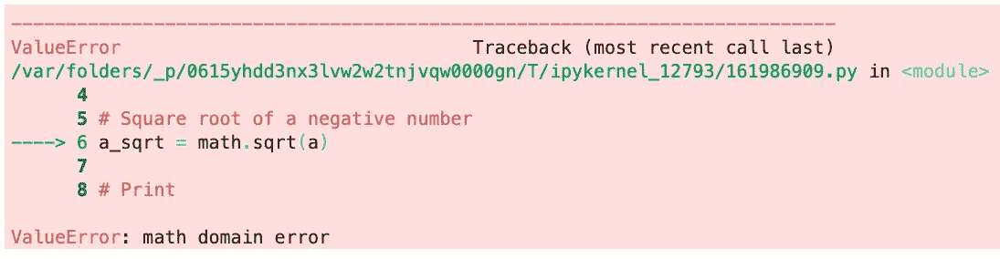

图 3-负数的平方根(作者提供的图片)

有很多方法可以计算负数的平方根，那就是把它们写成-1 的倍数。例如，-9 可以写成-1 x 9。结果将是 **3i** 。进入虚数领域超出了今天的范围，所以我就讲到这里。

接下来，让我们来看一下处理 Python 平方根的 5 种方法。

# 用 sqrt()函数计算平方根

第一种方法实际上是您在上一节中看到的方法。它依靠`math.pow()`函数来完成这个任务。这个模块附带了默认的 Python 安装，所以不需要安装任何外部库。

下面是一段代码，演示了如何在 Python 中使用此函数求平方根:

```
import math

a = 1
b = 25
c = 30.82
d = 100
e = 400.40

# Method #1 - math.sqrt() function
a_sqrt = math.sqrt(a)
b_sqrt = math.sqrt(b)
c_sqrt = math.sqrt(c)
d_sqrt = math.sqrt(d)
e_sqrt = math.sqrt(e)

# Print
print("Method #1 - math.sqrt() function")
print("--------------------------------------------------")
print(f"Square root of {a} = {a_sqrt}")
print(f"Square root of {b} = {b_sqrt}")
print(f"Square root of {c} = {c_sqrt}")
print(f"Square root of {d} = {d_sqrt}")
print(f"Square root of {e} = {e_sqrt}")
```

结果如下:

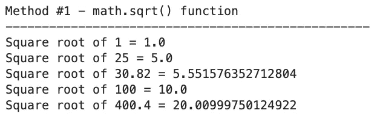

图 4 — Math sqrt()函数(图片由作者提供)

这可能是您需要的唯一方法，但是让我们看看其他的方法。

# 用 pow()函数计算平方根

如果平方一个数意味着把它提升到 2 的幂，那么开平方根实质上就是把它提升到 0.5 的幂。这正是您可以用`math.pow()`函数实现的行为。它有两个参数——数字和指数。

让我们来看几个例子:

```
import math

a = 1
b = 25
c = 30.82
d = 100
e = 400.40

# Method #2 - math.pow() function
a_sqrt = math.pow(a, 0.5)
b_sqrt = math.pow(b, 0.5)
c_sqrt = math.pow(c, 0.5)
d_sqrt = math.pow(d, 0.5)
e_sqrt = math.pow(e, 0.5)

# Print
print("Method #2 - math.pow() function")
print("--------------------------------------------------")
print(f"Square root of {a} = {a_sqrt}")
print(f"Square root of {b} = {b_sqrt}")
print(f"Square root of {c} = {c_sqrt}")
print(f"Square root of {d} = {d_sqrt}")
print(f"Square root of {e} = {e_sqrt}")
```

输出与我们之前的输出相同:

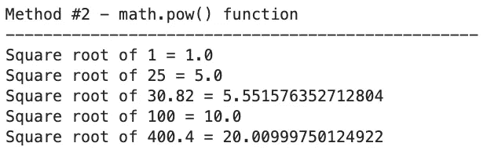

图 5 — Math pow()函数(图片由作者提供)

很好，但是我们能完全消除图书馆的使用吗？当然，这是方法。

# Python 的指数运算符(**)用于计算平方根

上一个函数的逻辑同样适用于此处。您可以使用 Python 的指数运算符将一个数字提升到 0.5 的幂。它和`math.pow(x, 0.5)`做的一样，但是语法更短并且不依赖任何库。

下面是如何在 Python 中使用它:

```
a = 1
b = 25
c = 30.82
d = 100
e = 400.40

# Method #3 - Python exponent operator
a_sqrt = a**0.5
b_sqrt = b**0.5
c_sqrt = c**0.5
d_sqrt = d**0.5
e_sqrt = e**0.5

# Print
print("Method #3 - Python exponent operator")
print("--------------------------------------------------")
print(f"Square root of {a} = {a_sqrt}")
print(f"Square root of {b} = {b_sqrt}")
print(f"Square root of {c} = {c_sqrt}")
print(f"Square root of {d} = {d_sqrt}")
print(f"Square root of {e} = {e_sqrt}")
```

结果又是一样的，毫无疑问:

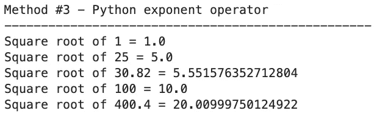

图片 6-Python 指数运算符(图片由作者提供)

接下来，让我们看看用 Numpy 计算数字和数组的平方根。

# Numpy —计算数字或数组的根

Numpy 是 Python 中数值计算的首选库。它内置了一个`sqrt()`函数，你可以用它对数字和数组求平方根。

请记住返回类型——对于单个数字是`numpy.float64`,对于数组是`numpy.ndarray`。当然，每个数组元素的类型都是`numpy.float64`:

```
import numpy as np

a = 1
b = 25
c = 30.82
d = 100
e = 400.40
arr = [a, b, c]

# Method #4 - Numpy square roots
a_sqrt = np.sqrt(a)
b_sqrt = np.sqrt(b)
c_sqrt = np.sqrt(c)
d_sqrt = np.sqrt(d)
e_sqrt = np.sqrt(e)
arr_sqrt = np.sqrt(arr)

# Print
print("Method #4 - Numpy square roots")
print("--------------------------------------------------")
print(f"Square root of {a} = {a_sqrt}")
print(f"Square root of {b} = {b_sqrt}")
print(f"Square root of {c} = {c_sqrt}")
print(f"Square root of {d} = {d_sqrt}")
print(f"Square root of {e} = {e_sqrt}")
print(f"Square root of {arr} = {arr_sqrt}")
```

以下是控制台输出:

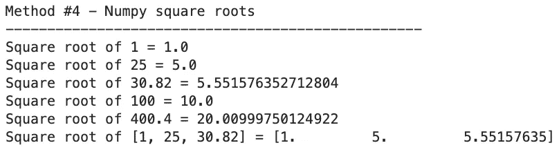

图 7——Numpy 中的平方根(图片由作者提供)

这是迄今为止最方便的方法，因为它依赖于广泛使用的 Python 库，并且不管输入的数据类型是什么，计算过程都是相同的。

# Cmath —取复数的 Python 平方根

还记得平方根和负数的故事吗？Python 的`math`模块引发了一个错误，但是`cmath`在这里拯救了这一天。这个模块用于处理复数。

在下面的代码片段中，您将看到从正整数、浮点数、复数和负数中提取的平方根:

```
import cmath

a = 1
b = 25.44
c = cmath.pi
d = 10+10j
e = -100

# Method #5 - Square roots of complex numbers
a_sqrt = cmath.sqrt(a)
b_sqrt = cmath.sqrt(b)
c_sqrt = cmath.sqrt(c)
d_sqrt = cmath.sqrt(d)
e_sqrt = cmath.sqrt(e)

# Print
print("Method #5 - Square roots of complex numbers")
print("--------------------------------------------------")
print(f"Square root of {a} = {a_sqrt}")
print(f"Square root of {b} = {b_sqrt}")
print(f"Square root of {c} = {c_sqrt}")
print(f"Square root of {d} = {d_sqrt}")
print(f"Square root of {e} = {e_sqrt}")
```

这次没有错误:

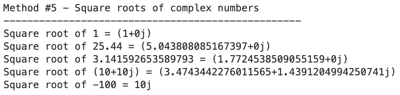

图 8——复数的平方根(图片由作者提供)

我从来没有使用这个模块的需求，但是知道它的存在是很好的。

接下来，让我们来看看 Python 平方根的一些更高级的用法示例。

# 额外收获:高级 Python 根主题

我们现在将改变话题，讨论几个更高级的话题。其中包括在 Python 中计算立方根的方法，以及对普通 Python 列表求平方根的方法。让我们从立方根开始。

## Python 中的立方根

如果求平方根意味着将一个数提升到 0.5 的幂，那么立方根必须用 0.333 的幂来表示，即 1/3。

以下是如何在不使用任何外部库的情况下用 Python 实现这一逻辑:

```
a = 1
b = 27
c = 30.82
d = 1000
e = 400.40

# Bonus #1 - Cube roots
a_cbrt = a ** (1./3.)
b_cbrt = b ** (1./3.)
c_cbrt = c ** (1./3.)
d_cbrt = d ** (1./3.)
e_cbrt = e ** (1./3.)

# Print
print("Bonus #1 - Cube roots")
print("--------------------------------------------------")
print(f"Cube root of {a} = {a_cbrt}")
print(f"Cube root of {b} = {b_cbrt}")
print(f"Cube root of {c} = {c_cbrt}")
print(f"Cube root of {d} = {d_cbrt}")
print(f"Cube root of {e} = {e_cbrt}")
```

结果打印如下:

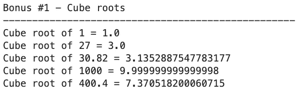

图 9-立方根(1)(图片由作者提供)

Numpy 提供了一种在 Python 中求立方根的更简单的方法。它内置了一个`cbrt()`函数，代表*立方根*。您可以在数字和数组上使用它，就像平方根一样:

```
import numpy as np

a = 1
b = 27
c = 30.82
d = 1000
e = 400.40
arr = [a, b, c]

# Bonus #1.2 - Cube roots with Numpy
a_cbrt = np.cbrt(a)
b_cbrt = np.cbrt(b)
c_cbrt = np.cbrt(c)
d_cbrt = np.cbrt(d)
e_cbrt = np.cbrt(e)
arr_cbrt = np.cbrt(arr)

# Print
print("Bonus #1.2 - Cube roots with Numpy")
print("--------------------------------------------------")
print(f"Cube root of {a} = {a_cbrt}")
print(f"Cube root of {b} = {b_cbrt}")
print(f"Cube root of {c} = {c_cbrt}")
print(f"Cube root of {d} = {d_cbrt}")
print(f"Cube root of {e} = {e_cbrt}")
print(f"Cube root of {arr} = {arr_cbrt}")
```

让我们来看看结果:

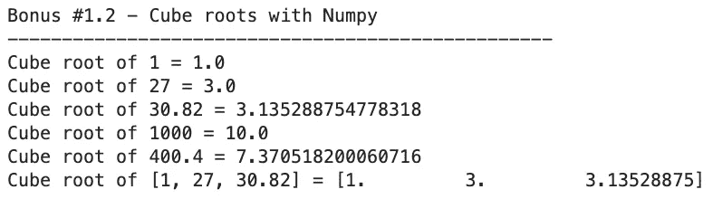

图 10-立方根(2)(图片由作者提供)

是的，就是这么简单。

## Python 中列表的平方根

还有一种简单的方法来计算 Python 列表的平方根，不需要 Numpy。您可以简单地遍历列表，求出单个列表项的平方根:

```
import math

arr = [1, 25, 30.82]
arr_sqrt = []

# Bonus #2 - Square root of a Python list
for num in arr:
    arr_sqrt.append(math.sqrt(num))

# Print
# Print
print("Bonus #2 - Square root of a Python list")
print("--------------------------------------------------")
print(f"Square root of {arr} = {arr_sqrt}")
```

结果如下:

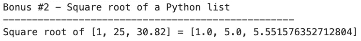

图 11 —列表的平方根(1)(图片由作者提供)

或者，如果您喜欢更 Pythonic 化的方法，没有理由不使用列表理解，而只是将上面的计算简化为一行代码:

```
import math

arr = [1, 25, 30.82]

# Bonus #2.2 - Square root of a Python list using list comprehension
arr_sqrt = [math.sqrt(num) for num in arr]

# Print
# Print
print("Bonus #2.2 - Square root of a Python list using list comprehension")
print("--------------------------------------------------")
print(f"Square root of {arr} = {arr_sqrt}")
```

输出是相同的:

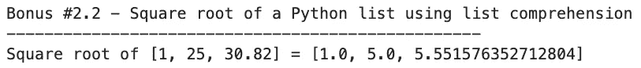

图 12 —列表的平方根(2)(图片由作者提供)

这就是在 Python 中求平方根有多容易——对于整数、浮点数、列表，甚至是复数。接下来让我们做一个简短的回顾。

# 结论

您现在知道了计算 Python 平方根的 5 种不同方法。实际上，你只需要一个，但是知道几个选择也无妨。您可以使用内置的`math`模块，选择`numpy`，或者使用指数运算符并完全避免使用库。所有的方法都可行，选择权在你。

如果您想了解更多基本的 Python 概念，请继续关注博客。感谢阅读！

喜欢这篇文章吗？成为 [*中等会员*](/@radecicdario/membership) *继续无限制学习。如果你使用下面的链接，我会收到你的一部分会员费，不需要你额外付费。*

<https://medium.com/@radecicdario/membership>  

## 保持联系

*   雇用我作为一名技术作家
*   订阅 [YouTube](https://www.youtube.com/c/BetterDataScience)
*   在 [LinkedIn](https://www.linkedin.com/in/darioradecic/) 上连接

*原载于 2022 年 12 月 1 日*[*https://betterdatascience.com*](https://betterdatascience.com/python-square-roots/)*。*