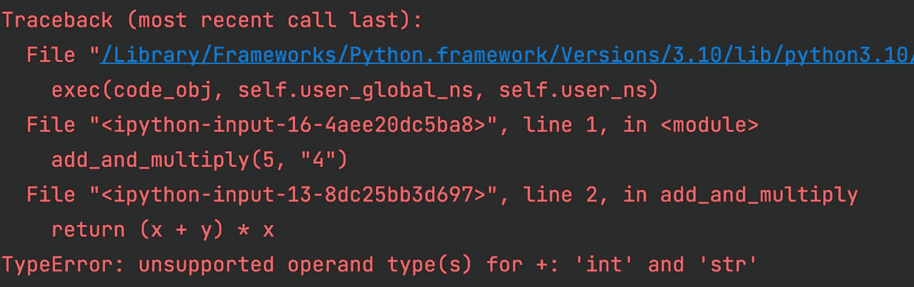

# Python 回溯-解释

> 原文：<https://towardsdatascience.com/python-tracebacks-explained-538caaac434>

## 调试的好帮手


安妮·尼加德在 [Unsplash](https://unsplash.com/s/photos/trace?utm_source=unsplash&utm_medium=referral&utm_content=creditCopyText) 上拍摄的照片

我们很少能在第一次尝试时运行一个没有任何错误的脚本，这在编写代码时是绝对正常的。重要且有时具有挑战性的部分是修复这些错误。

修复错误并使脚本按预期工作的过程可能需要多次迭代，这取决于程序员的经验和我们对错误的了解。编程语言给了我们一些提示，告诉我们是什么导致了错误，这基本上就是 Python 回溯所做的事情。

Python 中的回溯可以看作是一份报告，帮助我们理解和修复代码中的问题。在本文中，我们将学习什么是 Python 中的回溯，如何阅读回溯消息以便能够更有效地使用它们，以及不同的错误类型。

# Python 中的回溯是什么？

Python 中的程序在遇到错误时会停止执行，错误的形式可能是语法错误或异常。当解释器检测到无效的语法时，就会出现语法错误，这相对来说比较容易解决。

语法错误的一个例子是不匹配的括号。另一方面，当语法正确但程序导致错误时，会引发异常。

回溯是帮助我们理解异常原因的报告。它包含代码中的函数调用以及它们的行号，这样我们就不会对导致代码失败的问题一无所知。

让我们看一个简单的例子。

下面的代码片段创建了一个函数，该函数将两个数字相加，并将总和乘以第一个数字。然后，它调用带有参数 5 和 4 的函数。但是，4 是作为字符串传递的，所以它实际上不是一个数字。

```
def add_and_multiply(x, y):
    return (x + y) * x

add_and_multiply(5, "4")
```

执行此代码时，Python 会引发以下异常:



(图片由作者提供)

最后一行显示了错误类型以及简短的解释。这种情况下的错误是由整数和字符串之间不受支持的操作数导致的类型错误。加号运算符不能用于将字符串与整数相加，因此代码会导致异常。

最后一行上面的行根据函数名和行号告诉我们异常发生的位置。我们这里的例子非常简单，但是当处理非常长的脚本或具有多个脚本的程序时，关于函数名和行号的信息对于诊断和修复问题非常有帮助。

回溯还显示了模块和文件名，这在处理从其他文件或脚本导入模块的脚本时非常有用。根据您的工作环境(如终端或 REPL)，文件名和模块名的显示方式会略有不同。

例如，当我将上面的代码片段保存为“sample_script.py”并尝试在终端中运行它时，我得到以下回溯:

```
Traceback (most recent call last):
  File "/Users/sonery/sample_script.py", line 6, in <module>
    add_and_multiply(5, "6")
  File "/Users/sonery/sample_script.py", line 2, in add_and_multiply
    print((x + y) * x)
TypeError: unsupported operand type(s) for +: 'int' and 'str'
```

在任何情况下，我们都可以从回溯消息中获得有用的线索。

# 常见追溯类型

创建高效程序并在生产中维护它们的大量时间都花在了调试错误上。因此，利用 Python 回溯至关重要。

否则，可能需要花费数小时来查找和修复问题，如果程序已经部署到生产环境中，这可能会产生严重的后果。​

回溯消息最重要的部分是错误类型，因为它提示我们是哪种错误导致脚本停止执行。

让我们回顾一下回溯消息中一些常见的错误类型。

## 类型错误

当对象的数据类型与定义的操作不兼容时，会发生类型错误。我们在开始时做的添加整数和字符串的例子就是这种错误的一个例子。

## 属性错误

在 Python 中，一切都是一个具有整数、字符串、列表、元组、字典等类型的对象。使用类来定义类型，类也具有用于与类的对象交互的属性。

类可以有数据属性和过程属性(即方法):

*   数据属性:创建一个类的实例需要什么
*   方法(即过程属性):我们如何与类的实例交互。

假设我们有一个 list 类型的对象。我们可以使用 append 方法向列表中添加新项。如果对象没有我们试图使用的属性，就会引发一个属性错误异常。

这里有一个例子:

```
mylist = [1, 2, 3, 4, 5]

mylist.add(10)

# output
Traceback (most recent call last):
  File "<file>", line 3378, in run_code
    exec(code_obj, self.user_global_ns, self.user_ns)
  File "<ipython-input-25-4ad0ec665b52>", line 3, in <module>
    mylist.add(10)
AttributeError: 'list' object has no attribute 'add'
```

由于 list 类没有名为“add”的属性，我们得到一个显示属性错误的回溯。

## ImportError 和 ModuleNotFoundError

Python 有大量的第三方库(即模块)，这使得用几行代码完成大量任务成为可能。

为了使用这样的库，以及内置的 Python 库(例如操作系统、请求)，我们需要导入它们。如果在导入它们时出现问题，则会引发导入错误或模块未找到错误异常。

例如，在下面的代码片段中，我们试图从 Scikit-learn 导入逻辑回归类。

```
from sklearn import LogisticRegression

# output
Traceback (most recent call last):
  File "<file>", line 3378, in run_code
    exec(code_obj, self.user_global_ns, self.user_ns)
  File "<ipython-input-22-b74afc1ba453>", line 1, in <module>
    from sklearn import LogisticRegression
ImportError: cannot import name 'LogisticRegression' from 'sklearn' (/Library/Frameworks/Python.framework/Versions/3.10/lib/python3.10/site-packages/sklearn/__init__.py)
```

由于线性模型模块中提供了逻辑回归类，因此引发了导入错误异常。正确的导入方法如下。

```
from sklearn.linear_model import LogisticRegression
```

如果模块在工作环境中不可用，则会引发模块未找到错误异常。

```
import openpyxl

# output
Traceback (most recent call last):
  File "<file>", line 3378, in run_code
    exec(code_obj, self.user_global_ns, self.user_ns)
  File "<ipython-input-23-f5ea1cbb6934>", line 1, in <module>
    import openpyxl
  File "/Applications/PyCharm CE.app/Contents/plugins/python-ce/helpers/pydev/_pydev_bundle/pydev_import_hook.py", line 21, in do_import
    module = self._system_import(name, *args, **kwargs)
ModuleNotFoundError: No module named 'openpyxl'
```

## 索引错误

一些数据结构有一个索引，可以用来访问它们的项目，如列表、元组和数据帧。我们可以通过使用序列下标来访问一个特定的项目。

```
names = ["John", "Jane", "Max", "Emily"]

# Get the third item
names[2]

# output
"Max"
```

如果下标超出范围，将引发索引错误异常。

```
names = ["John", "Jane", "Max", "Emily"]

# Get the sixth item
names[5]

# output
Traceback (most recent call last):
  File "<file>", line 3378, in run_code
    exec(code_obj, self.user_global_ns, self.user_ns)
  File "<ipython-input-30-3033b2837dcd>", line 3, in <module>
    names[5]
IndexError: list index out of range
```

由于列表包含 4 项，当我们试图访问不存在的第 6 项时，会引发一个异常。

让我们用熊猫数据框架做另一个例子。

```
import pandas as pd
import numpy as np

df = pd.DataFrame(np.random.randint(10, size=(5, 2)), columns=["A", "B"])

df

# output
   A  B
0  1  6
1  6  3
2  8  8
3  3  5
4  5  6
```

变量 df 是一个具有 5 行 2 列的数据帧。以下代码行试图获取第一行第三列中的值。

```
df.iloc[0, 3]

# output

Traceback (most recent call last):
  File "<file>", line 3378, in run_code
    exec(code_obj, self.user_global_ns, self.user_ns)
  File "<file>", line 1, in <module>
    df.iloc[0, 3]
  File "<file>", line 960, in __getitem__
    return self.obj._get_value(*key, takeable=self._takeable)
  File "<file>", line 3612, in _get_value
    series = self._ixs(col, axis=1)
  File "<file>", line 3439, in _ixs
    label = self.columns[i]
  File "<file>", line 5039, in __getitem__
    return getitem(key)
IndexError: index 3 is out of bounds for axis 0 with size 2
```

正如我们在回溯的最后一行看到的，这是一个不言自明的错误消息。

## 名称错误

当我们引用代码中未定义的变量时，会引发名称错误异常。

这里有一个例子:

```
members = ["John", "Jane", "Max", "Emily"]

member[0]

# output
Traceback (most recent call last):
  File "<file>", line 3378, in run_code
    exec(code_obj, self.user_global_ns, self.user_ns)
  File "<ipython-input-35-9fcefb83a26f>", line 3, in <module>
    name[5]
NameError: name 'member' is not defined
```

变量的名称是 members，所以当我们试图使用 member 而不是 members 时，我们会得到一个错误。

## 值错误

当我们试图给一个变量赋一个不合适的值时，就会出现值错误异常。回想一下我们的 5 行 2 列的数据帧。

```
import pandas as pd
import numpy as np

df = pd.DataFrame(np.random.randint(10, size=(5, 2)), columns=["A", "B"])

df

# output
   A  B
0  1  6
1  6  3
2  8  8
3  3  5
4  5  6
```

假设我们想向这个数据帧添加一个新列。

```
df["C"] = [1, 2, 3, 4]

# output
Traceback (most recent call last):
  File "<file>", line 3378, in run_code
    exec(code_obj, self.user_global_ns, self.user_ns)
  File "<file>", line 1, in <module>
    df["C"] = [1, 2, 3, 4]
  File "<file>", line 3655, in __setitem__
    self._set_item(key, value)
  File "<file>", line 3832, in _set_item
    value = self._sanitize_column(value)
  File "<file>", line 4535, in _sanitize_column
    com.require_length_match(value, self.index)
  File "<file>", line 557, in require_length_match
    raise ValueError(
ValueError: Length of values (4) does not match length of index (5)
```

如错误消息中所述，数据帧有 5 行，因此每列有 5 个值。当我们试图创建一个包含 4 个条目的新列时，我们得到一个值错误。

# 结论

错误消息在调试代码或使代码第一次正确执行时非常有用。幸运的是，Python 回溯有清晰的解释性错误消息。

在本文中，我们学习了什么是回溯，如何阅读它，以及一些常见的回溯类型。

*你可以成为* [*媒介会员*](https://sonery.medium.com/membership) *解锁我的全部写作权限，外加其余媒介。如果你已经是了，别忘了订阅*<https://sonery.medium.com/subscribe>**如果你想在我发表新文章时收到电子邮件。**

*感谢您的阅读。如果您有任何反馈，请告诉我。*