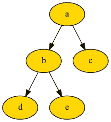
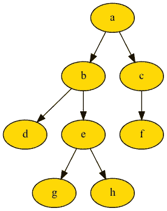
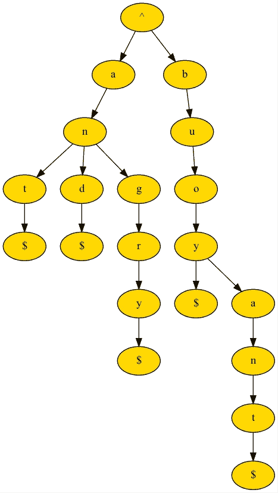
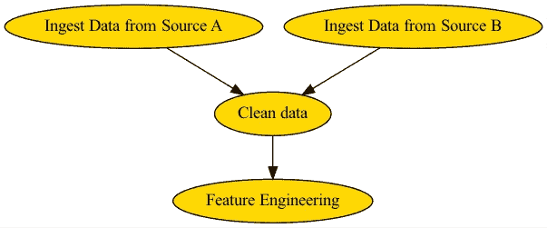

# 用 BigTree 实现 Python 树

> 原文：<https://towardsdatascience.com/python-tree-implementation-with-bigtree-13cdabd77adc>

## 将树与 Python 列表、字典和熊猫数据框架集成在一起


[简·侯伯](https://unsplash.com/@jan_huber?utm_source=medium&utm_medium=referral)在 [Unsplash](https://unsplash.com?utm_source=medium&utm_medium=referral) 上拍照

Python 内置了列表、数组和字典的数据结构，但没有树状数据结构。在 LeetCode 中，针对树的问题仅限于二分搜索法树，并且其实现不具有许多功能。

`**bigtree**` Python 包可以在 Python 列表、字典和 pandas 数据帧之间构建和导出树，与现有的 Python 工作流无缝集成。

> 树状数据结构可以用来显示层次关系，如家谱和组织结构图。

本文将介绍基本的树概念，如何用`**bigtree**` Python 包构建树，树的遍历、搜索、修改和导出方法。本文以使用树实现待办事项列表的方式结束，并将树实现扩展到 [Trie](https://en.wikipedia.org/wiki/Trie) 和[有向无环图](https://en.wikipedia.org/wiki/Directed_acyclic_graph)数据结构。

如果你有兴趣为`**bigtree**` Python 包做贡献，那就来合作吧！

# 目录

*   [树基础和术语](https://medium.com/p/13cdabd77adc/#c220)
*   [大树设置](https://medium.com/p/13cdabd77adc/#8552)
*   [建造树木](https://medium.com/p/13cdabd77adc/#3e14)
*   [树遍历算法](https://medium.com/p/13cdabd77adc/#509b)
*   [树形搜索方法](https://medium.com/p/13cdabd77adc/#1ada)
*   [树形修改方法](https://medium.com/p/13cdabd77adc/#4bd0)
*   [导出树木](https://medium.com/p/13cdabd77adc/#2251)
*   [附加:与](https://medium.com/p/13cdabd77adc/#4d13)和`[**bigtree**](https://medium.com/p/13cdabd77adc/#4d13)`一起使用待办事项
*   [附加:延伸至 Trie](https://medium.com/p/13cdabd77adc/#660e)
*   [附加:有向无环图(DAG)](https://medium.com/p/13cdabd77adc/#185d)

# 树的基础和术语

树是分层存储数据的非线性数据结构，由通过**边**连接的**节点**组成。例如，在家谱中，一个节点代表一个人，一条边代表两个节点之间的关系。



图 1:树的例子——作者的图片

了解了构成树的组件后，有几个术语可以扩展到这些组件，

*   **根**:没有任何父节点，整棵树都源于它的节点。在图 1 中，根是节点`a`
*   **叶**:没有任何子节点的节点。在图 1 中，叶节点是节点`c`、`d`和`e`
*   **父节点**:节点的直接前任。在图 1 中，节点`a`是节点`b`和`c`的父节点
*   **子节点**:节点的直接继承者。在图 1 中，节点`b`是节点`a`的子节点
*   **祖先**:一个节点的所有前辈。在图 1 中，节点`a`和`b`是节点`d`的祖先
*   **子孙**:一个节点的所有继承者。在图 1 中，节点`d`和`e`是节点`b`的后代
*   **兄弟节点**:具有相同父节点的节点。在图 1 中，节点`d`和`e`是兄弟节点
*   **左同级**:节点左侧的同级。在图 1 中，节点`d`是节点`e`的左兄弟
*   **右同级**:节点右侧的同级。在图 1 中，节点`e`是节点`d`的右兄弟
*   **深度**:从节点到根的路径长度。在图 1 中，节点`b`的深度是 2，节点`d`的深度是 3
*   **高度/最大深度**:根到叶节点的最大深度。在图 1 中，树的高度是 3

# 大树设置

大树很容易设置，只需在终端上运行以下命令。

```
$ pip install bigtree
```

如果您想要将树导出到图像，请改为在终端上运行以下命令。

```
$ pip install 'bigtree[image]'
```

事不宜迟，让我们开始实现树吧！

# 构建树

要构造树，首先要定义节点，通过指定节点的`parent`和`children`来链接节点。

例如，要构建一个家族树，

```
from bigtree import Node, print_tree

a = Node("a", age=90)
b = Node("b", age=65, parent=a)
c = Node("c", age=60, parent=a)

a.children
# (Node(/a/b, age=65), Node(/a/c, age=60))

a.depth, b.depth
# (1, 2)

a.max_depth
# 2

print_tree(a, attr_list=["age"])
"""
a [age=90]
├── b [age=65]
└── c [age=60]
"""
```

在上面的例子中，我们用 3 行代码将节点`b`和`c`定义为节点`a`的子节点。我们还可以添加属性，比如节点的`age`属性。要查看树结构，我们可以使用`print_tree`方法。

我们还可以查询上一节中提到的节点的`root`、`leaves`、`parent`、`children`、`ancestors`、`descendants`、`siblings`、`left_sibling`、`right_sibling`、`depth`、`max_depth`。

> 上述定义每个节点和边的方法可能是手动的和繁琐的。用列表、字典和熊猫数据框架构建树还有其他方法！

如果没有节点属性，构建树的最简单方法是使用 Python 列表和`list_to_tree`方法。

```
from bigtree import list_to_tree, print_tree

path_list = ["a/b/d", "a/b/e", "a/c"]

root = list_to_tree(path_list)

print_tree(root)
"""
a
├── b
│   ├── d
│   └── e
└── c
"""
```

如果有节点属性，建议用字典或 pandas DataFrame 构造一棵树，分别用`dict_to_tree`和`dataframe_to_tree`方法。

```
from bigtree import dict_to_tree, print_tree

path_dict = {
    "a": {"age": 90},
    "a/b": {"age": 65},
    "a/c": {"age": 60},
    "a/b/d": {"age": 40},
    "a/b/e": {"age": 35},
}
root = dict_to_tree(path_dict)

print_tree(root, attr_list=["age"])
"""
a [age=90]
├── b [age=65]
│   ├── d [age=40]
│   └── e [age=35]
└── c [age=60]
"""
```

```
from bigtree import dataframe_to_tree, print_tree

path_data = pd.DataFrame(
    [
        ["a", 90],
        ["a/b", 65],
        ["a/c", 60],
        ["a/b/d", 40],
        ["a/b/e", 35],
    ],
    columns=["PATH", "age"],
)
root = dataframe_to_tree(path_data)

print_tree(root, attr_list=["age"])
"""
a [age=90]
├── b [age=65]
│   ├── d [age=40]
│   └── e [age=35]
└── c [age=60]
"""
```

更多节点属性和方法以及其他数据结构到树的方法，请参考`[**bigtree**](https://bigtree.readthedocs.io)` [文档](https://bigtree.readthedocs.io)。

# 树遍历算法

有两种类型的树遍历，深度优先搜索(DFS)和宽度优先搜索(BFS)，

*   深度优先搜索从根开始，在移动到下一个分支之前，探索每个分支到它的叶节点
*   广度优先搜索从根节点开始，探索每个子节点，并对每个节点递归地这样做

## 前序遍历(DFS，NLR)

前序遍历是一种深度优先搜索(DFS)方法，

1.  访问当前节点(N)
2.  递归遍历当前节点的左子树(L)
3.  递归遍历当前节点的右子树(R)



图 2:树的例子——作者的图片

对于前序遍历，它将按顺序遍历图 2 中的树，

```
['a', 'b', 'd', 'e', 'g', 'h', 'c', 'f']
```

## 后序遍历(DFS，LRN)

后序遍历是一种深度优先搜索(DFS)方法，

1.  递归遍历当前节点的左子树(L)
2.  递归遍历当前节点的右子树(R)
3.  访问当前节点(N)


图 3:树的例子——作者的图片

对于后序遍历，它将按顺序遍历图 3 中的树，

```
['d', 'g', 'h', 'e', 'b', 'f', 'c', 'a']
```

## 层级顺序遍历(BFS)

层次顺序遍历是一种广度优先的搜索方法。

对于级别顺序遍历，它将按照顺序遍历图 3 中的树，

```
['a', 'b', 'c', 'd', 'e', 'f', 'g', 'h']
```

## 级别顺序组遍历(BFS)

级别顺序组遍历类似于级别顺序遍历，区别在于每一级都将作为嵌套列表返回；`list[idx]`表示深度`idx + 1`中的项目。

对于级别顺序组遍历，它将按照顺序遍历图 3 中的树，

```
[['a'], ['b', 'c'], ['d', 'e', 'f'], ['g', 'h']]
```

注意还有**按序遍历(DFS，LNR)** 只适用于二叉树，不适用于类属树。

# 树搜索方法

我们可以使用树搜索方法来获得满足特定标准的一个或多个节点，方法`find`用于一个节点，方法`findall`用于多个节点。

```
from bigtree import Node, print_tree, find, findall

root = Node("a", age=90)
b = Node("b", age=65, parent=root)
c = Node("c", age=60, parent=root)
d = Node("d", age=40, parent=b)

print_tree(root, attr_list=["age"])
"""
a [age=90]
├── b [age=65]
│   └── d [age=40]
└── c [age=60]
"""

find(root, lambda node: node.age == 65)
# Node(/a/b, age=65)

findall(root, lambda node: node.age >= 60)
# (Node(/a, age=90), Node(/a/b, age=65), Node(/a/c, age=60))
```

对于没有定义 lambda 函数的通用搜索方法，有一些内置方法，

*   `**find_attr**`和`**find_attrs**`:根据属性查找一个/多个节点
*   `**find_name**`和`**find_names**`:根据名称查找一个/多个节点
*   `**find_path**`、`**find_paths**`:通过完整或部分路径查找一个或多个节点
*   `**find_full_path**`:根据节点的完整路径找到一个节点
*   `**find_children**`:通过名称查找节点的子节点，无需搜索整个树

# 树木改造方法

`**bigtree**` 支持节点必须从一个位置移动或复制到一个目的地的情况。例如，我们可以在待办事项列表实现中移动和重新排序节点。

```
from bigtree import Node, shift_nodes, print_tree

root = Node("List")
groceries = Node("Groceries", parent=root)
urgent = Node("Urgent", parent=root)
groceries_milk = Node("Milk", parent=groceries)

shift_nodes(
    root,
    from_paths=["Groceries/Milk"],
    to_paths=["Urgent/Milk"],
)

print_tree(root)
# List
# ├── Groceries
# └── Urgent
#     └── Milk
```

还有其他树修改方法，

*   `**copy_nodes**`:将节点从一个位置复制到目的地，节点将存在于两个位置
*   `**copy_nodes_from_tree_to_tree**`:将节点从一棵树复制到另一棵树，节点将存在于两棵树中

# 导出树

正如文章开头提到的，`**bigtree**` 与 Python 字典和 pandas DataFrame 无缝集成。可以将树导出到字典、嵌套字典、pandas DataFrame 和更多格式。

## 将树打印到控制台

给定一个树，我们可以使用`print_tree`将树打印到控制台，并且能够指定要打印的属性和树的样式。更多定制也可在`[**bigtree**](https://bigtree.readthedocs.io)` [文档](https://bigtree.readthedocs.io)中获得。

```
from bigtree import print_tree

print_tree(root, attr_list=["age"], style="ascii")
"""
a [age=90]
|-- b [age=65]
|   |-- d [age=40]
|   +-- e [age=35]
|       |-- g [age=10]
|       +-- h [age=6]
+-- c [age=60]
    +-- f [age=38]
"""
```

对于一个生成器的方法，可以用`**yield_tree**` 的方法代替。

## 将树导出到字典

给定一个树，我们可以使用`tree_to_dict`将树导出到一个字典中，能够存储所有属性的名称，或者使用字典将树属性映射到自定义属性名称。

```
from bigtree import tree_to_dict

tree_to_dict(root, all_attrs=True)
# {
#     '/a': {'name': 'a', 'age': 90},
#     '/a/b': {'name': 'b', 'age': 65},
#     '/a/b/d': {'name': 'd', 'age': 40},
#     '/a/b/e': {'name': 'e', 'age': 35},
#     '/a/b/e/g': {'name': 'g', 'age': 10},
#     '/a/b/e/h': {'name': 'h', 'age': 6},
#     '/a/c': {'name': 'c', 'age': 60},
#     '/a/c/f': {'name': 'f', 'age': 38}
# }

tree_to_dict(root, attr_dict={"age": "AGE"})
# {
#     '/a': {'name': 'a', 'AGE': 90},
#     '/a/b': {'name': 'b', 'AGE': 65},
#     '/a/b/d': {'name': 'd', 'AGE': 40},
#     '/a/b/e': {'name': 'e', 'AGE': 35},
#     '/a/b/e/g': {'name': 'g', 'AGE': 10},
#     '/a/b/e/h': {'name': 'h', 'AGE': 6},
#     '/a/c': {'name': 'c', 'AGE': 60},
#     '/a/c/f': {'name': 'f', 'AGE': 38}
# }
```

使用`dict_to_tree`方法可以重新构建原始树！

## 将树导出到数据框架

给定一个树，我们可以使用`tree_to_dataframe`将树导出到一个数据帧，能够将所有属性存储为列，名称不变，或者使用字典将树属性映射到定制的列名。

```
from bigtree import tree_to_dataframe

tree_to_dataframe(root, all_attrs=True)
#        path name  age
# 0        /a    a   90
# 1      /a/b    b   65
# 2    /a/b/d    d   40
# 3    /a/b/e    e   35
# 4  /a/b/e/g    g   10
# 5  /a/b/e/h    h    6
# 6      /a/c    c   60
# 7    /a/c/f    f   38
```

使用`dataframe_to_tree`方法可以重新构建原始树！

## 将树导出为图像(等等)

给定一棵树，我们可以使用`tree_to_dot`将树导出到图像或其他图形或文件中。这个用的是引擎盖下的`[pydot](https://pypi.org/project/pydot/)`，用的是点语言，可以和 [Graphviz](https://www.graphviz.org) 接口。

```
from bigtree import tree_to_dot

graph = tree_to_dot(root)
graph.write_png("tree.png")
graph.write_dot("tree.dot")
graph.to_string()
```

在上面的代码片段中，`graph`属于`pydot.Dot`数据类型，它内置了写入 dot、PNG、SVG 等文件格式的实现。输出类似于图 3。

# 附加:通过`**bigtree**`使用待办事项列表

如果在这一点上，你仍然想知道你可以用`**bigtree**`、`**bigtree**`、**、**做些什么，它们带有一个内置的待办事项工作流，能够从 JSON 文件导入和导出。

这个待办事项列表实现有三个级别——应用名称、列表名称和项目名称。您可以将列表添加到应用程序或将项目添加到列表。举个例子，

```
from bigtree import AppToDo

app = AppToDo("To-Do App")
app.add_item(item_name="Homework 1", list_name="School")
app.add_item(item_name=["Milk", "Bread"], list_name="Groceries", description="Urgent")
app.add_item(item_name="Cook")

app.show()
# To Do App
# ├── School
# │   └── Homework 1
# ├── Groceries
# │   ├── Milk [description=Urgent]
# │   └── Bread [description=Urgent]
# └── General
#     └── Cook

app.save("list.json")
app2 = AppToDo.load("list.json")
```

在上面的例子中，

*   应用名称指`To-Do App`
*   列表名称指`School`、`Groceries`、`General`
*   项目名称是指`Homework 1`、`Milk`、`Bread`和`Cook`

# 附加:延伸至 Trie

[Trie](https://en.wikipedia.org/wiki/Trie) 是一种 k 元搜索树，用于存储和搜索集合中的特定关键字，它源自单词 re **TRIE** val。Trie 可用于按字母顺序对字符串集合进行排序，或者搜索某个字符串是否有前缀。



图 Trie 示例—作者提供的图片

为了用 Trie 扩展`**bigtree**` ，我们可以给每个单词加上前导符号`**^**`和尾随符号`**$**`，用树搜索的方法找到一个带有`**find_path**`的特定单词或子单词。Trie 可以这样构造，

```
from bigtree import list_to_tree, find_path

bag_of_words = ["ant", "and", "angry", "buoy", "buoyant"]
list_of_paths = ["/".join(["^"] + list(x) + ["$"])  for x in bag_of_words]

list_of_paths
# [
#     "^/a/n/t/$",
#     "^/a/n/d/$",
#     "^/a/n/g/r/y/$",
#     "^/b/o/y/$",
#     "^/b/o/y/a/n/t/$"
# ]

trie = list_to_tree(list_of_paths)
find_path(trie, "/".join(list("^boy$")))
```

如果使用`**tree_to_dot**` 方法导出，上面的代码片段会产生图 4 中的图像。

# 附加:有向无环图(DAG)

[有向无环图(DAG)](https://en.wikipedia.org/wiki/Directed_acyclic_graph) 是一种图形数据结构，其中每个节点可以有多个父节点。树被认为是图的限制形式。这种差异导致以下差异，

*   根:DAG 中没有根的概念，因为一个节点可以有多个父节点
*   **深度**:DAG 中没有深度的概念，因为没有根节点
*   **高度/最大深度**:DAG 中没有高度的概念，因为没有根节点

Dag 最适合用于表示工作流，因为工作流具有一定的顺序(定向)，并且不会无限重复；没有循环(非循环)。

与树类似，`**bigtree**` 中的 Dag 可以手动构造，分别使用`**list_to_dag**`、`**dict_to_dag**`和`**dataframe_to_dag**` 方法从 Python 列表、字典或 pandas 数据帧中构造。

```
from bigtree import DAGNode, dag_to_dot

a = DAGNode("Ingest Data from Source A")
b = DAGNode("Ingest Data from Source B")
c = DAGNode("Clean data", parents=[a, b])
d = DAGNode("Feature Engineering", parents=[c])

graph = dag_to_dot(a, node_colour="gold")
graph.write_png("dag.png")
```

上面的代码片段产生了下图，



图 5:作者的 DAG 图像示例

希望你已经更好地理解了树结构以及如何使用`**bigtree**` Python 包来实现它们。如果有任何建议、反馈、错误或新的用例，请随时联系我们！

# 相关链接

`**bigtree**` 文档:[https://bigtree . readthedocs . io](https://bigtree.readthedocs.io)

`**bigtree**` 官方 GitHub:[https://github.com/kayjan/bigtree](https://github.com/kayjan/bigtree)