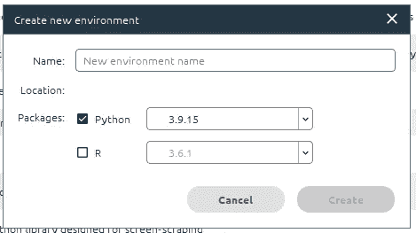
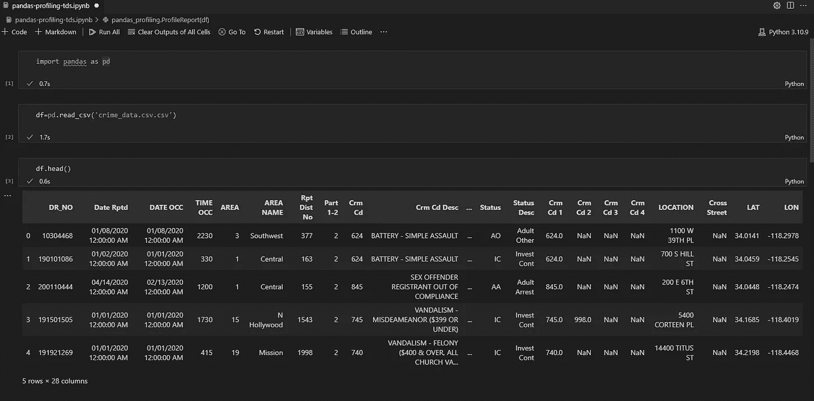
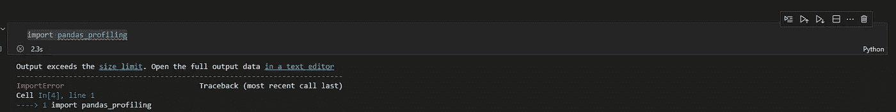
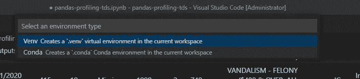
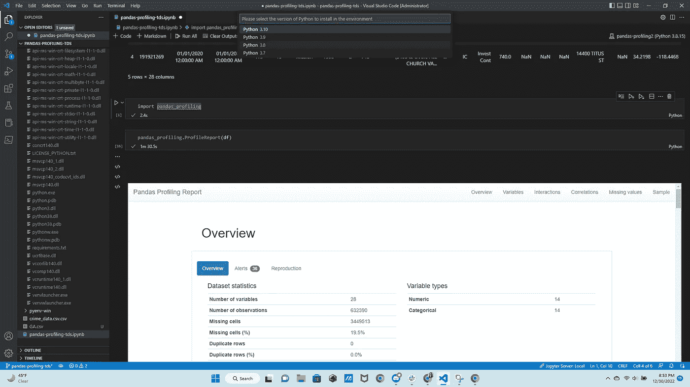
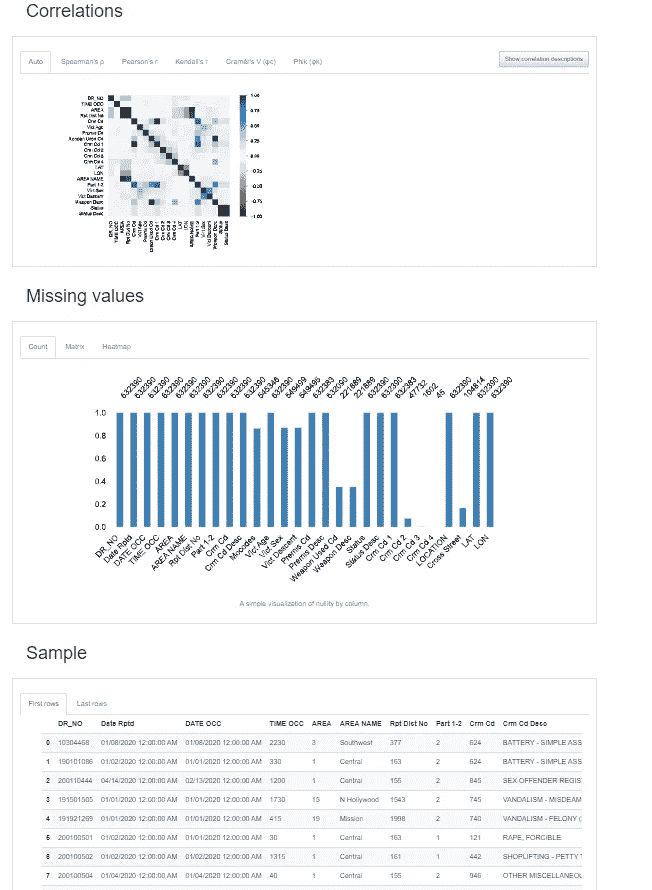

# Python 虚拟环境简介

> 原文：<https://towardsdatascience.com/python-virtual-environments-22c0d5f9689c>

## 它们是什么？我们什么时候使用它们？为什么？怎么会？


Billy Huynh 在 [Unsplash](https://unsplash.com?utm_source=medium&utm_medium=referral) 上拍摄的照片

您是否曾经在开始一个数据科学项目时发现没有安装合适的依赖项？到达代码块 2 时，发现您的 Pandas 版本与 Pandas-Profiling 不兼容，或者 Graphviz 无法导入到您的笔记本中，这是非常令人沮丧的。之前， [Manuel Treffer](https://medium.com/u/27ed7eb16994?source=post_page-----22c0d5f9689c--------------------------------) 发表了一篇与这个问题相关的[文章，主要关注 python 依赖冲突以及如何管理它们。作者列出了一些常见的问题以及解决这些问题的方法，但是我想重点介绍另一个可以解决更多问题的选项—管理虚拟环境。](/pythons-dependency-conflicts-are-depriving-data-scientists-of-sleep-ff52c5689336)

# 什么是虚拟环境？

作为初学者，您可能会像这样进行 python 编码——在全球环境中为您的所有数据科学项目安装所有必需的包。这样做有一些好处，其中之一就是简单。然而，一些缺点包括面临依赖冲突，更重要的是全球环境恶化。你有没有经历过你的包裹“再也找不到”的时候？如果是这样，你可能遇到了全球环境腐败，是时候找到一种新的方法来解决这个问题了。

[Python 文档将虚拟环境定义为](https://docs.python.org/3/tutorial/venv.html):

> 一个自包含的目录树，其中包含特定 Python 版本的 Python 安装，以及许多附加包

基本上，虚拟环境是您可以创建来隔离您的数据科学项目的东西。

# 我们何时使用虚拟环境，为什么？

这似乎是一个相当简单的问题，事实也的确如此。有一个最重要的答案…您正在处理多个基于 python 的项目。

例如，如果您某一天在做一个 NLP 项目，第二天又在做一个 CNN 项目，那么没有必要在一个环境中为这两个项目安装所有必需的包。相反，你可以为 NLP 创造一个环境，为你的 CNN 创造一个环境。

[Athreya Anand](https://medium.com/u/7947b7445b03?source=post_page-----22c0d5f9689c--------------------------------) 在他的文章[中很好地总结了这一点，即为什么你应该为每个 python 项目使用虚拟环境](/why-you-should-use-a-virtual-environment-for-every-python-project-c17dab3b0fd0)。如果你读了这篇文章，你会发现创建虚拟环境的主要原因是为了提高效率。

你的电脑就像一个公共图书馆。每次你在你的全球环境中安装软件包，你都在添加越来越多的书。最终，这导致了材料的混乱和冲突。想想看，如果你有一个图书馆，你会把它分成几个部分。你也可以定期检查书籍，以确保内容是最新的。你的电脑也一样。

当您在从事一个重要的数据科学项目时，您最不想浪费时间的事情就是纠正包的依赖性。这降低了工作效率，坦率地说，它真的磨我的齿轮。作为一名新的数据科学家，我花了一些时间来了解虚拟环境，但我可以向您保证，这是数据科学家工具包中的核心技能。因此，我想介绍一下虚拟环境是如何工作的。

# 如何使用 python 虚拟环境

创建和管理虚拟环境有几个选项，我们将在下面介绍:

1.  [Venv](https://docs.python.org/3/library/venv.html)

这为创建虚拟环境提供了一个轻量级的选项。首先，您需要在命令行中运行以下命令:

```
python3 -m venv /path/to/new/virtual/environment
```

该命令使用新虚拟环境的名称创建一个目录，其中包含几个不同的项目:

*   `pyvenv.cfg`
*   `home`键
*   一个`bin`(或 Windows 上的`Scripts`)
*   `lib/pythonX.Y/site-packages`子目录(在 Windows 上，这是`Lib\site-packages`)

一旦设置好这些项目，您的环境就被激活了，您可以开始工作了。

# venv 有哪些优点？

*   您并不局限于 python 的特定版本
*   您的代码是可复制的。如果有人想运行你的脚本，他们只需要创建一个具有相同需求的 venv。
*   全球环境不会被你并不总是需要的 python 包轰炸

# venv 有什么缺点吗？

占用了一些空间…但真的就这样了。如果你能腾出几百兆字节，那么这应该不是一个问题。

# 2.康达环境

如果您通常使用 anaconda navigator 或 conda，那么您可能更倾向于使用 conda 环境。这也很容易实现。

创建 conda 环境有几个选项:

*   运行以下命令行:

```
 conda create — name myenv
```

*   使用一个`environment.yml`文件
*   使用 anaconda navigator 的 UI 来创建您的环境



作者形象

对于希望使用点击式界面来创建环境的新程序员来说，这是一个很好的选择。如果你想了解更多关于 Anaconda Navigator 的信息，点击这里。

# 3.Docker 容器

对于那些稍微精通 python 编程的人来说，你可能想看看 docker——特别是 [docker 容器](https://stephen-odaibo.medium.com/docker-containers-python-virtual-environments-virtual-machines-d00aa9b8475)。

根据[码头工人的说法，](https://www.docker.com/resources/what-container/)集装箱是

> “一个标准的软件单元，它将代码及其所有依赖项打包，以便应用程序能够快速可靠地从一个计算环境运行到另一个计算环境。”

这意味着 docker 有三个核心优势:

*   **代码隔离**—将软件从全球环境中隔离出来，并确保它按照标准运行
*   独立性——Docker 容器确保其他人可以在另一个平台上运行你的代码
*   **可移植性** — Docker 不需要每个应用都有操作系统，这提高了服务器效率，降低了成本

如果您在 Docker 映像中打包 python 应用程序，以下代码可用作激活虚拟环境的模板:

```
FROM python:[VERSION]

CMD ["python", "yourcode.py"]

RUN virtualenv /ve

ENV PATH="/ve/bin:$PATH"

RUN /ve/bin/[PIP INSTALL PACKAGES]

CMD ["/ve/bin/python", "CODE.py"]
```

# 使用 Python 虚拟环境:示例

现在您已经有了创建和激活虚拟环境(通过 venv、conda 和/或 docker)的基础，下一步是为一个新的 python 项目实践这个过程。

一个可能对实践有帮助的项目的例子是一个使用熊猫轮廓的项目。这是因为 pandas-profiling 依赖于 python、numpy、pandas 等的版本。你在吸毒。在这个简单的例子中，我将介绍如何使用 pandas-profiling 2.9，这要求我使用 python 3.8.15 而不是我通常使用的 3.10.9 来创建 venv。

我首先打开了我在[Data.gov(2020 年至今的犯罪数据)](https://catalog.data.gov/dataset/crime-data-from-2020-to-present)上找到的一个数据集。我在 VS 代码中的全局环境中使用了以下代码:

```
import pandas as pd
df=pd.read_csv('crime_data.csv')
df.head()
```

如您所见，这正如预期的那样有效:



作者形象

注意 python 版本在右上角(Python 3.10.9)。

当我试图导入熊猫概况时，我遇到了一个问题:



作者的错误图像

具体来说，这是最后一条错误消息:

```
ImportError: cannot import name 'ABCIndexClass' from 'pandas.core.dtypes.generic'
```

如果您在 google 上快速搜索一下这个错误，您会发现在使用 pandas-profiling 时，由于依赖项名称的变化，这个错误太常见了。要解决这个问题，最好在虚拟环境中工作，在虚拟环境中可以安装特定的 python 和包版本。

我用 Crtl+Shift+P 命令在 VS 代码中直接做到了这一点。我选择了创建环境。接下来，您可以选择 venv 或 conda:



作者图像

我创建了一个 conda 环境，用 python 3.8.15 命名为 pandas-profiling2



python 版本 conda 环境

一旦设置好了，我就在我的熊猫档案笔记本上运行代码，瞧！我在下面附上了一些熊猫简介报告的截图:



# 常见问题

1.  您如何激活您的虚拟环境？

要激活 python 虚拟环境，请运行以下命令:

```
source env/bin/activate
```

**2。如何停用虚拟环境？**

在命令行中运行以下代码

```
~ deactivate
```

**3。什么是需求文件？**

需求文件是所有项目依赖项的列表。要生成您的需求文件，请运行以下命令:

```
pip freeze > requirements.txt
```

创建需求文件后，您可以使用该文件运行 python 项目，而无需手动安装项目所需的单个包。