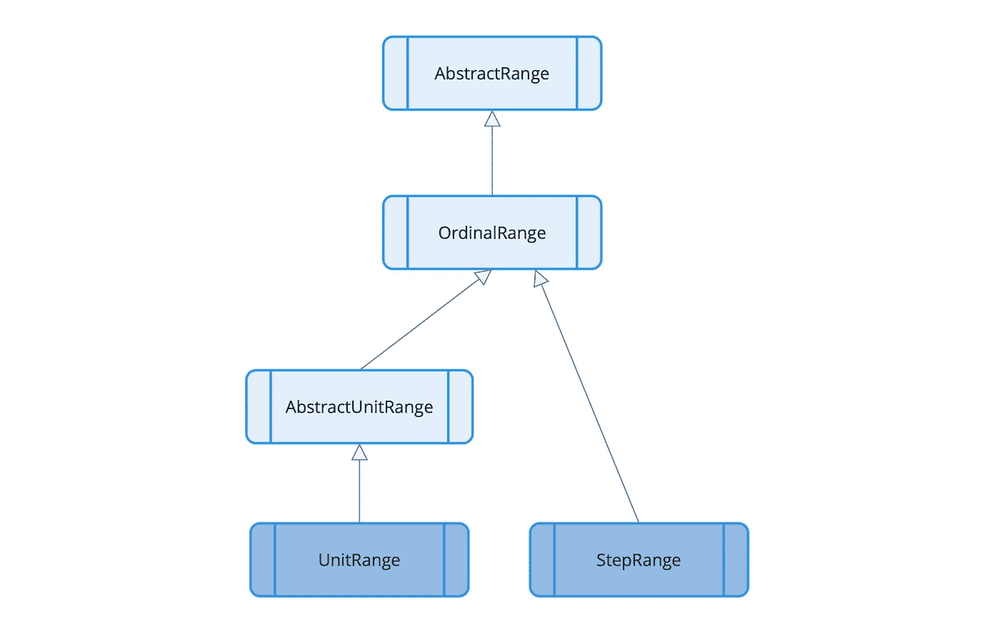

# Python vs. Julia:这也是关于一致性

> 原文：<https://towardsdatascience.com/python-vs-julia-its-also-about-consistency-236812dd64ba>


由[克劳迪奥·施瓦茨](https://unsplash.com/@purzlbaum?utm_source=unsplash&utm_medium=referral&utm_content=creditCopyText)在 [Unsplash](https://unsplash.com/?utm_source=unsplash&utm_medium=referral&utm_content=creditCopyText) 上拍摄的照片

## 与 Python 相比，Julia 的主要优势无疑是它的速度和多任务分派等概念。但是还有更多:在日常使用中，一致性起着重要的作用。

学习和使用一种编程语言的容易(或困难)程度在很大程度上取决于该语言不同构造的一致性。高度的一致性也有助于避免错误，从而使其成为构建高质量软件的一个重要方面。在本文中，我将展示 Julia 和 Python 在这方面的表现。

以 *ranges* 和 *indexing* 为例，我将首先说明这两种语言在这些概念的用法上有何不同，然后解释其背后的基本原理。

# 范围

在编程中，由一个下限和一个上限指定的数字范围是一个经常使用的概念。让我们来看看它在两种语言中是如何应用的。

## 整数范围

如果我们需要，比方说一个从 4 到 10 的整数范围，这表示如下:

```
Python: **range(4,11)  **                  Julia: **4:10**
```

在 Julia 中，当指定范围时，下限和上限是包含的，而在 Python 中，下限是包含的，上限是不包含的。所以我们必须给出一个 11 的上限，如果我们想让 Python 中的数字达到 10 的话。

## 数组中的一组元素

如果我们有一个数组`a`并且想要提取第 4 到第 10 个元素，我们必须写:

```
Python: **a[3:10]**                       Julia: **a[4:10]**
```

在 Python 中，数组(列表)的索引从零开始，所以第 4 个元素的索引为 3。同样，上限是唯一的。因此，要指定我们想要的元素一直到第 10 个元素(它的索引是 9)，我们必须在那里放一个 10。

正如我们在这里看到的，在 Julia 中使用了与上面完全相同的表达式。而且不仅仅是完全相同的表达式，还有*相同的* (range)对象。它可以像上面一样“独立”使用，也可以作为一个数组的参数进行索引。

## 从中抽取随机数的范围

以下表达式用于生成范围从 4 到 10 的随机数:

```
Python: **randint(4,10) **               Julia: **rand(4:10)**
```

在 Python 中，上限在这种情况下是包含的，因此偏离了常见的概念。在 Julia 中，我们将上面介绍的*完全相同的* range 对象作为参数传递给函数`rand`。

## 引入步长

如果我们不希望*每个*元素都在一个范围内，而是例如每隔一个元素，这可以在两种语言中使用*步长*来指定(在本例中，步长为 2，而不是 1)。所以为了得到从 4 到 10 的每隔一秒的数字，我们写:

```
Python: **range(4,11,2)   **            Julia: **4:2:10**
```

在 Julia 中，这个扩展版本也只是一个范围对象。所以它可以用在每一个指定 range 对象的地方，特别是在上面的例子中指定一个数组的子范围或者指定从中抽取随机数的范围。

```
 Julia: **a[4:2:10]
                                           rand(4:2:10)**
```

这在 Python 中是不可能的。

## 其他种类的范围

当然不仅仅是整数的范围。下一个示例显示了 2022 年 4 月 8 日的三个**小时时间戳**(从 12:00 到 14:00):

```
Python: **pandas.data_range(start='08/04/2022 12:00', 
                          periods=3, freq='H')**Julia:  **DateTime(2022,4,8,12):Hour(1):DateTime(2022,4,8,14)**
```

可以看出，在 Julia 中，使用了与整数范围相同的基本语法(`lower:step:upper`)。

在 Julia 中，这也可以应用于其他数据类型，比如字符。这里我们指定了一个从‘d’到‘k’的字符范围:

```
 Julia: '**d':'k'**
```

这在 Python 中是不可能的。

# 索引

本文中使用的第二个示例演示了如何应用一致(或不一致)的概念，它是二维数组式数据结构的索引。

## 访问矩阵中的元素

为了访问一个矩阵`m`(一个二维数组)的第 2 行第 4 列的元素，我们写:

```
Python: **m[1][3]**                   Julia: **m[2,4]**
```

在 Python 中使用了列表的列表(因为在基本库中没有 *n* 维数组)。因此，索引这样的结构是一个两步过程(并且需要两倍的括号)。同样，在 Python 中，索引从零开始，第 2 行的索引是 1，第 4 列的索引是 3。

## 访问数据帧中的元素

要获得*数据帧* `df`(类似于数据库表的二维数据结构)第 2 行第 4 列的元素，我们必须编写:

```
Python: **df.iloc[1,3]**              Julia: **df[2,4]**
```

在 Julia 中，这与上面的符号完全相同。

与 Python 中用来表示矩阵的列表相比， *DataFrame* 是真正的二维结构。因此指数可以写在*一对*括号内。

## 访问数据帧中的一系列元素

数据框中的每一列都有一个名称。这些名称也可以用来引用列。因此，如果我们希望将第 4 行到第 10 行的元素放在名为“A”和“B”的列中，我们编写:

```
Python: **df.loc[3:10,[“A”,“B”]]**    Julia: **df[4:10,[“A”,“B”]]**
```

## 为矩阵元素赋值

为了给矩阵`m`的第 2 行第 4 列中的矩阵元素赋值 5，我们必须写出:

```
Python: **m[1][3] = 5**               Julia: **m[2,4] = 5**
```

## 为数据帧中的元素赋值

如果我们想将值 5 赋给*数据帧* `df`的第 2 行第 4 列的元素，使用以下表达式:

```
Python: **df.iat[1,3] = 5**          Julia: **df[2,4] = 5**
```

要将该值赋给“A”列第 2 行中的元素，我们编写:

```
Python: **df.at[1,”A”] = 5**         Julia: **df[2,”A”] = 5**
```

## 摘要

为了在 Python 中索引一个矩阵(这是一个列表的列表),使用了由两个括号对组成的符号，而对于数据帧，必须使用一个与方法调用结合的括号对。每种分度(`iloc, loc, iat, at`)都有不同的方法*。*

在 Julia 中，所有这些情况都有一个共同的符号:两个索引总是放在一对括号中。就是这样。

# 但是为什么呢？

我认为很明显，Julia 中更高程度的一致性使得这种语言更容易学习、阅读和使用。那么问题就来了:如果优势这么明显，为什么不用 Python(或者其他某种一致性程度较低的编程语言)来做呢？

简短的回答是:因为他们不能！

## 更长的答案

现在来看一个更长的答案:如果我们看一下幕后，那么例如在 Julia 中访问一个矩阵中的元素(比如`m[2,4]`)就转化为对函数`getindex`的调用，如下所示:

```
getindex(m, 2, 4)
```

带括号的符号只是这个函数调用的语法糖(由操作符重载启用)。这适用于所有的例子:

使用“getindex”访问值[作者图片]

这些函数调用都是用不同类型的参数完成的:


“getindex”的不同参数类型[图片由作者提供]

根据参数使用的数据类型，调用适当的`getindex`实现。你可能已经猜到了:这就是著名的*多重调度*的工作原理！

所以*多调度*最终有利于*一个*函数(`getindex`)的一致使用，可以应用于*多个*类似的变体。此外，它被裹在漂亮的衣服里(用括号表示)；但这只是为了更好的可读性的包装。核心是基于多重调度。因此，没有这个概念的编程语言不能提供这种程度的一致性。

目前，仅 Julia 的基础库就有 220 种`getindex`变体。所以它确实允许这个概念的广泛应用。

## 赋值

向矩阵状结构的元素赋值的例子以类似的方式工作。他们用`setindex!`代替`getindex`。所以这里的机制是一样的。

使用“setindex”赋值[图片作者]

## 靶场的幕后

现在来看使用范围的例子:上面所有指定范围的表达式都表示类型为`UnitRange`(默认步长为 1)或`StepRange`(使用其他步长)的对象。两种类型都是抽象类型`AbstractRange`的子类型，如下图所示:



范围的类型层次结构[按作者分类的图像]

举个例子

*   `4:10`是一个`UnitRange{Int64}`类型的对象(花括号中的`Int64`告诉我们，范围的下限和上限都是这个整数类型)，
*   `4:2:10`一个类型为`StepRange{Int64, Int64}`的对象(这里的边界和步骤都属于类型`Int64`)和
*   `DateTime(2022,4,8,12):Hour(1):DateTime(2022,4,8,14)`
    属于`StepRange{DateTime, Hour}`类型。

然后再一次*多重分派*来到游戏中:

*   正如我们在上面所学的，用`a[4:10]`访问一个数组的一系列元素会转化为`getindex(a, 4:10)`。因此有一个`getindex`的实现，它接受`AbstractRange`的一个子类型作为索引参数(除了使用整数的“经典”索引和相当多的其他变化)。
*   使用`rand(4:10)`从一系列数字中抽取一个随机数意味着有一个`rand`的实现(在其他版本中)，它接受一个`AbstractRange`的子类型作为它的参数。

所以最终它也归结为*多重分派*的应用(它本质上依赖于 Julia 类型系统，可以由用户定义的类型任意扩展)。

## 和更多的句法糖

对于那些感兴趣的人来说:使用冒号如`4:10`或`4:2:10`的范围符号也只是普通函数调用的语法上更好的版本(同样基于操作符重载)。在这种情况下，它是功能`range`。

所以`4:10`实际上是`range(4, 10)``4:2:10`相当于`range(4, 10, step = 2)`(其中*步长*是可选的关键字自变量；这就是为什么在这个例子中关键字`step`是必要的)。

# 结论

使用像*索引*和*范围*这样的例子，我们可以看到事物可以在 Julia 中以非常一致的方式表达，这使得语言易于学习，易于阅读，最终也易于使用。

这种一致性是通过一些强大的概念实现的，如*多重分派*，一个*可扩展类型系统*和*操作符重载*，这些概念都经过精心制作，以便无缝地协同工作。