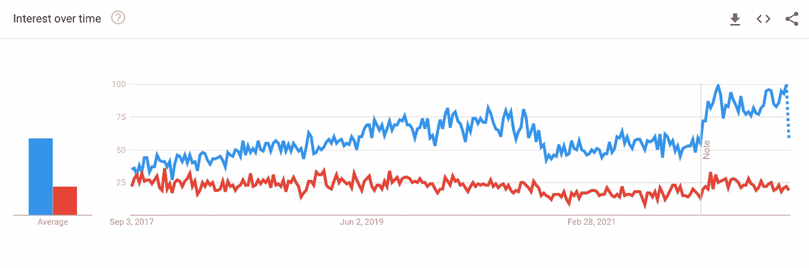

# Python vs R for Data Science:你做了正确的选择吗？

> 原文：<https://towardsdatascience.com/python-vs-r-for-data-science-did-you-make-the-right-choice-7d090dca4786>

## 两者对数据科学都有好处，但哪一个选项最适合你？

图片来自 Shutterstock，授权给 Frank Andrade

是的，Python 和 R 都是数据科学的好选择，但它们各有利弊。这意味着，如果你是数据科学的新手，一个选项可能比另一个更合适，如果你已经知道其中一个，学习另一个可能仍然是值得的。

使用 Python 和 R，您可以完成大多数您可以想象的数据科学任务，因此关于它们的能力没有争议，但是其他因素会使您选择一个而不是另一个。

一种工具可能对某些特定的任务更方便，对某些类型的用户来说可能比其他人更容易学习，可能会带来不同的工作机会，等等。

学习新事物是艰难的，所以确保你做出了正确的选择。在学习 Python 和/或 R for data science 之前，您需要了解以下一些事情。

## 你的背景是什么？

如果您是数据科学的新手，在 Python 和 R 之间做出选择的一个简单方法是考虑您的背景。如果你有多年的编程经验，学习像 Python 或 R 这样的新编程语言并不困难，但是如果你过去很少使用像 Excel 或 SPSS 这样的工具，情况就不同了。

让我们看看谁使用 Python 和 R，他们用它们做什么。

r 是一种由统计学家创造的编程语言，主要用于统计计算。也就是说，R 不仅被统计学家使用，还被数据挖掘者、生物信息学家和其他使用它们进行数据分析和开发统计软件的专业人士使用。

另一方面，Python 是一种通用语言，不仅用于数据科学，还用于构建 GUI、开发游戏、网站等。软件工程师、web 开发人员、数据分析师和业务分析师等专业人员使用 Python 来完成各种各样的任务。

总而言之，如果您来自 Excel、SAS 或 SPSS，R 可能更容易掌握，但是如果您已经用其他编程语言编写了一段时间的代码，并且已经形成了一种编程思维，Python 将更容易使用和习惯。

## 数据科学哪个更受欢迎？雇主在 Python 和 R 专家身上寻求什么？

在学习一个工具之前，它的受欢迎程度是需要记住的一个重要因素。相信我，你不会想学一些在现实世界中根本用不到的东西。

Google Trends 上的关键词“python 数据科学”(蓝色)和“r 数据科学”(红色)之间的快速比较揭示了过去 5 年全球对这两种编程语言的兴趣。

谷歌趋势

毫无疑问，对于数据科学来说，Python 比 R 更受欢迎。

另一方面，当谈到数据科学时，雇主在 Python 和 R 专家中寻求不同的东西。在包含术语数据科学和 R(但不是 python)以及术语数据科学和 Python(但不是 R)的招聘公告中进行的[比较揭示了在每组招聘公告中出现的最常见的数据科学工具和技术。](/r-vs-python-comparing-data-science-job-postings-seeking-r-or-python-specialists-2c39ba36d471)

在 [wordcloud](/r-vs-python-comparing-data-science-job-postings-seeking-r-or-python-specialists-2c39ba36d471) 中，我们可以看到带有数据科学和 R 术语的职位发布通常包括“研究”、“SQL”和“统计”等内容，而带有数据科学和 Python 术语的职位发布包括“机器学习”、“SQL”、“研究”以及 AWS 和 Spark 等工具。

## 哪一个为数据科学提供了最好的工具？

数据科学工作流涉及数据收集、探索和可视化等内容。虽然 Python 和 R 都可以完成这项工作，但是它们提供的工具和软件包各有利弊。

**数据收集:**R 和 Python 都支持各种各样的格式，比如 CSV 和 JSON，除此之外，R 还允许你将 Minitab 或 SPSS 中构建的文件转换成数据集。此外，两者都允许你从网站提取数据，以建立自己的数据集，但 Python 有更先进的工具，如 Selenium 和完整的框架，如 Scrapy。

**数据探索**:这是数据科学家花费大量时间的一个步骤，所以看看 R 和 Python 中使用的包。在 Python 中，我们主要使用 [Pandas](/a-python-pandas-introduction-to-excel-users-1696d65604f6) 和 [Numpy](/numpy-basics-for-people-in-a-hurry-8e05781503f) 来探索数据集，而 R 则有不同的为数据探索而构建的包。一张图片胜过千言万语，所以请查看在 [R](https://www.r-bloggers.com/2018/11/explore-your-dataset-in-r/) 和 [Python](/a-complete-yet-simple-guide-to-move-from-excel-to-python-d664e5683039) 中完成的这些简单的探索性数据分析，以更详细地了解所使用的工具。

**数据可视化**:在 Python 中，你可以使用 Pandas 库来制作[基本图形](/the-easiest-way-to-make-beautiful-interactive-visualizations-with-pandas-cdf6d5e91757)，但是当你想要创建可定制的高级可视化时，你需要学习诸如 Matplotlib 和 Seaborn 之类的库。问题是它们可能很难学习(并记住它们的语法)，而且用 Python 创建的可视化效果也不是最美观的。相比之下，数据可视化才是 R 擅长的。r 内置了对许多标准图形的支持，并提供了像 [ggplot2](https://www.youtube.com/watch?v=rfR9Nrpfnyg) 这样的高级工具来提高图形的质量和美观度。

## 那么应该学 R、Python，还是两者都学？

至此，你大概知道哪个才是最适合你的工具了，不过我来和你分享一下我认识的人都是怎么做的。

有些人选择 R 而不是 Python，因为它强大的面向统计的特性和强大的可视化功能，而其他人更喜欢 Python 而不是 R，因为它的多功能性和灵活性不仅允许他们执行强大的数据科学任务，而且还不止于此。

如果你已经知道一门，学习另一门是值得的，因为它们提供了不同的工作机会和工具。

用 Python 学习数据科学？ [**通过加入我的 10k+人电子邮件列表，获取我的免费 Python for Data Science 备忘单。**](https://frankandrade.ck.page/26b76e9130)

如果你喜欢阅读这样的故事，并想支持我成为一名作家，可以考虑报名成为一名媒体成员。每月 5 美元，让您可以无限制地访问数以千计的 Python 指南和数据科学文章。如果你使用[我的链接](https://frank-andrade.medium.com/membership)注册，我会赚一小笔佣金，不需要你额外付费。

<https://frank-andrade.medium.com/membership> 