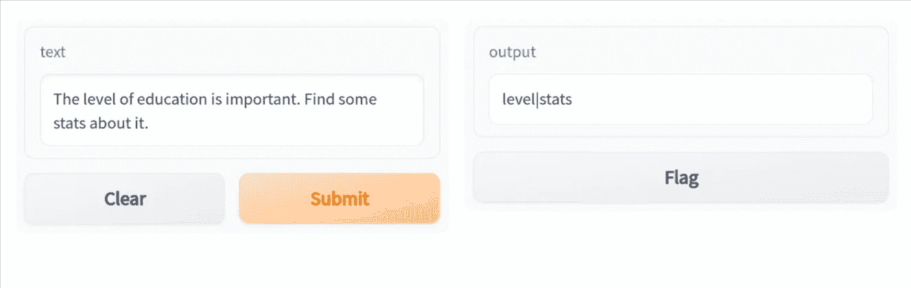
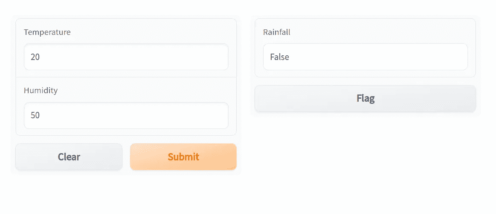
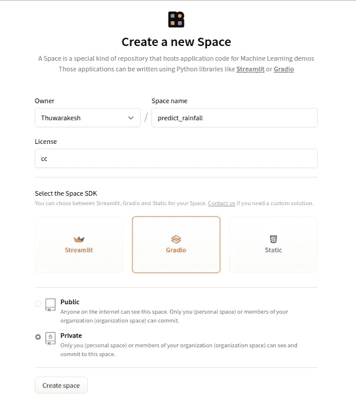
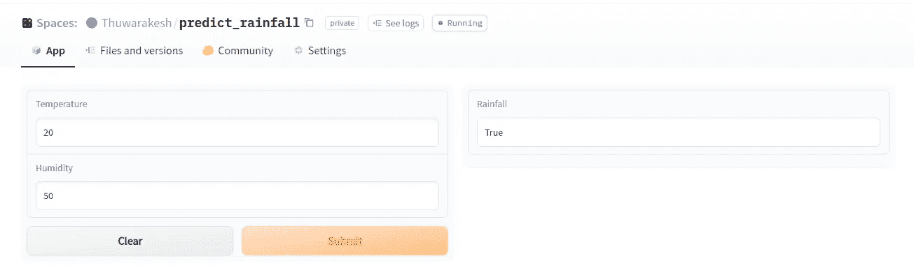
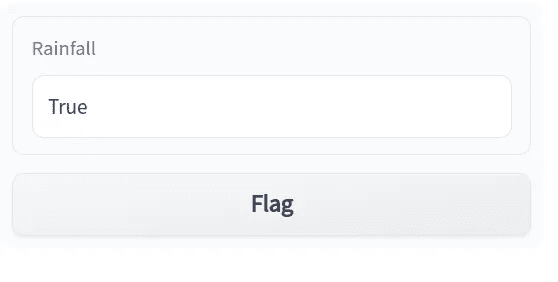
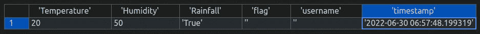

# 为 Python APIs 和 ML 模型创建 Web UIs

> 原文：<https://towardsdatascience.com/python-web-apps-for-machine-learning-e29d075e6459>

## 快速制作原型并与其他人共享 web 应用程序。收集关于预测的反馈，以提高 ML 模型的性能。


由[基利安·卡蒂涅斯](https://unsplash.com/@kikisad?utm_source=medium&utm_medium=referral)在 [Unsplash](https://unsplash.com?utm_source=medium&utm_medium=referral) 拍摄的照片

你如何与他人分享你的 ML 模型？尤其是和那些没有编程技能的人？

我们需要一个界面，不是吗？

一个友好的用户界面可以得到每个人的认同，并产生更多的反馈来改进。

以前，你需要 web 开发人员的帮助来将你的模型和 API 转换成应用程序。但是今天，数据科学家有许多选择来开发一个不离开他们的笔记本。

在过去，我曾经写过关于 Streamlit 的文章，这是一个非常好的工具。这部电影以格拉迪欧为特色。一个同样神奇的工具，为 ML 模型提供了一个非常酷的选择。

</how-to-create-stunning-web-apps-for-your-data-science-projects-c7791102134e>  

这篇文章讨论了:

*   如何为你的 APIs Gradio 开发 UI 组件；
*   如何使用它部署 scikit-learn 模型；
*   如何在 Huggingface 上部署您的解决方案(免费)，以及；
*   一个非常酷的选择。

# 用 Python 开发 API 的用户界面

Gradio 帮助我们在熟悉的 Python 环境中开发 UI 组件。它的声明式小部件库会让你有宾至如归的感觉。你也可以在笔记本上做。然而，首先，它非常简单。

</5-python-gui-frameworks-to-create-desktop-web-and-even-mobile-apps-c25f1bcfb561>  

您可以从 PyPI 存储库中安装 Gradio。以下命令将带您开始。

```
pip install gradio
```

一旦安装完毕，再有三行代码就会把你的 API 转换成一个应用程序。

这里有一个例子。

上面的代码有一个在文本中查找回文的功能。

回文是前后相同的单词。该函数接受一个文本字符串并返回一个回文字符串。

该脚本还有一个 gradio 接口。它允许您以图形方式与函数进行交互。

在终端中输入:python3 app.py 即可启动 app。一旦服务器运行，您就可以访问浏览器来访问应用程序。

如果你在 Jupyter 笔记本上，运行代码块`app.launch()`就足够了。

```
python <YOURSCRIPT>.py
```

运行上述命令后，控制台将打印 web 链接以访问您的应用程序。该应用程序将如下所示。



基本 Python(Gradio) web 应用——作者截图[。](https://thuwarakesh.medium.com)

你可以选择一个 API 来代替回文查找函数。

## 更多的小部件和更好的配置选项。

Gradio 可以灵活地将多个小部件作为输入和输出。这些小部件可以是文本、图像、音频文件、滑块等。您还可以显示数据框架和图表。

下面的例子使用了一堆其他的小部件。


Python (Gradio)应用程序有更多的小部件。每个小部件都接受参数来进一步配置其行为。—作者截图[。](https://thuwarakesh.medium.com)

这不是可用选项的完整列表。有关您可以使用的组件的详细列表，请参考文档。写这篇文章的时候，他们有 25 个人！

# 使用 Gradio 部署 Scikit-learn 模型

Gradio 也是部署您的 ML 模型的一种方式。

在一个扩展的 ML 应用程序中，你会有一个更复杂的安装。但是一切都应该从小事做起。在我看来，你可以从 Gradio 开始测试你的模型的性能。

Python 开发者大多使用 [Scikit learn](https://scikit-learn.org/stable/) 来创建和训练 ML 模型。您可以将训练好的模型保存为 pickle 文件供以后使用。以下是如何处理模型并将其保存在文件系统中的方法。

现在，您可以在函数中使用它并创建预测服务。Gradio 将负责为您的模型构建一个界面。

gradio 应用程序接收温度和湿度，并返回降雨量。当用户点击按钮时，应用程序调用 predict _ rain 函数，该函数使用 pickled 模型来预测降雨。



在 web 应用程序中包装机器学习模型的演示。—[作者](https://thuwarakesh.medium.com)截图。

# 部署 Gradio 应用程序 Hugginggace

Huggingface 是一个构建、训练和部署 ML 模型的平台。这也是一个数据科学家相互交流的全球社区。

如果你想和别人分享你的应用， [Huggingface](https://huggingface.co/) 是最好的选择。如果你是一个组织的成员(在 Huggingface 中)，你只能在组织内部分享你的作品。如果没有，你可以选择私有或者公开。

您可以通过从 Huggingface 主页创建新空间来开始部署。

您还可以在不同的可用许可类型中进行选择。这些都是有用的，尤其是如果你在公共领域下制作你的应用。



将 Gradio 应用程序部署到 Huggingface 空间。—截图作者[作者](https://thuwarakesh.medium.com)。

在发布更改方面，Huggingface 与 git 没有太大的不同。事实上，您将使用本地 git 在云上更新您的应用程序。

让我们克隆 Huggingface 存储库，并将我们的应用程序代码转移到新的 repo 中。然后我们可以通过推送代码在 Huggingface spaces 上发布应用。

```
$ git clone [https://huggingface.co/spaces/Thuwarakesh/predict_rainfall](https://huggingface.co/spaces/Thuwarakesh/predict_rainfall)
# Replace the URL with your huggingface space url.$ mv app.py requirements.txt predict_rainfll # to your folder$ cd predict_rainfall
$ git add app.py requirements.txt
$ git commit -m 'Create rainfall predictor'$ git push
```

以上步骤将在 Huggingface spaces 上创建一个新的 Docker 容器，并部署您的应用程序。如果您在浏览器上访问共享空间的 URL，就会看到您的应用程序。



Huggingface 中托管的 Gradio 应用程序—作者截图[。](https://thuwarakesh.medium.com)

如果您选择将空间公开，您可以与全世界共享 URL 并展示您的新 ML 应用程序。

# 在您的 ML 应用上获得用户的实时反馈。

有经验的 ML 工程师知道，构建和部署机器学习模型是一个迭代的过程。改进模型的核心是反馈回路。

<https://levelup.gitconnected.com/concept-drift-in-machine-learning-1fc7a4396b10>  

Gradio 的创建者在设计时就考虑到了反馈收集。除了输出，您还会看到一个 Flag 按钮。如果那些测试你的应用的人觉得预测是错误的，他们可以标记它。



接收关于最大似然预测的反馈。Gradio 有标志按钮来报告错误的预测。—[作者](https://thuwarakesh.medium.com)截图。

Gradio 在文件系统上以 CSV 格式保存标记的记录。它记录所有输入值和预测以及其他相关信息。



Gradio 将标记的预测收集到一个 CSV 文件中——作者 T4 截图。

标记的记录是需要 ML 工程师注意的例外情况。这些是您的模型中表现不佳的区域。ML 工程师可以在审核标记并根据问题的重要性进行权衡后采取纠正措施。

# 最后的想法。

作为数据科学家，我们需要快速构建工作原型。原型会经常改变。在开发阶段，将 JavaScript 框架和其他技术引入堆栈是不明智的。

借助 Streamlit 和 Gradio 等工具，我们现在可以为我们的 ML 模型构建快速而肮脏的应用程序。Gradio 特别适合 ML 项目，因为它收集反馈。

此外，Gradio 和 Streamlit 都帮助我们在 Huggingface 上发布应用程序。这让我们的应用覆盖了更广泛的受众。

这两个工具都允许我们在舒适的笔记本环境中构建应用程序。数据科学家可以构建专业外观的应用程序，全部用 Python 编写。

> 感谢阅读，朋友！在 [**LinkedIn**](https://www.linkedin.com/in/thuwarakesh/) 、 [**Twitter**](https://twitter.com/Thuwarakesh) 、 [**Medium**](https://thuwarakesh.medium.com/) 上跟我打招呼。
> 
> 还不是中等会员？请使用此链接使 [**成为**](https://thuwarakesh.medium.com/membership) 的会员，因为，在不为你额外付费的情况下，我为你引荐赚取一小笔佣金。