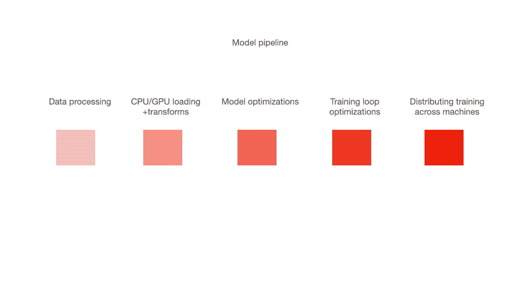
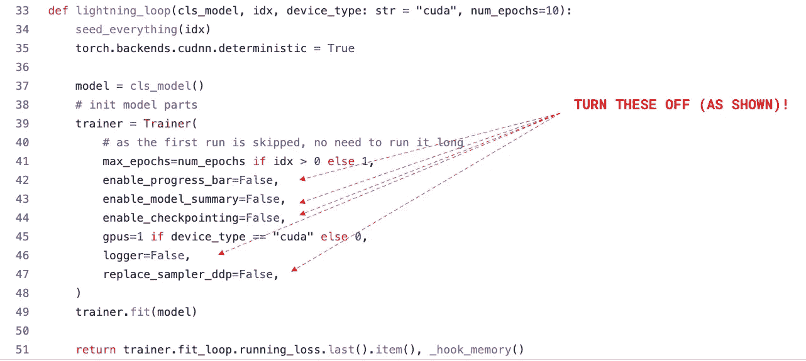
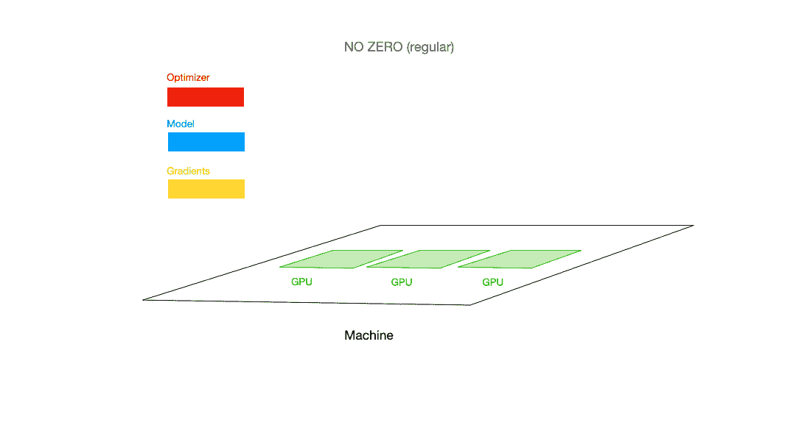
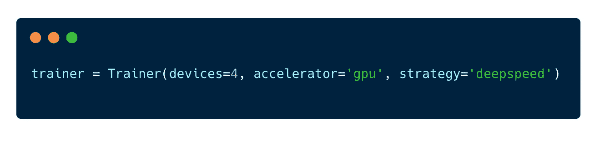
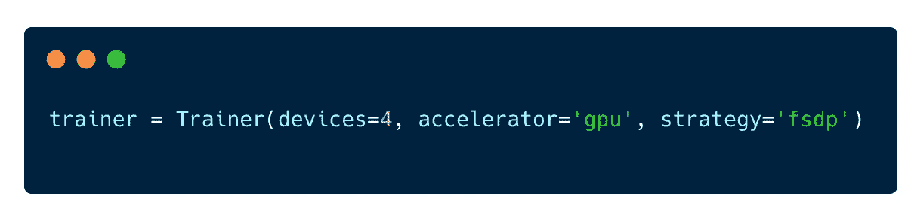
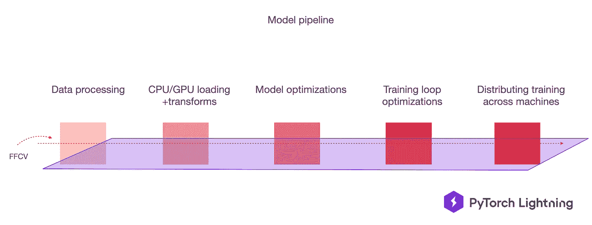
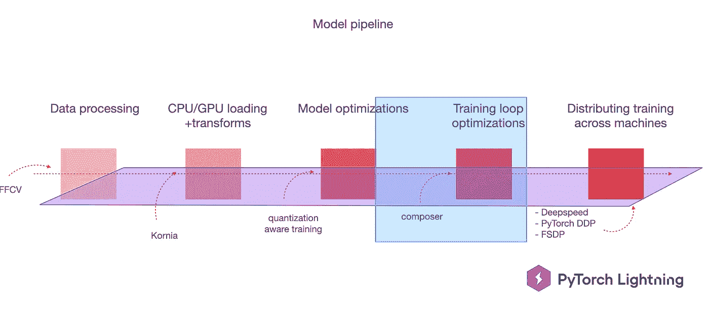
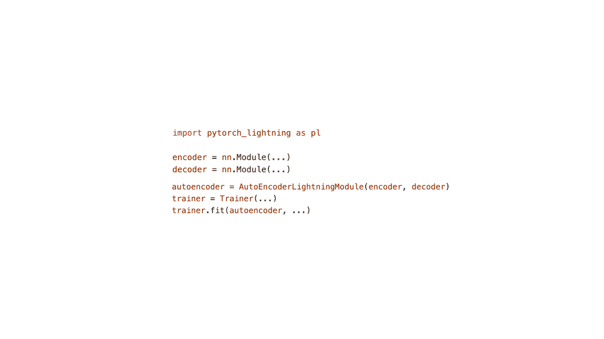

# 火炬闪电 vs 极速 vs FSDP vs FFCV vs …

> 原文：<https://towardsdatascience.com/pytorch-lightning-vs-deepspeed-vs-fsdp-vs-ffcv-vs-e0d6b2a95719>

## 通过混合使用 PyTorch Lightning 的这些技术来组合其优势，从而扩大 PyTorch 模型培训

PyTorch Lightning 已经成为世界上使用最广泛的深度学习框架之一，它允许用户**专注于研究而不是工程**。Lightning 用户受益于 PyTorch 模型训练的大规模加速，从而节省了大量成本。

PyTorch Lightning 不仅仅是一个深度学习框架，它还是一个允许最新和最棒的技巧完美结合的平台。

> 闪电是一个̶f̶r̶a̶m̶e̶w̶o̶r̶k̶平台

闪电是一个平台(鸣谢:作者自有)

在过去的几年中，有许多库已经开始优化培训管道的每个阶段，当单独使用时，通常会导致 2-10 倍的速度提升。有了 Lightning，这些库可以一起用于**合成 PyTorch 模型的效率**。

在本帖中，我们将从概念上理解这些技术，并展示如何在 PyTorch Lightning 中启用它们。

# 标杆 PyTorch 闪电

PyTorch Lightning 通过*默认、*给用户提供了大量有用的东西，比如检查点、Tensorboard 日志、进度条等等……当对 PyTorch 进行基准测试时，这些必须关闭(是的，PyTorch + tensorboard 比没有它的 PyTorch 慢得多)。

要关闭的标志(鸣谢:作者自己的)

> 要比较 PyTorch Lightning 和 PyTorch **禁用“附加功能”**

请记住 PyTorch Lightning 是由 PyTorch 组织的，因此与 PyTorch 进行比较是没有意义的。每个👏单一的👏将请求拉至 PyTorch Lightning 基准，并与 PyTorch 进行比较，以确保两者在解决方案或速度上没有分歧([查看代码！](https://github.com/PyTorchLightning/pytorch-lightning/blob/master/tests/benchmarks/test_basic_parity.py))

以下是其中一个基准的示例:

PyTorch vs 闪电基准代码(鸣谢:作者自有)

# 深度速度

[DeepSpeed](https://github.com/microsoft/DeepSpeed) 是微软创造的一种大规模训练大规模十亿参数模型的技术。如果你有 800 个 GPU，你也可以得到[万亿个参数模型](https://www.microsoft.com/en-us/research/blog/deepspeed-extreme-scale-model-training-for-everyone/)😉。

DeepSpeed 如何实现规模的关键是通过引入**零冗余优化器(** [**零**](https://www.deepspeed.ai/tutorials/zero/) **)。零有三个阶段:**

1.  优化器状态跨进程进行分区。
2.  渐变是跨进程划分的。
3.  模型参数跨流程进行划分。

DeepSpeed 解释(鸣谢:作者自己)

要在闪电中启用 DeepSpeed，只需将`strategy='deepspeed'`传递给你的闪电训练器( [docs](https://pytorch-lightning.readthedocs.io/en/1.2.0/advanced/multi_gpu.html?highlight=deepspeed#deepspeed) )。

在 Lightning 中启用 DeepSpeed(鸣谢:作者所有)

# FSDP

完全分片数据并行( [FSDP](https://fairscale.readthedocs.io/en/stable/api/nn/fsdp.html) )是 Meta 的分片版本，灵感来自 DeepSpeed(阶段 3)，针对 PyTorch 兼容性进行了优化([阅读他们最新的 1 万亿参数尝试](https://pytorch.medium.com/training-a-1-trillion-parameter-model-with-pytorch-fully-sharded-data-parallel-on-aws-3ac13aa96cff))。

FSDP 是由脸书(现在的 Meta)的 FairScale 团队开发的，重点是优化 PyTorch 兼容性。尝试两种方法，看看你是否能注意到不同之处！

要在 PyTorch Lightning ( [docs](https://pytorch-lightning.readthedocs.io/en/stable/advanced/advanced_gpu.html) )中使用 FSDP，请使用:

《闪电》中的 FSDP(鸣谢:作者自己)

# FFCV

DeepSpeed 和 FSDP 优化了负责跨机器分发模型的管道部分。

当您有一个图像数据集时，FFCV 通过利用数据集中的共享结构来优化管道中的数据处理部分。

FFCV 优化了更广泛的管道的一部分(鸣谢:作者自己)

[FFCV](https://github.com/libffcv/ffcv) 当然是对极速和 FSDP 的补充，因此也可以在 PyTorch Lightning 中使用。

*注意:FFCV 团队报告的基准测试并不完全公平，因为他们没有禁用 PyTorch Lightning 中的 tensorboard、logging 等功能，也没有启用 Deepspeed 或 FSDP 来合成使用 FFCV 的效果。*

FFCV 集成目前正在进行中，将在未来几周内在 PyTorch Lightning 中提供。

 [## 使用 PL 问题# 11538 PyTorchLightning/pytorch-lightning 启用 ffcv

### 一个团队引入了 ffcv，它在数据加载器级别进行优化。只要它能代替…

github.com](https://github.com/PyTorchLightning/pytorch-lightning/issues/11538) 

# 设计者

Composer 优化了培训管道的一部分(鸣谢:作者自己的)

Composer 是另一个处理培训管道不同部分的库。Composer 添加了某些技术，如 BlurPooling、ChannelsLast、CutMix 和 LabelSmoothing。

这些技术可以在优化开始之前添加到模型中。这意味着，要将 composer 与 PyTorch Lightning 一起使用，您只需在开始训练循环之前对模型手动运行优化即可。

马赛克优化适用于兼容 PyTorch 闪电(信用:作者自己的)

Lightning 团队正在研究将 mosaic 与 PyTorch Lightning 整合的最佳方式。

 [## 支持马赛克优化作为插件问题# 12360 PyTorchLightning/pytorch-lightning

### 这个库马赛克有优化模型以加快训练的巧妙技巧。每个应用程序都是作为单个…

github.com](https://github.com/PyTorchLightning/pytorch-lightning/issues/12360) 

# 结束语

PyTorch Lightning 不仅仅是一个深度学习框架，它还是一个平台！

PyTorch Lightning 允许您集成最新的技术，这样它们可以很好地协同工作，并保持您的代码高效有序，而不是试图重新发明轮子。

新推出的解决管道不同部分的优化将在几周内集成。如果您正在创建一个新的社区，请联系 lightning 团队，以便 lightning 团队可以与您合作，使您的集成成为社区的一个平稳体验！