# 时序数据的 Pytorch LSTMs

> 原文：<https://towardsdatascience.com/pytorch-lstms-for-time-series-data-cd16190929d7>

## 使用 Pytorch 函数 API 构建单变量时间序列的时态模型


[天一马](https://unsplash.com/@tma?utm_source=medium&utm_medium=referral)在 [Unsplash](https://unsplash.com?utm_source=medium&utm_medium=referral) 上拍照

Y 您可能已经注意到，尽管我们在现实世界中经常会遇到序列数据，但是网上并没有大量的内容展示如何使用 Pytorch 函数式 API 从头开始构建简单的 LSTMs。即使 Pytorch 官方文档中的 LSTM 例子也只适用于自然语言问题，当试图让这些递归模型处理时间序列数据时，这可能会令人迷惑。在本文中，我们将为构建端到端 LSTM 打下坚实的基础，从张量输入和输出形状到 LSTM 本身。

本文的目标是能够实现任何单变量时间序列 LSTM。我们首先检查传统神经网络对于这些任务的缺点，以及为什么 LSTM 的输入与简单神经网络的形状不同。然后，我们将直观地描述让 LSTM“记忆”的机制有了这个大概的理解，我们可以使用从`nn.Module`继承的传统模型类结构实现 Pytorch LSTM，并为它编写一个 forward 方法。我们用这个来看看我们是否能让 LSTM 学习一个简单的正弦波。最后，我们尝试编写代码来概括如何根据手头的问题初始化 LSTM，并在前面的例子中进行测试。

# 最简单的神经网络

L 假设我们有以下时间序列数据。我们不使用复杂的递归模型，而是将时间序列视为简单的输入输出函数:输入是时间，输出是我们测量的任何因变量的值。这本质上只是简化了一个单变量时间序列。

> Y 你可能想知道我们上面概述的问题和时间序列问题的实际顺序建模方法(如 LSTMs 中使用的)之间有什么*差异。区别在于解的递归性。这里，我们只是传递当前的时间步长，并希望网络能够输出函数值。然而，在递归神经网络中，我们不仅传入当前输入，还传入以前的输出。这样，网络可以学习先前函数值和当前函数值之间的相关性。在这里，网络没有办法学习这些依赖关系，因为我们根本不把以前的输出输入到模型中。*

让我们假设我们正在试图模拟克莱·汤普森伤愈复出后的上场时间。金州勇士队的教练史蒂夫·科尔不希望克莱回来后立即打很多分钟。取而代之的是，他将让克莱每场比赛打几分钟，并随着赛季的进行增加他的上场时间。我们将是克莱·汤普森的理疗师，我们需要预测克莱每场比赛将打多少分钟，以确定他的膝盖需要多少绷带。

因此，伤愈复出后的比赛次数(代表输入时间步长)为自变量，克莱·汤普森的上场分钟数为因变量。假设我们观察克莱 11 场比赛，记录他每次出场的上场时间，得到以下数据。

在这里，我们已经生成了每场比赛的分钟数，作为回归以来与比赛次数的线性关系。我们将使用 9 个样本作为训练集，2 个样本用于验证。

我们知道比赛次数和分钟数的关系是线性的。然而，我们仍然要使用非线性激活函数，因为这是神经网络的全部要点。(否则，这只会变成线性回归:线性运算的合成只是一个线性运算。)像往常一样，我们使用`nn.Sequential`来构建一个隐藏层的模型，有 13 个隐藏神经元。

我们现在需要编写一个训练循环，就像我们在使用梯度下降和反向传播来迫使网络学习时经常做的那样。提醒您，每个训练步骤都有几个关键任务:

1.  通过将模型应用于训练示例来计算通过网络的前向传递。
2.  基于定义的损失函数计算损失，该损失函数将模型输出与实际训练标签进行比较。
3.  通过网络反向传播损耗相对于模型参数的导数。在用`.zero_grad()`将当前参数梯度设置为零后，通过对损耗调用`.backward()`来完成。
4.  通过减去梯度乘以学习率来更新模型参数。这是通过我们的优化器完成的，使用`optimiser.step()`。

现在，我们需要做的就是实例化所需的对象，包括我们的模型，我们的优化器，我们的损失函数和我们要训练的时期数。

```
>>> Epoch 1, Training loss 422.8955, Validation loss 72.3910
Epoch 10000, Training loss 0.1970, Validation loss 324.8314
Epoch 20000, Training loss 0.1950, Validation loss 323.0615
Epoch 30000, Training loss 0.1922, Validation loss 320.4883
Epoch 40000, Training loss 0.1883, Validation loss 317.0684
Epoch 50000, Training loss 0.1825, Validation loss 313.0166
Epoch 60000, Training loss 0.1736, Validation loss 308.5492
...
Epoch 500000, Training loss 0.0007, Validation loss 299.8014
```

正如我们所看到的，该模型很可能明显过度拟合(这可以通过许多技术来解决，如正则化，或降低模型参数的数量，或实施线性模型形式)。培训损失基本为零。由于我们的因变量中固有的随机变化，上场时间在最后几场比赛中逐渐减少成一条平坦的曲线，导致该模型认为这种关系更像一条日志而不是一条直线。

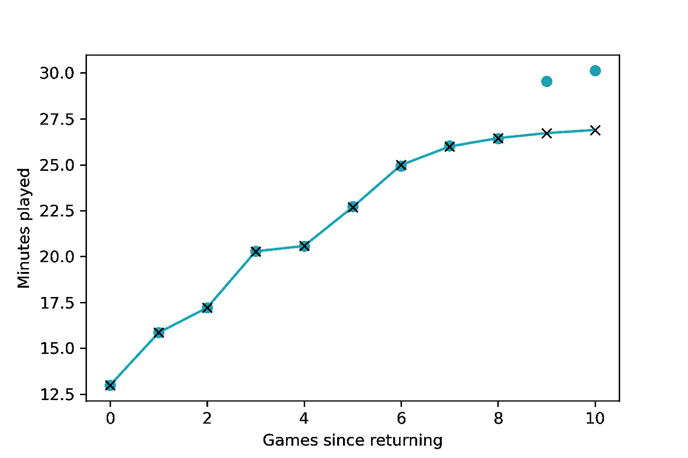

十字代表我们在训练神经网络 50，000 个时期后的预测。蓝点代表实际数据点(上场时间)。由于由故意噪声引起的训练样本变平，该模型不能完美地捕捉线性关系。移除模型中的 tanh()图层将移除非线性，从而迫使模型近似于回归输出。(图片由作者提供)

虽然它不是很成功，但这个初始的神经网络是一个概念验证，我们可以仅仅通过输入所有的时间步骤来开发序列模型。但是，如果没有关于过去的更多信息，并且没有存储和调用这些信息的能力，那么模型在顺序数据上的性能将会非常有限。

# LSTMs 背后的直觉

最简单的神经网络假设输入和输出之间的关系与先前的输出状态无关。它假设函数形状可以仅从输入中学习。在像顺序数据这样的情况下，这个假设是不成立的。任何一个特定时间步长的函数值都可以被认为直接受到过去时间步长的函数值的影响。这些值之间存在时间相关性。长短期记忆网络(LSTMs)是一种递归神经网络，擅长学习这种时间依赖性。

LSTMs 的关键是**单元状态**，它允许信息从一个单元流向另一个单元。这代表了 LSTM 的记忆，可以随着时间的推移而更新、改变或遗忘。进行这种更新的 LSTM 组件被称为**门**，它调节细胞包含的信息。门可以被视为神经网络层和逐点操作的组合。

如果你还不知道 LSTM 是如何工作的，数学很简单，基本的 LSTM 方程可以在 [Pytorch 文档](https://pytorch.org/docs/stable/generated/torch.nn.LSTMCell.html)中找到。网上有很多很棒的资源，[比如这个](https://colah.github.io/posts/2015-08-Understanding-LSTMs/)。作为快速复习，以下是每个 LSTM 细胞进行的四个主要步骤:

1.  *决定从单元格状态中删除哪些不再相关的信息。*这由被称为**遗忘门**的神经网络层(具有 sigmoid 激活功能)控制。我们将前一个单元的输出输入到遗忘门，遗忘门依次输出一个介于 0 和 1 之间的数字，决定遗忘多少。
2.  *用新信息更新单元状态。*一个称为**输入门**的神经网络层将前一个单元的输出和当前输入连接起来，并决定更新什么。tanh 层采用相同的连接，并创建可添加到状态的新候选值的向量。
3.  *更新旧的单元格状态以创建新的单元格状态。*我们将旧状态乘以步骤 1 中确定的值，忘记了我们之前决定忘记的事情。然后，我们添加在步骤 2 中找到的新候选值。这些构成了新的单元格状态，根据我们决定更新每个状态值的程度进行缩放。此单元已完成；我们可以将它直接传递给模型中的下一个单元。
4.  *根据以前的输出和当前的输入生成模型输出。*首先，我们获取更新后的单元状态，并将其传递给 NN 层。然后，我们找到通过 sigmoid 层的输出/输入向量的输出，然后用修改后的单元状态逐点组合它。这允许单元完全控制组成单元状态和当前单元输入，这给我们一个适当的输出。

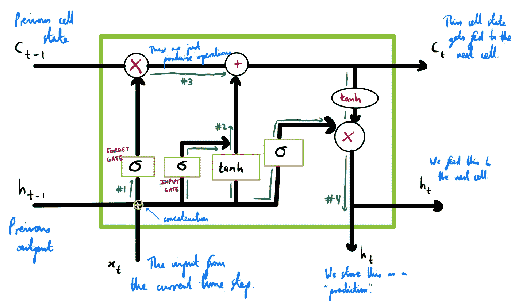

单个 LSTM 细胞的简单表示。黄色方框显示的是神经网络层——与常规的 rnn 不同，我们每个细胞中有四层，所有层都以高度指定的方式相互作用。(图片由作者提供)

注意，在上图中我们给出了两次输出。这些输出中的一个将被存储为模型预测，用于绘图等。另一个被传递到下一个 LSTM 单元，就像更新后的单元状态被传递到下一个 LSTM 单元一样。

# 皮托尔彻·LSTM

我们的问题是看 LSTM 是否能“学习”正弦波。这实际上是 Pytorch 社区中一个相对著名(阅读:声名狼藉)的例子。这是 Pytorch 的 Examples Github 知识库中唯一一个针对时序问题的 LSTM 的例子。然而，这个例子已经过时了，大多数人发现代码要么不能为他们编译，要么不能收敛到任何合理的输出。(在这个例子中，快速的 Google 搜索给出了一连串的堆栈溢出问题。)在这里，我们将逐步分解和修改他们的代码。

## 生成数据

我们从生成 100 个不同正弦波的样本开始，每个正弦波具有相同的频率和幅度，但开始于 *x* 轴上略有不同的点。

让我们浏览一下上面的代码。 *N* 为样本数；也就是说，我们正在产生 100 个不同的正弦波。许多人直觉地在这一点上犯错。由于我们习惯于在单个数据点上训练神经网络，例如上面的简单克莱·汤普森例子，因此很容易将这里的 *N* 视为我们测量正弦函数的点的数量。这是错误的；我们正在生成 N 个不同的正弦波，每个都有许多点。LSTM 网络通过检测多个正弦波而不是一个正弦波来学习。

接下来，我们实例化一个空数组 *x* 。将该数组视为沿 *x* 轴的点的样本。该阵列有 100 行(代表 100 个不同的正弦波)，每行有 1000 个元素长(代表 *L* ，或正弦波的粒度，即每个波中不同采样点的数量)。然后，我们通过对前 1000 个整数点进行采样来填充 *x* ，然后在由 *T* 控制的特定范围内添加一个随机整数，其中`x[:]`只是将整数沿行相加的语法。请注意，我们必须将第二个随机整数整形为整形【T21(N，1)】，以便 Numpy 能够将其广播到 *x* 的每一行。

最后，我们简单地将 Numpy 正弦函数应用于 *x* ，并让 broadcasting 将该函数应用于每行中的每个样本，每行创建一个正弦波。我们将其转换为类型`float32`。我们可以选择任意一个正弦波，并用 Matplotlib 绘制出来。让我们选择索引为 0 的第一个采样正弦波。

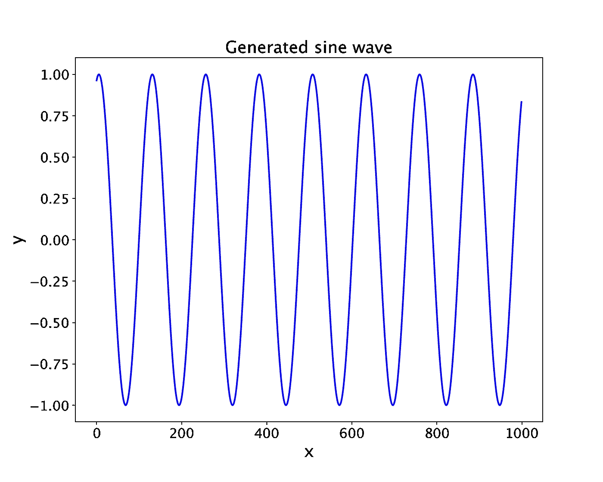

将在我们的 LSTM 模型中使用的 100 个生成的正弦波之一。每个正弦波都有 1000 个采样点，我们使用正弦函数将这些点转换成一个波。(图片由作者提供)

为了构建 LSTM 模型，我们实际上只为 LSTM 单元调用了一个`nn`模块。首先，我们将呈现整个模型类(一如既往地从`nn.Module`继承)，然后一点一点地浏览它。

## 初始化

初始化的关键步骤是 Pytorch `LSTMCell`的声明。你可以在这里找到文档。该单元有三个主要参数:

*   `input_size`:输入中预期特征的数量 *x* 。
*   `hidden_size`:隐藏状态下的特征数量 *h* 。
*   这默认为真，一般情况下我们保持不变。

> 你们中的一些人可能知道一个叫做`LSTM`的独立`torch.nn`类。这两者之间的区别在这里并不重要，但是只要知道`LSTMCell`在使用函数式 API 从头定义我们自己的模型时更加灵活。

请记住，LSTM 单元的**参数**不同于**输入**。这里的参数很大程度上决定了预期输入的形状，因此 Pytorch 可以设置适当的结构。输入是我们输入到单元中的实际训练示例或预测示例。

我们使用两个 LSTM 单元定义两个 LSTM 层。与卷积神经网络非常相似，设置输入和隐藏大小的关键在于两层之间的连接方式。对于第一个 LSTM 单元格，我们传入一个大小为 1 的输入。回想一下为什么会这样:在 LSTM 中，我们不需要传入输入的切片数组。我们不需要数据上的滑动窗口，因为记忆和遗忘门为我们处理细胞状态。我们不需要每次都专门用旧数据手工输入模型，因为模型有能力回忆这些信息。这就是 LSTMs 如此特别的原因。

然后，当我们声明我们的类时，我们给第一个 LSTM 单元格一个由变量控制的隐藏大小，`n_hidden`。这个数字是相当随意的；在这里，我们选择 64。如上所述，这成为我们传递到下一个 LSTM 单元的各种输出，很像 CNN:上一步的输出大小成为下一步的输入大小。在这个单元格中，我们有一个大小为`hidden_size`的输入，还有一个大小为`hidden_size`的隐藏层。然后，我们将这个大小为`hidden_size`的输出传递给一个线性层，该层本身输出一个大小为 1 的标量。我们输出一个标量，因为我们只是试图预测在特定时间步的函数值 *y* 。

> 在构建模型的这个阶段，需要记住的最重要的事情之一是输入和输出的大小:我映射的是什么？

## 正向方法

在正向方法中，一旦 LSTM 的各个层都以正确的大小进行了实例化，我们就可以开始关注通过网络传输的实际输入。LSTM 单元格接受以下输入:`input, (h_0, c_0).`

*   `input`:形状为`(batch, input_size)`的输入张量，我们在创建 LSTM 单元时声明了`input_size`。
*   `h_0`:一个张量，包含批处理中每个元素的初始隐藏状态，形状为`(batch, hidden_size).`
*   `c_0`:一个张量，包含批处理中每个元素的初始单元格状态，形状`(batch, hidden_size)`。

为了连接两个 LSTM 细胞(以及第二个具有线性全连接层的 LSTM 细胞)，我们还需要知道 LSTM 细胞实际输出的是什么:形状张量`(h_1, c_1)`。

*   `h_0`:一个张量，包含批处理中每个元素的下一个隐藏状态，形状为`(batch, hidden_size).`
*   `c_0`:一个张量，包含批处理中每个元素的下一个单元格状态，形状为`(batch, hidden_size)`。

这里我们的批量是 100，由我们输入的第一维度给出；于是，我们取`n_samples = x.size(0)`。因为我们知道隐藏和单元状态的形状都是`(batch, hidden_size)`，我们可以实例化这个大小的零张量，并且对我们的两个 LSTM 单元都这样做。

下一步可以说是最困难的。我们必须输入一个适当形状的张量。在这里，这将是一个由 *m* 个点组成的张量，其中 *m* 是我们在每个序列上的训练规模。然而，在 Pytorch `split()`方法(文档[这里是](https://pytorch.org/docs/stable/generated/torch.split.html))中，如果参数`split_size_or_sections`没有传入，它将简单地将每个张量分割成大小为 1 的块。我们希望将它拆分到每个单独的批处理中，因此我们的维度将是行，这相当于维度 1。

当我们以这种方式对数组进行矢量化时，检查输出形状总是一个好主意。假设我们选择三条正弦曲线作为测试集，其余的用于训练。我们可以在我们的分割方法中检查我们的训练输入看起来像什么:

因此，对于每个样本，我们传递 97 个输入的数组，用一个额外的维度来表示它来自一个批次。(Pytorch 通常是这样操作的。即使我们向世界上最简单的 CNN 传递单个图像，Pytorch 也需要一批图像，因此我们必须使用`unsqueeze().`)然后输出一个新的隐藏单元格状态。从上面我们知道，隐藏状态输出被用作下一个 LSTM 单元的输入。然后，从第二个单元输出的隐藏状态被传递到线性层。

很好——我们已经完成了基于实际数据点的模型预测。但是 LSTM 的全部意义在于根据过去的输出预测曲线的未来形状。因此，在向前传递的下一阶段，我们将预测下一个`future`时间步长。回想一下，在前一个循环中，我们通过将第二个 LSTM 输出传递到一个线性层来计算要附加到我们的`outputs`数组的输出。这个变量仍然在运行——我们可以访问它，并将其再次传递给我们的模型。这是一个好消息，因为我们可以预测未来的下一个时间步，在我们有数据的最后一个时间点之后的一个时间步。该模型将其对最后一个数据点的预测作为输入，并预测下一个数据点。

然后，我们再次这样做，将预测作为输入输入到模型中。总的来说，我们这样做`future`次，以产生一条长度为`future`的曲线，除此之外，我们已经对我们实际拥有数据的 1000 个点进行了 1000 次预测。

我们要做的最后一件事是，在返回输出之前，连接代表输出的标量张量的数组。就是这样！我们已经建立了一个 LSTM，它接受一定数量的输入，并一个接一个地预测未来一定数量的时间步长。

## 训练模型

在 Pytorch 中定义一个训练循环对于各种常见的应用程序来说是非常相似的。然而，在我们的情况下，我们不能通过检查损失来直观地了解模型是如何收敛的。是的，低损失是好的，但有很多次我在实现低损失后去看模型输出，看到了绝对的垃圾预测。这通常是由于我的绘图代码中的错误，或者更可能是我的模型声明中的错误。因此，我们可以应用于模型评估和调试的最有用的工具是绘制每个训练步骤的模型预测，以查看它们是否有所改进。

我们的第一步是找出输入和目标的形状。我们知道我们的数据`y`具有形状`(100, 1000)`。即 100 条不同的正弦曲线，每条 1000 个点。接下来，我们想弄清楚我们的训练测试分割是什么。我们将为测试集保存 3 条曲线，因此沿着`y`的第一维索引，我们可以将最后 97 条曲线用于训练集。

现在是时候考虑我们的模型输入了。一次一个，我们希望输入上一个时间步长，并得到一个新的时间步长预测。为此，我们输入每个正弦波的前 999 个样本，因为输入最后 1000 个样本将导致预测第 1001 个时间步长，我们无法验证这一点，因为我们没有相关数据。同样，对于训练目标，我们使用前 97 个正弦波，并从每个波中的第*第 2 个*样本开始，使用每个波中的最后*999 个样本；这是因为我们需要一个先前的时间步骤来实际输入到模型中—我们不能输入`nothing`。因此，第二维中目标的起始索引(代表每个波中的样本)是 1。这给了我们两个数组的形状`(97, 999)`。*

测试输入和测试目标遵循非常相似的推理，除了这一次，我们只沿着第一维索引前三个正弦波。正如我们所期望的，其他一切都是完全一样的:除了批量输入大小(97 比 3)之外，我们需要训练集和测试集有相同的输入和输出。

我们现在需要实例化训练循环的主要组件:模型本身、损失函数和优化器。该模型只是我们的`LSTM`类的一个实例，我们将用于回归问题的损失函数是`nn.MSELoss()`。唯一不同于平常的是我们的乐观主义者。代替 Adam，我们将使用所谓的有限内存 BFGS 算法，该算法本质上归结为估计 Hessian 矩阵的逆作为变量空间的向导。你不需要担心细节，但你需要担心`optim.LBFGS`和其他乐观主义者之间的区别。我们将在下面的培训循环中介绍这一点。

> 您可能想知道为什么我们要费心从像 Adam 这样的标准优化器转换到这种相对未知的算法。LBFGS 解算器是一种准牛顿方法，它使用 Hessian 的逆来估计参数空间的曲率。在序列问题中，参数空间的特点是有大量长而平坦的谷，这意味着 LBFGS 算法通常优于 Adam 等其他方法，尤其是在没有大量数据的情况下。

最后，我们开始构建训练循环。公平的警告，虽然我尽量让这看起来像一个典型的 Pytorch 训练循环，但还是会有一些不同。这些主要在我们必须传递给优化器的函数中，`closure`，它代表了网络中典型的前向和后向传递。通过传递这个函数，我们用`optimiser.step()`来更新权重。[根据 Pytorch](https://pytorch.org/docs/1.9.1/generated/torch.optim.LBFGS.html) ，函数`closure`是一个重新评估模型(正向传递)并返回损失的可调用函数。所以这正是我们所做的。

训练循环开始时和其他普通的训练循环一样。但是，请注意，向前和向后传递的典型步骤是在函数闭包中捕获的。这只是 Pytorch 中优化器函数设计的一个特点。我们在`closure`中返回损失，然后在`optimiser.step()`中将这个函数传递给优化器。这就是培训步骤的大部分内容。

接下来，我们想要绘制一些预测，这样我们就可以在进行过程中检查我们的结果。为此，我们需要获取测试输入，并将其传递给模型。这就是我们包含在模型中的参数`future`派上用场的地方。回想一下，在实际样本的最后一次输出之后，将一些非负整数`future`传递给模型的前向传递将为我们提供`future`预测。这让我们可以看到模型是否推广到未来的时间步骤。然后，我们将这个输出从当前的计算图中分离出来，并将其存储为一个 numpy 数组。

最后，我们编写一些简单的代码来绘制模型在每个时期对测试集的预测。只有三条测试正弦曲线，所以我们只需要调用我们的`draw`函数三次(我们将用不同的颜色绘制每条曲线)。绘制的线表示未来的预测，实线表示当前数据范围内的预测。

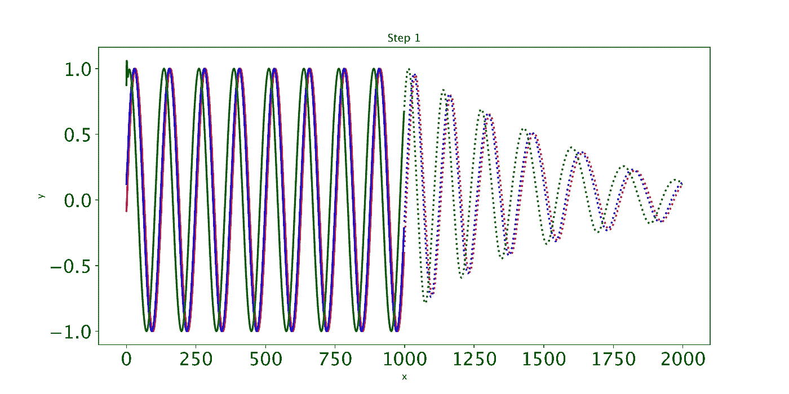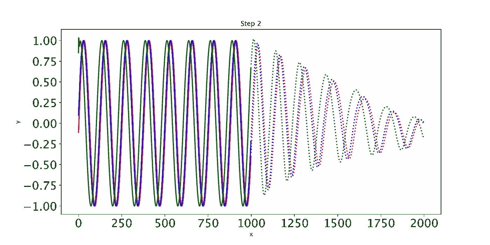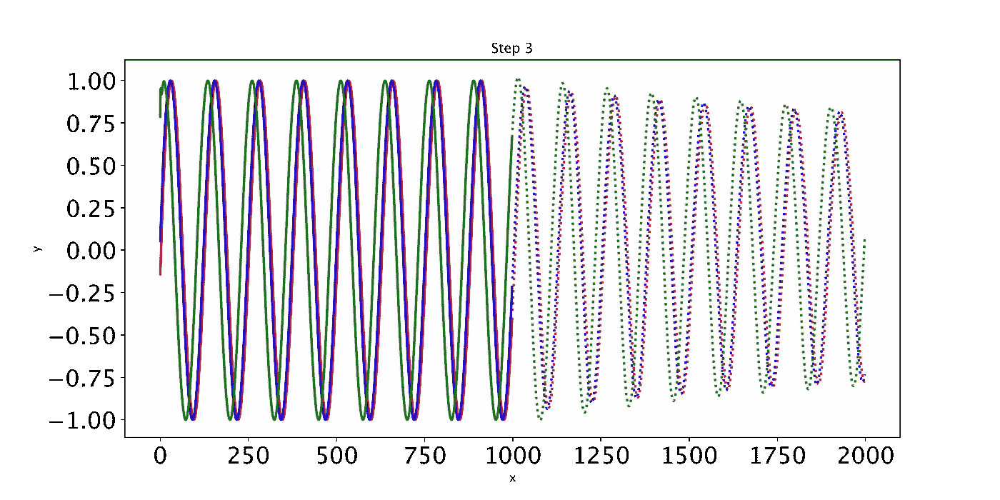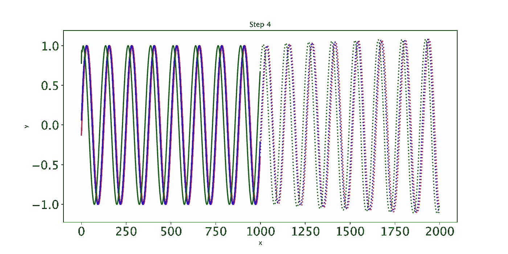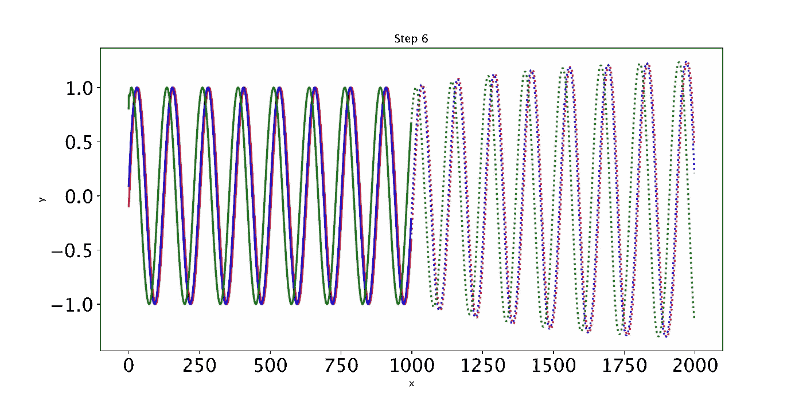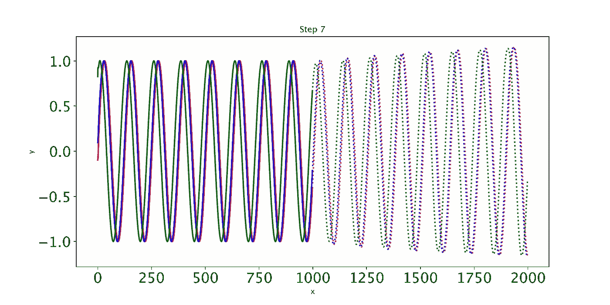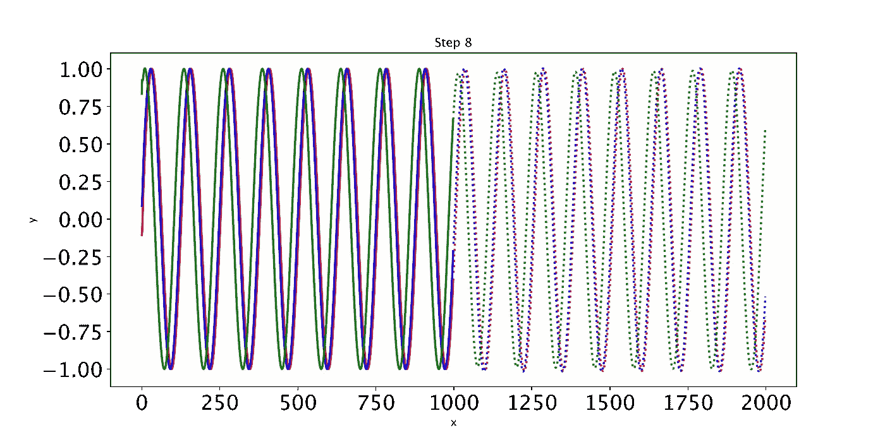

(图片由作者提供)

随着时间的推移，预测会明显改善，损失也会下降。我们的模型工作:到第 8 个纪元时，模型已经学会了正弦波。但是，如果您继续训练模型，您可能会看到预测开始变得有趣。这是因为，在每个时间步，LSTM 依赖于前一个时间步的输出。如果对于第 1001 次预测，预测稍有变化，这将一直干扰预测，直到预测 2000，导致无意义的曲线。有许多方法可以解决这个问题，但是它们超出了本文的范围。现在最好的策略是观察曲线图，看看这种误差累积是否开始发生。然后，你可以回到更早的时代，或者训练过去，看看会发生什么。

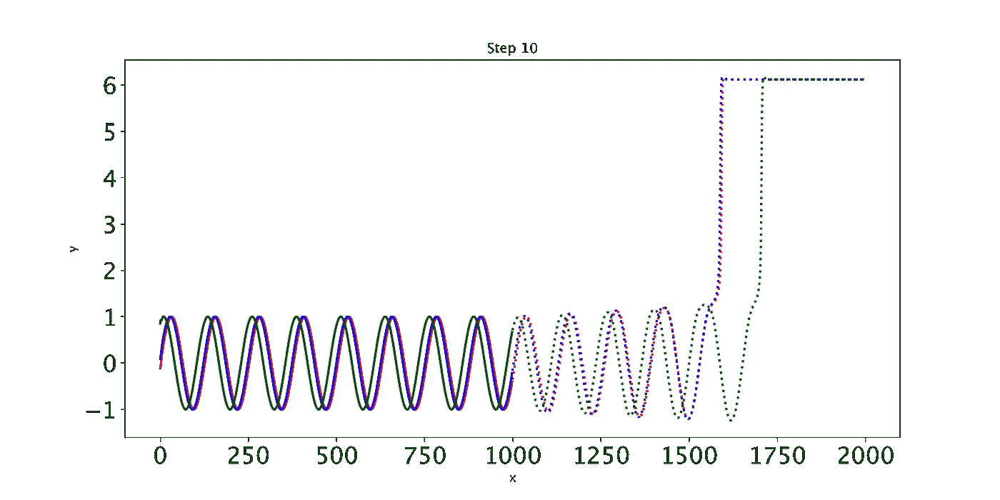

(图片由作者提供)

如果您的 LSTM 收敛有问题，您可以尝试以下几种方法:

*   通过改变隐藏层的大小来减少模型参数的数量(甚至可以减少到 15 个)。这减少了模型搜索空间。
*   通过减少传递给第二个单元格的`hidden_size`，尝试从第一个 LSTM 单元格向下采样到第二个单元格。从第二个 LSTM 单元到线性全连接层，也可以这样做。
*   添加 batchnorm 正则化，通过对较大的权重值进行惩罚来限制权重的大小，从而使损失的地形更加平滑。
*   添加 dropout，在每个时期将整个模型中神经元输出的随机部分清零。这每次都会生成略有不同的模型，这意味着模型被迫更少地依赖单个神经元。

如果实现最后两个策略，请记住在训练期间调用`model.train()`来实例化正则化，并在使用`model.eval()`的预测和评估期间关闭正则化。

# 自动构建模型

如果我们仍然不能将 LSTM 应用于其他形状的输入，则整个练习毫无意义。让我们生成一些新数据，除了这一次，我们将随机生成曲线的数量和每条曲线中的样本。我们不知道这些参数的实际值是什么，所以这是一个完美的方式来看看我们是否可以基于输入和输出形状之间的关系来构造 LSTM。

然后，我们可以通过确定要用于训练集的每个曲线中的样本百分比来更改以下输入和输出形状。

因此，输入和输出形状变为:

您可以通过 LSTM 运行这些输入和目标来验证这是否有效(提示:确保您为将来基于输入的长度实例化了一个变量)。

让我们看看我们是否能把这个应用到最初的克莱·汤普森例子中。如果我们要把它提供给我们的 LSTM，我们需要生成一组以上的分钟。也就是说，我们将生成 100 个不同的假设分钟集，克莱·汤普森在 100 个不同的假设世界中演奏。我们将其中的 95 个输入进行培训，并绘制其余 5 个中的 3 个，以了解我们的模型是如何学习的。

在使用上述代码基于 *L* 和 *N* 重新整形输入和输出之后，我们运行该模型并实现以下内容:

这给了我们下面的图像(我们只显示第一个和最后一个):

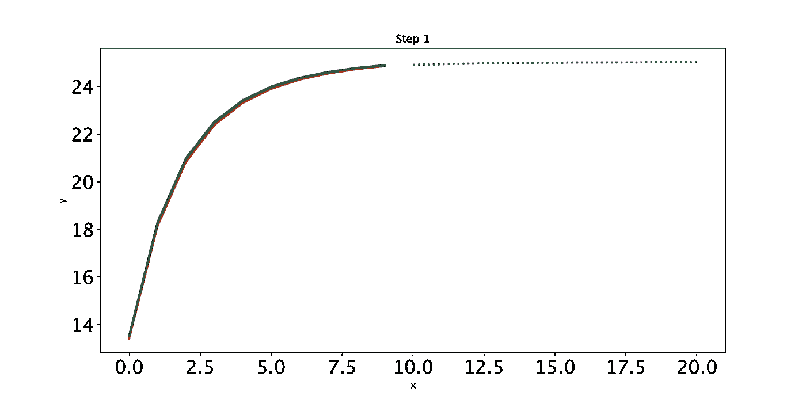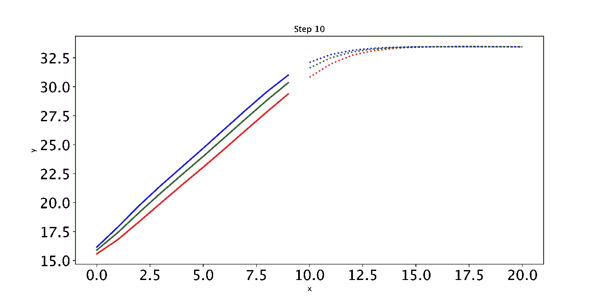

(图片由作者提供)

很有意思！最初，LSTM 也认为曲线是对数的。虽然经过一些训练后，它得出了前 11 场比赛的曲线是线性的，但它坚持为未来的比赛提供对数曲线。这其中最吸引人的一点是，LSTM 是对的——Klay 不能一直线性增加他的游戏时间，因为一场篮球比赛只持续 48 分钟，而且大多数这样的过程都是对数的。显然，LSTM 不可能知道这一点，但不管怎样，看看这个模型如何解释我们的玩具数据是很有趣的。未来的任务可能是玩弄 LSTM 的超参数，看看是否有可能让它也学习未来时间步长的线性函数。此外，我还喜欢创建一个 Python 类来将所有这些函数存储在一个位置。然后，可以使用数据创建一个对象，并且可以编写函数来读取数据的形状，并将其馈送给相应的 LSTM 构造函数。

# 结论

总之，在 Pytorch 中为单变量时间序列数据创建 LSTM 不需要太复杂。然而，缺乏可用的在线资源(尤其是不关注自然语言形式的序列数据的资源)使得学习如何构建这种递归模型变得困难。希望本文提供了关于设置输入和目标、为 LSTM 向前方法编写 Pytorch 类、用我们新的优化器的特性定义训练循环以及使用可视化工具(如绘图)进行调试的指导。

如果你想了解更多关于 LSTM 细胞背后的数学知识，我强烈推荐[这篇文章](https://colah.github.io/posts/2015-08-Understanding-LSTMs/)，它漂亮地列出了 LSTMs 的基本方程(我与作者没有联系)。我还建议尝试将上述代码应用于多元时间序列。所有的核心思想都是一样的——你只需要考虑如何扩展输入的维度。