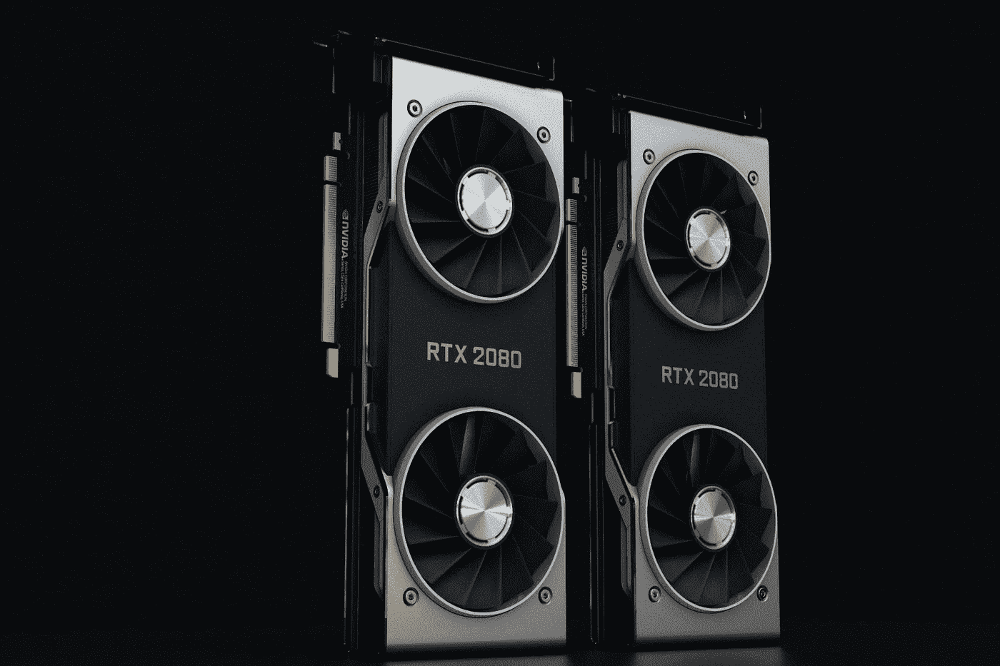

# PyTorch 与 TensorFlow 在基于变压器的 NLP 应用中的比较

> 原文：<https://towardsdatascience.com/pytorch-vs-tensorflow-for-transformer-based-nlp-applications-b851bdbf229a>

## 当使用基于 BERT 的模型时，部署考虑应该是首要的


照片由[皮查拜](https://www.pexels.com/@pixabay?utm_content=attributionCopyText&utm_medium=referral&utm_source=pexels)从[派克斯](https://www.pexels.com/photo/gray-scale-photo-of-gears-159298/?utm_content=attributionCopyText&utm_medium=referral&utm_source=pexels)拍摄。

*TL；DR: BERT 是 NLP 中一个不可思议的进步。两个主要的神经网络框架都成功地完全实现了 BERT，尤其是在 HuggingFace 的支持下。然而，尽管乍一看 TensorFlow 更容易进行原型设计和部署，但 PyTorch 在量化和一些 GPU 部署方面似乎更有优势。在开始一个基于 BERT 的项目时，应该考虑到这一点，这样你就不必像我们一样中途重新构建代码库。*

像人工智能领域的许多事情一样，机会在于你能多快地改变和适应改进的性能。伯特及其衍生物无疑建立了一个新的基线。它很大，而且掌管一切。(事实上，[我们最近有](https://lemay.ai)这么多基于 BERT 的项目同时启动，我们需要全公司范围的培训，以确保每个人都有相同的编程风格。)

[我们的另一家公司](https://auditmap.ai)最近遇到了一些与基于 Tensorflow 的模型相关的令人头疼的问题，希望你能从中学习。以下是我们在这个项目中学到的一些方面。

# 模型可用性和存储库


购买模特有时感觉像逛市场。[好人](https://www.pexels.com/photo/photo-of-a-pathway-with-gray-and-black-buildings-792832/)在[Pexels.com](https://pexels.com)上的照片。

如果你想使用那些出版物刚出版的模特，你仍然需要通过 GitHub。否则可以直接进入 transformer 模型库 hubs，比如 [HuggingFace](https://huggingface.co/) 、 [Tensorflow Hub](https://www.tensorflow.org/hub) 和 [PyTorch Hub](https://www.tensorflow.org/hub) 。

在 [BERT 发布](https://arxiv.org/abs/1810.04805)几个月后，让它运行起来有点笨拙。自从[拥抱脸](https://huggingface.co/)推动整合[变形金刚模型库](https://arxiv.org/abs/1910.03771)以来，这就有点悬而未决了。由于大多数(几乎所有)模型都可以在 HuggingFace 上正确检索，hugging face 是任何变形金刚的第一和主要来源，所以这些天关于模型可用性的问题越来越少。

然而，在某些情况下，模型只能在专有的存储库中获得。例如，Google 的[通用句子编码器似乎仍然只能在](https://arxiv.org/pdf/1803.11175.pdf) [TensorFlow Hub](https://www.tensorflow.org/hub) 上使用。(在[发布](https://arxiv.org/abs/1803.11175)的时候，这是最好的单词和句子嵌入模型之一，所以这是一个问题，但是它已经被类似 [MPNet](https://huggingface.co/sentence-transformers/all-mpnet-base-v2) 和 [Sentence-T5](https://huggingface.co/sentence-transformers/sentence-t5-base) 的东西取代了。)

在撰写本文时，HuggingFace 上有[2669 个 Tensorflow 模型，相比之下](https://huggingface.co/models?library=tf&sort=downloads)[有 31939 个 PyTorch 模型](https://huggingface.co/models?library=pytorch&sort=downloads)。这主要是由于较新的模型首先作为 PyTorch 模型发布；学术界偏爱 PyTorch 模型，尽管这不是一个普遍的模型。

***要点:PyTorch 有更多的模型，但是主要的模型在两个框架上都可用。***

# 跨库 GPU 争用



纯粹的火力。照片由[娜娜·杜瓦](https://www.pexels.com/photo/industry-technology-grey-music-8622912/)在[Pexels.com](https://www.pexels.com/)拍摄

毫不奇怪，这些利维坦模型有巨大的计算需求，GPU 将在训练和推理周期的不同点上涉及。此外，您可能将这些模型用作 NLP/文档智能管道的一部分，其他库在预处理或自定义分类器期间会争夺 GPU 空间。

幸运的是，有许多流行的库已经在它们的后端使用 Tensorflow 和 PyTorch，所以与其他模型友好相处应该很容易。例如，两个流行的 NLP 库，主要运行在 Torch 上( [1](https://github.com/explosion/spacy-transformers/blob/5a36943fccb66b5e7c7c2079b1b90ff9b2f9d020/requirements.txt#L3) ， [2](https://github.com/flairNLP/flair/blob/016cd5273f8f3c00cac119debd1a657d5f86d761/requirements.txt#L2) )。

* *注意:SpaCy 使用*[*Thinc*](https://thinc.ai/docs/usage-frameworks)*来实现框架之间的可互换性，但是我们注意到，如果我们坚持使用基本 PyTorch 模型，会获得更多的稳定性、原生支持和可靠性。*

对于单个框架，在定制的 BERT 模型和特定于库的模型之间共享 GPU 要容易得多。如果您可以共享一个 GPU，那么部署成本就会降低。(稍后在“[量子化](#9499)”中对此有更多介绍。)在理想的部署中，有足够的资源来有效地扩展每个库；事实上，计算与成本之间的制约发生得非常快。

如果您正在运行一个多步骤部署(比如说文档智能)，那么您将拥有一些通过将它们转移到 GPU 而得到改进的功能，比如句子化和分类。

PyTorch 具有本机 GPU 增量使用，通常为给定模型保留正确的内存边界。从他们的[到 *CUDA 语义*文档](https://pytorch.org/docs/stable/notes/cuda.html#memory-management):

> PyTorch 使用缓存内存分配器来加速内存分配。这允许在没有设备同步的情况下快速释放内存。然而，由分配器管理的未使用的内存仍然会显示为在`nvidia-smi`中使用过。可以使用`[memory_allocated()](https://pytorch.org/docs/stable/generated/torch.cuda.memory_allocated.html#torch.cuda.memory_allocated)`和`[max_memory_allocated()](https://pytorch.org/docs/stable/generated/torch.cuda.max_memory_allocated.html#torch.cuda.max_memory_allocated)`来监控张量占用的内存，使用`[memory_reserved()](https://pytorch.org/docs/stable/generated/torch.cuda.memory_reserved.html#torch.cuda.memory_reserved)`和`[max_memory_reserved()](https://pytorch.org/docs/stable/generated/torch.cuda.max_memory_reserved.html#torch.cuda.max_memory_reserved)`来监控缓存分配器管理的内存总量。调用`[empty_cache()](https://pytorch.org/docs/stable/generated/torch.cuda.empty_cache.html#torch.cuda.empty_cache)`从 PyTorch 释放所有**未使用的**缓存内存，以便其他 GPU 应用程序可以使用这些内存。但是，张量占用的 GPU 内存不会被释放，因此它不能增加 PyTorch 可用的 GPU 内存量。

与 TensorFlow 相比，tensor flow 具有默认的完全内存接管，您需要[来指定](https://www.tensorflow.org/guide/gpu#limiting_gpu_memory_growth) `[incremental_memory_growth()](https://www.tensorflow.org/guide/gpu#limiting_gpu_memory_growth)`:

> 默认情况下，TensorFlow 会映射进程可见的所有 GPU 的几乎所有 GPU 内存(以`[CUDA_VISIBLE_DEVICES](https://docs.nvidia.com/cuda/cuda-c-programming-guide/index.html#env-vars)`为准)。这样做是为了通过减少内存碎片来更有效地使用设备上相对珍贵的 GPU 内存资源。要将 TensorFlow 限制到一组特定的 GPU，请使用`[tf.config.set_visible_devices](https://www.tensorflow.org/api_docs/python/tf/config/set_visible_devices)`方法。

***外卖:两个框架都在单个 GPU 上具备多模型部署能力，但 Tensorflow 的管理稍逊一筹。小心使用。***

# 量化


在[Pexels.com](https://pexels.com)上 [Pixabay](https://www.pexels.com/photo/low-angle-view-of-lighting-equipment-on-shelf-257904/) 拍摄的照片。

[量化](https://en.wikipedia.org/wiki/Quantization)主要涉及将 [Float64](https://numpy.org/doc/stable/reference/arrays.scalars.html#numpy.double) 转换为 [Unsigned Int8](https://numpy.org/doc/stable/reference/arrays.scalars.html#numpy.ubyte) 或 [UInt16](https://numpy.org/doc/stable/reference/arrays.scalars.html#numpy.ushort) 以减少模型大小和完成单次计算所需的位数，这也是[一种广为接受的模型压缩技术](https://arxiv.org/abs/1710.09282)。这类似于图像的像素化和颜色损失。它还考虑了权重的分布，在它们的通用模型生成管道中， [Tensorflow](https://www.tensorflow.org/lite/performance/post_training_quantization) 和 [PyTorch](https://pytorch.org/docs/stable/quantization.html) 都支持固定和动态范围量化。

量化在模型性能优化中是一个值得采取的步骤，其主要原因是*性能*随时间推移的典型损失(由于延迟增加)比*质量*随时间推移的损失(例如 F1 下降)更昂贵。对此的另一种解释是“现在好不如以后更好”。

有趣的是，我们看到训练后量化的 F1 平均分数下降了 0.005(相比之下，训练中量化的 F1 平均分数下降了 0.03–0.05)，对于我们的大多数客户和主要应用程序来说，这是一个可以接受的质量下降，特别是如果这意味着在更便宜的基础设施上和在合理的时间框架内运行的话。

*举个例子:考虑到我们在* [*审计图*](https://auditmap.ai) *应用程序中分析的文本量，我们发现的大部分风险洞察都是有价值的，因为我们能够快速检索它们，向我们的审计师和风险经理客户传达他们的风险状况。我们大多数模型的 F1 分数在 0.85 到 0.95 之间，完全可以接受基于大规模分析的决策支持。*

这些模型确实需要在 GPU 上训练和([通常是](https://paperswithcode.com/paper/distilbert-a-distilled-version-of-bert))运行才能有效。然而，如果我们想只在 CPU 上运行这些模型，我们需要从 Float64 表示转移到 int8 或 uint8，以便在可接受的时间框架内运行。根据我的实验和检索到的例子，我将把我的观察范围限制在以下方面:

**我还没能找到一个简单或直接的机制来量化基于张量流的拥抱脸模型。**

与 PyTorch 相比:

我在 PyTorch 中写的动态量化的一个简单例子。

***要点:PyTorch 中的量化是单行代码，可以部署到 CPU 机器上。Tensorflow 不太流线型。***

# 奖励类别:圈复杂度和编程风格

那么，如果 PyTorch 在它所提供的东西上有如此好的差异化，为什么 TensorFlow 仍然是一个考虑因素？在我看来，这是因为用 TensorFlow 编写的代码具有更少的活动部分，也就是说圈复杂度更低。

[圈复杂度](https://en.wikipedia.org/wiki/Cyclomatic_complexity)是一种软件开发度量，用于评估一段代码中所有可能的代码路径。它被用作全面性、可维护性和每行代码的[错误](https://en.wikipedia.org/wiki/Cyclomatic_complexity#Correlation_to_number_of_defects)的代理。考虑到代码的可读性，类继承是一个循环步骤，而内置函数不是。从机器学习的角度来看，圈复杂度可以用来评估模型训练和推理代码的可读性。

继续往下，PyTorch 受面向对象编程的影响很大，而 Tensorflow(通常，不总是)在其模型生成流程中更程序化。

我们为什么关心？因为复杂会滋生 bug。库越简单，故障诊断和修复就越容易。简单的代码是可读的代码，可读的代码是可用的代码。

在 PyTorch BERT 管道中，圈复杂度随着数据加载器、模型实例化和训练而增加。

让我们看看 FashionMNIST 数据加载器的公开例子。

这是 PyTorch :

```
# PyTorch Exampleimport os
import pandas as pd
from torchvision.io import read_imageclass CustomImageDataset(Dataset):
    def __init__(self, annotations_file, img_dir, transform=None, target_transform=None):
        self.img_labels = pd.read_csv(annotations_file)
        self.img_dir = img_dir
        self.transform = transform
        self.target_transform = target_transformdef __len__(self):
        return len(self.img_labels)def __getitem__(self, idx):
        img_path = os.path.join(self.img_dir, self.img_labels.iloc[idx, 0])
        image = read_image(img_path)
        label = self.img_labels.iloc[idx, 1]
        if self.transform:
            image = self.transform(image)
        if self.target_transform:
            label = self.target_transform(label)
        return image, label
```

这里是 [TensorFlow](https://www.tensorflow.org/tutorials/keras/classification) 预建加载器:

```
# TensorFlow Exampleimport tensorflow as tf
import numpy as npfashion_mnist = tf.keras.datasets.fashion_mnist

(train_images, train_labels), (test_images, test_labels) = fashion_mnist.load_data()
```

虽然这是 TensorFlow 中的一个预建函数，但它是典型的训练/测试拆分的示例。

(*奖励:有人在 TensorFlow 中用 PyTorch 编写代码:* [*使用 BERT 和 TensorFlow*](/building-a-multi-label-text-classifier-using-bert-and-tensorflow-f188e0ecdc5d) *)*

# 结论

如果您有可用的 GPU，您通常不会看到任何框架之间的任何重大差异。但是，请记住上面提到的边缘情况，因为您可能会发现自己正在重建从一个框架到另一个框架的整个管道。就像我一样。

省时快乐！

马特。

*如果您对本文或我们的 AI 咨询框架有其他问题，请通过*[***LinkedIn***](https://www.linkedin.com/in/mnlemay/)**或通过*[***email***](mailto:matt@lemay.ai)*联系。**

# *你可能喜欢的其他文章*

*   *[用于批处理的 MLOps:在 GPU 上运行气流](/mlops-for-batch-processing-running-airflow-on-gpus-dc94367869c6)*
*   *数据集偏差:制度化的歧视还是足够的透明度？*
*   *[AI 如何创造价值？](https://medium.com/@lsci/how-does-artificial-intelligence-create-value-bec14c785b40)*
*   *[实施企业人工智能战略](/implementing-a-corporate-ai-strategy-a64e641384c8)*
*   *[离群点感知聚类:超越 K 均值](/outlier-aware-clustering-beyond-k-means-76f7bf8b4899)*
*   *[深度学习图像分类器的罗夏测试](/rorschach-tests-for-deep-learning-image-classifiers-68c019fcc9a9)*