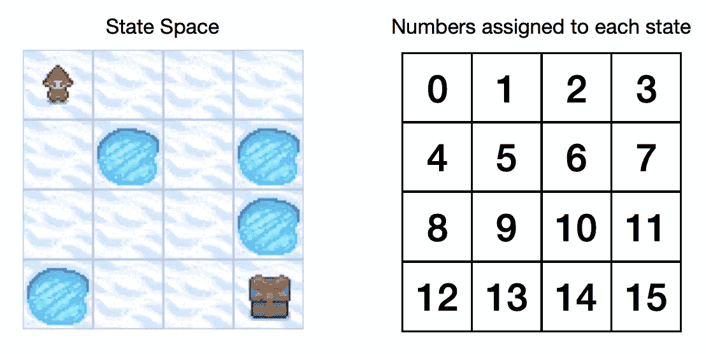
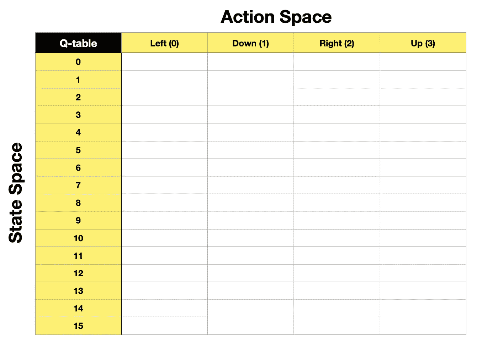
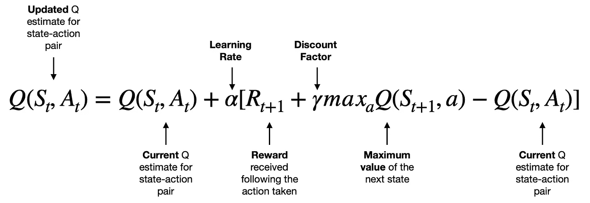
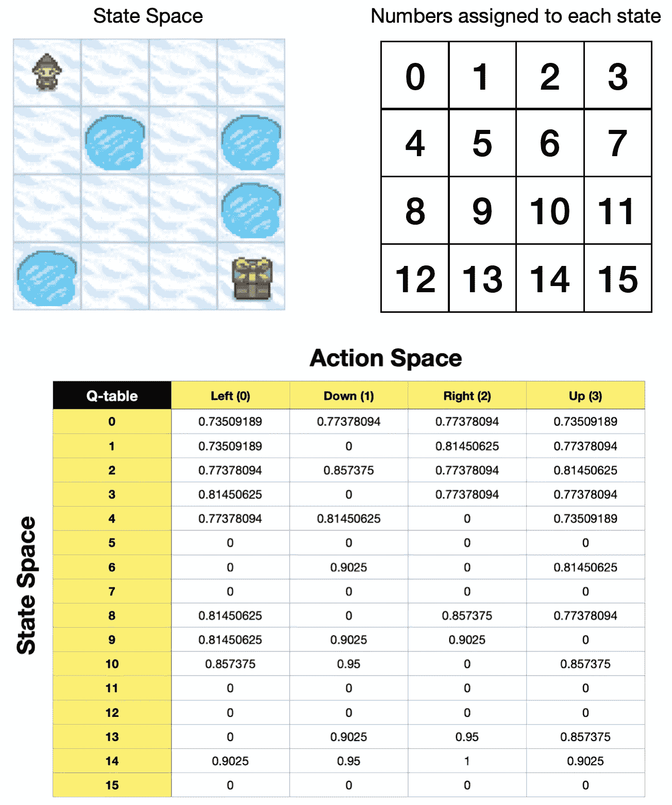
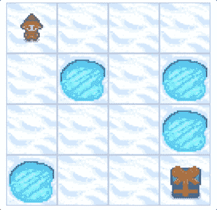
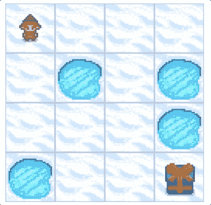

# q-学习算法:如何成功地教一个智能代理玩游戏

> 原文：<https://towardsdatascience.com/q-learning-algorithm-how-to-successfully-teach-an-intelligent-agent-to-play-a-game-933595fd1abf>

## 强化学习

## 通过一个循序渐进的 Python 示例详细解释了一种称为 Q-Learning 的强化学习算法


Q 学习的强化学习。图片由[作者](https://solclover.com/)提供。

# **简介**

**强化学习(RL)** 是机器学习的一个令人兴奋的部分，它帮助我们创造出能够执行各种任务的**智能代理**。

在这一系列文章中，我将深入研究不同的 RL 技术，并向您展示如何使用 Python 代码来应用它们。这一次我将讨论 Q-Learning(Q 代表质量)，这是最直接的 RL 方法之一。

如果你对 RL 的主要思想不熟悉，可以随意参考我的介绍文章:[强化学习(RL)——它是什么，是如何工作的？](/reinforcement-learning-rl-what-is-it-and-how-does-it-work-1962cf6db103)

# **内容**

*   Q-Learning 在更广泛的机器学习(ML)宇宙中处于什么位置
*   强化学习术语
*   Q-Learning 是如何工作的？
    -基于策略和基于值的方法之间的区别
    - Q 函数和 Q 表
    - Q 学习算法
    - Q 学习输出
*   Python 示例向您展示了如何训练一个代理来玩一个冰湖游戏

# 机器学习领域中的 q 学习

下图是我对最常用的机器学习算法进行分类的尝试。当然，它永远不会是完美的，因为一些算法可以分为多个类别。然而，观想 ML 宇宙是非常有帮助的，尤其是在学习过程中。

Q-Learning 属于强化学习算法家族，更具体地说，属于基于值的方法分支(在下面的章节中有更多的介绍)。

下面的**图是交互式的**，请点击👇在不同的类别上探索和揭示更多。

机器学习算法分类。互动图表由[作者](https://solclover.com/)创作。

***如果你喜欢数据科学和机器学习*** *，请* [*订阅*](https://bit.ly/3sItbfx) *获取我的新文章邮件。如果不是中等会员，可以在这里* *加入* [*。*](https://bit.ly/36Mozgu)

# 强化学习术语

在我们研究 Q-Learning 之前，先快速回顾一下强化学习的基本要素:

*   **代理**——可以与其环境交互的“智能角色”，例如游戏中的玩家。
*   **环境**——代理“生活”或操作的“世界”。
*   **动作空间** —代理可以执行的动作的列表或范围。
*   **状态/观察空间** —可能的环境配置的列表或范围。状态/观察向代理提供关于其环境的信息(例如，其位置)。
*   **奖励** —当代理在不同状态下执行期望的(不期望的)行为时，我们给予代理的激励(或抑制)。我们可以通过使用**贴现因子{gamma(𝛾)}** 来减少相对于当前奖励的未来奖励。
*   **探索/开发{epsilon(𝜖)}** —使我们能够设置代理应该花费多少时间来探索环境和开发其关于环境的现有知识。
*   **第**集——从开始位置到结束位置的一个完整循环。例如，在游戏的上下文中，一集将从你的代理开始新的级别的时刻持续到它死亡或完成该级别。
*   **Alpha(𝛼)** —学习率，它影响学习速度和向最优策略的收敛。
*   **policy(𝜋)**—代理人追求目标的策略。

# Q-Learning 是如何工作的？

## **基于政策和基于价值的方法之间的差异**

Q-Learning 属于**基于价值的方法**的范畴，所以让我们从理解基于价值的方法和基于政策的方法之间的区别开始。

*   **基于策略的方法** —我们直接训练代理**在哪个状态下采取什么行动**。它由一个**策略函数**描述，该函数可以是**确定性的**(给出每个状态的精确动作)或**随机性的**(提供动作的概率分布)。
*   **基于价值的方法** —我们通过教代理**识别哪些状态(或状态-动作对)更有价值来间接训练代理**，以便它可以被价值最大化所引导。它由一个**价值函数**描述，其中一个状态的价值是代理在该状态开始时可以获得的预期贴现回报。

不管我们使用哪种方法来训练我们的代理，找到最优策略函数或最优值函数等同于发现**最优 policy(𝜋).**

## **Q 功能和 Q 表**

由于 Q-Learning 是一种基于价值的方法，我们必须有一个**价值函数**，我们称之为 **Q 函数**。在内部，它将有一个包含每个**状态动作对**的 **Q 表**。

训练一个 Q 函数就是简单地找到与存储在 Q 表中的每个状态-动作对相关联的值。了解这些值使代理能够在每个状态下选择最佳操作。

在后面的 Python 部分，我们将教代理玩一个冰湖游戏，所以让我们用同一个游戏来演示 Q 表是什么样子的。

我们的冰湖环境将是一个 4x4 的网格，由冰冻的正方形和带孔的正方形组成，总共 16 个正方形。每个方块代表一种可能的状态，我们可以通过给它们编号来标记。



[冰湖游戏](https://www.gymlibrary.dev/environments/toy_text/frozen_lake/?highlight=frozen+lake)状态空间，每个状态分配有数字。图片由[作者](https://solclover.com/)提供。

**动作空间**将由我们的代理可以采取的 4 个不同动作组成:**向左(0)、向下(1)、向右(2)、向上(3)** 。

现在我们可以形成一个 Q 表，状态作为行，动作作为列。



空 Q 表。图片由[作者](https://solclover.com/)提供。

游戏的目标是让代理人从起点(方块 0)导航到终点(包含礼物的方块 15)而不掉进洞里。因此，训练一个 Q 函数将教会代理如何避免漏洞，找到到达目标的最快路线。

*请注意，当我们第一次初始化 Q-table 时，它在每个单元格中都有零，因为代理在开始探索它之前不知道任何关于它的环境的信息。*

## **Q-学习算法**

在我们研究实际的 Q-Learning 算法之前，还有几件事需要注意:

*   **On-policy vs Off-policy:**Q-Learning 是一种 **off-policy** 算法，这意味着在训练过程中，我们使用不同的策略让 agent 进行动作(acting policy)和更新 Q-function (updating policy)。同时，On-policy 意味着相同的策略用于动作和更新。关于这一点，请参阅 Python 部分。
*   **时间差分(TD) vs 蒙特卡罗:** Q-Learning 使用一种 **TD 方法**，这意味着在训练过程中，它在每一步之后更新 Q-function。同时，蒙特卡罗方法是等到一集结束后再对价值函数进行更新。

现在让我们来看看 Q 学习算法，看看它如何训练 Q 函数(更新 Q 表):

*   Q-Q 函数
*   𝑆𝑡——现状(观察)
*   𝐴𝑡——当前行动
*   𝑅𝑡+1 —当前行动后收到的奖励
*   𝑆𝑡+1——下一个国家(观察)
*   𝛼(阿尔法)—学习率参数
*   𝛾(伽玛)-折扣系数参数
*   𝑚𝑎𝑥𝑎𝑄(𝑆𝑡+1,𝑎) —在可能的动作空间中，下一个状态(观察)的最大值



q-学习算法。图片由[作者](https://solclover.com/)提供。

*   左边 Q(𝑆𝑡,𝐴𝑡的项)是特定状态-动作对的新值**。**
*   右手边的第一项，Q(𝑆𝑡,𝐴𝑡)，是同一状态-动作对的**电流值**。
*   为了修改当前值，我们将代理𝑅𝑡+1 采取行动后的**奖励**加上我们可以从下一个状态𝛾𝑚𝑎𝑥𝑎𝑄(𝑆𝑡+1,𝑎**中得到的**最大值乘以γ**，并减去**当前值** Q(𝑆𝑡,𝐴𝑡).**
*   因此，方括号中的项可能导致正值、零值或负值。因此，该状态-动作对的新 Q 值将增加、保持不变或减少。请注意，我们还应用了一个学习率来控制每次更新的“大小”。

由于 Q-Learning 使用**时间差异(TD)方法**，该算法将在每一步之后不断更新 Q-table，直到我们到达一个不能再进行更新的位置，即它已经收敛到一个最优解。

## q-学习输出

得出 q 函数的最优解意味着我们已经找到了最优的**policy(𝜋】**。然后，代理可以使用此策略成功地导航其环境，并根据起始状态获得可能的最高累积奖励。

下面是一个冰湖游戏的最佳 q 表，使用 0.95 的𝛾 (gamma)和游戏的默认奖励函数:

*   实现目标(G): +1
*   到达孔(H): 0
*   达到冻结状态(F): 0



为[冰湖游戏](https://www.gymlibrary.dev/environments/toy_text/frozen_lake/?highlight=frozen+lake)优化的 q 表。图片来自[作者](https://solclover.com/)。

我们将在 Python 部分看到如何得到这个结果，但是现在，让我们看看它告诉我们什么。

如果我们的代理使用上述 Q 表中描述的政策，那么:

*   从状态 0 开始，向下或向右都同样有价值。根据 Q 表中的动作顺序，代理将进入状态 4。
*   从状态 4 开始，最高值动作是再次下降，因此它将这样做，到达状态 8。
*   从状态 8 开始，最高值动作是向右，将代理带到状态 9。
*   从状态 9 开始，向下或向右同样有价值。但是，由于基于 Q-表中的动作顺序，down 首先出现，代理进入状态 13。
*   从状态 13，它将向右到状态 14，然后再向右到状态 15，达到目标。

这是遵循上述政策的代理的 gif 图像。



Gif 图片由[作者](https://solclover.com/)使用来自[冰湖游戏](https://www.gymlibrary.dev/environments/toy_text/frozen_lake/?highlight=frozen+lake)的组件创建。

[](https://solclover.com/membership)[](https://www.linkedin.com/in/saulius-dobilas/)

# **Python 示例向你展示了如何训练一个代理玩冰湖游戏**

现在让我们使用 Python 来实现我们刚刚学到的内容。我们将使用 [Open AI 的健身房 Python 库](https://www.gymlibrary.dev/environments/toy_text/frozen_lake/?highlight=frozen+lake)包含各种游戏环境，包括冰封湖。

## 设置

我们需要获得以下库:

*   [为](https://www.gymlibrary.dev/)[冰湖](https://www.gymlibrary.dev/environments/toy_text/frozen_lake/?highlight=frozen+lake)游戏环境打开艾的健身房库
*   [Numpy](https://numpy.org/) 用于数据操作
*   [Matplotlib](https://matplotlib.org/stable/index.html) 和内置的 **IPython** 和 **time** 库，用于显示代理如何导航其环境

让我们导入库:

上面的代码打印了本例中使用的包版本:

```
numpy: 1.23.3
gym: 0.26.0
matplotlib: 3.6.0
```

接下来，我们建立一个冰湖环境:

注意，我们在这个例子中使用了一个不滑的游戏版本。同时，渲染选项如下:

*   **无(默认):**不计算渲染。
*   **人类:**渲染返回无。环境在当前显示器或终端中被连续渲染，通常用于人类消费。
*   **rgb_array:** 返回代表环境状态的帧。帧是具有 shape (x，y，3)的 numpy.ndarray，表示 x 乘 y 像素图像的 RGB 值。
*   **ansi:** 返回字符串列表(str)或 StringIO。StringIO，包含每个时间步长的终端样式文本表示。文本可以包括换行符和 ANSI 转义序列(例如颜色)。

让我们检查我们在上面设置的环境的环境描述、状态空间和动作空间:

```
Environment Array: 
[[b'S' b'F' b'F' b'F']
 [b'F' b'H' b'F' b'H']
 [b'F' b'F' b'F' b'H']
 [b'H' b'F' b'F' b'G']]State(Observation) space: Discrete(16)
Action space: Discrete(4)
```

您可以看到环境与上一节中显示的布局相匹配。但是，您可以在 gym.make()中使用 **desc** 选项来指定您自己的地图。提醒:S =开始，F =冻结，H =球洞，G =进球。

同样，正如所料，状态空间包含 16 个离散状态(4x4)，动作空间有 4 个离散动作(0:左，1:下，2:右，3:上)。

作为最后一项检查，在我们进行任何培训之前，我们将让我们的代理在其环境中自由活动(在每个步骤中采取随机行动)，并将其呈现在 Jupyter 笔记本中。

以下是上述代码的输出:



由[作者](https://solclover.com/)使用来自[冰湖游戏](https://www.gymlibrary.dev/environments/toy_text/frozen_lake/?highlight=frozen+lake)的组件创建的 Gif 图像。

## **训练 Q 函数以找到最佳策略**

设置完成后，让我们使用 **Q-Learning** 为我们的代理在这个游戏中找到最好的 **policy(𝜋)** 。

我们首先初始化几个参数:

请注意，我们将在整个培训过程中改变 epsilon。我们将从ε= 1 开始，这意味着我们的代理人的行为在开始时都是随机的。但是，我们会随着每一集而衰减 epsilon，所以我们的代理人逐渐从纯探索走向剥削。

接下来，让我们初始化 Q 表。正如我们在上一节中看到的，这将是一个 16x4 的表格，其中 16 行代表 16 个状态，4 列代表 4 个可能的动作。我们用全 0 初始化 Q 表，因为在开始训练之前，我们不知道每个状态的价值。

上述代码显示初始化的 Q 表:

```
array([[0., 0., 0., 0.],
       [0., 0., 0., 0.],
       [0., 0., 0., 0.],
       [0., 0., 0., 0.],
       [0., 0., 0., 0.],
       [0., 0., 0., 0.],
       [0., 0., 0., 0.],
       [0., 0., 0., 0.],
       [0., 0., 0., 0.],
       [0., 0., 0., 0.],
       [0., 0., 0., 0.],
       [0., 0., 0., 0.],
       [0., 0., 0., 0.],
       [0., 0., 0., 0.],
       [0., 0., 0., 0.],
       [0., 0., 0., 0.]])
```

回想一下，Q-Learning 是一种**非策略**算法。因此，我们将为**动作** (epsilon_greedy)定义一个函数，为**更新 Q 表(update_Q)定义另一个函数。更新策略使用贪婪方法，即没有探索。**

您应该能够发现 update_Q 函数包含前一节中分析的 Q 学习算法等式。

最后，让我们定义我们的培训功能:

现在让我们调用训练函数，看看结果:

在训练之后，我们得到了优化的 Q 表，它与我们在上一节中展示的结果相匹配。现在，代理可以使用它来始终达到目标，而不会掉进洞里。

```
array([[0.73509189, 0.77378094, 0.77378094, 0.73509189],
       [0.73509189, 0\.        , 0.81450625, 0.77378094],
       [0.77378094, 0.857375  , 0.77378094, 0.81450625],
       [0.81450625, 0\.        , 0.77378094, 0.77378094],
       [0.77378094, 0.81450625, 0\.        , 0.73509189],
       [0\.        , 0\.        , 0\.        , 0\.        ],
       [0\.        , 0.9025    , 0\.        , 0.81450625],
       [0\.        , 0\.        , 0\.        , 0\.        ],
       [0.81450625, 0\.        , 0.857375  , 0.77378094],
       [0.81450625, 0.9025    , 0.9025    , 0\.        ],
       [0.857375  , 0.95      , 0\.        , 0.857375  ],
       [0\.        , 0\.        , 0\.        , 0\.        ],
       [0\.        , 0\.        , 0\.        , 0\.        ],
       [0\.        , 0.9025    , 0.95      , 0.857375  ],
       [0.9025    , 0.95      , 1\.        , 0.9025    ],
       [0\.        , 0\.        , 0\.        , 0\.        ]])
```

## 估价

让我们通过运行一些模拟来评估这个策略，并检查代理是否总是设法获得最大的回报。

上面的代码打印出以下结果:

```
Mean Reward = 1.00 +/- 0.00
```

如你所见，在测试的 100 集每集中，代理人设法获得了最高奖励(1.00)。

让我们通过让代理遵循策略并将其呈现在屏幕上来直观地评估它:

正如我们在上一节中看到的那样，结果是意料之中的:


Gif 图片由[作者](https://solclover.com/)使用来自[冰湖游戏](https://www.gymlibrary.dev/environments/toy_text/frozen_lake/?highlight=frozen+lake)的组件创建。

# **结束语**

我们已经成功地使用 Q-Learning 为代理人找到了在冰湖游戏中使用的最佳策略。我希望这款游戏的简单本质能让你很容易理解 Q-Learning 是如何工作的。

请不要忘记[订阅](https://solclover.com/subscribe)，这样您就可以**从我即将发表的文章**中学习其他强化学习算法，并了解如何使用 **Python 将它们应用到不同的环境中！**

你可以在我的 [**GitHub 库**](https://github.com/SolClover/Art056_RL_Q_Learning) 上找到本文使用的完整 Python 代码，作为 Jupyter 笔记本。

干杯！🤓
**索尔·多比拉斯**

如果你已经花光了这个月的学习预算，下次请记得我。 *我的个性化链接加入媒介:*

[](https://bit.ly/3J6StZI) [## 通过我的推荐链接加入 Medium 索尔·多比拉斯

### 阅读索尔·多比拉斯和媒体上成千上万的其他作家的每一个故事。你的会员费直接支持索尔…

solclover.com](https://bit.ly/3J6StZI)