# q-初学者学习

> 原文：<https://towardsdatascience.com/q-learning-for-beginners-2837b777741>

## 训练一个 AI 来解决冰冻的湖泊环境


作者图片

T 这篇文章的目标是**教人工智能如何使用强化学习解决❄️Frozen 湖环境问题**。我们不再阅读维基百科的文章和解释公式，而是从零开始，尝试重新创建🤖q-自学算法。我们不仅要了解**它是如何工作的**，更重要的是**它为什么会工作**:为什么要这样设计？有哪些隐藏的假设，常规课程和教程中从来不解释的细节？

在本文结束时，您将**掌握 Q 学习算法**，并能够**将其应用于其他环境和现实世界的问题**。这是一个很酷的迷你项目，让人们更好地了解强化学习是如何工作的，并且有望激发原创应用的想法。

让我们首先安装❄️ **冰封湖**环境并导入必要的库:`gym`用于游戏，`random`用于生成随机数，`numpy`用于做一些数学运算。

# ❄️岛冰封湖

现在，让我们来谈谈我们将在本教程中解决的游戏。❄️ **冰湖**是一个由瓷砖组成的简单环境，在这里 AI 必须**从最初的瓷砖**移动到**目标**。瓷砖可以是一个安全的✅冰湖，也可以是一个让你永远陷进去的❌。人工智能或代理有 4 种可能的动作:走◀️ **左**，🔽**向下**，▶️ **向右**，或者🔼**涨**。代理必须学会避开洞，以便**在**最少的动作**中达到目标**。默认情况下，环境**总是处于相同的配置**。在环境代码中，**每个图块由字母**表示，如下所示:

```
S F F F       (S: starting point, safe)
F H F H       (F: frozen surface, safe)
F F F H       (H: hole, stuck forever)
H F F G       (G: goal, safe)
```

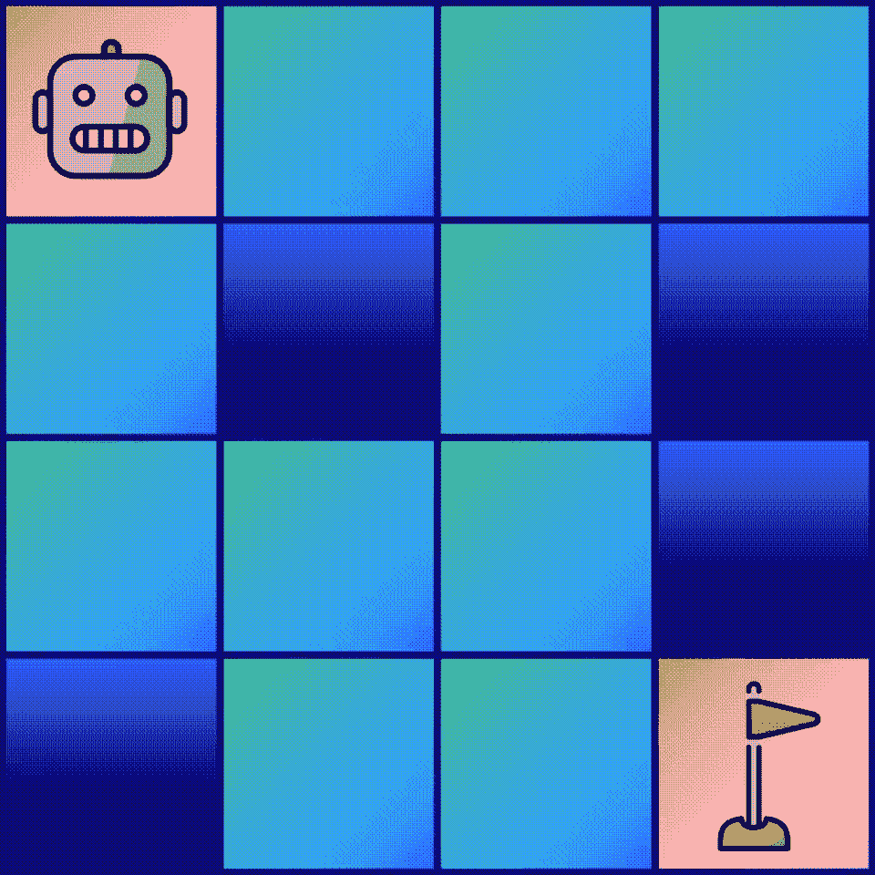

作者图片

我们可以尝试手动解决上面的例子来理解游戏。看看下面的动作顺序是不是正确的解法:**右** → **右** → **右** → **下** → **下** → **下**。我们的代理人从瓦**s**开始，所以我们在冰冻的表面上向右移动✅，然后再一次是✅，然后再一次是✅，然后我们下去找一个洞❌.

其实找几个正确的解法真的很容易:**右** → **右** → **下** → **下** → **下** → **右**就是很明显的一个。但是我们可以做一系列动作，在到达目标之前绕着一个洞转 10 圈。这个序列是有效的，但是它不满足我们的最终需求:**代理需要在最少的动作数内达到目标**。在这个例子中，完成游戏的最少动作数是 **6** 。我们需要记住这个事实，以检查我们的代理商是否真的掌握了❄️ **冰封湖**。

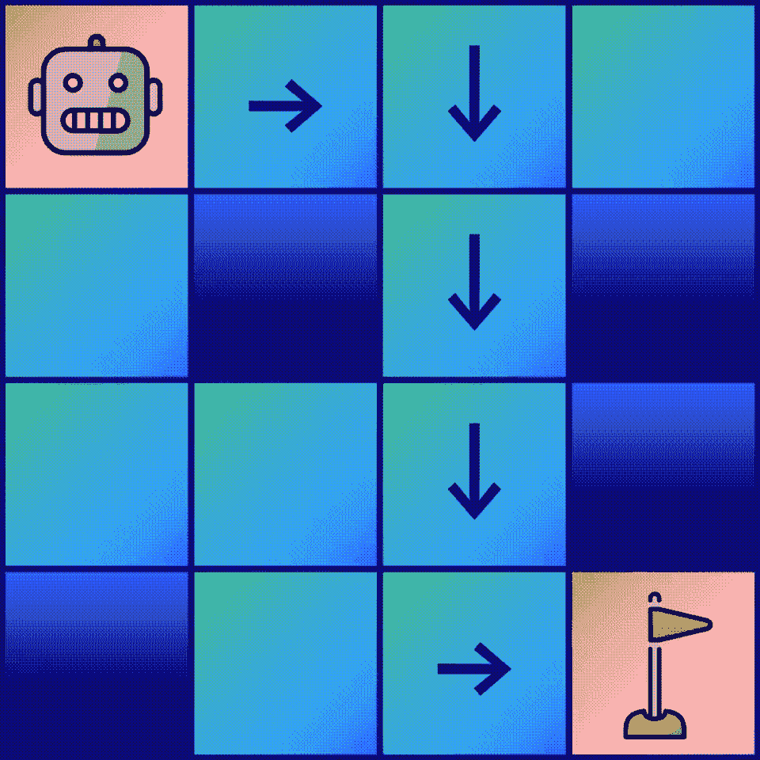

作者图片

让我们通过`gym`库来初始化环境。游戏有两个版本:一个有**滑冰**，其中选择的动作有**随机几率被代理**忽略；和一个**防滑器**，其中**的动作不能忽略**。我们将使用**防滑**开始，因为它更容易理解。

```
🟥FFF
FHFH
FFFH
HFFG
```

我们可以看到，创建的游戏**与我们的示例**具有完全相同的配置:这是相同的谜题。我们代理的位置由一个红色矩形**表示。解决这个难题可以用一个简单的脚本和 if…else 条件来完成，这实际上对于比较我们的人工智能和一个更简单的方法是有用的。但是，我们想尝试一个更刺激的方案:**强化学习**。**

# 🏁二。q 表

在 ❄️ **冰封湖**中，有 16 个瓷砖，这意味着我们的代理可以在 16 个不同的位置找到，称为**状态**。对于每个状态，有 4 种可能的动作:走◀️ **左**，🔽**向下**，▶️ **向右**，以及🔼**向上**。学习如何玩冰封湖就像**学习在每个状态下你应该选择哪个动作**。为了知道在给定的状态下哪一个动作是最好的，我们想给我们的动作分配一个**质量值**。我们有 16 个状态和 4 个动作，所以要计算 16 x 4 = 64 个值。

表示它的一个好方法是使用一个表格，称为 Q-table，其中**行列出每个州的**，而**列列出每个动作 a** 。在这个 Q-table 中，每个单元格都包含一个值 Q(s，a)，它是状态 s 中动作 a 的**值(如果是可能的最佳动作，则为 1；如果真的很差，则为 0)。当我们的代理处于特定状态 s 时，它**只需检查这个表，看看哪个动作具有最高值**。采取价值最高的行动是有道理的，但是我们稍后会看到我们可以设计出更好的东西**

*Q 表示例，其中每个单元格包含给定状态* s *(行)*下动作 a *(列)的值* Q(a，s)

*让我们创建我们的 Q 表并用零填充它，因为**我们仍然不知道每个状态**中每个动作的值。*

```
*Q-table =
[[0\. 0\. 0\. 0.]
 [0\. 0\. 0\. 0.]
 [0\. 0\. 0\. 0.]
 [0\. 0\. 0\. 0.]
 [0\. 0\. 0\. 0.]
 [0\. 0\. 0\. 0.]
 [0\. 0\. 0\. 0.]
 [0\. 0\. 0\. 0.]
 [0\. 0\. 0\. 0.]
 [0\. 0\. 0\. 0.]
 [0\. 0\. 0\. 0.]
 [0\. 0\. 0\. 0.]
 [0\. 0\. 0\. 0.]
 [0\. 0\. 0\. 0.]
 [0\. 0\. 0\. 0.]
 [0\. 0\. 0\. 0.]]*
```

*太好了！我们的 Q-table 有 16 行(我们的 16 个州)和 4 列**(我们的 4 个动作)，正如预期的那样。让我们试着看看下一步我们能做什么:每个值都被设置为零，所以我们完全没有信息。假设代理采取了一个**随机动作** : ◀️ **左**，🔽**向下**，▶️ **向右**，或者🔼**向上**。***

***我们可以使用带有`choice`方法的`random`库来随机选择一个动作。***

```
***'LEFT'***
```

***等等，实际上代理当前处于初始状态 **S** ，这意味着只有两个动作是可能的:▶️ **右**和🔽**向下**。代理也可以采取措施🔼**向上**和◀️ **向左**，但是它不动:它的状态不变。因此，我们**不会对可能的行为**施加任何约束:代理人**自然会理解他们中的一些人不做任何事情**。***

***我们可以继续使用`random.choice()`，但是`gym`库**已经实现了随机选择一个动作**的方法。以后可能会省去我们一些麻烦，所以让我们试试吧。***

```
***0***
```

***哎哟...这次是一个**号**。我们可以阅读`[gym](https://gym.openai.com/docs/)` [的文档](https://gym.openai.com/docs/)，但不幸的是，这是非常稀缺的。不过不用担心， [**我们可以查看 GitHub**](https://github.com/openai/gym/blob/master/gym/envs/toy_text/frozen_lake.py#L10) 上的源代码来理解**这些数字的含义**。这其实非常简单:***

```
***◀️ LEFT = 0
🔽 DOWN = 1
▶️ RIGHT = 2
🔼 UP = 3***
```

***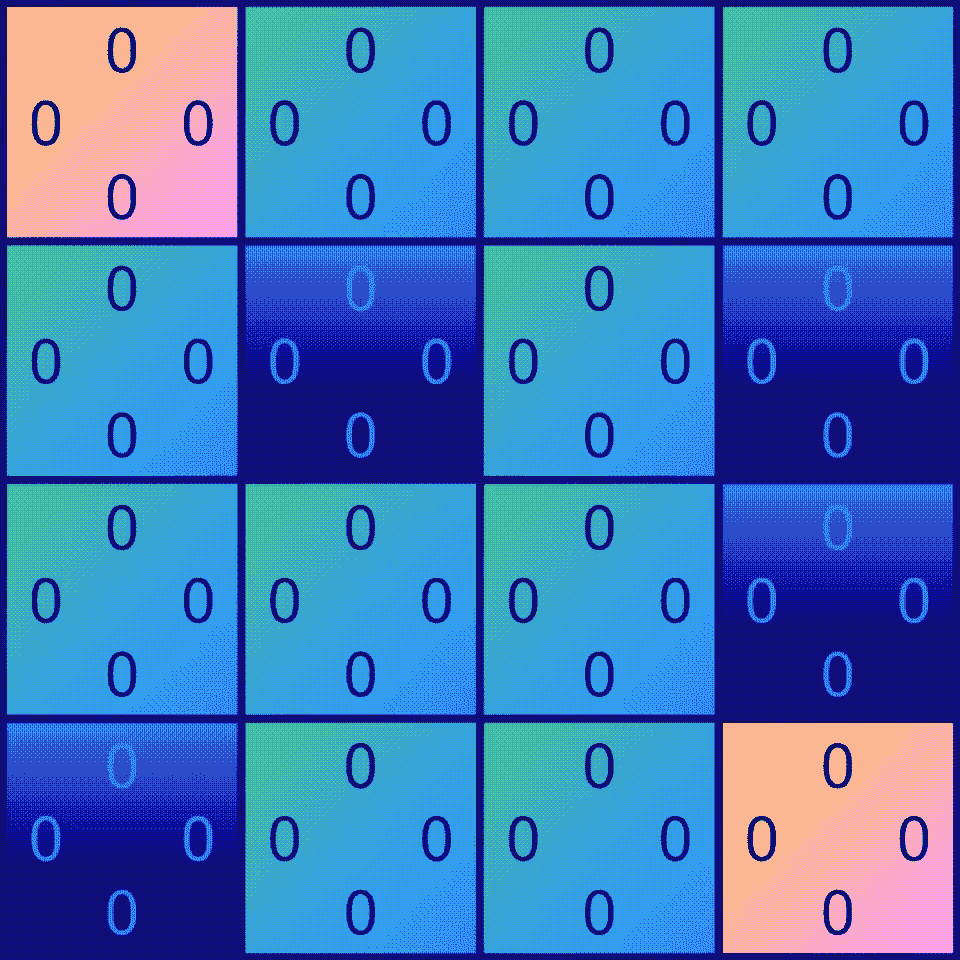***

***作者图片***

***好了，现在**我们了解了** `**gym**` **如何将数字与方向**联系起来，让我们试着用它来**将我们的代理移动到右边的** ▶️.这一次，可以使用`step(action)`方法来执行。我们可以尝试**直接给它提供数字 2** ，对应我们选择的方向(右)，检查代理是否移动。***

```
***(Right)
S🟥FF
FHFH
FFFH
HFFG***
```

*****万岁**！红色方块从初始状态 **S** 向右移动:**我们的预测是正确的**。为了与环境互动，我们只需要知道这些:***

1.  ***如何**使用`action_space.sample()`随机选择一个动作**；***
2.  ***如何**执行该动作，并使用`step(action)`将我们的代理移动到期望的方向**。***

***为了完全详尽，我们可以加上:***

1.  ***如何**显示当前地图，看看我们在用`render()`做什么**；***
2.  ***如何**重新开始游戏**当代理人掉进一个洞或者用`reset()`到达目标 **G** 。***

***既然我们理解了如何与我们的`gym`环境交互，让我们回到我们的算法。在强化学习中，**智能体在完成预定目标**时会得到环境的奖励。在❄️ **冰封湖**中，代理人只有达到状态 **G** 才会获得奖励(见[源代码](https://github.com/openai/gym/blob/master/gym/envs/toy_text/frozen_lake.py#L85))。我们无法控制这个奖励，它是在环境中设置的:**当代理达到 G 时为 1，否则为 0**。***

***让我们每次执行一个动作就把它打印出来。奖励通过`step(action)`的方式给出。***

```
***(Left)
🟥FFF
FHFH
FFFH
HFFG
Reward = 0.0***
```

***奖励确实是 0…😱哇，我想我们陷入困境了，因为在整个游戏中只有一个州能给我们正奖励。当我们唯一的确认是在最后的时候，我们怎么能从一开始就选择正确的方向呢？如果我们想要看到 1 的奖励，我们需要足够幸运，能够**偶然找到正确的行动顺序。不幸的是，这正是它的工作方式…**Q 表将保持填充零，直到代理随机达到目标 G** 。*****

***如果我们能有中间的、较小的奖励来引导我们走向目标，问题会简单得多。唉，这实际上是强化学习的**主要问题之一:这种被称为**稀疏奖励**的现象，使得代理很难在问题**上接受训练，因为唯一的奖励是在一长串动作**的结尾。人们提出了不同的技术来缓解这个问题，但我们将在另一个时间讨论它。*****

# ***🤖三。q 学习***

***让我们回到我们的问题上来。好吧，我们需要足够幸运，偶然发现目标 **G** 。但是一旦完成，如何将信息反向传播到初始状态？这🤖Q 学习算法为这个问题提供了一个巧妙的解决方案。我们需要更新我们的状态-动作对(Q 表中的每个单元格)的值，考虑 1/到达下一个状态的**奖励**，以及 2/下一个状态中的**最高可能值。*****

***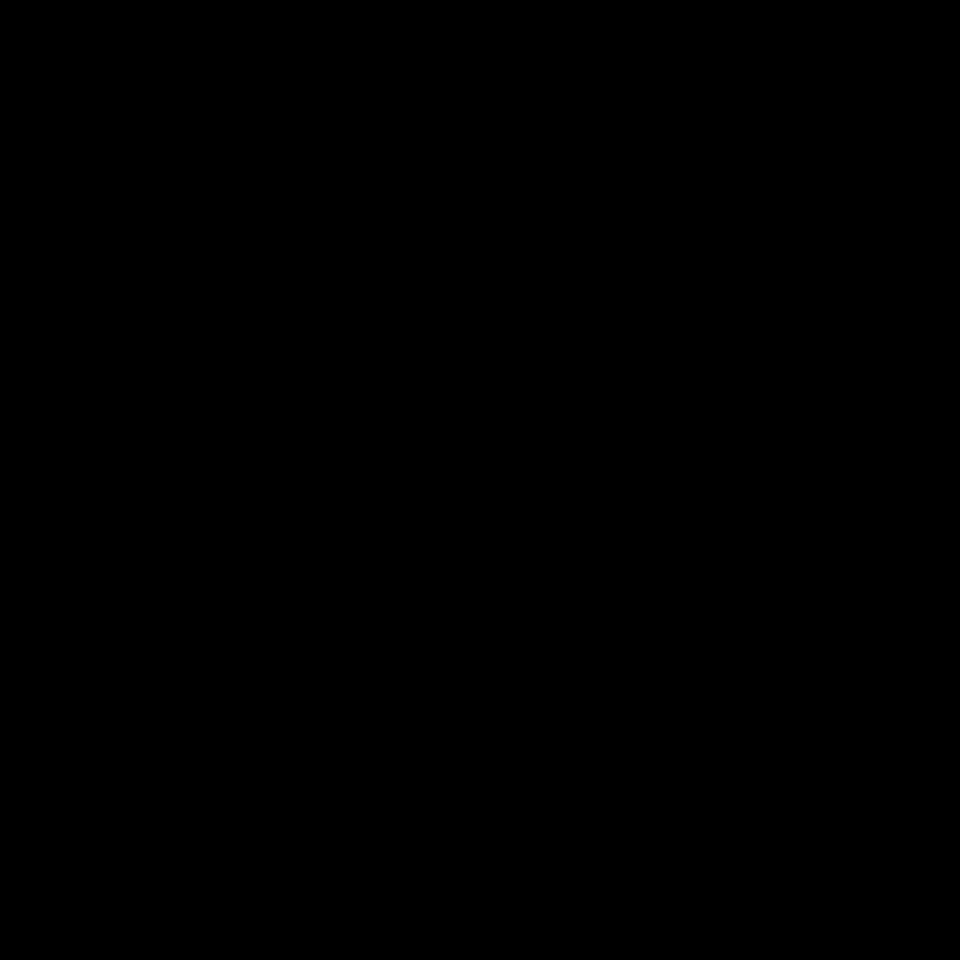***

***作者图片***

***我们知道，当我们移动到 **G** 时，我们得到的回报是 1。正如我们刚才所说的，G (姑且称之为 **G-1** )与**到达 G** 的相关动作的**的值由于奖励而增加。好的，这一集的结尾:代理赢了，我们重新开始游戏。现在，下一次代理处于 G-1** 旁边的 **a 状态时，它会用**的相关动作增加这个状态的值(姑且称之为 **G-2** )到达 G-1** 。下一次代理处于 **G-2** 旁边的状态时，它也会这样做。清洗并重复，直到更新达到初始状态 **S** 。*****

*让我们试着找到**更新公式**将值从 **G** 反向传播到 **S** 。记住:数值表示在特定状态下**一个动作的**质量**(0 表示很糟糕，1 表示在这种状态下可能是最好的动作)。我们尝试**在 sₜ状态下(例如，当代理处于初始状态 **S** 时，sₜ = 0)更新动作 aₜ的值**(例如，如果动作为左，则 aₜ=为 0)。这个**值只是我们的 q 表**中的一个单元格，对应于**行号 s** ₜ **和列号 a** ₜ:这个值的正式名称是 aₜ).q(sₜ***

*如前所述，我们需要使用 1/ **下一个状态**(正式标注为 rₜ)的奖励，以及 2/ **下一个状态** (maxₐ *Q(s* ₜ₊₁，a))的最大可能值来更新它。因此，更新公式必须如下所示:*

*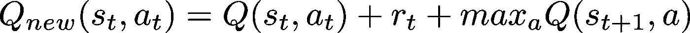*

*新值是当前值+奖励值+下一个状态的最高值。我们可以手动尝试我们的公式来检查它看起来是否正确:让我们假设我们的代理人第一次在目标 G 旁边的状态 G-1 中**。我们可以用以下方式更新对应于此状态下获胜动作的值 **G-1** :***

**

*其中 Q(G-1，aₜ) = 0 和 maxₐ *Q(G* ，a) = 0 是因为 q 表是空的，rₜ *= 1* 是因为我们在这个环境中得到唯一的奖励。我们得到 Q{new}(G-1，aₜ) = 1。下次代理处于下一个状态( **G-2** )时，我们也使用公式更新它，得到相同的结果: *Q* {new}(G-2，aₜ) = 1。最后，**我们将 Q 表**中的 1 从 **G** 反向传播到 **S** 。好吧，它工作了，但是结果是**二元的**:要么是**错误的状态-动作对，要么是最好的状态-动作对**。我们想要更多的细微差别…*

*其实我们差不多**用常识找到了真正的 Q-learning 更新公式**。我们寻找的细微差别增加了两个参数:*

*   ***α** 是💡**学习率**(在 0 和 1 之间)，也就是我们应该改变多少原来的 q(sₜ(aₜ)值。如果α = 0，数值**永远不变**，但如果α = 1，数值**变化极快**。在我们的尝试中，我们没有限制学习速率，所以α = 1。但这在现实中太快了:下一个状态的奖励和最大值很快**压倒了当前值**。我们需要在过去和新知识的重要性之间找到一个平衡。*
*   ***γ** 是📉**贴现因子**(0 到 1 之间)，决定了相对于眼前的回报，代理人对未来回报的关心程度(俗话说“一鸟在手胜过双鸟在林”)。如果γ = 0，代理只关注**即时奖励**，但是如果γ = 1，任何**潜在的未来奖励与当前奖励**具有相同的价值。在❄️ **冰封湖**，我们想要一个高折扣系数，因为在游戏的最后只有一个可能的奖励。*

*使用实数 Q 学习算法，新值计算如下:*

*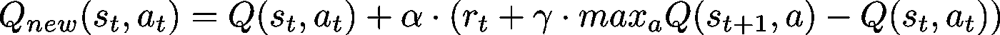*

*好吧，让我们在实施这个新公式之前先试一试。再一次，我们可以假装我们的代理人是第一次目标 G 旁边的**。我们可以使用我们的公式更新状态-动作对以赢得游戏:Q{new}(G-1，aₜ)= 0+α(1+γ00)*。*我们可以给α和γ赋值任意值来计算结果。当α = 0.5，γ = 0.9 时，我们得到 Q{new}(G-1，aₜ)= 0+0.5(1+0.9 0)= 0.5。代理第二次处于这种状态时，我们会得到:Q{new}(G-1，aₜ)= 0.5+0.5(1+0.9 0.5)= 0.75，然后是 0.875，0.9375，0.96875，等等。***

******

***作者图片***

***所以用代码训练我们的特工意味着:***

1.  *****选择一个随机动作**(使用`action_space.sample()`)如果当前状态的值正好为零。否则，我们用函数`np.argmax()`取当前状态下值最高的**动作；*****
2.  *****通过`step(action)`向所需方向移动来执行此动作**；***
3.  *****使用关于新状态的信息和`step(action)`给出的奖励，用我们采取的动作更新原始状态的值**；***

***我们不断重复这 3 个步骤，直到代理**卡在洞内**或**到达目标 G** 。当它发生时，我们只需**用`reset()`重启环境**，开始新的一集，直到我们达到 1000 集。此外，我们可以绘制每次运行的**结果(如果没有达到目标，则为失败，否则为成功),以便**观察我们代理的进度**。*****

```
***Q-table before training:
[[0\. 0\. 0\. 0.]
 [0\. 0\. 0\. 0.]
 [0\. 0\. 0\. 0.]
 [0\. 0\. 0\. 0.]
 [0\. 0\. 0\. 0.]
 [0\. 0\. 0\. 0.]
 [0\. 0\. 0\. 0.]
 [0\. 0\. 0\. 0.]
 [0\. 0\. 0\. 0.]
 [0\. 0\. 0\. 0.]
 [0\. 0\. 0\. 0.]
 [0\. 0\. 0\. 0.]
 [0\. 0\. 0\. 0.]
 [0\. 0\. 0\. 0.]
 [0\. 0\. 0\. 0.]
 [0\. 0\. 0\. 0.]]

===========================================
Q-table after training:
[[0\.         0\.         0.59049    0\.        ]
 [0\.         0\.         0.6561     0\.        ]
 [0\.         0.729      0\.         0\.        ]
 [0\.         0\.         0\.         0\.        ]
 [0\.         0.02050313 0\.         0\.        ]
 [0\.         0\.         0\.         0\.        ]
 [0\.         0.81       0\.         0\.        ]
 [0\.         0\.         0\.         0\.        ]
 [0\.         0\.         0.17085938 0\.        ]
 [0\.         0\.         0.49359375 0\.        ]
 [0\.         0.9        0\.         0\.        ]
 [0\.         0\.         0\.         0\.        ]
 [0\.         0\.         0\.         0\.        ]
 [0\.         0\.         0\.         0\.        ]
 [0\.         0\.         1\.         0\.        ]
 [0\.         0\.         0\.         0\.        ]]***
```

***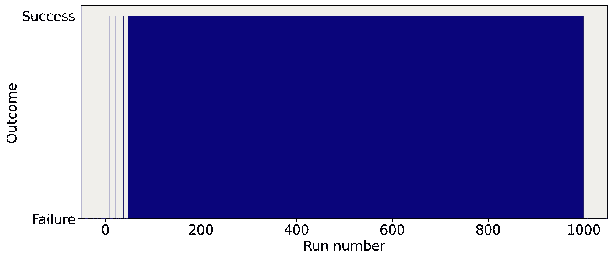***

***作者图片***

***特工训练有素！图上的每个蓝条对应一次胜利，因此我们可以看到代理在培训开始时很难找到目标。但是一旦它连续几次发现，就开始**一致赢**。🥳训练过的 q 表也很有趣:这些值表明了代理为达到目标而学习的独特的行动顺序。***

***现在通过 100 集的评测来看看它的表现如何。我们认为培训已经结束，因此**我们不再需要更新 Q 表**。要查看代理的表现，我们可以**计算它设法达到目标**的次数百分比(成功率)。***

```
***Success rate = 100.0%***
```

***我们的代理不仅接受了培训，而且成功地达到了 100%的成功率。大家干得好，防滑的❄️ **冰湖**解决了！***

***我们甚至可以**通过执行下面的代码来可视化代理在地图**上的移动，并打印**所采取的动作序列**来检查它是否是最好的一个。***

```
***(Right)
SFFF
FHFH
FFFH
HFF🟥
Sequence = [2, 2, 1, 1, 1, 2]***
```

***代理可以学习几种正确的动作顺序:[2，2，1，1，1，2]，[1，1，2，2，1，2]等。好的一面是在我们的序列中只有**6 个动作，这是我们统计的**最小可能动作数**:这意味着我们的代理学会了以最佳方式解决游戏。在[2，2，1，1，1，2]的情况下，对应的是右→右→下→下→下→右，正是我们在文章最开始预测的顺序。📣*****

# ***📐四。ε-贪婪算法***

***D 尽管取得了成功，但我们之前的方法有一点让我感到困扰:代理总是选择具有最高**值的动作。因此，每当一个状态-动作对**开始具有非零值时，代理将总是选择它**。其他的动作将永远不会被执行，这意味着我们永远不会更新它们的值…但是如果这些动作中的一个比代理总是执行的那个更好呢？难道我们不应该鼓励代理人时不时地尝试新的东西，看看是否可以改进吗？*****

***换句话说，我们希望允许我们的代理:***

*   *****采取值最高的动作**(剥削)；***
*   *****选择一个随机动作，尝试找到更好的动作**(探索)。***

***这两种行为之间的权衡很重要:如果代理只关注于**开发**，它不能尝试新的解决方案，因此**不再学习**。另一方面，如果代理只采取**随机行动**，那么**培训是没有意义的**，因为它不使用 Q 表。所以我们想**随着时间的推移改变这个参数**:在训练开始的时候，我们想**尽可能的探索环境**。但是探索变得越来越没意思，因为代理已经知道每一个可能的状态-动作对。该参数代表动作选择中的**随机量。*****

***这种技术通常被称为**ε贪婪算法**，其中ε是我们的参数。这是一个**简单但极其有效的**方法来找到一个好的折衷方案。每次代理必须采取行动时，它有一个**概率ε选择随机的一个**，和一个**概率 1-ε选择具有最高值的一个**。我们可以在每集结束时将ε**的值减少一个固定的量(**线性衰减**，或者基于ε的当前值(**指数衰减**)。*****

***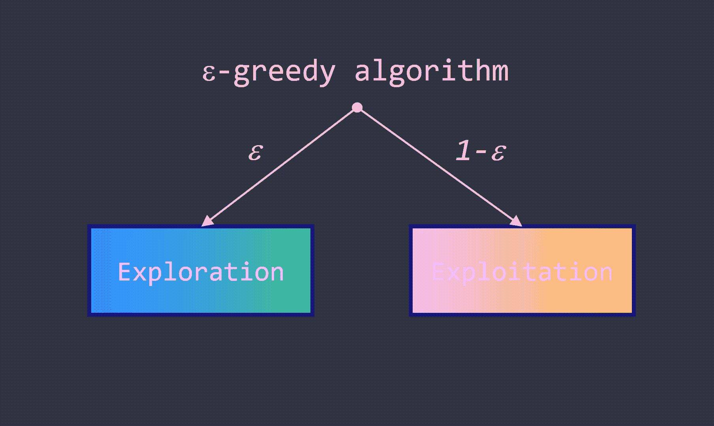***

***作者图片***

***让我们实现一个线性衰减 T2。在此之前，我想看看任意参数下的曲线。我们将从ε = 1 开始进入完全探索模式，并在每集之后将该值减少 0.001。***

***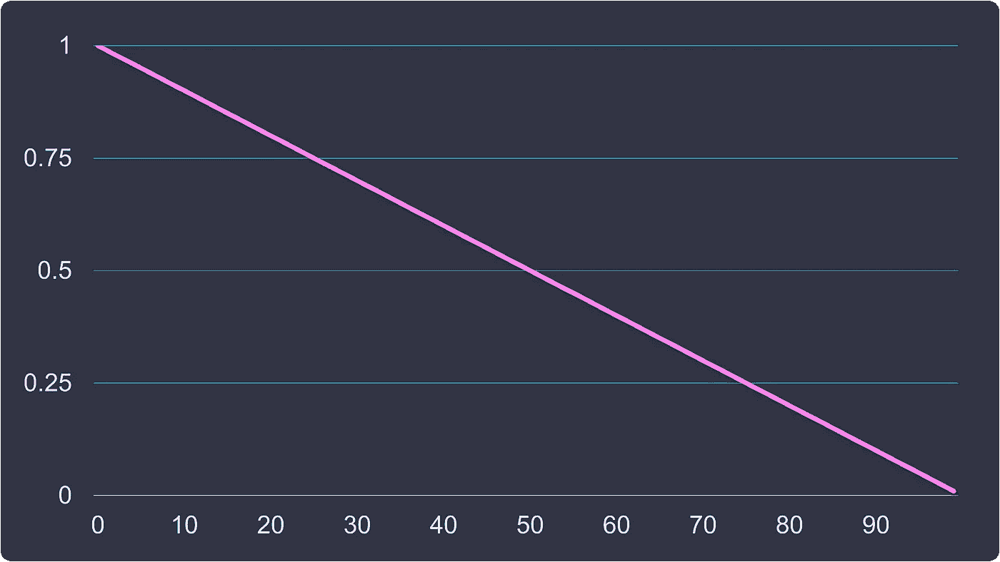***

***作者图片***

***好了，现在我们对它有了很好的理解，我们可以真正实现它，看看**它如何改变代理的行为**。***

```
***Q-table before training:
[[0\. 0\. 0\. 0.]
 [0\. 0\. 0\. 0.]
 [0\. 0\. 0\. 0.]
 [0\. 0\. 0\. 0.]
 [0\. 0\. 0\. 0.]
 [0\. 0\. 0\. 0.]
 [0\. 0\. 0\. 0.]
 [0\. 0\. 0\. 0.]
 [0\. 0\. 0\. 0.]
 [0\. 0\. 0\. 0.]
 [0\. 0\. 0\. 0.]
 [0\. 0\. 0\. 0.]
 [0\. 0\. 0\. 0.]
 [0\. 0\. 0\. 0.]
 [0\. 0\. 0\. 0.]
 [0\. 0\. 0\. 0.]]

===========================================
Q-table after training:
[[0.531441   0.59049    0.59049    0.531441  ]
 [0.531441   0\.         0.6561     0.56396466]
 [0.58333574 0.729      0.56935151 0.65055117]
 [0.65308668 0\.         0.33420534 0.25491326]
 [0.59049    0.6561     0\.         0.531441  ]
 [0\.         0\.         0\.         0\.        ]
 [0\.         0.81       0\.         0.65519631]
 [0\.         0\.         0\.         0\.        ]
 [0.6561     0\.         0.729      0.59049   ]
 [0.6561     0.81       0.81       0\.        ]
 [0.72899868 0.9        0\.         0.72711067]
 [0\.         0\.         0\.         0\.        ]
 [0\.         0\.         0\.         0\.        ]
 [0\.         0.81       0.9        0.729     ]
 [0.81       0.9        1\.         0.81      ]
 [0\.         0\.         0\.         0\.        ]]***
```

***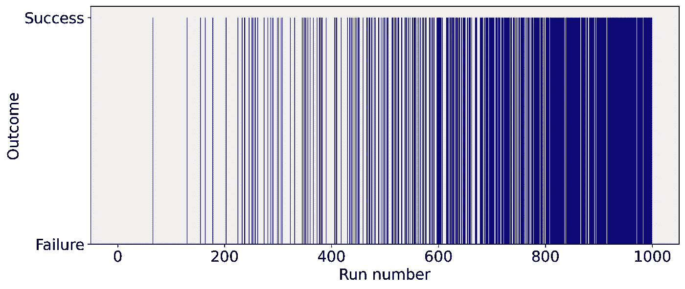***

***作者图片***

***嘿，**代理现在需要更多时间来持续赢得游戏**！Q 表中的非零值**比前一个多得多，这意味着代理已经学习了**几个动作序列**来达到目标。这是可以理解的，因为这个新的代理**被迫探索状态-动作对，而不是总是利用具有非零值的状态-动作对**。*****

***让我们看看**是否和上一个**一样成功赢得比赛。在评估模式中，我们**不想再探索了**，因为代理现在已经训练好了。***

```
***Success rate = 100.0%***
```

***唷，又是一个 **100%的成功率**！我们没有贬低这个模型。😌这种方法的好处在这个例子中可能并不明显，但是我们的模型变得不那么静态了，而 T21 变得更加灵活了。它学习了从 **S** 到 **G** 的不同路径(动作序列),而不是像以前的方法那样只有一条路径。更多的探索**会降低性能**但是有必要训练能够**适应新环境的代理**。***

# ***❄️四世。挑战:湿滑的冰湖***

***我们没有解决**整个❄️Frozen 湖环境**:我们只是在防滑版本上训练了一个代理，在初始化的时候使用`is_slippery = False`。在易变型中，代理采取的行动只有 **33%的机会成功**。如果失败，则随机采取其他三个动作中的一个。这个特点给训练增加了很多随机性，给我们的代理增加了难度。让我们看看我们的代码在这个新环境中表现如何...***

```
***Q-table before training:
[[0\. 0\. 0\. 0.]
 [0\. 0\. 0\. 0.]
 [0\. 0\. 0\. 0.]
 [0\. 0\. 0\. 0.]
 [0\. 0\. 0\. 0.]
 [0\. 0\. 0\. 0.]
 [0\. 0\. 0\. 0.]
 [0\. 0\. 0\. 0.]
 [0\. 0\. 0\. 0.]
 [0\. 0\. 0\. 0.]
 [0\. 0\. 0\. 0.]
 [0\. 0\. 0\. 0.]
 [0\. 0\. 0\. 0.]
 [0\. 0\. 0\. 0.]
 [0\. 0\. 0\. 0.]
 [0\. 0\. 0\. 0.]]

===========================================
Q-table after training:
[[0.06208723 0.02559574 0.02022059 0.01985828]
 [0.01397208 0.01425862 0.01305446 0.03333396]
 [0.01318348 0.01294602 0.01356014 0.01461235]
 [0.01117016 0.00752795 0.00870601 0.01278227]
 [0.08696239 0.01894036 0.01542694 0.02307306]
 [0\.         0\.         0\.         0\.        ]
 [0.09027682 0.00490451 0.00793372 0.00448314]
 [0\.         0\.         0\.         0\.        ]
 [0.03488138 0.03987256 0.05172554 0.10780482]
 [0.12444437 0.12321815 0.06462294 0.07084008]
 [0.13216145 0.09460133 0.09949734 0.08022573]
 [0\.         0\.         0\.         0\.        ]
 [0\.         0\.         0\.         0\.        ]
 [0.1606242  0.18174032 0.16636549 0.11444442]
 [0.4216631  0.42345944 0.40825367 0.74082329]
 [0\.         0\.         0\.         0\.        ]]***
```

***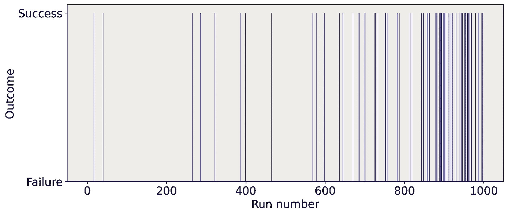***

***作者图片***

```
***Success rate = 17.0%***
```

***不太好。但是你能通过调整我们谈到的不同参数来提高性能吗？我鼓励你接受这个**小挑战**，自己动手**享受强化学习的乐趣**，并检查你是否理解了**我们所说的关于 Q-learning 的一切**。为什么不为ε贪婪算法实现指数衰减呢？在这个快速练习中，您可能会意识到**稍微修改超参数会完全破坏结果**。这是强化学习的另一个怪癖:超参数是相当情绪化的，如果你想调整它们，理解它们的含义是很重要的。测试和尝试新的组合来建立你的直觉并变得更有效率总是好的。祝你好运，玩得开心！***

# ***🔚五.结论***

***Q-learning 是一个简单而强大的算法，是强化学习的核心。在这篇文章中，***

*   ***我们学会了**与** `**gym**` **环境**交互来选择动作和移动我们的代理；***
*   ***我们引入了一个 **Q 表**的概念，其中**行是状态** , **列是动作**,**单元格是给定状态下动作的值**；***
*   ***我们实验性地重新创建了 **Q 学习更新公式**来解决**稀疏回报问题**；***
*   ***我们实施了一整套培训和评估流程，以 100%的成功率解决了 **❄️Frozen 湖**的环境问题；***
*   ***我们实现了著名的**ε-贪婪算法**，以便在未知状态-动作对的**探索和最成功状态-动作对**的**利用之间建立一个折衷。*****

*****❄️Frozen 湖**是一个非常简单的环境，但是其他人可以有**如此多的状态和动作，以至于不可能在内存**中存储 q 表。在事件**不是离散的，而是连续的**的环境中尤其如此(像《超级马里奥兄弟》或《《我的世界》》)。当问题出现时，一种流行的技术包括训练一个**深度神经网络来逼近 Q 表**。这种方法增加了几层复杂性，因为神经网络**不是很稳定**。但是我将在另一个教程中用不同的技术来稳定它们。***

***在此之前，**分享这篇文章**如果对你有帮助的话[和**在 Twitter 上关注我**T5 和](https://twitter.com/maximelabonne)[中 了解更多关于机器学习和深度学习的**实用内容**。📣](https://medium.com/@mlabonne)***