# 使用 CVXOPT 在 Python 中实现带约束的二次优化

> 原文：<https://towardsdatascience.com/quadratic-optimization-with-constraints-in-python-using-cvxopt-fc924054a9fc>


弗洛里安·施梅兹在 [Unsplash](https://unsplash.com?utm_source=medium&utm_medium=referral) 上的照片

二次优化是很多领域都会遇到的问题，从最小二乘回归[1]到投资组合优化[2]以及路过模型预测控制[3]。在所有这些问题中，必须优化对不同资产或代理的资源分配(这通常对应于线性项)，知道在这些资产或代理之间可能存在有益或无益的交互(这对应于二次项)，同时满足一些特定的约束(不将所有资源分配给同一代理或资产，确保所有分配的资源的总和不超过总的可用资源，等等。).当约束不能用线性公式表示时，可能会出现困难。在本文中，我们将看到如何使用一个非常强大的 python 库 CVXOPT [4，5]来解决这些优化问题，该库依赖于 LAPACK 和 BLAS 例程(这些是用 Fortran 90 编写的高效线性代数库)[6]。

从数学上来说，目标是找到最小化多元二次函数的自变量，同时满足一些等式和不等式约束。要优化的函数具有以下一般形式:

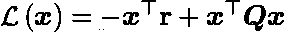

二次函数

其中 **x** 是大小为 n 的未知向量， **r** 是与 **x** 大小相同的向量，并且 **Q** 是 n 乘 n 维的对称方阵。约束可以被公式化为一组等式和不等式，使得:

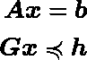

限制

其中 **A** 是一个 n 乘 m 的矩阵(其中 m 是等式约束的数量)， **b** 是一个大小为 m 的向量， **G** 是一个 n 乘 m’的矩阵(其中 m’是不等式约束的数量)，而 **h** 是一个大小为 m’的向量。卷曲的不等式符号意味着不等式适用于向量的每个元素。

在 CVXOPT 形式中，我们如何写这个？考虑下面的代码:

```
# Import Libraries**import** numpy **as** np
**import** cvxopt **as** opt
**from** cvxopt **import** matrix, spmatrix, sparse
**from** cvxopt.solvers **import** qp, options
**from** cvxopt **import** blas # Generate random vector r and symmetric definite positive matrix Qn = 50
r = matrix(np.random.sample(n))
Q = np.random.randn(n,n)
Q = 0.5 * (Q + Q.T)
Q = Q + n * np.eye(n)
Q = matrix(Q)# Solvesol = qp(Q, -r)
```

解决方案“sol”是一个字典，其中包含在关键字“x”下最小化损失函数的向量，以及在关键字“status”下是否找到最佳解决方案的信息。

如何在这种形式主义中实现约束？所有需要做的就是提供矩阵 **A** 和 **G** 以及之前定义的向量 **b** 和 **h** 。假设我们希望 **x** 的元素之和等于 1，并且 **x** 的所有元素都是正的。数学上，这些条件是:

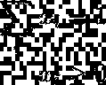

并且可以用矩阵格式写成:

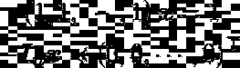

因此，我们可以将矩阵 A、G、b 和 h 定义为:

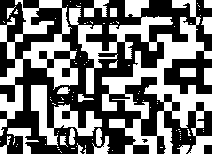

在 CVXOPT 形式中，这些变成:

```
# Add constraint matrices and vectorsA = matrix(np.ones(n)).T
b = matrix(1.0)
G = matrix(- np.eye(n))
h = matrix(np.zeros(n))# Solve and retrieve solutionsol = qp(Q, -r, G, h, A, b)['x']
```

现在找到的解决方案遵循强加的约束。

# 摩擦效应

现在让我们添加一种不同类型的非线性约束。假设在某一时刻找到了最优解。稍后，矩阵 **Q** 和向量 **r** 已经用新值更新。然而，改变资源或资产的分配是有成本的。因此，改变旧向量 **x** 中的一个值必须是值得的，以便证明这个成本是合理的。这个问题现在可以表述为:


有周转费用的二次函数

用 **c** 表示从一个解决方案到另一个解决方案的摩擦效应的向量，或者分配和取消分配资源的成本。这个新的损失不再是二次的，因为有一项包含绝对值，这是有问题的，因为它是不可微的。如何解决这个问题？解决方案是添加额外的变量，这些变量将对应于从一个状态到下一个状态的变化，然后线性化损失函数。上述等式的线性部分变为:


线性化周转成本

在上面的等式中，我们已经考虑了对于不同的代理/资产分配和不分配资源，摩擦效应或成本可能是不同的。然后，我们必须添加额外的约束，以确保这些额外的变量很好地对应于从一个解决方案到下一个解决方案的变化:

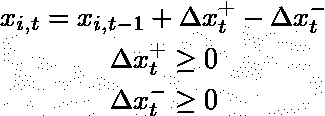

额外周转限制

我们通过将 **x** 与 **x 的变量**连接起来获得新的未知向量 **X** ，我们对新的 **Q** 和 **r** 矩阵和向量做同样的事情:

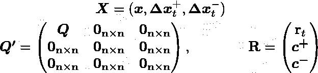

串接 **X** 、 **Q** 和 **r**

我们实施约束条件:

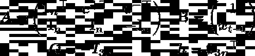

具有摩擦效应的约束

然后以下列方式修改代码:

```
# Modify Loss Functionn = 200
c = 0.001
max_weight = 0.05r = matrix(np.block([np.random.sample(n), -c * np.ones(2*n)]))
Q = np.random.randn(n,n)
Q = 0.5 * (Q + Q.T)
Q = Q + n * np.eye(n)
Q = matrix(np.block([[Q, np.zeros((n,n)), np.zeros((n,n))], [np.zeros((n,n)), np.zeros((n,n)), np.zeros((n,n))], [np.zeros((n,n)), np.zeros((n,n)), np.zeros((n,n))]]))# Modify constraint matrices and vectorsA = matrix(np.block([[np.ones(n), c * np.ones(n), -c * np.ones(n)], [np.eye(n), np.eye(n), -np.eye(n)]]))
old_x = np.zeros(n)
old_x[np.random.choice(n, n_assets_r, replace=False)] = max_weight
b = matrix(np.block([1.0, old_x]))
G = matrix(- np.eye(3*n))
h = matrix(np.zeros(3*n))# Solve and retrieve solutionsol = qp(Q, -r, G, h, A, b)['x']
```

因此，我们已经了解了如何考虑从一种解决方案过渡到另一种解决方案时的摩擦效应。

# 实际例子:投资组合优化

让我们考虑一个实际的例子来充分理解这种技术的使用:投资组合优化。在 Markowitz 的投资组合优化理论[2]中， **r** 向量对应的是对不同资产收益的预测。这种预测是由我们在这里不考虑的任何预测模型给出的。Q 矩阵对应于这些相同资产收益的协方差矩阵。在这种情况下，可以采用历史协方差矩阵。我们将稍微改变一下这里的符号，使用ω作为未知向量。ω值对应于投资组合中不同资产的权重。损失函数现在可以写成:

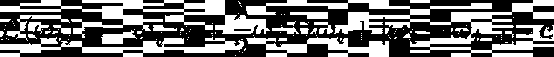

投资组合优化的二次函数

这里我们还引入了λ，它代表了用户的风险厌恶。等式的第一项代表这个投资组合的预期收益。第二项代表投资组合的风险。λ值越低，意味着可以承受的风险越大。最后一项代表从一个投资组合到另一个投资组合的交易成本。

我们想增加一些投资组合优化中常见的约束条件。我们希望我们的投资组合在某种程度上多样化，这可以通过增加权重的上限来确保。我们还可能希望进一步减少从一个投资组合到另一个投资组合的变动，这种变动转化为周转限制。数学上，这些可以写成:

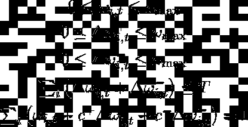

投资组合优化的约束

其中 T 对应于允许的最大营业额，可以取 0(不允许修改)和 2(没有营业额限制)之间的值。下面列出的约束中的最后一项是前一个约束的修改，其中权重之和应该等于 1。这种修改反映了这样一个事实，即当资产被买卖时，交易费用被支付，因此投资组合的资本减少[6]。在矩阵形式中，这些约束变成:


投资组合优化的约束

并且以下面的方式修改代码:

```
max_weight = 0.05
turnover = 2.0# Modify the Q matrix so that it resembles 
# the covariance matrix of returnsT = np.random.randn(n,100)
Q = np.cov(T)
Q = matrix(np.block([[Q, np.zeros((n,n)), np.zeros((n,n))], [np.zeros((n,n)), np.zeros((n,n)), np.zeros((n,n))], [np.zeros((n,n)), np.zeros((n,n)), np.zeros((n,n))]]))# Create constraint matricesG = matrix(0.0, (6 * n + 1, 3 * n))
h = opt.matrix(0.0, (6 * n + 1, 1))
for k in range(3 * n):
    # wi > 0 constraint
    G[k, k] = -1# wi > max_weight
    G[k + 3 * n, k] = 1
    h[k + 3 * n] = max_weightfor k in range(2 * n):
    # sum dwi+ + dwi- < turnover
    G[6 * n, k + n] = 1

h[6 * n] = turnover
```

然后我们计算有效边界，这是给定风险厌恶的最佳投资组合的集合

```
# Compute random portfolios in order to have a baselinen_random = 10000
random_returns = np.zeros(n_random)
random_risks = np.zeros(n_random)
n_assets_r = 20for i in range(n_random):
    w0 = np.zeros(n)
    w0[np.random.choice(n, n_assets_r, replace=False)] = 1 / n_assets_r
    random_returns[i] = np.dot(w0, r[:n])
    random_risks[i] = np.dot(w0, np.dot(Q[:n,:n], w0))# Compute the optimal portfolio for different values
# of lambda, the risk aversionlmbdas = [10 ** (5.0 * t / N - 1.0) for t in range(N)]sol = [qp(lmbda / 2 * Q, -r, G, h, A, b)['x'] for lmbda in lmbdas]optimal_returns = np.array([blas.dot(x, r) for x in sol])
optimal_risks = np.array([blas.dot(x, Q * x) for x in sol])
```

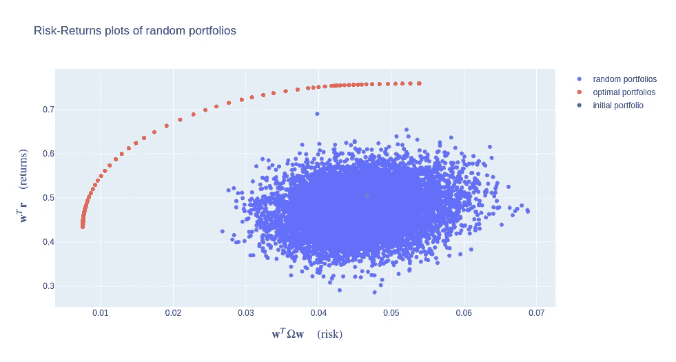

有效边界(图片来自作者)

在这个图中，我们绘制了一组随机投资组合的风险和回报，以此作为基线。我们看到，对于给定的风险，最佳计算的投资组合总是比任何随机投资组合有更大的回报。还描述了初始投资组合的风险和回报。

为了形象化最大周转率的重要性，我们可以重复计算有效边界的不同值(25%、50%、100%和 200%)。完全改变投资组合意味着出售所有资产(周转 100%的资产)，然后购买一套全新的资产(再次周转 100%)，相当于 200%的周转率。因此，投资组合的最大周转率是 200%。我们预计有效边界会随着更小的最大换手率而收缩，因为该算法改变初始投资组合权重的选项更少。

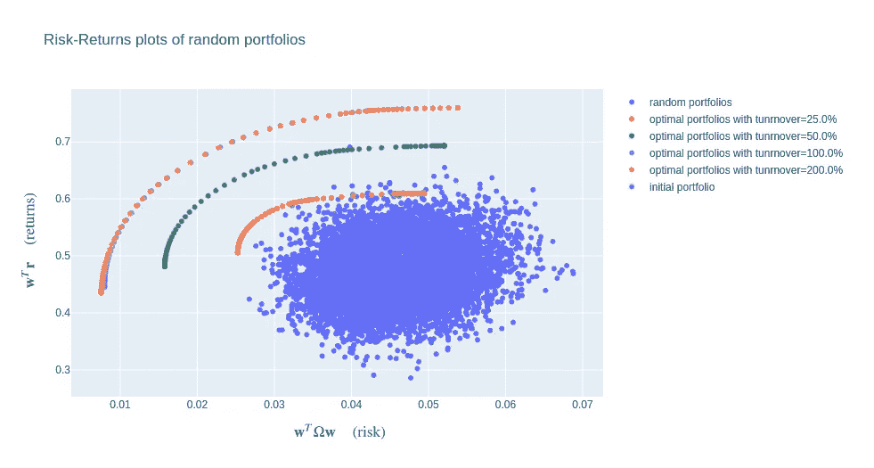

有效边界(图片来自作者)

这一假设在一定程度上得到了验证:对于这一特定的初始投资组合，将最大周转率从 100%增加到 200%似乎不会过多地阻碍优化过程。这可能是由于预测的性质，在我们的情况下，从一个时间步到另一个时间步变化不大。因此，稍微优化的投资组合不需要太多的改变就可以完全优化。

## 结束语

在本文中，我们已经看到了如何使用 CVXOPT，这是一个强大而快速的求解器，以解决带约束的二次优化问题。我们已经看到了如何调整一些既不是线性的也不是二次的约束和损失类型(例如交易成本损失和周转约束),以便求解器可以处理它们。然而，尽管规划求解非常高效且非常灵活，但它无法处理所有类型的约束。事实上，如果我们希望添加稀疏性约束(我们希望最多有 N 个非零权重)，这不能以线性或二次方式重新表述。在这种情况下，可能值得研究更灵活且能处理任何类型损失函数的其他方法，例如模拟退火。

**参考文献**

[1]https://mathworld.wolfram.com/LeastSquaresFitting.html

[2][https://online library . Wiley . com/doi/ABS/10.1111/j . 1540-6261.1952 . TB 01525 . x](https://onlinelibrary.wiley.com/doi/abs/10.1111/j.1540-6261.1952.tb01525.x)

[3][https://arxiv.org/abs/2002.06835](https://arxiv.org/abs/2002.06835)

[https://cvxopt.org/](https://cvxopt.org/)

[5] [机器学习的优化，Suvrit Sra，Sebastian Nowozin 和 Stephen J. Wright](https://mitpress.mit.edu/books/optimization-machine-learning)

[6][https://www.netlib.org/lapack/](https://www.netlib.org/lapack/)

[7] [风险平价和预算简介，Thierry Roncalli](http://www.thierry-roncalli.com/RiskParityBook.html)

## 关于我们

[**Advestis**](https://www.advestis.com/) 是一家欧洲合同研究组织(CRO)，对统计学和可解释机器学习技术有着深刻的理解和实践。Advestis 的专长包括复杂系统的建模和时间现象的预测分析。
*领英*:[https://www.linkedin.com/company/advestis/](https://www.linkedin.com/company/advestis/)