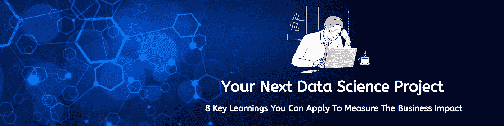
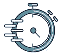

# 量化您的数据科学项目的业务影响

> 原文：<https://towardsdatascience.com/quantify-the-business-impact-of-your-data-science-project-b742e4b3208f>

作者使用 Canva 制作的图片

## 让你的工作得到重视和认可…

您是否曾与业务利益相关者共处一室，试图证明您的数据科学(DS)项目的影响？您是否遇到过这样的问题，“*您的项目的预计投资回报率是多少？*“您的 DS 项目是否曾因为其业务影响未被识别或不显著而从投资组合中退出？我们大多数人都曾一次或多次面临过类似的情况。至少，我经历过这样的困境。我向那些幸运的人们致意，他们从来不需要回答这些令人困惑的问题！

事实是，我们——*即*DS 或数据分析社区——总是难以量化 DS 项目的影响。多年来，我在这个领域遇到了许多挑战。然而，我总是通过实验来改变我的方法，这让我很好地完成了我的任务。因此，我想与你分享我的经历。我并不声称能够为您的所有 DS 项目问题提供完整的解决方案，但是我的文章将会给您一个快速的开始。我希望这篇文章可能会引发一场健康的讨论，让我们所有人分享宝贵的想法，我们可以一起学习各种解决方案。

在我们讨论数据科学解决方案的影响之前，您必须始终自问以下几个基本问题:“*我是否选择了对业务有实际和有意义(+ ROI)影响的正确业务问题？*、*我如何确定我(和我的团队)是否正在解决对我们公司有意义的业务问题*、*我该从哪里开始？*

这里还是现实一点吧！如果您正在解决一个为您的团队节省了几个小时时间的问题，或者它在一个不产生任何可观的商业结果的过程中自动化了一个手工任务，那么您的 DS 项目的影响可能是有限的和无关紧要的。

首先，如果你总是认为你正在解决的问题与你公司的目标是一致的，这将会有所帮助。例如，假设您的公司正在制造(或开发)一种产品或提供一些服务，但它无法生产足够的产品来满足客户需求。在这种情况下，贵公司的战略目标会自动转变为提高产量、减少产品浪费、增加创新和先进的设施和资源以制造更多产品*等*。在这种情况下，我们可以创建一个 DS 解决方案来提高产量并减少产品浪费。

您可能会问，“*那么，如果公司目标是在很高的层面上讨论的，而我无法将手头的业务问题与公司层面的目标联系起来，那该怎么办呢？*“在这种情况下，您可以努力将目标向下链接一级，比如说，在业务职能级别。这个层次包括研发、制造、运营、销售、营销、供应链、客户服务等。在这里，我们可以假设所有潜在的业务功能目标和流程都应该与公司的总体目标保持一致。尽管如此，你也可以考虑甚至下降到组织结构的下一个级别来指定目标。

将你的 DS 项目与公司的目标联系起来的另一个好处是让商业利益相关者站在你这边。如果他们能看到你的项目与他们公司的目标一致，他们会认为你是他们的合作伙伴。对于 DS 项目来说，拥有一个商业赞助商(*即*利益相关方)是至关重要的，这一点我再强调也不为过。这些赞助商将帮助你获得必要的资金和与任何障碍相关的变革管理。此外，他们将促进您的 DS 解决方案在其部门的采用。根据我的经验，大多数项目在实施之前失败是由于各种相关活动的管理不善，如入职、意识、培训、实施后支持、*等*。以下是一些关键的学习点:

**关键学习#1:** 采用自上而下的方法，从公司或业务职能或业务子职能的目标开始。在这里，想法是识别那些 DS 问题，这些问题可以在某个特定的层次上与公司的目标相一致。据观察，这些问题对本组织有着更广泛和更大的影响。

**关键学习#2:** 如果你不能确定你的 DS 项目的业务成果，它就不值得你去做。因此，你应该继续探索你任务清单上的另一个问题。如果你仍然继续处理一个问题，而没有具体说明它的影响，你可能会在最后感到惊讶。

**关键学习#3:** 如果你的业务赞助商能够通过你的 DS 解决方案看到他们项目的成功，那么说服他们会更方便、更容易。

**关键学习#4:** 您的 DS 项目是否有业务赞助商/支持者可以决定您的解决方案的命运。因此，如果你找不到赞助商，在投入精力和精力开发解决方案之前，你必须三思而行。

好吧！现在，您的下一个逻辑问题应该是:"*我应该定义什么指标来量化我的 DS 解决方案的业务影响？*“在下表中，我添加了影响(或结果)的各个方面，以考虑您的 DS 项目。您可以评估这些维度中的一个或多个如何为您的数据科学项目增加价值。每个维度中给出的 KPI 和指标仅作为示例提及。您可以立即将这些度量标准或 KPI 用于您自己的项目场景:(定义度量标准:度量 KPI:用目标量化)。

降低成本:作者图片

**成本降低:**成本降低指标可能有多种变化。例如，单位原材料成本降低、单位销售成本、单位制造成本*等*。

产量提高:作者图片

**提高产量:**通过测量关键生产阶段的各种工艺参数并进行调整以获得最佳产量，从而提高产量；例如，测量减少的浪费/拒绝的百分比。

节省人类时间:作者图片

**节省人力时间:**如果一个 DS 解决方案可以通过自动化节省人工劳动时间，对一个企业来说是有利的。一些例子包括:每天、每批、每次冲刺或任何其他合适的指标减少 30%的人工。

过程改进:作者图片

**流程改进:**如果你的 DS 解决方案可以帮助改进一个业务流程，它可以节省时间和成本。例如，将周期时间减少 20 小时，将等待时间减少 2 小时，将退出周期时间减少 8%，将客户退货处理时间减少 6%。

速度:作者图片

**速度:**一个数据科学项目可以提高一个流程的完成速度，这对一个企业来说可以是值得的。速度和过程改进可以是重叠的指标，它们可以结合起来。例如，将上市时间缩短 100 天，平均交付时间缩短 10 分钟。

质量:作者提供的图片

**更好的质量:**许多指标可以量化产品的整体质量、产品健康、客户服务、客户体验；*例如*客户退货数量减少 20%，客户投诉数量减少 14%，保修电话数量减少 10%，故障数量减少 12%。

市场份额:作者图片

**市场份额:**DS 项目的成功可以通过其对市场份额的影响来量化。例如，与前一年相比，某个品牌、地理区域、客户群或整体消费者群的市场份额增长了 5%。

更多客户:作者图片

**更多客户:**提高客户数量也是 DS 项目的一个重要结果。例如，客户群同比增长 6%，每个用户会话的平均花费时间增加 10%，客户转化率增加 25%，客户保持率增加 12%。

现在你一定很想知道:“我如何在我的项目中利用这些度量？”为了回答这个问题，让我们把使用它们的过程分成以下几个步骤:

**步骤 1:** 为您的场景选择正确的*指标。安排与业务用户的发现会议，并向他们介绍上面列出的指标维度。确定哪些指标将适用于您的用例。*

***步骤 2:** 要量化 DS 解决方案的影响，您必须为每个指标建立基线。例如，如果您的公司经营半导体产品，您当前的平均产量为 94%，这意味着您的产品有 6%被剔除。这 6%的产品可能是有缺陷的，也可能是*错误剔除* — *，即*在质量检测过程中剔除的合格产品。我们可以在这里创建一个场景，假设每天生产 20，000 件产品，其中 1200 件(*即* 6%)被丢弃。因此，94%(或(18800/20000)x100)是您的基线，您想要衡量您的 DS 解决方案是否可以提高产量。但是，您的公司可能会也可能不会维护历史原始数据来得出基线值。假设你不能获得现成的历史数据。在这种情况下，您可能需要与多个业务团队或用户合作，做出假设并估算原始数字，以得出所需的基线值。因此，你的数字不必精确，而是一个高层次的近似值。*

***第 3 步:**要衡量影响，您需要在部署 DS 解决方案后等待一段时间，然后收集与第 1 步相同指标的新原始数据(*即*平均每月生产和拒收的单位)。或者，您可以比较实施 DS 解决方案前后六个月的累积数据。我在此重申，您必须等待一段合理的时间(*例如* ~6 个月或任何与您的用例相关的时间)来见证变更的真正影响。*

***关键学习#5:** 如果你没有任何计算基线的原始数据，通过与你的团队成员讨论做出假设，这些成员非常了解你的解决方案正在实现的业务流程。毕竟，作为领导者，如果我们没有完整的可用信息，我们总是会做出假设。*

***关键学习#6:** 您需要等待一段时间(通常为六个月)才能看到您的 DS 解决方案的影响。*

***关键学习#7:** 商业价值计算不是一个简单的过程，它需要毅力和耐心。为了实现您的 DS 解决方案，您需要与在业务流程中工作的团队成员密切协作。因此，如果您反复地、勤奋地评估您的 DS 解决方案的商业价值或影响，那将是最好的。*

*现在，我详细说明最具挑战性的部分。您如何评估您的 DS 解决方案是否最终提供了预期的结果？可能会有这样一种情况，公司的其他一些并行计划可能已经取得了与您的目标相同的结果。此外，在某些情况下，您的 DS 解决方案可能会提供一些见解，供经理或其他人用来获得结果。在这种情况下，您能否将项目的成功归功于您的解决方案或在正确的时间采取行动使事情发生的个人，或者是这两种情况的混合？我认为我们可以将成功的归因按 50-50 或其他合理的比例进行划分。不幸的是，没有科学的方法来解决这个问题，因为它高度依赖于特定的情况。因此，如果你和其他参与者一起分配这个归因比例，将会有所帮助——这是所有利益相关者都同意的。*

***关键学习#8:** 时机决定一切。当您准备好部署 DS 解决方案时，必须准备好确定解决方案的影响。在企业层面上，永远要从更广阔的角度来评估影响您公司结果的其他计划的可能性，因为他们可能也在朝着与您一样的解决方案努力。*

*欢迎任何问题和反馈！如果您认为量化 DS 项目成果有其他方法，请在您的反馈意见中分享。*