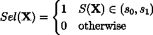
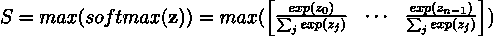
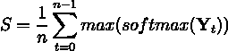
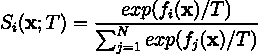
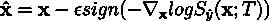
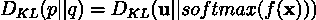
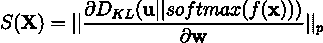

# 量化语音识别的不确定性

> 原文：<https://towardsdatascience.com/quantifying-the-uncertainty-for-speech-recognition-1932dc198c49>

## 何时以及如何信任您的语音识别模型

[Attendi 语音服务的标志](https://www.attendi.nl/en/assistant/)。*经作者许可展示*

# 目录

*   什么是不确定性？
*   语音识别的不确定性估计方法
*   我们如何从不确定性评估中获益？
*   摘要
*   关于我
*   参考

在过去的几年里，自动语音识别(ASR)已经转向更复杂和更大的神经网络架构。更高的复杂性有利于模型的性能，但另一方面，它会变得更加难以信任的结果。一个复杂的神经网络模型就像一个黑匣子，我们只能希望它对看不见的数据同样有效。

在 [Attendi](https://www.attendi.nl/) ，我们为荷兰的(健康)保健专业人士提供量身定制的演讲服务。用户录制的音频可能有明显的噪声背景、行话或口音，而模型没有见过(或在这种情况下，听到了[🙂](https://emojipedia.org/slightly-smiling-face/))之前。在这种情况下，知道我们可以在多大程度上相信预测是有益的。

通过测量预测的不确定性，我们有可能:

*   找出最有可能出错的话语并突出显示出来，以便用户检查
*   根据最“不确定”的样本微调模型
*   监控模型的性能

但是我们如何测量不确定性呢？幸运的是，有一些不确定性估计的相关方法可以应用于 ASR 系统。在本文中，我们将研究如何定义不确定性，以及哪些方法可以应用于语音识别模型。最后，我们将了解在哪些实际设置中，我们可以将不确定性估计应用于 ASR 系统。

# 什么是不确定性？

不确定性衡量模型做出预测的可信度[1]。根据不确定性的来源，我们可以将其分为两种类型:*任意的*和*认知的。*

*随机*型是由于固有的随机过程而出现的统计不确定性。例如，掷硬币的结果具有任意的不确定性。掷硬币的结果要么是正面，要么是反面，
两者都有 50%的几率发生。任意型是不确定性的不可约部分。不可能改变正面或反面的概率，因为这个事件是由一个固有的随机过程描述的。

*认知*不确定性是由于不适当的模型架构、训练程序、数据的分布变化或先前未知数据的出现(例如用于狗/猫
图像分类的鸟的图像)[1]。这是不确定性的可减少部分，这意味着我们可以通过改进模型及其训练参数，或者通过改进训练数据的可变性来增加预测的可靠性。

在更实际的设置中，我们最感兴趣的是*预测*不确定性，即在网络单次前向传递后可以估计的不确定性。这种类型的不确定性非常有用，因为它很容易在现有的 ASR 管道中实现。我们也更喜欢关注认知类型的方法，因为这是不确定性中唯一可约的部分。

# *语音识别的不确定性估计方法*

理想情况下，我们想知道对于给定的输入数据 **X** ，模型的输出是否是不确定的。在 ASR 领域中，通常定义一种方法，在每个模型的预测之后输出分数 S*(****)X****)*。对于一个取值范围 *s* ₀，和 *s* ₁，我们可以确定模型的输出是否不确定。

指示不确定性的简单阈值函数 Sel( **X** )可以定义如下:

Eq 1。给定得分函数 S( **X** ，我们可以定义哪些数据使得模型的输出不确定。

其中 *s* ₀和*s*₁*t30】分别是下限和上限。 *s* ₀和 *s* ₁ 的值根据具体情况确定，因为它们取决于许多因素，例如模型架构或不确定性估计方法。*

通过这个简单的阈值函数，我们可以识别 ASR 模型需要处理的数据。然而，主要的问题是评分函数 S( **X** )无法访问基本事实标签，因为我们对未标记的“实时”数据进行预测。因此，这些评分函数只能使用原始模型的输出来计算不确定性，或者必须对真实标签分布做出假设。

在下面的小节中，我们将看看这些方法的选择，并了解它们如何生成分数 S( **X** )。

## 最大软最大概率

一种简单的方法是使用模型的 softmax 分布来估计不确定性[2]。为了计算得分 S( **X** )，我们可以取模型的 softmax 输出的最大值*。*

**

*Eq 2。从 softmax 输出中取最大值*

*但是我们如何将这种方法推广到 ASR 呢？上面的等式只考虑了非顺序输出([ *batch_size，no. classes]* )，当我们想要预测整个话语(*【batch _ size，no. predicted tokens，no . classes】)*时，情况并非如此。我们需要定义另一个函数来聚合整个话语的得分:*

**

*Eq 3。在[预测令牌数]维度上平均 MSP 分数*

*其中，softmax( **Y** ₜ)是令牌 *t.* 的 softmax 分发输出*

*在上面的等式中，我们计算整个话语的平均不确定性得分。也可以使用最大值、最小值或其他聚合函数来代替平均值。然而，尽管这种方法为整个话语提供了单个分数，但是这些分数不如每个标记的分数那样具有信息量。即，在聚合之后，我们不能再标记不正确的单词/标记。我们能做的最好的事情就是找到一个不正确的发音。简单来说，我们失去了细节的颗粒度。*

## *欧丁神*

*MSP 方法有一些缺点。神经网络模型倾向于对域外(OOD)数据做出过于自信的预测[3]。通常，它们没有很好地校准，这意味着 softmax 输出与进行预测的置信度没有很好的关联[3]。*

*ODIN 试图通过向输入数据添加温度标度和小扰动来解决这个问题[4]。这些方程非常类似于 MSP 方法。*

*首先，温度缩放用于校准 softmax 输出，使其更好地符合预测的置信度:*

**

*Eq 4。ODIN 通过添加温度比例参数 *T* 来修改 softmax 方程*

*其中神经网络 **f** =(f₁，…，fₙ)被训练来分类 n 个类。为了获得最终得分 S( **x** )，我们可以从得分 Si 中取最大值(如等式 2 所示)。*

*在论文[4]中，作者指出温度比例必须足够大，并指出他们的模型在 T=1000 时性能最佳。*

*第二步，我们加入输入扰动。这有助于扩大分布内和分布外样本之间的 softmax 得分差距。要添加输入扰动，我们需要执行以下操作:*

1.  *计算*最大值* softmax 分数(等式。4 和 Eq。2)*
2.  *将交叉熵损失 w.r.t .反向传播到输入端 **x***
3.  *计算梯度 w.r.t 输入 **x***
4.  *取一个[符号](https://en.wikipedia.org/wiki/Sign_function)(梯度)，用ε缩放，并从输入 **x** 中减去它*

*这个过程可以用下面的等式来解释:*

**

*Eq 5。输入扰动有助于区分分布内和分布外样本的分数*

*要将其应用于顺序 ASR 任务，我们可以遵循与 MSP 相同的方法。将它聚集在一个[预测令牌数]上，会将其减少到一个数字分数。*

## *GradNorm*

*MSP 和 ODIN cherrypicks 中的 *max* 函数从 softmax 分布中选取一个值，并忽略其他输出值。最重要的是，这些方法不考虑输入信号如何在网络中传播。所有这些方法只是盲目地从最终的 softmax 层中查看单个元素。*

*GradNorm [5]从不同的角度处理这个问题，并从整体上看待这个模型。为了计算不确定性得分，GradNorm 研究梯度如何在网络中传播以及最终的输出分布。*

*梯度范数的主要概念如下。我们假设如果输入数据 **X** 不确定，那么最终 softmax 层的输出将(或多或少)均匀分布。如果模型对其预测有信心，那么我们将在 softmax 层中看到某个类的峰值。*

*为了计算不确定性，我们首先计算 softmax 分布和均匀分布之间的 [KL 发散损失](https://machinelearningmastery.com/divergence-between-probability-distributions/):*

**

*Eq 6。我们假设地面真值分布 **u** 是均匀的。基于此，我们计算 softmax(f( **x** )和 **u** 之间的 KL 发散损失。*

*为了计算最终得分，我们反向传播 KL 散度损失，然后计算 pₜₕ层的梯度幅度(p-范数)。在论文中，他们发现最好的分数是从最后一层开始计算的，所以 *p=1:**

**

*Eq 7。为了计算最终得分，反向传播 KL 发散损失并计算 pth 层的 p 范数。p=1 给出了最好的结果，也是计算效率最高的。*

# **我们如何从不确定性评估中获益？**

*了解预测的不确定性在实际应用中非常有用。在这一部分，我们将看看一些最有用的应用。*

## *用户校正输入*

**

*[来自 Attendi 应用](https://www.attendi.nl/en/speech-service/)的用户修正输入。经作者许可展示。*

*不确定性分数允许我们找到可能不正确的话语。我们可以为用户突出显示这些话语，这样他/她就可以快速找到并纠正它们。*

## *主动学习*

*主动学习假设我们有一定的配额来给新数据添加基础事实标签。在 ASR 的环境中，我们可以雇佣注释者转录一定数量的音频样本来帮助微调模型。但是我们应该优先考虑手动转录哪个音频呢？*

*在这种情况下，我们可以计算不确定性分数，并选择具有某个期望 S( **X** )的音频。我们可以采取最‘不确定’的样本，或者选择特定范围的 S( **X** )。*

## *监视*

*部署的 ASR 模型可以暴露于不同的音频信号。他们可能有不同的环境噪音、行话或口音，这些都会影响模型的性能。我们希望，通过监控音频的不确定性分数，我们可以检测到模型的性能何时下降并采取行动。*然而，对我们来说，这仍然是一项正在进行的工作。我们首先需要确定模型的性能(在这种情况下是 WER)是否与不确定性相关。**

# *摘要*

*在本文中，我们定义了什么是不确定性，以及如何使用它作为分数 S( **X** )来衡量模型对其预测的信心。*

*有不同的方法来计算不确定性。最大 Softmax 概率(MSP)和 ODIN 使用 softmax 输出计算不确定性得分。然而，这些方法的缺点是，它们只是盲目地查看模型的输出。GradNorm 采用了一种不同的方法，既关注输出分布，也关注梯度如何在整个模型中反向传播。*

*最后，我们看了不确定性分数估计的潜在用例。*

## *信用*

**我要感谢来自 Attendi 的 Jan-Willem van Leussen、Omar Elbaghdadi 和 Berend Jutte 为我的文章提供了有用的反馈和更正。**

# *关于我*

*我是阿姆斯特丹大学的人工智能硕士学生。在我的业余时间，你可以发现我摆弄数据或者调试我的深度学习模型(我发誓这很有效！).我也喜欢徒步旅行:)*

*如果你想了解我的最新文章和其他有用的内容，以下是我的其他社交媒体资料:*

*   *[领英](https://www.linkedin.com/in/kacperkubara/)*
*   *[GitHub](https://github.com/KacperKubara)*

# *参考*

*[1] [深度神经网络中不确定性的调查](https://arxiv.org/pdf/2107.03342.pdf)*

*[2] [用于检测神经网络中错误分类和非分布样本的基线](https://arxiv.org/abs/1610.02136)*

*[3] [关于现代神经网络的校准](https://arxiv.org/pdf/1706.04599.pdf)*

*[4] [增强神经网络中非分布图像检测的可靠性](https://arxiv.org/abs/1706.02690)*

*[5] [关于梯度对检测野外分布变化的重要性](https://arxiv.org/abs/2110.00218)*